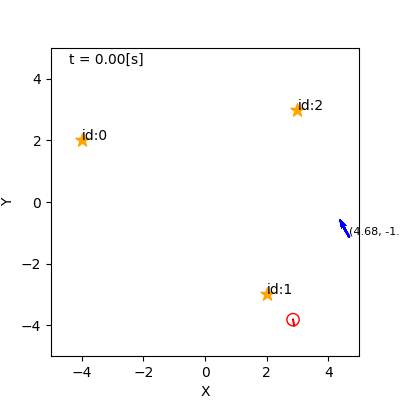
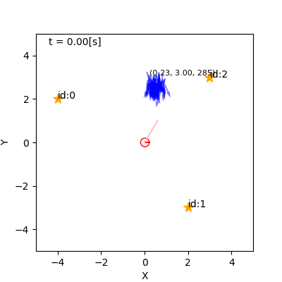

## 7. 自己位置推定の諸問題

千葉工業大学 上田 隆一

 

This work is licensed under a <a rel="license" href="http://creativecommons.org/licenses/by-sa/4.0/">Creative Commons Attribution-ShareAlike 4.0 International License</a>.

---

### 大域的自己位置推定

* 初期姿勢$\boldsymbol{x}_0$を未知とする問題
    * MCLの場合、パーティクルが不足
    * 真の姿勢まわりにパーティクルがないと推定続行不可能

---

### 誘拐ロボット問題

* 誘拐: 人がロボットを運んで別の場所に置く
    * 信念分布の高確率な部分と真の姿勢$\boldsymbol{x}^*_t$が乖離
    * 一度信念を否定する必要があるけどMCLにそのような機能はない

---

### 対策

* 「自己位置推定が間違っている確率」の導入
    * $b(\boldsymbol{x}) = b(\boldsymbol{x} | \Upsilon=0)P(\Upsilon=0) + b(\boldsymbol{x} | \Upsilon=1)P(\Upsilon=1)$
        * $\Upsilon=0$: 正常（自己位置推定が間違っていない） 
        * $\Upsilon=1$: 異常
        * $b(\boldsymbol{x} | \Upsilon=0)$: 自己位置推定で求めた信念
        * $b(\boldsymbol{x} | \Upsilon=1)$: 異常だとした場合の信念
* この考えの実装に必要なこと
    * 間違っている確率$P(\Upsilon)$をどうやって求めるか
    * 分布$b(\boldsymbol{x} | \Upsilon=1)$をどう作るか

---

### リセット

* センサ値を信念に反映するときのベイズの定理の分母を使う
    * このときのベイズの定理: $b(\boldsymbol{x}) = \hat{b}(\boldsymbol{x} | \textbf{z}) = \dfrac{ p(\textbf{z} | \boldsymbol{x}) \hat{b}(\boldsymbol{x}) } { p(\textbf{z}) } = \dfrac{ p(\textbf{z} | \boldsymbol{x}) \hat{b}(\boldsymbol{x}) } { \langle p(\textbf{z} | \boldsymbol{x}') \rangle_{\hat{b}(\boldsymbol{x}')}}$
    * $\alpha = \langle p(\textbf{z} | \boldsymbol{x}') \rangle_{\hat{b}(\boldsymbol{x}')}$とする
* $\alpha$は信念$b$に対して$\textbf{z}$がどれくらいあり得るかを数値化したもの（周辺尤度）
    * とりあえずシンプルに考えて、$\alpha$が閾値を下回ったら$P(\Upsilon=1)=1$（異常）としましょう

---

### 異常時の信念分布の構成

* 考え方は次の3つ
    * 一様分布と考える
        * 単純リセット 
    * センサ値が正しいと考える
        * センサ値にしたがってパーティクルを置き直し$\rightarrow$センサリセット
    * センサ値は信用できないけど信念も少し不確かになる
        * 信念分布をなだらかにする$\rightarrow$膨張リセット

---

### センサリセット

* 得られたセンサ値が得られそうな姿勢にパーティクルを置き直し
    * $p(\boldsymbol{x} | \boldsymbol{z} )$からドロー
* センサ値が間違っていたら今までの推定が無駄に
    * 起こる条件を厳しくするか、今までのパーティクルを残す

---

### 膨張リセット

* 今までの分布を膨張させる
* 分布が大きく変化しないので頻繁に起こせる
* 収束まで時間がかかる

---

### 組み合わせ

* 通常は膨張リセット
* 何回か連続で$\alpha$が閾値を下回ったらセンサリセット

