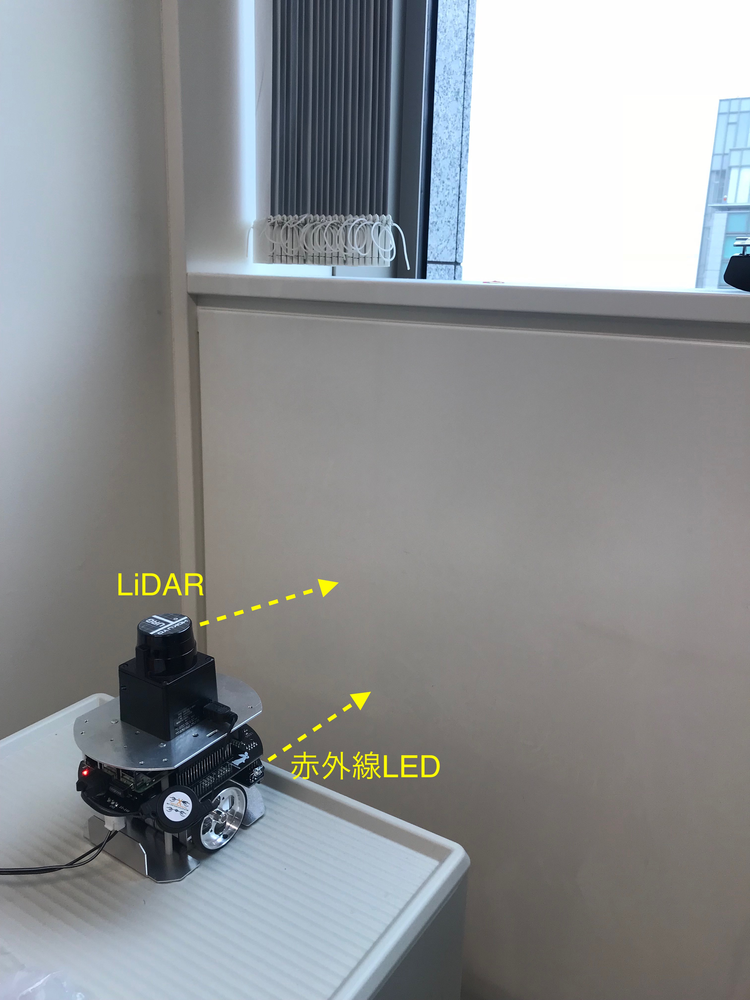

## 2. 確率統計の基礎

千葉工業大学 上田 隆一
2019年4月24日

 

This work is licensed under a <a rel="license" href="http://creativecommons.org/licenses/by-sa/4.0/">Creative Commons Attribution-ShareAlike 4.0 International License</a>.

---

### 実験

* ロボットを壁から離して置く（約200mm）
* 2日間にわたって3秒ごとにセンサの値を記録
    * 光センサとLiDARの1本のレーザー

