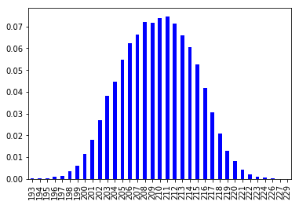

## 2. 確率統計の基礎

千葉工業大学 上田 隆一
2019年4月24日

 

This work is licensed under a <a rel="license" href="http://creativecommons.org/licenses/by-sa/4.0/">Creative Commons Attribution-ShareAlike 4.0 International License</a>.

---

### 実験

* ロボットを決めた距離だけ壁から離して置く
* 3秒ごとにセンサの値を記録（2日間）
    * 光センサとLiDARの1本のレーザー

---

### 得られたデータ

* [200mm](https://raw.githubusercontent.com/ryuichiueda/LNPR_BOOK_CODES/master/section_sensor/sensor_data_200.txt)
    * $1: 日付
    * $2: 時分秒
    * $3: 光センサの値
    * $4: LiDAR（の1本のレーザの）値
* LiDARの値の特性を調査してみましょう
    * こんなにたくさんデータあるけどどうしよう？
        * 統計学
    * 以後、LiDARから得た値を「センサ値」と呼称

---

### 度数分布・ヒストグラム

* 度数分布
    * センサ値の範囲をいくつかの区間に分ける
    * 各区間に属するセンサ値の数を集計
* ヒストグラム
    * 度数分布をグラフにしたもの
    * 下図: 区間の幅1で描いたヒストグラム

---

### センサ値を予想する

* 度数分布からセンサが次に出す値を予想できるか？
    * だいたいどのような値になるかは予想可能
        * センサ値を何度も予想したら頻度が度数分布の示す割合に
	    * センサ値が$z$になる割合: 「$z$になる頻度/データ数」$\Longrightarrow$確率
    * 「$z$になる頻度/データ数」を返す関数$p(z)$ $\Longrightarrow$確率質量関数（確率分布）
* 確率分布が分かる: センサの特性を統計的に理解

---

### 素朴な確率分布

* 作り方
    1. 度数分布の頻度を全て足す
    2. 各区間の頻度を1の合計値で割る
        * 合計が1になる$\rightarrow$これを 確率分布$p(z)$とする（左図）
* センサ値$z$を$p(z)$から選ぶ操作: $z \sim p(z)$
    * 「ドローする」と表現
    * 右図: 左図の$p(z)$からドローを繰り返して作った度数分布

