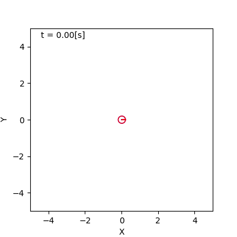

## 4. 不確かさのモデル化

千葉工業大学 上田 隆一
2019年4月24日

 

This work is licensed under a <a rel="license" href="http://creativecommons.org/licenses/by-sa/4.0/">Creative Commons Attribution-ShareAlike 4.0 International License</a>.

---

### 実世界の不確かさ（センサ）

* 例
    * 同じものを計測しても毎回違う値（偶然誤差・雑音）
    * 周囲に観測するものがない
    * 定常的に計測値がずれる（系統誤差・バイアス）
    * 壁だと思ったら人までの距離を計測（過失誤差）

<iframe width="560" height="315" src="https://www.youtube.com/embed/RpPcmyXOcr4?start=2444" frameborder="0" allow="accelerometer; autoplay; encrypted-media; gyroscope; picture-in-picture" allowfullscreen></iframe>

---

### 実世界の不確かさ（動き）

* 例
    * 小石・縁石を踏んだ、人に持ち上げられた
        * 前のスライドのムービー
    * モータへの指令値と実際の出力が少しずれている
        * 「ロボットがまっすぐ走らないんですよ」（当たり前）
        * ひどい例: 床が違うと脚ロボットの動きは大きく変わる

<iframe width="260" height="315" src="https://www.youtube.com/embed/wNm9dhWBqZM" frameborder="0" allow="accelerometer; autoplay; encrypted-media; gyroscope; picture-in-picture" allowfullscreen></iframe>

---

### 雑音のシミュレーション

* 動きに関するもの
* 観測に関するもの

---

### 路面からの雑音のシミュレーション

* モデル化の例: ある一定の確率で小石を踏む
    * 小石は穴でも岩でもなんでもよい
    * 以下のパラメータで頻度と深刻度が決まる
        * どれだけの確率で起こるか
        * 踏んだらどれだけロボットがずれるか
    * [実装例](https://github.com/ryuichiueda/LNPR_BOOK_CODES/blob/master/section_uncertainty/noise_simulation2.ipynb)
        * 前者を指数分布、後者をガウス分布でモデル化

---

### 路面からの雑音のシミュレーション
#### 「小石を踏む」のモデル化 

* 偶然に何か起こる確率は指数分布に従う
$$
	p(t | \lambda ) = \lambda e^{-\lambda t} \  (t > 0)
$$
    * $t$: ロボットの移動量（道のり）
    * $1/\lambda$: 小石を一つ踏みつけるまでの移動量の期待値
    * 小石を踏んだときに次に踏むまでの時間をドロー
$$
	t \sim p(t | \lambda ) 
$$
* [Jupyter Notebookでの例](https://github.com/ryuichiueda/LNPR_BOOK_CODES/blob/master/distributions/exponential.ipynb)

---

### 路面からの雑音のシミュレーション
#### 「小石を踏んで姿勢変化」のモデル化

* ロボットの方向$\theta$にガウス分布に従う雑音を加える
$$
	p(\theta | \mu, \sigma^2 ) = \dfrac{1}{\sqrt{2\pi}\sigma} \exp\left[ - \dfrac{(\theta - \mu)^2}{2\sigma^2} \right] = \mathcal{N}(\theta | \mu, \sigma^2)
$$
* 手続き: ロボットの姿勢を$(x \ y \ \theta)^T$次のように更新
$\begin{eqnarray}
    (x \ y \ \theta)^T &\longleftarrow& (x \ y \ \theta)^T + (0 \ 0 \ \theta')^T \\\\
    &\text{where}&\ \theta' \sim p(\theta | \mu, \sigma^2 )
\end{eqnarray}$
    * 位置はあまりずれないので雑音を加えず

---

### 出力のバイアスのシミュレーション

* モータへの指令値$(\nu \ \omega)^T$を更新するごとに同じ割合だけ雑音として加える（系統誤差）
* 手続き
    * 初期化: 
$ \begin{pmatrix} \delta_\nu  \\\\ \delta_\omega \end{pmatrix}\sim \mathcal{N}\left[ \begin{pmatrix} \delta_\nu \\\\ \delta_\omega \end{pmatrix} \Big| \begin{pmatrix} 0 \\\\ 0 \end{pmatrix} , \begin{pmatrix} \sigma_\nu^2 & 0 \\\\ 0 & \sigma_\omega^2 \end{pmatrix} \right] $
        * $\sigma_\nu, \sigma_\omega$: パラメータ
    * その後: 
$
    (\nu \ \omega)^T \longleftarrow (\delta_\nu \nu \ \delta_\omega \omega)^T 
$
* [実装例](https://github.com/ryuichiueda/LNPR_BOOK_CODES/blob/master/section_uncertainty/noise_simulation_bias.ipynb)
    * キャリブレーションで小さくすることは可能
        * 根絶は無理
    * 事前に予想ができないので厄介

---

### 他の誤差の例

* 引っかかり（ロボットの脱輪など）
    * 指数分布で次に脱輪するまでの時間をシミュレーション
    * 脱輪から抜け出すまでの時刻も指数分布で
* 誘拐（人によるロボットの上げ下ろしなど）
    * これも指数分布

---

### センサ値に混入する 雑音のシミュレーション

* このスライドでの「雑音」: 偶然誤差の原因となる熱、電気的なゆらぎ
   * 非常に多種多様だが、まとめるとガウス分布に従う
       * 中心極限定理
       * 例: 2章の200[mm]のセンサ値の分布
* [実装例](https://github.com/ryuichiueda/LNPR_BOOK_CODES/blob/master/section_uncertainty/noise_simulation7.ipynb)
   * $\boldsymbol{z'} \sim \mathcal{N}(\boldsymbol{z'} | \boldsymbol{z}, \Sigma_\boldsymbol{z})$

---

### センサ値に混入する バイアスのシミュレーション

* 長時間にわたって値を偏らせる要因
    * 環境の違い、変化
        * 例: 2章の600[mm]のセンサ値
* 実装は移動に加えるバイアスと同じ
    * [実装例](https://github.com/ryuichiueda/LNPR_BOOK_CODES/blob/master/section_uncertainty/noise_simulation8.ipynb)
    * あらかじめバイアスの大きさを決めておく
        * 距離: 距離に比例した量を足す
        * 方向: 方向に無関係に決まった量を足す

---

### 他の誤差の例

* ファントム
* 見落とし
