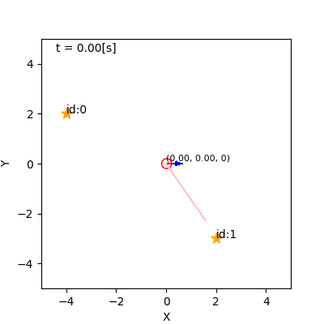
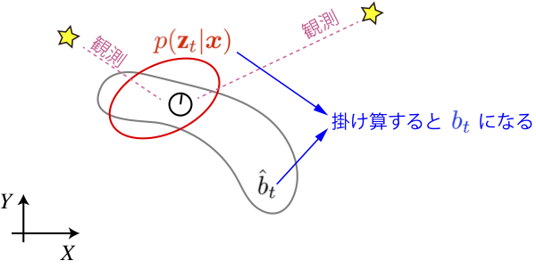
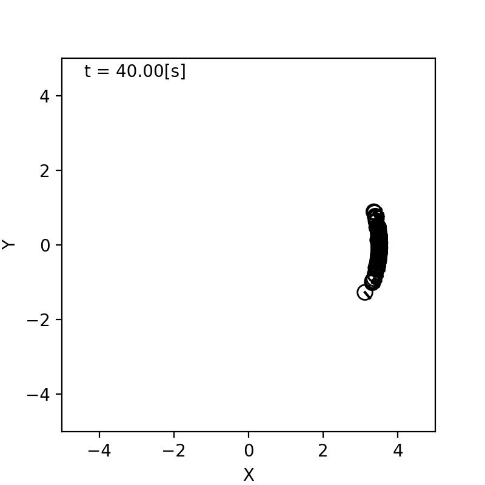
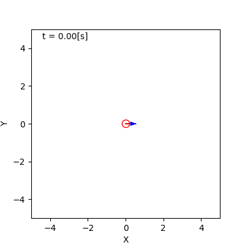
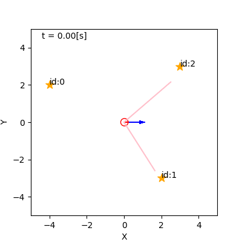
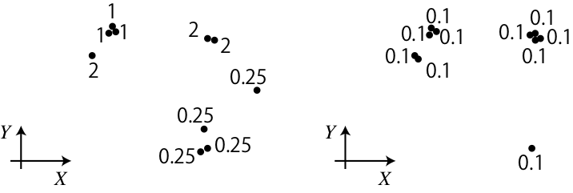

## 5. パーティクルフィルタを用いた自己位置推定

千葉工業大学 上田 隆一

 

This work is licensed under a <a rel="license" href="http://creativecommons.org/licenses/by-sa/4.0/">Creative Commons Attribution-ShareAlike 4.0 International License</a>.

---

### 自己位置推定

* ロボットが自らの姿勢を、これまで得た情報から推定することを指す言葉
    * 自らの行動を決める
    * 自身の周囲との位置づけを把握する

---

### 例: カルマンフィルタ（KF） による実装

* 青い楕円が位置、青いヒゲが向きの不確かさを表す
    * 動くと不確かに
    * センサ値を得ると不確かさが減少

---

### 例: パーティクルフィルタ（PF） による実装

* 青い矢印が姿勢の候補
    * 動くと拡散し、センサ値を得ると収束
* KFもPFも同じ計算の近似

---

### 何を計算しているのか

* 分布$p_t(\boldsymbol{x} = \boldsymbol{x}_t^* | \boldsymbol{x}_0, \boldsymbol{u}_\{1:t\}, \textbf{z}_\{1:t\})$を計算
    * $t=0,1,2,\dots,t$: 離散時間（$t$が現在の時刻）
    * $\boldsymbol{x}_t^*$: 真の姿勢
    * $\boldsymbol{x}_0$: 最初の姿勢（分かっているとしましょう）
    * $\boldsymbol{u}_\{1:t\}$: 各時刻の制御指令
    * $\textbf{z}_\{1:t\}$: 各時刻のセンサ値のリスト
        * $\textbf{z}_s = \\{ \boldsymbol{z}_\{j,s\} | j=0,1,2,\dots, N_\text{m}-1 \\}$
            * $\boldsymbol{z}_\{j,s\}$: 時刻$s$におけるランドマーク$j$のセンサ値
            * $N_\text{m}$: ランドマークの数

---

### 信念

* 求める分布を特別に$b_t$と表しましょう
    * $b_t(\boldsymbol{x}) = p_t(\boldsymbol{x} = \boldsymbol{x}_t^* | \boldsymbol{x}_0, \boldsymbol{u}_\{1:t\}, \textbf{z}_\{1:t\})$
* $b_t$を信念と呼ぶ
    * エージェントの頭の中

---

### 信念の演算

* $b_\{t-1\}$から$b_t$へはどう計算すればよいか？
    * ロボットの移動後の信念には$\boldsymbol{u}_t$が加わる（$b_\{t-1\}\rightarrow \hat{b}_t$）
    * ロボットがセンサ値を得ると、さらに$\textbf{z}_t$が加わる（$\hat{b}_t \rightarrow b_t$）
    * 上記の$b_\{t-1\}, \hat{b}_t, b_t$
        * $b_t(\boldsymbol{x}) = p_t(\boldsymbol{x} = \boldsymbol{x}_t^* | \boldsymbol{x}_0, \boldsymbol{u}_\{1:t-1\}, \textbf{z}_\{1:t-1\})$
        * $\hat{b}_t(\boldsymbol{x}) = p_t(\boldsymbol{x} = \boldsymbol{x}_t^* | \boldsymbol{x}_0, \boldsymbol{u}_\{1:t\}, \textbf{z}_\{1:t-1\})$
        * $b_t(\boldsymbol{x}) = p_t(\boldsymbol{x} = \boldsymbol{x}_t^* | \boldsymbol{x}_0, \boldsymbol{u}_\{1:t\}, \textbf{z}_\{1:t\})$

---

### 移動時の更新

* $b_\{t-1\}$から$\hat{b}_t$へ
    * 計算式: $\hat{b}_t(\boldsymbol{x}) = \big\langle p(\boldsymbol{x} | \boldsymbol{x}', \boldsymbol{u}_t) \big\rangle_\{b_\{t-1\}(\boldsymbol{x}')\}$
        * $p(\boldsymbol{x} | \boldsymbol{x}', \boldsymbol{u}_t)$: 状態遷移モデル
    * 計算式の意味
        * 移動前の姿勢$\boldsymbol{x}'$が既知なら移動後の分布は状態遷移モデルと一致
        * 実際には移動前の姿勢は$b_\{t-1\}$で確率的にしか分からない 
            $\rightarrow$状態遷移モデルの期待値が$\hat{b}_t$となる

---

### センサ値の反映

* $\hat{b}_t$から$b_t$へ
    * 計算式: $b_t(\boldsymbol{x})= \hat{b}_t(\boldsymbol{x} | \textbf{z}_t) = \dfrac{ p(\textbf{z}_t | \boldsymbol{x}) \hat{b}_t(\boldsymbol{x}) } { p(\textbf{z}_t) } = \eta p(\textbf{z}_t | \boldsymbol{x}) \hat{b}_t(\boldsymbol{x})$
        * $p(\textbf{z}_t | \boldsymbol{x})$: 観測モデル
        * $\eta$は$b_t$の積分が1になるように後から計算すればよい（正規化定数）
    * 計算式の意味
        * $\hat{b}_t(\boldsymbol{x})$の各姿勢の値に、その姿勢から実際に得られたセンサ値（のリスト）$\textbf{z}_t$がどれだけ得られやすいかを表す値$p(\textbf{z}_t | \boldsymbol{x})$をかける

---

### ベイズフィルタ

* 前の二つのスライドの計算式を交互に適用して信念分布を更新
    * ベイズフィルタと呼ばれる
* 処理
    * 初期化: $b_0(\boldsymbol{x})$を構成
    * 以後、次の二つの式の繰り返し
        * $\hat{b}_t(\boldsymbol{x}) = \big\langle p(\boldsymbol{x} | \boldsymbol{x}', \boldsymbol{u}_t) \big\rangle_\{b_\{t-1\}(\boldsymbol{x}')\}$
        * $b_t(\boldsymbol{x}) = \eta p(\textbf{z}_t | \boldsymbol{x}) \hat{b}_t(\boldsymbol{x})$
* 実装方法
    * カルマンフィルタ
    * パーティクルフィルタ（本章ではこちらを扱う）

---

### パーティクルフィルタ

* 信念分布をパーティクルで近似
    * パーティクル（粒子）: ロボットの分身と考えておく

---

### 移動時の更新（事前準備）

* 状態遷移モデル$p(\boldsymbol{x} | \boldsymbol{x}', \boldsymbol{u}_t)$を作成
* モデルの作り方の例
    * ロボットを何度も決まった距離、角度だけ走らせて指令値と実際に進んだ量を記録$\rightarrow$確率分布を求める
    * 下図: ロボットを4[m]前進させて向きのばらつきを調査

---

### 移動時の更新（アルゴリズム）

* 初期化
    * パーティクル: $\boldsymbol{x}^{(i)} \ (i=0,1,2,\dots,N-1)$を$\boldsymbol{x}_0$に置く
* $\boldsymbol{u}_t$を反映する手続き
    * $\boldsymbol{x}^{(i)} \sim p(\boldsymbol{x} | \boldsymbol{x}^{(i)}, \boldsymbol{u}_t) \qquad (i=0,1,2,\dots,N-1)$
        * 元の姿勢を状態遷移して上書き

---

### パーティクルの分布

* 信念分布との関係
    * ある領域$X \in \mathcal{X}$中のパーティクルの数（を$N$で割ったもの）: 
    その領域にロボットの姿勢がある確率の近似
        * 左図: パーティクル100個の分布
        * 右図: ロボットを100台動作させたときの分布

&nbsp;

---

### センサ値の反映（事前分布）

* 観測モデル$p(\textbf{z}_t | \boldsymbol{x})$を作成
    * これも事前実験で求める
        * ロボットに様々な姿勢からランドマークを観測させてセンサ値を記録
    * 通常はランドマークごとに$p(\boldsymbol{z}_{j,t} | \boldsymbol{x})$を求める

---

### センサ値の反映（アルゴリズム）

* 初期化
    * パーティクルに重み$w^{(i)}$ を持たせて$1/N$で初期化
    * 最終的なパーティクルの定義
        * $\xi^{(i)} = (\boldsymbol{x}^{(i)}, w^{(i)})$
* $\textbf{z}_t$を反映する手続き
    * $w^{(i)} \longleftarrow p(\textbf{z}_t | \boldsymbol{x})w^{(i)}$
        * センサ値が互いに独立なら $p(\textbf{z}\_t | \boldsymbol{x}) = \prod_{j=0}^\{N_\text{m}-1\} p(\boldsymbol{z}_\{j,t\} | \boldsymbol{x})$
    * 重みはこのままだと消失 or 発散

---

### 重みの正規化とリサンプリング

* まだ実装に足りないこと
    * 重みの正規化
    * 重みの偏りの是正
        * 特定のいくつかのパーティクルに重みが集中 
	$\rightarrow$他のパーティクルは存在しないのと同じ
* 方法: リサンプリング
    * 手続き
        1. パーティクルの集合から新しいパーティクルを$N$個選ぶ
        1. 重みを$1/N$にする
    * 下図: リサンプリングの一例（左: 前、右: 後）

---

### リサンプリングの方法

* 単純な方法
    * 以下を$N$回繰り返し
        1. 古いパーティクルの集合から重みに比例する確率で1つパーティクルを選択
        1. 選択したパーティクルの重みを$1/N$に変えて新しい集合に追加
    * この方法は計算量が$O(N)$より大きい
        * パーティクルの数$N$が2倍になると2倍よりも計算量が増える
