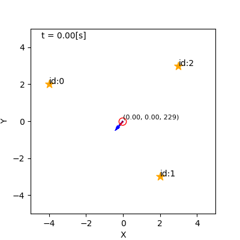
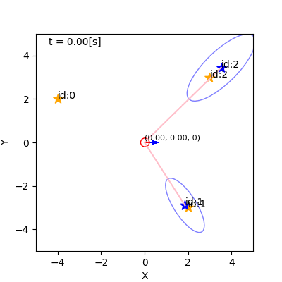
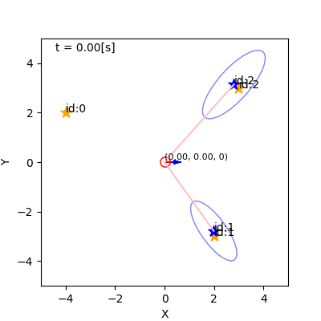
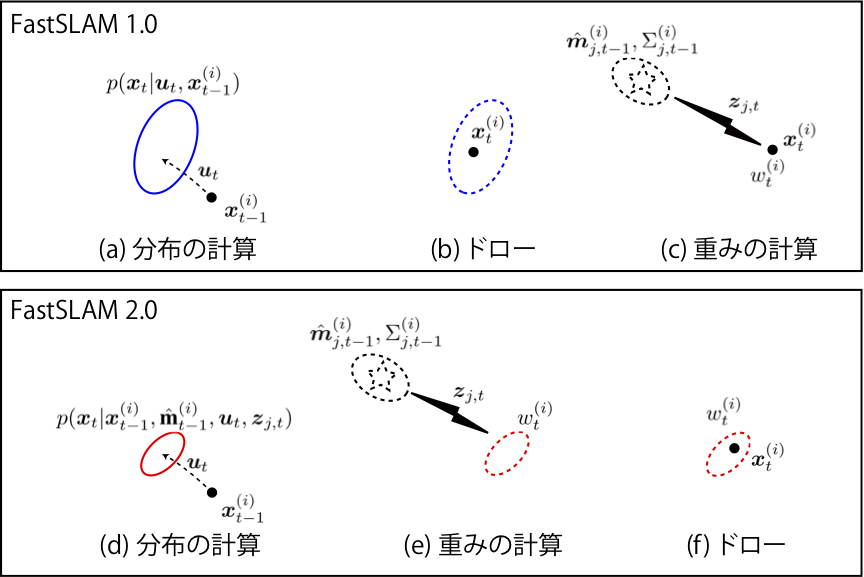
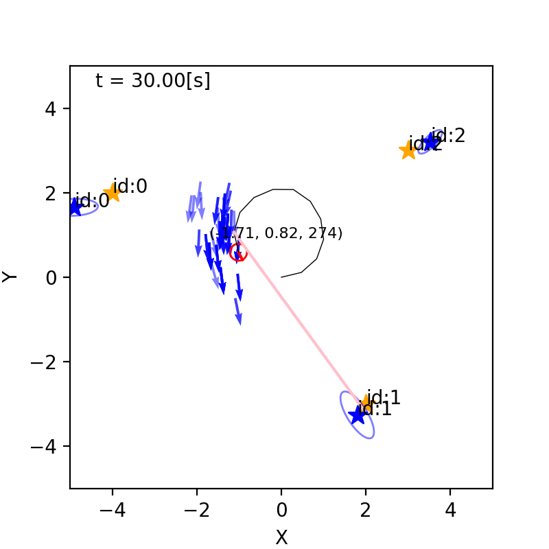
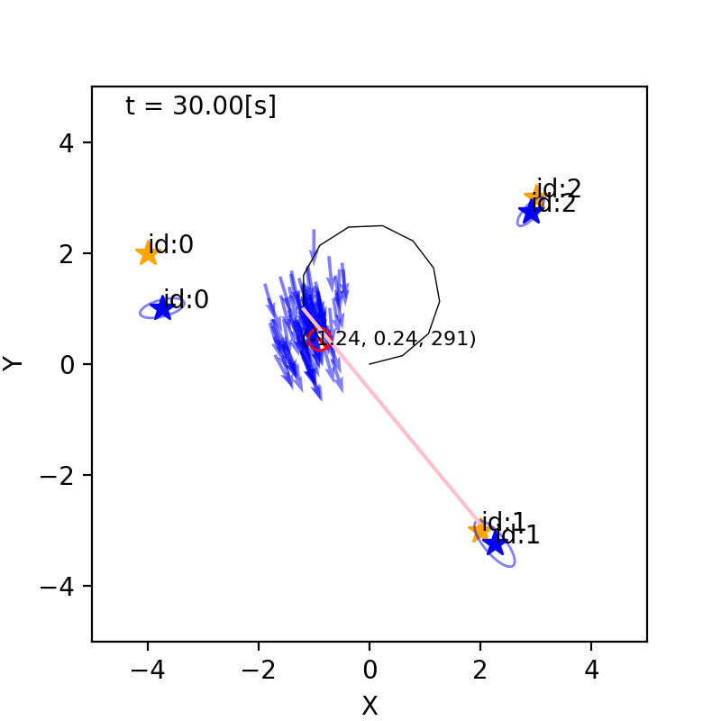
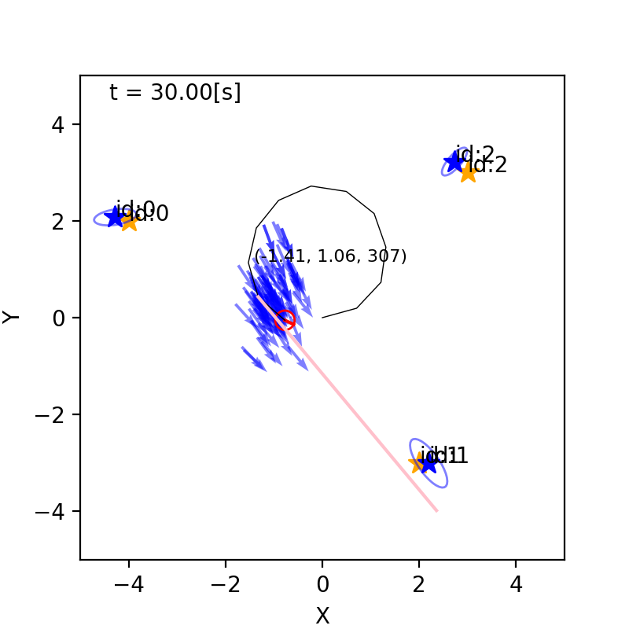

## 8. パーティクルフィルタを 用いたSLAM

千葉工業大学 上田 隆一

 

This work is licensed under a <a rel="license" href="http://creativecommons.org/licenses/by-sa/4.0/">Creative Commons Attribution-ShareAlike 4.0 International License</a>.

---

### SLAM

* SLAM: simultaneous localization and mapping
    * 自己位置推定と地図生成を同時に実行すること
* ランドマークの位置が分からないのに自己位置推定できるのか？
    * 素直に次のようにすればできる
        1. 白地図を用意
        2. ロボットの初期姿勢を原点にして世界座標系を設定
        3. 移動して姿勢を更新し、ロボットが観測したものを世界座標系の位置に変換して白地図に書き込むことを繰り返す

ただし雑音が厄介

---

### SLAMの問題

* 求める信念分布: $b\_t(\boldsymbol{x}\_\{1:t\}, \textbf{m}) = p(\boldsymbol{x}_\{1:t\}, \textbf{m} | \boldsymbol{x}_0, \boldsymbol{u}_\{1:t\}, \textbf{z}_\{1:t\})$
    * $\boldsymbol{x}_\{1:t\}$: 軌跡
    * $\textbf{m}$: 地図
* リアルタイム/オフライン
    * オフラインのSLAM: ロボットが行動と観測を全て終わらせてから軌跡と地図を算出
    * リアルタイムのSLAM: ロボットが行動、観測するごとに軌跡と地図を算出
        * 本章はこれを扱う

---

### 軌跡の推定と地図の推定の分離

$\begin{align} &b\_t(\boldsymbol{x}\_\{1:t\}, \textbf{m}) \\\\
	&= p(\boldsymbol{x}\_\{1:t\},\textbf{m} | \boldsymbol{x}\_{0}, \boldsymbol{u}\_\{1:t\}, \textbf{z}\_\{1:t\}) \\\\
        &=
        p(\textbf{m} | \boldsymbol{x}\_\{1:t\}, \boldsymbol{x}\_0, \boldsymbol{u}\_\{1:t\}, \textbf{z}\_\{1:t\})
        p(\boldsymbol{x}\_\{1:t\} | \boldsymbol{x}\_0, \boldsymbol{u}\_\{1:t\}, \textbf{z}\_\{1:t\}) \\\\
        &=
        p(\boldsymbol{x}\_\{1:t\} | \boldsymbol{x}\_0, \boldsymbol{u}\_\{1:t\}, \textbf{z}\_\{1:t\})
        p(\textbf{m} | \boldsymbol{x}\_{0:t}, \boldsymbol{u}\_\{1:t\}, \textbf{z}\_\{1:t\})
        \\\\
        &=
        p(\boldsymbol{x}\_\{1:t\} | \boldsymbol{x}\_0, \boldsymbol{u}\_\{1:t\}, \textbf{z}\_\{1:t\})
        p(\textbf{m} | \boldsymbol{x}\_{0:t}, \textbf{z}\_\{1:t\})
\end{align}$

* 軌跡を$\boldsymbol{x}\_\{1:t\}$を一つ定めてやると、地図の推定が簡単に
    * どうやって軌跡を定めるか$\longrightarrow$パーティクルフィルタ

---

### さらに式を分解

* 後の話のために前のページの式を各ランドマークの位置推定に分解しておく
    * $b\_t(\boldsymbol{x}\_\{1:t\}, \textbf{m}) 
  = p(\boldsymbol{x}\_\{1:t\} | \boldsymbol{x}\_0, \boldsymbol{u}\_\{1:t\}, \textbf{z}\_\{1:t\})
  \prod\_{j=0}^{N\_\textbf{m}-1} p(\boldsymbol{m}\_j | \boldsymbol{x}\_{0:t}, \textbf{z}\_\{1:t\})$

---

### FastSLAM

* 次のようなパーティクルを定義して毎ステップ更新
    * $\xi_t^{(i)} = ( \boldsymbol{x}_{0:t}^{(i)}, w_t^{(i)}, \hat{\textbf{m}}_t^{(i)} )  \quad (i=0,1,2,\dots,N-1) $
* $\hat{\textbf{m}}_t^{(i)}$は地図の推定値（分布）
    * $\hat{\textbf{m}}_t^{(i)} = \\{ \hat{\boldsymbol{m}}\_\{j,t\}^{(i)}, \Sigma\_\{j,t\}^{(i)} | j=0,1,2,\dots,N\_\textbf{m}-1 \\}$
        * $\hat{\boldsymbol{m}}\_\{j,t\}^{(i)}$: IDが$j$のランドマークの推定位置
	* $\Sigma\_\{j,t\}^{(i)}$: 推定位置の共分散行列

---

### パーティクルの性質

* 各パーティクルの軌跡$\boldsymbol{x}_{0:t}^{(i)}$は決定論的なので地図は$p(\textbf{m} | \boldsymbol{x}\_\{0:t\}, \textbf{z}\_\{1:t\})$から求められる

---

### FastSLAMの演算

* A: ロボットが移動したら軌跡を更新
* センサ値が得られたら
    * B: 地図の初期化（B-1）と更新（B-2）
    * C: パーティクルの重みを更新
* これからA, B, Cと順に説明
    * 注意: これから提示する式は長い計算の結果なのでテキストを参照のこと 

---

### A: 移動時のパーティクルの処理

* この式の右辺左側の確率分布を変形してみましょう
    * $\hat{b}\_t(\boldsymbol{x}\_\{1:t\}, \textbf{m}) 
  = p(\boldsymbol{x}\_\{1:t\} | \boldsymbol{x}\_0, \boldsymbol{u}\_\{1:t\}, \textbf{z}\_\{1:t-1\})
  \prod\_{j=0}^{N\_\textbf{m}-1} p(\boldsymbol{m}\_j | \boldsymbol{x}\_{0:t}, \textbf{z}\_\{1:t-1\})$
    * この式は$\boldsymbol{u}_t$による移動直後の信念を表現
* 右辺左側: $p(\boldsymbol{x}\_\{1:t\} | \boldsymbol{x}\_0, \boldsymbol{u}\_\{1:t\}, \textbf{z}\_\{1:t-1\})$
    * 初期姿勢、制御指令の履歴、センサ値のリストの履歴から軌跡を求める問題
    * 計算は次のページ

---

### 計算
 
* 次のように状態遷移モデル$p(\boldsymbol{x}\_t | \boldsymbol{u}\_t, \boldsymbol{x}\_{t-1})$を因子として抽出できる
    * $\begin{align}
&p(\boldsymbol{x}\_\{1:t\} | \boldsymbol{x}\_0, \boldsymbol{u}\_\{1:t\}, \textbf{z}\_\{1:t-1\})  \\\\
&=
p(\boldsymbol{x}\_\{1:t-1\}, \boldsymbol{x}\_t | \boldsymbol{x}\_0, \boldsymbol{u}\_\{1:t\}, \textbf{z}\_\{1:t-1\}) \\\\
&=
p(\boldsymbol{x}\_t | \boldsymbol{x}\_0, \boldsymbol{u}\_\{1:t\}, \textbf{z}\_\{1:t-1\}, \boldsymbol{x}\_\{1:t-1\})
p(\boldsymbol{x}\_\{1:t-1\} | \boldsymbol{x}\_0, \boldsymbol{u}\_\{1:t\}, \textbf{z}\_\{1:t-1\}) \\\\
&=
p(\boldsymbol{x}\_t | \boldsymbol{u}\_t, \boldsymbol{x}\_{t-1})
p(\boldsymbol{x}\_\{1:t-1\} | \boldsymbol{x}\_0, \boldsymbol{u}\_\{1:t-1\}, \textbf{z}\_\{1:t-1\}) 
\end{align}$
* これを信念の式に戻してやると
    * $\hat{b}\_t(\boldsymbol{x}\_\{0:t\},\textbf{m}) = p(\boldsymbol{x}\_t | \boldsymbol{u}\_t, \boldsymbol{x}\_{t-1})b\_{t-1}(\boldsymbol{x}\_\{0:t-1\},\textbf{m})$
    となる
* 移動時のパーティクルの処理はMCLと同じ
    * $\boldsymbol{x}_t^{(i)} \sim p(\boldsymbol{x} | \boldsymbol{u}_t, \boldsymbol{x}_\{t-1\}^{(i)})$して、$\boldsymbol{x}_\{1:t-1\}^{(i)}$にくっつけて$\boldsymbol{x}_\{1:t\}^{(i)}$を構成
    * 軌跡を推定しているが$\boldsymbol{x}_\{1:t-2\}^{(i)}$は処理に使用しない

---

### B-1: センサ値による地図の初期化

* ランドマークを初めて観測したときの処理
    * 次の分布をガウス分布で近似して初期化
        * $p(\boldsymbol{m} | \boldsymbol{z}\_t) = \eta \exp\left\\{ -\dfrac{1}{2}
\left[ \boldsymbol{z}\_t - \boldsymbol{h}(\boldsymbol{m}) \right]^T Q\_{\boldsymbol{m}}^{-1} \left[ \boldsymbol{z}\_t - \boldsymbol{h}(\boldsymbol{m}) \right] \right\\}$
            * $Q_{\boldsymbol{m}} = \begin{pmatrix} (\sigma_\ell \ell_{\boldsymbol{m}})^2 & 0 \\\\ 0 & \sigma_\varphi^2 \end{pmatrix}$
            * $\boldsymbol{h}$: 観測方程式
    * 近似方法: 観測方程式を線形化
        * $\boldsymbol{h}(\boldsymbol{m}) = \hat{\boldsymbol{m}} + H (\boldsymbol{m} - \hat{\boldsymbol{m}})$
            * $H$: $\boldsymbol{h}$のヤコビ行列
            * $\hat{\boldsymbol{m}}$: センサ値を信じたときのランドマークの位置
    * $Q\_{\boldsymbol{m}}$を$Q\_{\hat{\boldsymbol{m}}}$で近似

---

### B-1: 計算結果

* 次の中心、共分散行列のガウス分布で初期化
    * $\hat{\boldsymbol{m}}\_{t} = \hat{\boldsymbol{m}}$
    * $\Sigma\_t = ( H^T Q\_{\hat{\boldsymbol{m}}}^{-1} H )^{-1}$

---

### B-2: センサ値による地図の更新

* 更新式（パーティクルごとに計算）
    * 今のランドマークの信念分布に観測モデルの示す尤度をかけたもの
        * $p(\boldsymbol{m} | \hat{\boldsymbol{m}}\_{t}, \Sigma\_{t}) = \eta p(\boldsymbol{z}\_{t}| \boldsymbol{m}, \boldsymbol{x}\_t) p(\boldsymbol{m} | \hat{\boldsymbol{m}}\_{t-1}, \Sigma\_{t-1})$
$= \eta \exp\Big\\{ -\dfrac{1}{2} \left[ \boldsymbol{z}\_t - \boldsymbol{h}(\boldsymbol{m}) \right]^T Q\_{\boldsymbol{m}}^{-1} \left[ \boldsymbol{z}\_t - \boldsymbol{h}(\boldsymbol{m}) \right]$
$-\dfrac{1}{2} ( \boldsymbol{m} - \hat{\boldsymbol{m}}\_{t-1})^T \Sigma\_{t-1}^{-1} ( \boldsymbol{m} - \hat{\boldsymbol{m}}\_{t-1}) \Big\\}$
        * パーティクル、ランドマークのIDは省略
        * この式を近似でガウス分布にする
* 近似
    * 観測方程式を線形化: $\boldsymbol{h}(\boldsymbol{m}) = \boldsymbol{h}(\hat{\boldsymbol{m}}\_{t-1}) + H (\boldsymbol{m} - \hat{\boldsymbol{m}}\_{t-1})$
    * $Q\_{\boldsymbol{m}}$を$Q_{\hat{\boldsymbol{m}}_{t-1}}$で代用

---

### B-2: 計算結果

* 次のガウス分布になる
    * 位置: $\hat{\boldsymbol{m}}\_t = K \left[\boldsymbol{z}\_t - \boldsymbol{h}(\hat{\boldsymbol{m}}\_{t-1}) \right] + \hat{\boldsymbol{m}}\_{t-1} $
    * 共分散行列: $\Sigma_t = (I - KH ) \Sigma_{t-1}$
        * ここで$K = \Sigma\_{t-1} H^T ( Q\_{\hat{\boldsymbol{m}}\_{t-1}} + H \Sigma\_{t-1} H^T )^{-1}$
        * $K$はカルマンフィルタのカルマンゲイン
* 意味
    * 位置$\hat{\boldsymbol{m}}\_t$は次の2つを足したもの
        * 前の時刻の推定値$\hat{\boldsymbol{m}}\_\{t-1\}$
        * 得られたセンサ値$\boldsymbol{z}\_t$と推定位置から得られるはずのセンサ値$\boldsymbol{h}(\hat{\boldsymbol{m}}\_{t-1})$の誤差に$K$をかけたもの
    * 共分散は$KH\Sigma_{t-1}$の分だけ小さくなる

実行例は次のページ

---

### B-2: ここまでの実装でのSLAM

---

### C: センサ値による重みの更新

* 重みの更新式
    * $w\_t^{(i)} = w\_{t-1}^{(i)} \prod\_{\boldsymbol{z}\_\{j,t\} \in \textbf{z}\_t} \left\langle p(\boldsymbol{z}\_\{j,t\} | \boldsymbol{m}\_j, \boldsymbol{x}\_t^{(i)}) \right\rangle\_{ p(\boldsymbol{m}\_j | \hat{\boldsymbol{m}}\_\{j,t-1\}^{(i)}, \Sigma\_\{j,t-1\}) }$
        * ランドマークの位置が$p(\boldsymbol{m}\_j | \hat{\boldsymbol{m}}\_\{j,t-1\}^{(i)}, \Sigma\_\{j,t-1\})$という確率分布で表されるときに、センサ値から考えられる姿勢$\boldsymbol{x}\_t^{(i)}$の尤度をかけたもの
* 一つのセンサ値に関する計算
    * $\left\langle p(\boldsymbol{z}\_\{j,t\} | \boldsymbol{m}\_j, \boldsymbol{x}\_t^{(i)}) \right\rangle\_{ p(\boldsymbol{m}\_j | \hat{\boldsymbol{m}}\_\{j,t-1\}^{(i)}, \Sigma\_\{j,t-1\}) }$
    $= \int p(\boldsymbol{z}\_\{j,t\} | \boldsymbol{m}\_j, \boldsymbol{x}\_t^{(i)}) p(\boldsymbol{m}\_j | \hat{\boldsymbol{m}}\_\{j,t-1\}^{(i)}, \Sigma\_\{j,t-1\}) d\boldsymbol{m}_j $
    * この式を$\boldsymbol{z}_\{j,t\}$のガウス分布にして$\boldsymbol{z}_\{j,t\}$の値を代入して尤度を求める

---

### C: 計算方法

* この式の積分の中身はランドマークの位置推定のときのものと同じ
    * $\int p(\boldsymbol{z}\_\{j,t\} | \boldsymbol{m}\_j, \boldsymbol{x}\_t^{(i)}) p(\boldsymbol{m}\_j | \hat{\boldsymbol{m}}\_\{j,t-1\}^{(i)}, \Sigma\_\{j,t-1\}) d\boldsymbol{m}_j $
    * ランドマークの位置推定のときの計算結果から、上式の積分内の分布をガウス分布に
        * ガウス分布の指数部は次のようになる（ランドマークのIDは省略）
        * $ -\dfrac{1}{2} \big[ \boldsymbol{z}\_t - \boldsymbol{h}(\hat{\boldsymbol{m}}\_{t-1}) - H(\boldsymbol{m} - \hat{\boldsymbol{m}}\_{t-1} )  \big]^T Q\_{\hat{\boldsymbol{m}}\_{t-1}}^{-1} \big[ \text{（左の[ ]内と同じ）} \big]$
          $-\dfrac{1}{2} ( \boldsymbol{m} - \hat{\boldsymbol{m}}\_{t-1})^T \Sigma\_{t-1}^{-1} ( \boldsymbol{m} - \hat{\boldsymbol{m}}\_{t-1})$
    * この指数部を$\boldsymbol{z}_t$と$\boldsymbol{m}$の式に分離して、$\boldsymbol{m}$で積分して$\boldsymbol{z}_t$のガウス分布にする

---

### C: 計算結果

* 次の中心、共分散行列を持つガウス分布に
    * $\hat{\boldsymbol{z}}\_\{t,j\} = \boldsymbol{h}(\hat{\boldsymbol{m}}\_{j,t-1})$
         * ランドマークの推定位置を信じた場合に期待されるセンサ値
    * $Q\_{\boldsymbol{z}\_\{j,t\}} = H\Sigma\_{j,t-1} H^T + Q\_{\hat{\boldsymbol{m}}\_{j,t-1}}$
* $\boldsymbol{z}\_\{t,j\}$の値を代入し、値を求めて重みにかける

---

### FastSLAM 2.0

* 今までの実装は「FastSLAM 1.0」
* FastSLAM 2.0
    * パーティクルを置きなおす範囲をセンサ値を使って狭める

---

### 姿勢をドローする分布

* センサの値も考慮した次の分布からドロー
    * $\begin{align}&p(\boldsymbol{x}\_t | \boldsymbol{x}^{(i)}\_{t-1}, \hat{\textbf{m}}^{(i)}\_{t-1}, \boldsymbol{u}\_t, \boldsymbol{z}\_{j,t}) \\\\
&= \eta \int
p( \boldsymbol{z}\_{j,t} | \boldsymbol{x}\_t, \boldsymbol{m}\_j)
\mathcal{N}(\boldsymbol{m}\_j | \hat{\boldsymbol{m}}^{(i)}\_{j,t-1}, \Sigma\_{j,t-1}^{(i)})
d\boldsymbol{m}\_j 
\cdot p(\boldsymbol{x}\_t | \boldsymbol{x}^{(i)}\_{t-1}, \boldsymbol{u}\_t) 
\end{align}$
    * 状態遷移モデルにセンサ値を考慮した重み（積分の部分）をかける形になっている
    * 積分を計算しないとドローできない

---

### 姿勢をドローする分布（計算結果）

* 結果だけ示すと次のようなガウス分布に従ってドローすることに
    * $\boldsymbol{x}_t^{(i)} \sim \mathcal{N}(\boldsymbol{\mu}_t, \Sigma_t)$
        * $K = R\_t H\_{\boldsymbol{x}\_t}^T (Q\_{\boldsymbol{z}\_t} + H\_{\boldsymbol{x}\_t} R\_tH\_{\boldsymbol{x}\_t}^T)^{-1}$
        * $\boldsymbol{\mu}\_t = K(\boldsymbol{z}\_t - \hat{\boldsymbol{z}}\_t ) + \hat{\boldsymbol{x}}\_t$
        * $\Sigma\_t = (I - KH\_{\boldsymbol{x}\_t}) R\_t$
    * 手順（式(8.58) 〜式(8.71)）
        1. $p(\boldsymbol{x}\_t | \boldsymbol{x}^{(i)}\_{t-1}, \boldsymbol{u}\_t)$をガウス分布に
        2. 積分の部分を$\boldsymbol{z}_t$のガウス分布に線型近似
        3. 1と2のガウス分布の掛け算を$\boldsymbol{x}_t$のガウス分布に線型近似

---

### 重みの計算

* 次の分布の値に比例
    * $p(\boldsymbol{z}\_{j,t} | \boldsymbol{x}\_{t-1}^{(i)},\hat{\textbf{m}}\_{t-1}^{(i)},  \boldsymbol{u}\_t)$
    * 前の時刻の姿勢が$\boldsymbol{x}\_\{t-1\}$だったときに$\boldsymbol{z}\_{j,t}$を得る確率
    * = $\boldsymbol{z}\_{j,t}$を得たときの$\boldsymbol{x}_\{t-1\}$の尤度
* 計算するとこうなる
    * $\begin{align}&p(\boldsymbol{z}\_{j,t} | \boldsymbol{x}\_{t-1}^{(i)},\hat{\textbf{m}}\_{t-1}^{(i)},  \boldsymbol{u}\_t) \\\\
&= \eta \int \int p(\boldsymbol{z}\_t | \boldsymbol{x}\_t, \boldsymbol{m}) \mathcal{N}(\boldsymbol{m} | \hat{\boldsymbol{m}}\_{t-1}^{(i)}, \Sigma\_{t-1}^{(i)}) d{\boldsymbol{m}} \cdot p(\boldsymbol{x}\_t | \boldsymbol{x}\_{t-1}^{(i)}, \boldsymbol{u}\_t) d{\boldsymbol{x}\_t}\end{align}$
        * $\boldsymbol{x}_t$をドローするための式を$\boldsymbol{x}_t$で積分したもの
    * 最終的に$\mathcal{N}(\boldsymbol{z}\_t | \hat{\boldsymbol{z}}\_t, H\_{\boldsymbol{x}\_t} R\_t H\_{\boldsymbol{x}\_t}^T + Q\_{\boldsymbol{z}\_t})$というガウス分布の値に
        * 式(8.75)〜式(8.79)
        * センサ値が複数の場合はこれを複数掛け算

---

### FastSLAM 2.0の実行結果

* 左: FastSLAM 1.0、右: FastSLAM 2.0
    * 一見違いはない

---

### 30秒後のパーティクル分布の比較

* 上: FastSLAM 1.0、下: FastSLAM 2.0
    * 2.0の方がサンプリングバイアスが小さい

 

&nbsp;

