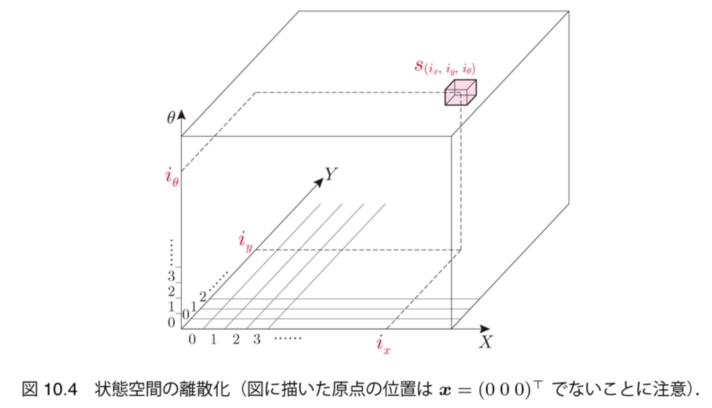
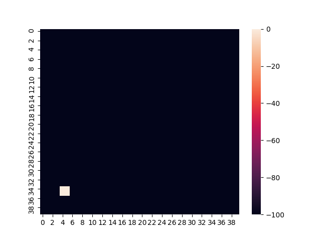
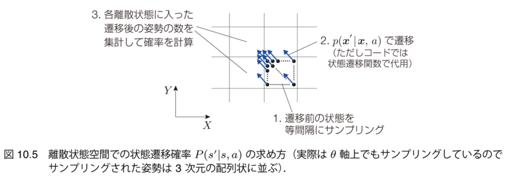
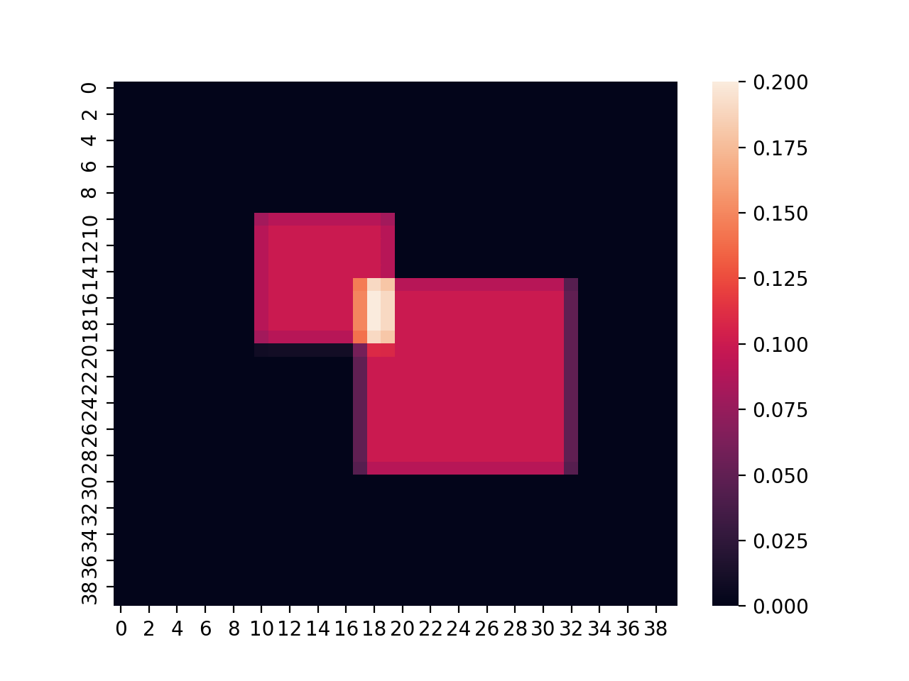

$\newcommand{\V}[1]{\boldsymbol{#1}}$

# 10. マルコフ決定過程と動的計画法

千葉工業大学 上田 隆一

This work is licensed under a <a rel="license" href="http://creativecommons.org/licenses/by-sa/4.0/">Creative Commons Attribution-ShareAlike 4.0 International License</a>.

---

### ロボットの行動決定

* 移動ロボットの場合、経路計画問題として扱われることが多い
    * ある地点からある地点までの移動を最短経路で 　
* もっと知的にしたい
    * 例
        * 危険のある近道と危険でない回り道を柔軟に選択
        * 目的地に行くことを諦める

マルコフ決定過程と動的計画法の枠組みで考える

---

## 10.1 マルコフ決定過程

* やること
    * ロボットが行動決定するという現象や問題を定式化

---

## 10.1.1 状態遷移と観測

* ロボットの行動
    * 状態遷移モデル: $\V{x}\_t \\sim p(\V{x} | \V{x}\_{t-1}, a\_t)$ $(t=1,2,\\dots,T)$
        * $T$: タスクが終わる時間（不定）
        * $\V{x}_T$: 終端状態
        * $a_t \in \mathcal{A} = \\{a_0, a_1, \dots, a_{M-1}\\}$: 行動
            * これまでのようにベクトルでもよいし、「走る」、「投げる」などの複合的な動作でもよい。なんなら「食う」、「寝る」、「遊ぶ」などでもよい
            * 添字が時刻だったり行動の種類のIDだったりするので注意 　
* ロボットの観測
    * 常に真の状態$\V{x}_t^*$が既知とする
    * 未知の場合は12章で扱う

---

### マルコフ性の仮定

* 状態遷移が遷移前の状態よりも前の状態に左右されない場合を考える
    * $\V{x}\_t \\sim p(\V{x} | \V{x}\_{t-1}, a\_t)$の形を見るとそうなっている
    * $\V{x}\_{t-2}$以前の状態は何の影響も与えない 　
* そうでない場合はどうする？
    * マルコフ性を満たすように状態の定義をしなおす
    * 例: $\V{x}\_{t-2}$まで散々動いてモータが熱々のロボットと$\V{x}\_{t-1}$からスタートするロボットでは動きが違う 
    $\Longrightarrow$モータの温度を$\V{x}$の変数として扱う

---

## 10.1.2 評価関数

* ロボットの行動を評価する
    * これまでは自己位置推定やSLAMがうまくできるかどうかを評価していたが、これは（ロボットに人格があれば）自律ロボットにとっては手段でしかない。うまく行動できるかどうかが重要。 　
* 評価関数: $J(\boldsymbol{x}\_{0:T}, a\_{1:T}) \in \Re$
    * やったこと（$a\_{1:T}$）、起こったこと（$\boldsymbol{x}\_{0:T}$）で評価
    *  評価は時間、消費エネルギー、危険性など多岐にわたるはずであるが、うまく式を作ってスカラ1個で評価することとする
        *  行動はひとつしか選べないのでこれで十分

---

## 10.1.3 報酬と終端状態の価値

* 評価関数$J(\boldsymbol{x}\_{0:T}, a\_{1:T}) $を次の形式で考える
    * $J(\boldsymbol{x}\_{0:T}, a\_{1:T}) = \sum\_{t=1}^T r(\boldsymbol{x}\_{t-1}, a\_t, \boldsymbol{x}\_t) + V\_\text{f}(\boldsymbol{x}\_T)$
        * $r(\boldsymbol{x}\_{t-1}, a\_t, \boldsymbol{x}\_t) \in \Re$: 状態遷移ごとに与える評価を決める関数
            * 報酬モデルと呼ぶ
            * 値を報酬と呼ぶ
            * $t=0$から$t=T$までの状態遷移、行動履歴、報酬をまとめてエピソードと呼ぶ
        * $V\_\text{f}(\boldsymbol{x}\_T)$: 終端状態の評価 　
* 終端状態
    * 良くも悪くもタスクが終わった状態
    * $V\_\text{f}(\boldsymbol{x}\_T)$でどのような終わりが良いのか点数をつけておく

---

## 10.1.4 方策と状態価値関数

* 同じ初期状態$\V{x}\_0$からタスクを行うと、$J(\V{x}\_{0:T}, a\_{1:T})$の値は毎回変化
    * 状態遷移が確率的なので 　
* 行動ルールがあったときにどうやって評価する？
    * 行動ルールのことを$\Pi$と表記して方策と呼びましょう
        * 方策の例: ロボットを動かすための自作のプログラム
    * 良い方策: $J$の期待値が高い 　
* $\V{x}_0$から$\Pi$でロボットを動かしたときの$J$の期待値を価値$V^\Pi(\V{x}_0)$と表記
    * 価値の性質を調べてみましょう

---

### 価値の性質

* $V^\Pi(\V{x}\_0) = \left\langle \sum\_{t=1}^T r(\V{x}\_{t-1}, a\_t, \V{x}\_t) + V(\V{x}\_T) \right\rangle\_{p(\V{x}\_{1:T}, a\_{1:T}|\V{x}\_0, \Pi)}$
    * $T$は可変だが、固定として扱える
        * 早くタスクが完了したら、終端状態で何もしない状態遷移（報酬ゼロ）を繰り返して評価を先延ばしにすればよい
        * この先延ばしで$T=0$（初期状態=終端状態の場合）でも上式が成立
    * 終端状態の評価は価値の定義に含まれる 　
* $\V{x}_0$は必ずしも初期状態である必要がない
    * マルコフ性の前提から、$\V{x}\_{-1}$以前のことは$V^\Pi(\V{x}\_0)$に無関係
    * 方策でも$\V{x}\_{-1}$以前を考慮する意味はない
    * タスクのどの時点の状態でも価値$V^\Pi(\V{x})$が考えられる 　
* 関数$V^\Pi: \mathcal{X} \to \Re$の存在$\Longrightarrow$状態価値関数

---

### 逐次式による価値の表現

* 価値の式を逐次式にしてみましょう
    * $V^\Pi(\V{x}\_0) = \left\langle r(\V{x}\_0, a\_1, \V{x}\_1) + \sum\_{t=2}^T r(\V{x}\_{t-1}, a\_t, \V{x}\_t) + V(\V{x}\_T)  \right\rangle\_{p(\V{x}\_{1:T}, a\_{1:T} |\V{x}\_0, \Pi)}$
$= \Big\langle r(\V{x}\_0, a\_1, \V{x}\_1) \Big\rangle\_{p(\V{x}\_{1:T}, a\_{1:T} |\V{x}\_0, \Pi)} + \left\langle \sum\_{t=2}^T r(\V{x}\_{t-1}, a\_t, \V{x}\_t) + V(\V{x}\_T)  \right\rangle\_{p(\V{x}\_{1:T}, a\_{1:T} |\V{x}\_0, \Pi)}$
$= \Big\langle r(\V{x}\_0, a\_1, \V{x}\_1) \Big\rangle\_{p(\V{x}\_1 , a\_1 | \V{x}\_0, \Pi )} + \left\langle \sum\_{t=2}^T r(\V{x}\_{t-1}, a\_t, \V{x}\_t) + V(\V{x}\_T)  \right\rangle\_{p(\V{x}\_{2:T}, a\_{2:T} |\V{x}\_1, a\_1, \V{x}\_0, \Pi)p(\V{x}\_1, a\_1 | \V{x}\_0, \Pi)}$ 
（↑第一項: 余計な変数の消去. 第二項: 乗法定理）
$= \Big\langle r(\V{x}\_0, a\_1, \V{x}\_1) \Big\rangle\_{p(\V{x}\_1 , a\_1 | \V{x}\_0, \Pi )} + \left\langle \sum\_{t=2}^T r(\V{x}\_{t-1}, a\_t, \V{x}\_t) + V(\V{x}\_T)  \right\rangle\_{p(\V{x}\_{2:T}, a\_{2:T} |\V{x}\_1, \Pi)p(\V{x}\_1, a\_1 | \V{x}\_0, \Pi)}$ 
（↑第二項: マルコフ性から$\V{x}\_1$が分かれば条件$\V{x}\_0,a\_1$は不要）

次ページに続く

---

### 逐次式による価値の表現（続き）

* 逐次式になる
    * $=\Big\langle r(\V{x}\_0, a\_1, \V{x}\_1) \Big\rangle\_{p(\V{x}\_1, a\_1 | \V{x}\_0, \Pi )} + \left\langle \left\langle \sum\_{t=2}^T r(\V{x}\_{t-1}, a\_t, \V{x}\_t) + V(\V{x}\_T)  \right\rangle\_{p(\V{x}\_{2:T}, a\_{2:T}|\V{x}\_1, \Pi)} \right\rangle\_{p(\V{x}\_1, a\_1 | \V{x}\_0, \Pi)}$
$= \Big\langle r(\V{x}\_0, a\_1, \V{x}\_1) \Big\rangle\_{p(\V{x}\_1, a\_1 | \V{x}\_0, \Pi )} + \left\langle V^\Pi(\V{x}\_1) \right\rangle\_{p(\V{x}\_1, a\_1 | \V{x}\_0, \Pi)}$ 
 （↑第二項: $\V{x}\_1$は$\V{x}\_0$と同様, 初期状態である必要がない）
$=\Big\langle r(\V{x}\_0, a\_1, \V{x}\_1) + V^\Pi(\V{x}\_1) \Big\rangle\_{p(\V{x}\_1, a\_1 | \V{x}\_0, \Pi )}$ 
$= \Big\langle r(\V{x}\_0, a\_1, \V{x}\_1) + V^\Pi(\V{x}\_1) \Big\rangle\_{p(\V{x}\_1 | \V{x}\_0, a\_1, \Pi )P(a\_1 | \V{x}\_0, \Pi)}$ 
$= \Big\langle r(\V{x}\_0, a\_1, \V{x}\_1) + V^\Pi(\V{x}\_1) \Big\rangle\_{p(\V{x}\_1 | \V{x}\_0, a\_1 )P(a\_1 | \V{x}\_0, \Pi)}$
* $\V{x}_0$が初期状態である必要はないので時刻を取り払う
    * $V^\Pi(\V{x}) = \left\langle r(\V{x}, a, \V{x}') + V^\Pi(\V{x}') \right\rangle\_{p(\V{x}' | \V{x}, a )P(a | \V{x}, \Pi)}$
        * 価値は、報酬と遷移後の価値の期待値の和と釣り合う

---

### 決定論的方策

* $V^\Pi(\V{x}) = \left\langle r(\V{x}, a, \V{x}') + V^\Pi(\V{x}') \right\rangle\_{p(\V{x}' | \V{x}, a )P(a | \V{x}, \Pi)}$
    * $a$は、そのときの状態$\V{x}$と方策$\Pi$から確率的に決まるという式になっているが、ロボットが自分で選択可能
    * $r(\V{x}, a, \V{x}'), V^\Pi(\V{x}'), p(\V{x}' | \V{x}, a )$の値が分かればベストな行動$a^\*$が決まる
        * $\Pi$から方策を改善できる
        * 全状態で$\V{x}$に対して$a^*$を決定していくと$\Pi$より性能がよくなる 
$\Longrightarrow$確率的な方策があると、それより性能がよい決定論的な方策が存在 　
* 方策を実装するときはこの形式で十分
    * $\Pi: \mathcal{X} \to \mathcal{A}$（決定論的方策）
* $\Pi$が決定論的方策の場合の価値の逐次式
    * $V^\Pi(\V{x}) = \left\langle r(\V{x}, a, \V{x}') + V^\Pi(\V{x}') \right\rangle\_{p(\V{x}' | \V{x}, a )} \qquad (a =\Pi(\V{x}))$

---

## 10.1.5 マルコフ決定過程のまとめ

* 系
    * 時間: $t = 0,1,2,\dots,T$（$T$は不定でよい）
    * 状態と行動: $\V{x} \in \mathcal{X}$、$a \in \mathcal{A}$
        * 一部の状態が終端状態: $\V{x} \in \mathcal{X}_\text{f} \subset \mathcal{X}$
    * 状態遷移モデル: $p(\V{x}' | \V{x}, a) \ge 0$
* 評価
    * 報酬モデル: $r(\V{x}, a, \V{x}') \in \Re$
    * 終端状態の価値: $V_\text{f}(\V{x}) \in \Re \quad (\V{x} \in \mathcal{X}_\text{f})$
    * 評価: $J(\V{x}\_{0:T}, a\_{1:T}) = \sum\_{t=1}^T r(\V{x}\_{t-1}, a\_t, \V{x}\_t) + V\_\text{f}(\V{x}\_T)$
* 解く問題
    * なるべく良い方策$\Pi: \mathcal{X} \to \mathcal{A}$を求めたい
        * 求めた価値の逐次式が解決に重要な役割

---

## 10.2 経路計画問題

* 次のような問題を考えます
    * ロボットが最短時間でゴールに行く
    * 水たまりに入りたくない
    * とれる行動: 前進、右回転、左回転の3種類

---

## 10.2.1 報酬の設定

* 「ゴールまで早く到達でき、 かつ水たまりを避ける」移動を 高く評価
    * $r(\V{x}, a, \V{x}') = -\Delta t - cw(\V{x}')\Delta t$
        * $\Delta t$: 1ステップの時間
        * $w(\V{x}')$: 遷移後の状態$\V{x}'$での水深
        * $c$: どれだけ水がいやなのかを表す係数 　
* シミュレータでの実装
    * 水たまり: 時間の10倍の罰
        * ふたつ重なった部分: 20倍

---

## 10.2.2 エピソードの評価

* 単純に各ステップの$r$を積算して、$J$とする
    * ゴールした状態の価値を$0$に
    * $J$: かかった時間と水たまりのペナルティーの和 　
* $r$は負なので$J$は$0$に近いほど良い

---

## 10.3 方策の評価

* 価値が確定している終端状態からさかのぼっていくと$V^\Pi(\V{x})$の値が計算できる
    * 使う式: $V^\Pi(\V{x}) = \left\langle r(\V{x}, a, \V{x}') + V^\Pi(\V{x}') \right\rangle\_{p(\V{x}' | \V{x}, a )}$
    * ただし$V^\Pi(\V{x})$はそのままでは計算不可能
        * $\V{x}$が無限にあるので 　
    * 本書では$\mathcal{X}$を格子状に区切って離散化して計算（次ページ）

---

## 10.3.1 状態空間の離散化

* $XY\theta$空間を図のように離散化
    * 各区画を$s_{(i_x,i_y,i_\theta)}$と番号づけ
        * $i_x,i_y,i_\theta$: 各軸の区画つけた$0,1,2,\dots$という番号
        * 実装での区間の幅: $X,Y$軸が200[mm]、$\theta$軸が10[deg]

* $s_{(i_x,i_y,i_\theta)}$: 離散状態

---

### 価値関数の初期化

* 終端状態の価値を0、それ以外を大きな負の値にしておく
* 図: $i_\theta$を固定したときの$XY$平面での価値関数
    * 白いところがゴール

---

## 10.3.2 離散状態間の状態遷移と状態遷移に対する報酬

* 数式を$\V{x}$から$s$に離散化
    * 価値関数の式: $V^\Pi(s) = \big\langle R(s, a, s') + V^\Pi(s') \big\rangle\_{ P(s' | s, a) } \\\\ \qquad = \sum\_{s'\in \mathcal{S}} P(s' | s, a) \left[ R(s, a, s') + V^\Pi(s') \right]$
        * $P(s' | s, a)$: 離散化した状態遷移関数（あとで計算）
        * $R(s,a,s')$: 離散化した報酬（これもあとで計算） 　
    * 求める方策の形式: $\Pi: \mathcal{S} \to \mathcal{A}$

---

### $P(s' | s, a)$の計算

* ある$i_\theta$に対して、下図のようにモンテカルロ法で求める
    * $i_x, i_y$については相対値でよい

---

### $R(s, a, s')$の計算

* 元の式: $r(\V{x}, a, \V{x}') = -\Delta t - cw(\V{x}')\Delta t$
* $R(s, a, s')$: 状態$s'$での水の深さの平均値で$w(\V{x}')$を代用して計算

