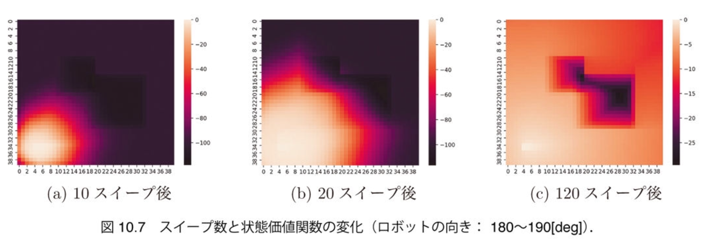
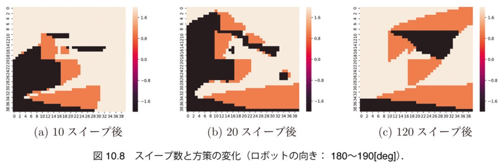
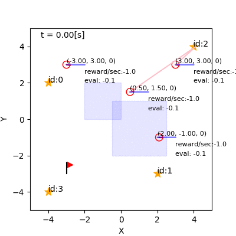

$\newcommand{\V}[1]{\boldsymbol{#1}}$

# 10. マルコフ決定過程と動的計画法 （後半）

千葉工業大学 上田 隆一

This work is licensed under a <a rel="license" href="http://creativecommons.org/licenses/by-sa/4.0/">Creative Commons Attribution-ShareAlike 4.0 International License</a>.

---

## 10.4 価値反復

* これまでやってきたこと
    * 水たまりに突っ込んでいく方策の状態価値関数を求めた 　
* 方策はもっとよくできる
    * 方策を局所的に変えると状態価値関数の値を改善可能

---

### 方策改善

* 行動価値関数
    * 行動を変数にして価値を考える
    * $Q^\Pi(s, a)  = \Big\langle R(s, a, s') + V^\Pi(s') \Big\rangle_{ P(s' | s, a) }  \\\\ \qquad = \sum_{s'} P(s' | s, a) \left[ R(s, a, s') + V^\Pi(s') \right]$ 　
* 行動価値関数を利用した方策の改善
    * $\Pi(s) \longleftarrow \text{argmax}_{a \in \mathcal{A}} Q^\Pi(s, a)$
    * 価値の計算（方策評価）と、この計算（方策改善）を繰り返すと方策がよくなっていきそうだ

これを突き詰めると次ページのアルゴリズムに

---

### 価値反復

* 次のようなアルゴリズムを考える
    1. 全状態について適当に状態価値関数$V$を初期化
        * ただし終端状態の価値だけは決まった値に
    2. 各状態において, 全行動$a \in \mathcal{A}$の行動価値関数を求め, 最大の値を$V(s)$に代入
        * $V(s) \longleftarrow \max_{a \in \mathcal{A}} Q(s, a)$
    3. 2を何スイープも実行
    4. 収束後、各状態で行動価値関数を最大にする行動を記録
        * $\Pi^\*(s) = \text{argmax}\_{a \in \mathcal{A}} \sum\_{s'} P(s' | s, a) \left[ R(s, a, s') + V^\*(s') \right]$
            * $V^*$: 収束した状態価値関数（最適状態価値関数）
            * $\Pi^*$: 最適方策

---

### 価値反復の実行

* 状態価値関数 

* 方策 

---

### 方策を用いた行動決定

* $\Pi^*$: どの状態に対しても最適な行動が記録されている
    * ロボットは$\Pi^*$を使って反射的に行動を選ぶと最適な経路でゴールに行ける

 

---

## 10.5 ベルマン方程式と最適制御

* やること
    * いままでのことを数式を眺めながらおさらい

---

## 10.5.1 有限マルコフ決定過程

* 離散状態でマルコフ決定過程をまとめなおす
    * 有限マルコフ決定過程（finite MDP）
* 系
    * 時間: $t = 0,1,2,\dots,T$（$T$は不定でよい）
    * 状態と行動: $s \in \mathcal{S}$、$a \in \mathcal{A}$
        * 一部の状態が終端状態: $s \in \mathcal{S}_\text{f} \subset \mathcal{S}$
    * 状態遷移モデル: $P(s' | s, a) \ge 0$
* 評価
    * 報酬モデル: $R(s, a, s') \in \Re$
    * 終端状態の価値: $V_\text{f}(s) \in \Re \quad (s \in \mathcal{X}_\text{f})$
    * 評価: $J(s\_{0:T}, a\_{1:T}) = \sum\_{t=1}^T R(s\_{t-1}, a\_t, s\_t) + V\_\text{f}(s\_T)$
* 最適方策$\Pi^*: \mathcal{S} \to \mathcal{A}$を求める
    * （計算量の話を抜きにすると）価値反復で求まる

---

## 10.5.2 有限マルコフ決定過程におけるベルマン方程式

* 最適状態価値関数の性質
    * $V^\*(s) = \max_{a \in \mathcal{A}} \sum_{s'} P(s' | s, a) \left[ R(s, a, s') + V^\*(s') \right]$
        * 価値反復でもう価値が更新できない状態
        * ベルマン（最適）方程式と呼ばれる 　
* 最適方策
    * $\Pi^\*(s) = \text{argmax}\_{a \in \mathcal{A}} \sum_{s'} P(s' | s, a) \left[ R(s, a, s') + V^\*(s') \right]$
    * そのときの状態だけで最適な行動が決まる
        * その前の状態がなんであろうと関係ないので、終端状態に近いところから部分問題を解いていくと$J$の期待値に対して最適な方策が得られる（最適性の原理）

---

## 10.5.3 連続系での ベルマン方程式と最適制御

* もう一度連続的な状態空間の話に戻る
    * ベルマン方程式: 
        * $V^\*(\V{x}) = \int\_{\mathcal{X}} p(\V{x}' | \V{x}, a) \left\\{ r(\V{x}, a, \V{x}') +  V^\*(\V{x}') \right\\} d\V{x}'$
    * さらに$a$を$\V{u}$に戻し、時間を連続に
        * 上の式はハミルトン-ヤコビ-ベルマン方程式と呼ばれる、制御問題を扱うための統一的な式になる
            * 式は私の手におえないので割愛
            * ほとんどの制御の問題はHJB方程式を具体化したもので、ほとんどの制御の手法はHJB方程式を近似的に解くためのもの

ロボットや人間の行動決定の問題と制御には 本質的な違いはない

---

## 10.6 まとめ

* 本章でやったこと
   * （有限）マルコフ決定過程の定式化
   * その具体例としてのロボットが水たまりを避けてゴールに向かう問題を定義し、価値反復で最適方策を計算
   * 最適性の原理やベルマン方程式について確認 　
* 補足
   * 価値反復は速い/遅い
       * 状態空間全域で最適方策を得ようとすればこれ以上速いアルゴリズムはおそらくないので速い
       * 価値反復は簡単にいくらでも並列化できるので速い
       * 状態空間の次元が増えると離散状態が指数乗的に増えるので遅い （次元の呪い）
   * 最適状態価値関数、最適方策を求めない手法は近似
       * 最悪、ロボットが無限ループに陥る

