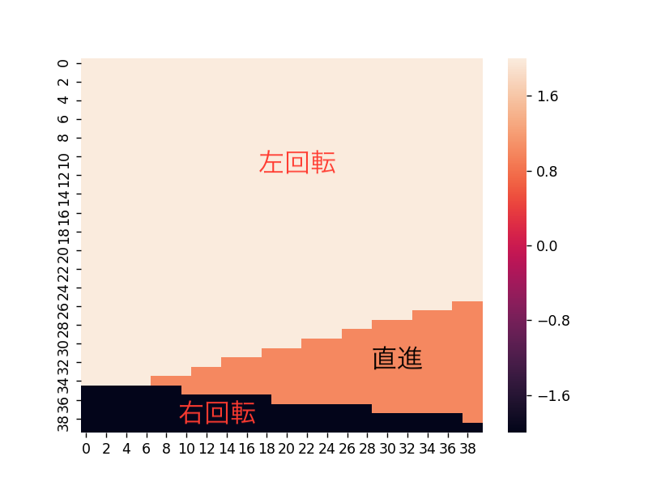
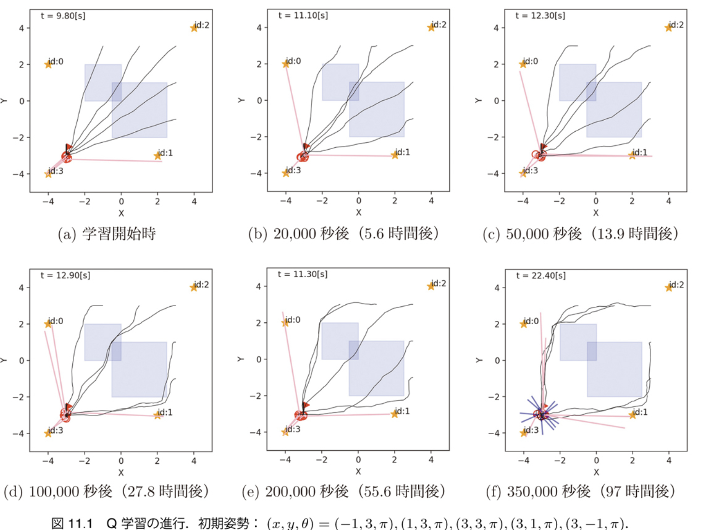
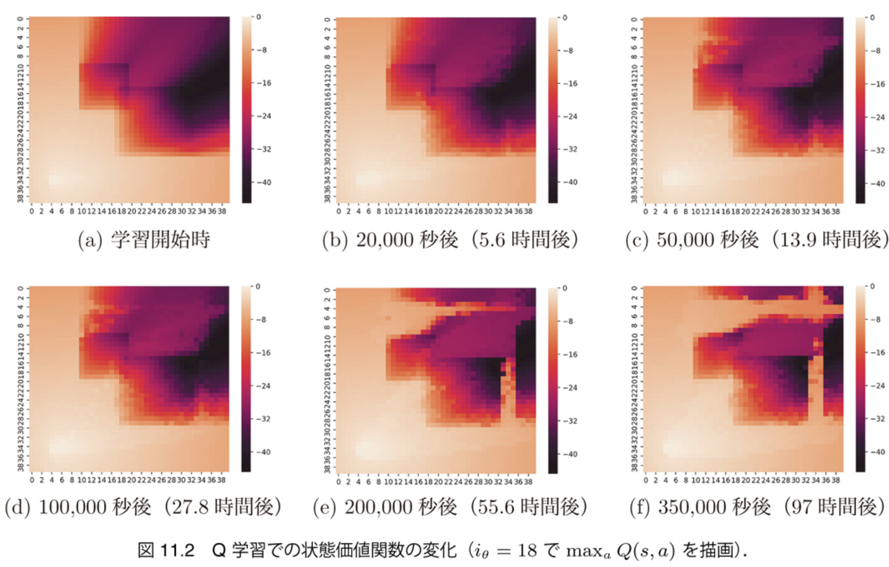

$\newcommand{\V}[1]{\boldsymbol{#1}}$

# 11. 強化学習 （前半）

千葉工業大学 上田 隆一

This work is licensed under a <a rel="license" href="http://creativecommons.org/licenses/by-sa/4.0/">Creative Commons Attribution-ShareAlike 4.0 International License</a>.

---

### 強化学習

* MDPにおいて以下の情報だけで方策を得る
    *  現在時刻までのエピソード: $\\{\V{x}_0, a_1, \V{x}_1, r_1, a_2, \V{x}_2, r_2, \dots, a_t, \V{x}_t, r_t \\}$
        * 報酬$r_t$は$a_t,\V{x}_t$の後にエージェントに知らされる
    *  終端状態に着いたこと, およびそのときに得られる価値$v_\text{f}$
    *  評価: $J(\V{x}\_{0:T}, a\_{1:T}) = \sum\_{t=1}^T r\_t + v\_\text{f}$

エージェントを動かして状態遷移や報酬の統計をとらないと解けない$\Longrightarrow$強化学習の問題

---

### 本章の内容

* 古典的な強化学習の解法を4種類実装
    * Q
    * Sarsa
    * $n$-step Sarsa
    * Sarsa$(\lambda)$ 　
* ねらい
    * 古典的（簡単）な手法で強化学習の原理を把握
    * 情報がないところからどのように学習が進むか、どんなことが起こるかを実感

---

## 11.1 Q学習

* ロボットが一回状態遷移した後に得られる情報から、行動価値関数を更新するアルゴリズムの一種 　
* 行動価値関数（おさらい）
    * $Q^\Pi(s, a)  = \Big\langle R(s, a, s') + V^\Pi(s') \Big\rangle_{ P(s' | s, a) }$
    * $R(s,a,s')$や$P(s'|s,a)$が分かれば$Q^\Pi(s,a)$は遷移先の$V^\Pi$の値から計算可能（でも分からない） 　
* 学習前の$Q^\Pi(s, a)$を、$P(s'|s,a)$ではなく、一度の状態遷移から修正するにはどうすればよいか
    * 状態遷移: $s$から$a$を選んで$s'$に行き、報酬$r$をもらう

---

## 11.1.1 Q学習の更新則

* 行動価値関数を変形
    * $Q^\Pi(s, a) = \Big\langle R(s,a,s') + V^\Pi(s') \Big\rangle_{ P(s' | s, a) } \\\\ \qquad\qquad = \Big\langle r + \max_{a'}Q^\Pi(s',a') \Big\rangle_{ P(s' | s, a) }$
        * 報酬は状態遷移で分かった$r$を用いる
        * $V^\Pi(s)$というのは$Q^\Pi(s,a)$が最大となるように$a$を選んだときの値 　
* さらに変形
    * $Q(s, a) = \Big\langle r + \max_{a'}Q(s',a') \Big\rangle_{ P(s' | s, a) }$
        * 方策が定まってないので、とりあえず$Q(s,a)$の値を適当に初期化したものから計算（価値反復と同じような考え方）
        * 方策（$a$の選び方）はあとで考える

---

### Q学習の更新則（続き）

* $P(s' | s, a)$が分からないのでひとつの事象で更新
    * $Q(s, a) \longleftarrow r + \max_{a'}Q(s',a')$
    * これはダメ
        * $a$が一か八かの行動の場合には値が安定しない
        * 本来は何回も統計をとる必要がある 　
* 妥協して更新前の値との折衷案に
    * $Q(s, a) \longleftarrow (1-\alpha)Q(s,a) + \alpha \big\[ r + \max_{a'}Q(s',a')\big\]$
    * $\alpha$を小さくするほど過去を忘れにくい
        * 書籍では$\alpha = 0.5$

ロボットをなんらかの方策で動かしながら$Q(s, a)$を更新していき、（だいたいの）収束を目論む

---

## 11.1.2 準備

* $Q$学習の実装の準備
* 書籍でやっていること
    * まったく方策がない状態からの学習は難しいので、puddle ignore policyからスタート
    * 前章の離散化と方策評価の方法で、方策と状態価値関数を計算・記録しておく

---

## 11.1.3 行動価値関数の設定

* 状態価値関数から行動価値関数を設定
    * $a$が最適な行動 or $s$が終端状態の場合: $Q(s,a) = V(s)$
    * $a$が最適な行動でない場合: $Q(s,a) = V(s) - 0.1$
        * 少し価値を下げておく

これで$Q(s,a)$が最大となる$a$を選ぶと puddle ignore policyになる

---

## 11.1.4 $\varepsilon$-グリーディ方策

* 学習のためには、同じ状態で別の行動を選択する機会が必要
    * puddle ignore policyだけだともっと良い行動に気づけない 　
* 書籍では次のような「$\varepsilon$-グリーディ方策」を実装
    * 確率$\varepsilon$で、ランダムに行動選択
    * 確率$1-\varepsilon$で、$Q(s,a)$が最大になる行動を選択
        * 書籍では$\varepsilon = 0.3$

ある状態$s$で$Q(s,a)$の値が逆転すると、 方策が変わる

---

## 11.1.5 行動価値関数の更新

* $Q(s, a) \longleftarrow (1-\alpha)Q(s,a) + \alpha \big\[ r + \max_{a'}Q(s',a')\big\]$ を実装 　

## 11.1.6 試行を繰り返すための ロボットの実装

* ロボットがゴールに入ると初期姿勢に戻るようにシミュレータを改造
    * 初期姿勢はランダムに選択
    * ただし学習の効率をあげるために少し範囲を限定
    * ゴールから見て水たまりの向こう側に

---

## 11.1.6 Q学習の結果

* 図: 学習中の$Q(s,a)$から最大の$a$を選択して得た行動
    * ゴールに近い初期姿勢から水たまりが回避できるように

---

### 状態価値関数の変化

* 図: 最良の行動価値関数から作った状態価値関数
    * 水たまり回避ルートが開拓されていく

