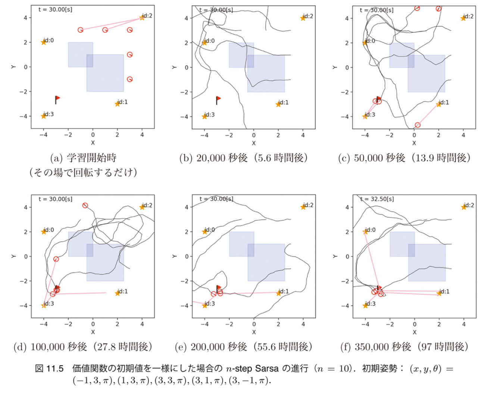
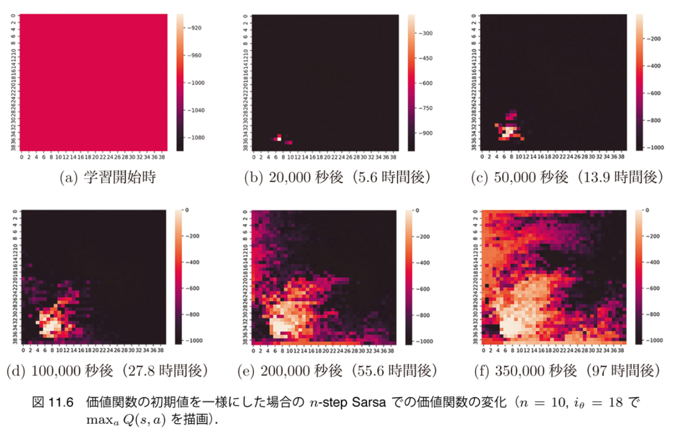
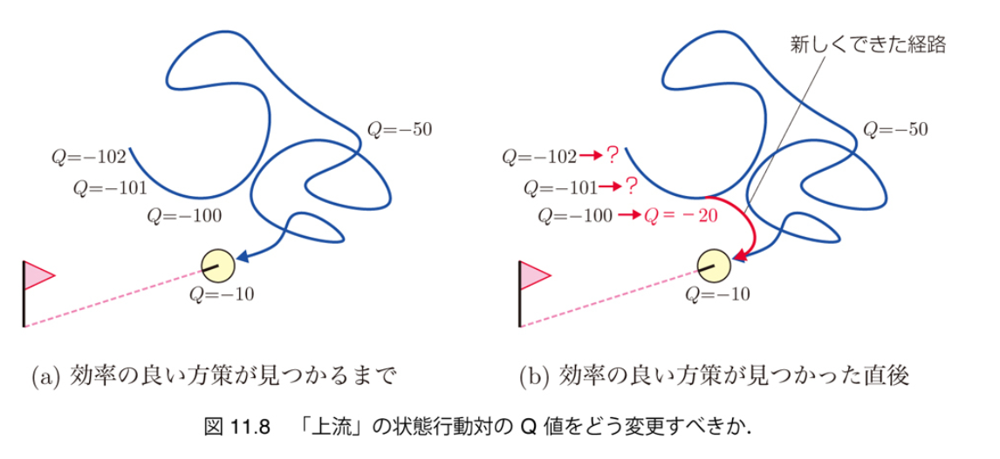
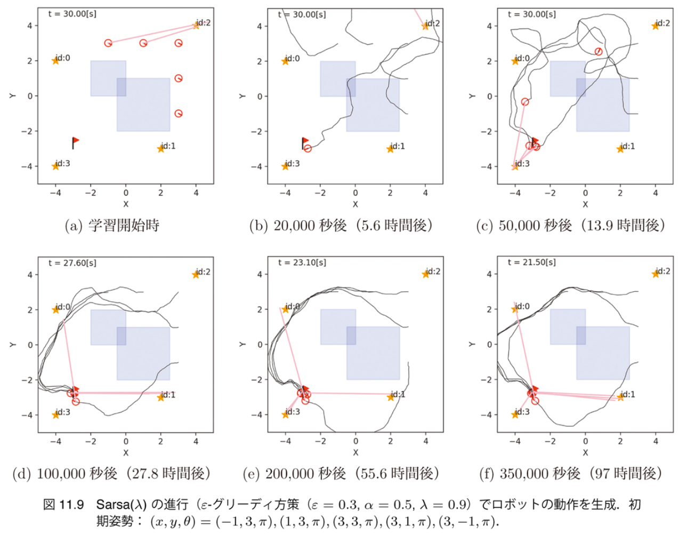
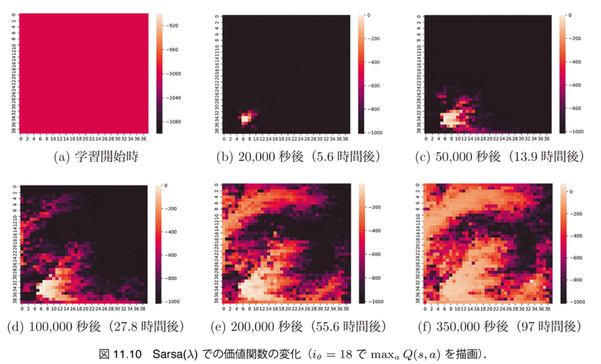

$\newcommand{\V}[1]{\boldsymbol{#1}}$

# 11. 強化学習 （後半）

千葉工業大学 上田 隆一

This work is licensed under a <a rel="license" href="http://creativecommons.org/licenses/by-sa/4.0/">Creative Commons Attribution-ShareAlike 4.0 International License</a>.

---

## 11.3 $n$-step Sarsa

* 画期的な行動選択があったときに、過去にさかのぼって価値を更新できないか？ 　
* 考えられる方法
    * Sarsaで、もうちょっと後まで行動選択してから価値を更新
        * Sarsa: $s, a, r, s', a'$で$Q(s,a)$を更新
        * 改良: $s, a, r, s', a', s'', a''$で$Q(s,a)$を更新
        * さらに改良: $s, a, r, s', a', s'', a'', s''', a'''$で$Q(s,a)$を更新
        * さらにさらに改良: ... 　
* $n$ステップだけ評価を先延ばしにする $= n$ステップ過去の状態行動対の価値を更新

---

### 更新式の導出

* $s,a,r,s',a'$の$r,s',a'$を1ステップ後ということで $r^{(1)},s^{(1)},a^{(1)}$と書き直し
    * Sarsaの式: $Q(s,a) \longleftarrow (1 - \alpha)Q(s,a) + \alpha \left[ r^{(1)} + Q(s^{(1)},a^{(1)}) \right]$ 　
* $a^{(2)}$まで評価を先延ばし
    * $Q(s,a) \longleftarrow (1 - \alpha)Q(s,a) + \alpha \left[ r^{(1)} + r^{(2)} + Q(s^{(2)},a^{(2)}) \right]$ 
    * Q学習では簡単に先延ばしできない
* $a^{(n)}$まで評価を先延ばし
    * $Q(s,a) \longleftarrow (1 - \alpha)Q(s,a) + \alpha \left[ \sum_{i=1}^n r^{(i)} + Q(s^{(n)},a^{(n)}) \right]$ 　
* 実装のため、$n$ステップ前の行動価値関数を更新する式に
    * $Q(s^{(-n)},a^{(-n)}) \longleftarrow (1 - \alpha)Q(s^{(-n)},a^{(-n)}) + \alpha \left[ \sum_{i=0}^{n-1} r^{(-i)} + Q(s,a) \right]$

---

### $n$-step Sarsaの実装

* 必要事項
    * エピソードを保存する機能の追加と更新式の変更 　
* 何も方策がない状態からの学習が期待できるので、シミュレーションの条件を変更
    * ロボットの初期姿勢をランダムに
    * 行動価値関数の初期値を一様に
        * 終端状態以外のものを負の大きな値に初期化
    * ひとつの試行に制限時間を設置（180[s]）
        * 長時間ゴールに行けない試行が発生する恐れがあるので 　
* $10$-step Sarsaを実行（結果は次ページ）

---

### $n$-step Sarsaの学習結果

* 5万秒後には水たまりの反対側からゴールに到達可能に
    * Q学習の場合は20万秒後でも無理

---

### $n$-step Sarsaで得られた状態価値関数

* 事前の方策なしから学習が進んでいる
    * まだ収束には遠い
* （些末な話だが）環境の端の離散状態が大きいので通る機会が多く学習が早く進行

---

## 11.4 Sarsa$(\lambda)$

* 評価を遅らせるのではなく、もっと積極的に過去の状態行動対の価値を変更
* 考え方
    * $Q(s,a)$が改善（改悪）された場合、その前の状態行動対の価値もすべて同じだけ更新すべきではないのか？
        * 例えば下図の$Q=-100 \rightarrow Q = -20$の更新

---

### Sarsa($\lambda$)の更新式の導出

* Sarsaの式を並び替え
    * $Q(s,a) \longleftarrow Q(s,a) + \alpha \left[ r + Q(s',a') - Q(s,a) \right]$ 　
* Q値の変化を$\Delta Q$とおく
    * $\Delta Q = r + Q(s',a') - Q(s,a)$
        * エピソードをさかのぼって価値に$\Delta Q$を足していく
        * ただし減衰させていく（過去にいくほど因果関係が薄くなるので） 　
* 更新式
    * $Q(s^{(-n)}, a^{(-n)}) \longleftarrow Q(s^{(-n)}, a^{(-n)}) + \alpha \lambda^n \Delta Q \quad (n=0,1,2,\dots)$
        * $\lambda$: エリジビリティ減衰率
        * 書籍では$\lambda=0.9$

減衰するものの、エピソードの最初まで 更新可能

---

### Sarsa($\lambda$)の実装と実行

* 10-step Sarsaよりも早く学習が進行
    * ゴールに入ったときや水たまりを回避した行動が得られたときに10ステップ以上前の方策も変化していると推察できる
    * ただし、パラメータの違いや偶発的なことで結果は変わる

---

### Sarsa($\lambda$)で得られた状態価値関数

* こちらも10-step Sarsaより価値の変化が大きい

---

## 11.5 まとめ

* 4種類の強化学習アルゴリズムを実装
    * Q学習
    * SarsaおよびSarsaの改良版
* Q学習は多段にしにくいが、できないことはない
    * [Sutton 2018]参照のこと 　
* 本書の離散化は効率が悪い$\rightarrow$関数近似
    * 価値関数や方策をパラメータで表現してパラメータを学習
        * Tesauroのバックギャモン
        * 近年流行しているDQNやA3Cなどは人工ニューラルネットワークで価値関数や方策を近似（+特徴量抽出）
* アルゴリズム凝りすぎに注意
    * 応用ならばよいけど基礎研究だと問題に特化していないかということに

