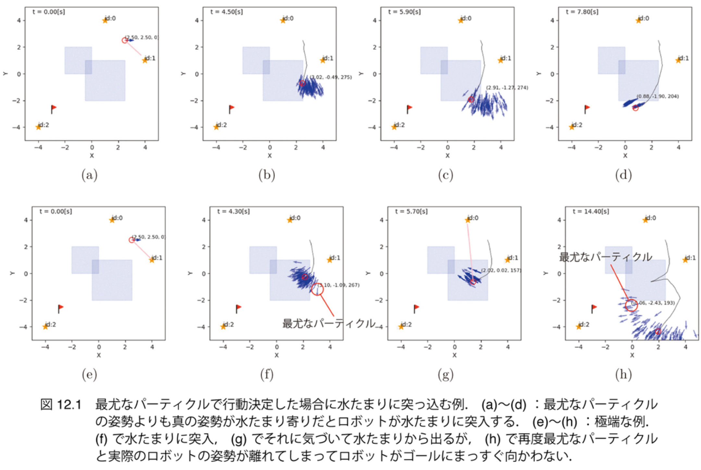
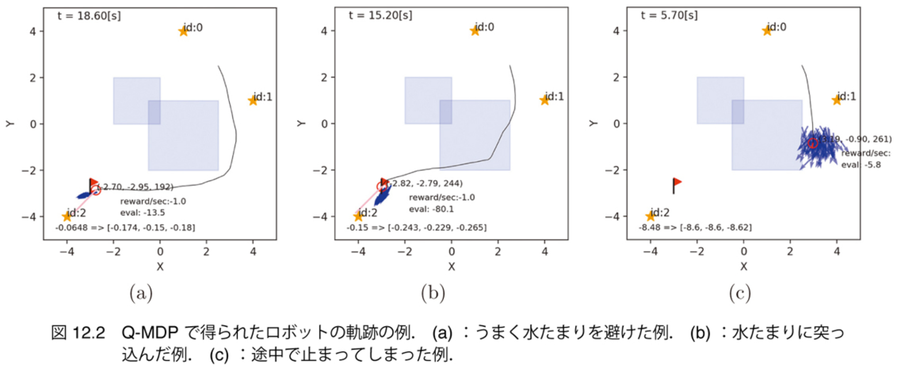
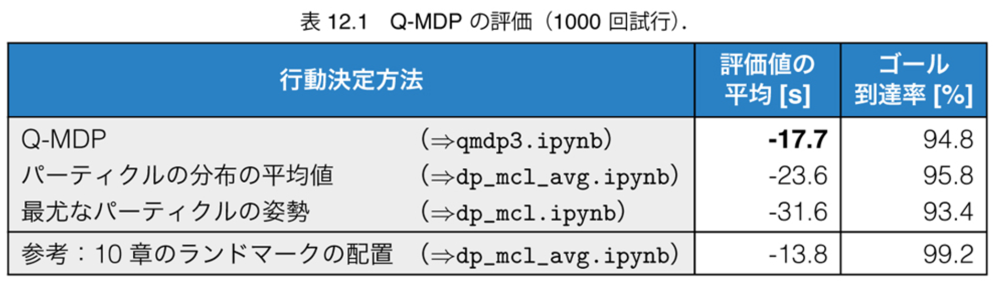
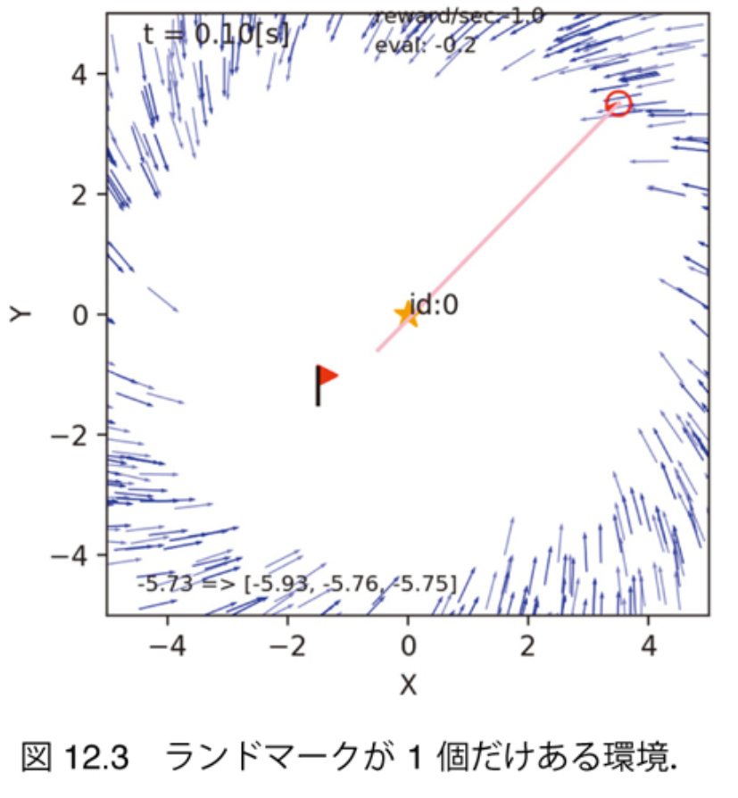

$\newcommand{\V}[1]{\boldsymbol{#1}}$

# 12. 部分観測マルコフ決定過程 （前半）

千葉工業大学 上田 隆一

This work is licensed under a <a rel="license" href="http://creativecommons.org/licenses/by-sa/4.0/">Creative Commons Attribution-ShareAlike 4.0 International License</a>.

---

## 12.1 POMDP

* POMDP
    * MDPで、エージェントが状態推定をしなければならない問題 　
* 名前の意味
    * partially observable Markov decision process
    * 部分観測マルコフ決定過程

---

## 12.1.1 POMDPの問題

* エージェントに与えられるもの
    * 状態遷移モデル: $p(\V{x}' | \V{x}, a)$
    * 観測モデル: $p(\V{z} | \V{x})$
    * 報酬モデル: $r(\V{x}, a, \V{x}')$
    * 終端状態の価値: $V_\text{f}(\V{x}_T)$ 　
* エージェントの目的
    * $J(\V{x}\_0, a\_{1:T}) = \sum\_{i=1}^T r(\V{x}\_{t-1}, a\_t, \V{x}\_t) + V(\V{x}\_T)$の最大化

MDPと異なり、$\V{x}$が分からない

---

### POMDPの方策

* $\V{x}$が分からないので入力に使えない
    * $\Pi(\V{x})$という形式にはならない 　
* 次のようなものになる
    * $a\_{t+1} = \Pi\_\text{POMDP}(a\_{1:t}, \textbf{z}\_{1:t}, r\_{1:t})$
        * 「これまでやったこと、見たこと、与えられた報酬から行動を決めてください」
        * 価値反復では求められなさそう

非常に難しいが、自己位置推定と 併用すると、少し簡単になる

---

## 12.1.2 状態推定が不確かな場合に起こる問題

* 自己位置推定の結果を使うことを考える
    * 信念分布から代表値$\hat{\V{x}}_t$を選ぶ
    * 価値反復などで得られた方策$\Pi$から$\Pi(\hat{\V{x}}_t)$で行動を選べる 　

問題: 信念分布$b_t$の形状や広さが 行動決定に反映されない

---

### $b_t$の形状や広さを考慮しない行動決定で起こること

* 最尤なパーティクルを$\hat{\V{x}}_t$とした例
    * $\hat{\V{x}}_t$と真の姿勢がずれると水たまりに引きずり込まれる

---

## 12.1.3 信念分布を用いる場合のPOMDP

* 方策$\Pi_\text{b}(b_t)$を考える
    * 信念分布から行動を選択
    * 信念分布$b_t$はMDPにおける状態に相当$\Rightarrow$信念状態 　
* 信念状態を状態とみなすと価値反復が利用可能
    * 状態遷移モデルを$p(\V{x}' | \V{x}, a)$から$p(b' | b, a)$に置き換え
    * belief MDPと呼ばれる

---

### belief MDPの状態数

* ものすごく多い
    * 全通りの確率分布
        * 信念状態の数は非負の実数の状態数乗$\Re^\V{\mathcal{X}}$
        * 離散の場合でも、例えば100個のパーティクルを1個ずつ57600個の離散状態に割り振るだけで$10^{318}$通り 　
* まともには攻略できないので近似を考える
    * 12.2節〜12.4節

---

## 12.2 Q-MDP

* 通常のMDPで得られた行動価値関数$Q(a,\V{x})$と信念分布$b$から期待値で行動を決定
    * $Q_\text{MDP}(a,b) = \Big\langle Q(a, \V{x}) \Big\rangle_{b(\V{x})}$
    * $\Pi(b) = \text{argmax}_a Q_\text{MDP}(a,b)$ 　
* 性質
    * 自己位置推定（状態推定）が完璧な場合、もとの方策と一致
    * 2ステップ以上先の信念の不確かさは考慮されない
        * 「自己位置が分からなくなるのを見越して水たまりを大回りする」ということができない

---

### Q-MDPの値の計算

* $Q$が離散的な場合
    * $Q_\text{MDP}(a,b) = \Big\langle Q(a, s) \Big\rangle_{B(s)} = \sum_{s \in \mathcal{S}} B(s)Q(a, s)$
        * 信念分布が連続な場合$b(s) = \int_{\V{x} \in s} b(\V{x}) d\V{x}$
        * 信念分布がパーティクルで近似されている: $s$内のパーティクルの重みの合計で$B(s)$を計算 　
* $Q$の代わりに状態価値関数$V$を使う場合
    * $Q_\text{MDP}(a,b) = \sum_{s \in \mathcal{S}} B(s) \Big\langle R(s, a, s') + V(s') \Big\rangle_{ P(s' | s, a) }$
        * メモリを食わないが計算量が大きくなる

---

### Q-MDPの実装結果

* 水たまりを避けたり避けなかったり止まったり
    * 効果は計測しないと分かりにくい
    * パーティクルの位置から真の姿勢が外れるとどうしようもない
    * ローカルミニマムで止まる（ヒューリスティックが必要）

---

### Q-MDPの評価

* ロボットが左回転と右回転を交互に選んだら次は前進というヒューリスティックを導入
    * 実は11章で強化学習で得た方策でも利用していた 　
* 表: 1000回試行して評価$J$の値の平均値をとった結果
    * Q-MDPで水たまりを避ける傾向が強くなることが分かる

---

## 12.3 ランドマークの足りない状況でのナビゲーション

* 自己位置が一意に定まらない ときにどうタスクを遂行するか 　
* 右図: ランドマークが ひとつしかない環境
    * ロボットの位置は円環状 にしか推定できない
    * （ゴールしたかどうかは直接 センシング可能と仮定をしておく）

どのようにゴールに導くか？
