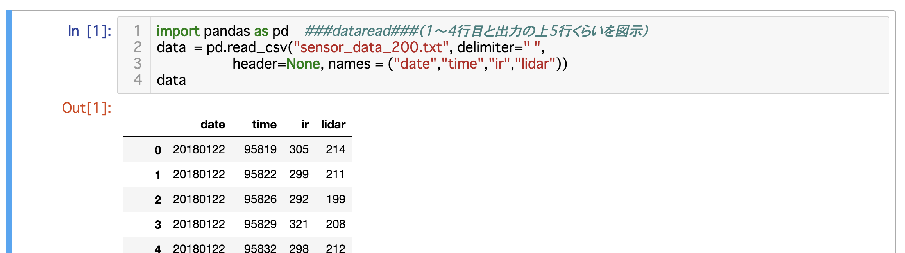
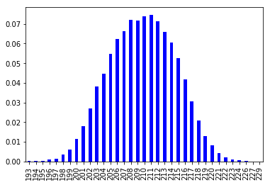
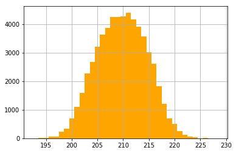
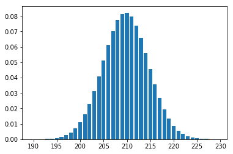
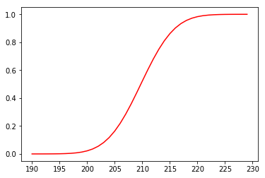

$\newcommand{\V}[1]{\boldsymbol{#1}}$

# 2. 確率・統計の基礎（前半）

千葉工業大学 上田 隆一

 

This work is licensed under a <a rel="license" href="http://creativecommons.org/licenses/by-sa/4.0/">Creative Commons Attribution-ShareAlike 4.0 International License</a>.

---

## 2.1 センサデータの収集とJupyter Notebook上での準備

---

### センサデータの収集

* 本章で使うデータを得るために 実験しました 　
* 方法
    * ロボットを決めた距離だけ 壁から離して置く
    * 3秒ごとにセンサの値を記録 （2〜3日間）
        * 光センサ
        * レーザスキャナ（LiDAR）の 正面の1本のレーザー

---

### 得られたデータ

* 下図: 200mm壁からロボットを離して得たもの
    * date: 日付
    * time: 時分秒
    * ir: 光センサの値（壁から反射した光の強さ）
    * lidar: LiDARの1本のレーザから得られた壁の距離[mm]

値が揺らいでいる

---

### 値のゆらぎ

* LiDARからの値（最初に得られた10個）
    * 214, 211, 199, 208, 212, 212, 215, 218, 208, 217, ...  　
* ロボットでこの値を使うときに気になること
    * 例えば壁の前200[mm]に正確に止まる、などの用途で
        * 毎回値が違うのにどれを信じればよい？
        * 200[mm]ということなのに210[mm]前後の値が多い
        * 1[mm]の違いもなくぴったり止まりたいが可能？

統計の知識が必要

---

## 2.2 度数分布と確率分布

---

## 2.2.1 ヒストグラムの描画

LiDARからの値（以後センサ値と呼ぶ）のばらつきを視認してみましょう

* 度数分布の作成
    * センサ値の範囲を区切り、 各区間の値の個数を集計 　
* ヒストグラムの作成
    * 度数分布をグラフ化
    * 図: 区間の幅1で描いた ヒストグラム
        * （整数のデータで幅1なので 例としてはあまりよくない）

---

## 2.2.2 頻度、雑音、バイアス

* このヒストグラムや元のデータから何を調べられるでしょうか
    * 用語を確認しながら考えてみましょう

---

### 頻度・事象

* 頻度: ある現象（確率・統計の用語では事象）が 起きた回数
    * 頻度の例:
        * 210[mm]あたりの値が得られた頻度が高い
        * 値が194[mm]や226[mm]に近づくほど頻度が低くなる
    * 事象の例:
        * センサ値が210[mm]だった
        * センサ値が210[mm]以上だった、等

---

### 雑音

* センサ値が毎回違う、ヒストグラムが広がりをもつのはなぜ？ 

* 理由: なんらかの雑音が存在するから
    * 雑音（ノイズ）: 値がゆらぐ（乱す）原因
        * 例: センサ内の電気的なゆらぎ、外光、湿度、正体不明・・・
        * ロボットの場合、センサを不適切な環境で使うので混沌を極める

正体不明でもなんとかするのが確率・統計

---

### バイアス

* 壁の距離が200[mm]と説明されたのにセンサ値は210[mm]くらいになるのはなぜ？ 

* なんらかのバイアスが存在するから
    * バイアス（偏り）: 値がずれる原因
        * 例: 筆者の勘違い、センサの取り付けた向きのずれ、正体不明・・・
        * 事前にキャリブレーションできるがゼロにはできず、ロボットの場合は動かしているうちに再発ということがある
        * 雑音と違いデータから量を推測ができないこともある

非常に厄介

---

### 誤差

* 誤差: 何か測りたいものの「真の」値とセンサの値の差
* 誤差の種類
    * 偶然誤差: 主に雑音による
    * 系統誤差: 主にバイアスによる
    * 過失誤差: 実験データの記録間違いなど

ロボットを動かす = これら誤差との戦い

---

## 2.2.3 雑音の数値化

いまの話を数字を使って議論しましょう

---

### 平均値

* 平均値: 全センサ値を足してセンサ値の個数で割ったもの
* 次の式で表される
$$\mu = \frac{1}{N}\sum_{i=0}^{N-1} z_i$$
    * $z_0, z_1, \dots, z_{N-1}$: センサ値
    * $N$: センサ値の個数 　
* 今扱っているセンサ値の平均値: 209.7[mm]
    * 分かること: 200[mm]だと言っていたが1[cm]くらい違う 
    （平均値がないとこういう議論は不可能）

---

### 分散、標準偏差

* 平均値はわかったけど、各センサ値はそこからどれだけ離れているのか
    $\rightarrow$分散、標準偏差で数値化 　
* 分散: 各センサ値と平均値の差の2乗和を足して平均 （実際は2乗和を$N-1$で割る。理由は書籍で。）
$$\sigma^2 = \frac{1}{N-1}\sum_{i=0}^{N-1} (z_i - \mu)^2 \quad (N>1)$$
* 標準偏差: 分散の正の平方根（上の式の$\sigma$）
    * センサ値と単位が揃うので分散よりイメージがつきやすく便利
        * 「誤差はどれだけ？」と聞かれて答える値
    * 今扱っているセンサ値の標準偏差: 4.8[mm]（つまり5[mm]ぐらいの誤差）

---

## 2.2.4 （素朴な）確率分布

* ここでやりたいこと: 度数分布から、 未来にどんなセンサ値が得られそうかを予想 　
* なぜやるか
    * ロボットが実際に得られたセンサ値と予想を比較 （自己位置推定で出てくる演算）
    * センサのシミュレーション

---

### 予想のアイデア

* 未来のセンサ値を集めたら今までと同じ度数分布が得られるのではないか？ 

* ただし、集める個数によって値が変わってはいけないので度数分布を頻度でなく割合に
    * $P_{\textbf{z}\text{LiDAR}}(z) = N_z / N$　（$N_z$: センサの値が$z$だった頻度）
        * 全センサ値の種類に関して$P_{\textbf{z}\text{LiDAR}}(z)$を足し合わせると1に

$P_{\textbf{z}\text{LiDAR}}(z)$を確率と呼びましょう

---

### 確率分布

* ヒストグラムを確率のグラフに描き直してみる
    * 左: ヒストグラム
    * 右: 確率$P_{\textbf{z}\text{LiDAR}}$のグラフ
        * 縦軸の値が変わっただけ
* 用語
    * 関数$P_{\textbf{z}\text{LiDAR}}$: 確率質量関数と呼ぶ
    * $P_{\textbf{z}\text{LiDAR}}$の形状や$P_{\textbf{z}\text{LiDAR}}$そのものを確率分布と呼ぶ

---

## 2.2.5 確率分布を用いた シミュレーション（4章の練習）

* 確率分布$P_{\textbf{z}\text{LiDAR}}$にしたがって センサ値をひとつずつ生成
    * 「ドロー」と表現
    * 数式での表現: $z \sim P_{\textbf{z}\text{LiDAR}}$
    * 「したがって」とは
        * 例えば$P(200\text{})/P(150\text{}) = 2$ なら$z=200$を$z=150$より 2倍出現しやすく 　
* 右のヒストグラム:  シミュレーションで得たもの
    * センサの特性を再現

---

## 2.3 確率モデル

* 度数分布から確率分布を作ることへの疑問
   * 度数分布のデコボコは重要なのか？
       * データの回数が少ないともっとデコボコ
   * 実際に得られた値より小さな/大きな値になる確率はゼロ？
   * なにか法則性（つまり数式）を当てはめられないだろうか？

「確率分布のモデル」を当てはめようという発想

---

## 2.3.1 ガウス分布の当てはめ

* たぶん、確率・統計を勉強した 人は「ガウス分布」を 当てはめようとするでしょう
    * 根拠はない （本当は違うけど是とする） 　
* ガウス分布の形状
    * $p(z | \mu, \sigma^2 ) = \frac{1}{\sqrt{2\pi}\sigma} e^{ - \frac{(z - \mu)^2}{2\sigma^2}}$
         * $\mu$: 平均値、$\sigma$: 標準偏差
         * 図: センサ値から描いたガウス分布
             * ヒストグラムとよく似ている
         * 値が確率でないことに注意 （次ページ）

---

## 2.3.2 確率密度関数

* ガウス分布からの確率の求め方: $p(x | \mu, \sigma^2 )$を積分
    * $p$の値を密度と言う
    * 密度を積分すると確率に（体積と同じ）
* 例
    * センサの値が$210$より小さい確率: $P(z < 210) = \int_{-\infty}^{210} p(z | \mu, \sigma^2 ) dz$
    * センサの値が$210$: $P(z = 210) = \int_{-209.5}^{210.5} p(z | \mu, \sigma^2 ) dz$
        * センサの値が離散値なのに連続関数を当てはめているのでこうなる
        * 右図: この計算で作った確率分布

---

### 用語の補足

* 密度を返す関数$p$: 確率密度関数
* $p$の形状や$p$そのものも確率分布と呼ぶことがある
* ガウス分布は特に$\mathcal{N}$と表記される
   * $\mathcal{N}(z | \mu, \sigma^2 ), \mathcal{N}(\mu, \sigma^2)$などと表記 　
* $P(z < a) = \int_{-\infty}^a p(z) dz$を累積分布関数と呼ぶ
    * 右図
    * $P(a \le z < b) = P(z < b) - P(z < a)$

---

## 2.3.3 期待値

* 期待値: 無限にセンサ値をドローしたときの平均値
    * $\langle z \rangle_{P(z)}$、$\langle z \rangle_{p(z)}$と表現
    * 実際にドローしなくても計算可能
        * $\langle z \rangle_{P(z)} = \sum_{-\infty}^{\infty} zP(z)$（サイコロで計算してみましょう）
        * $\langle z \rangle_{p(z)} = \int_{-\infty}^{\infty} zp(z) dz$ 　
* 一般化した期待値
    * $z$が$p(z)$に従うとき、$f(z)$の値はどうなる？
    * $\langle f(z) \rangle_{p(z)} = \int_{-\infty}^{\infty} f(z)p(z) dz$ 　

---

## 期待値の性質

* 期待値の性質
    * 線形性
        * $\big\langle f(z) + \alpha g(z) \big\rangle_{p(z)} = \big\langle f(z) \big\rangle_{p(z)} + \alpha \big\langle g(z) \big\rangle_{p(z)}$
        * $\big\langle f(z) + \alpha \big\rangle_{p(z)} = \big\langle f(z) \big\rangle_{p(z)} + \alpha \big\langle 1 \big\rangle_{p(z)} = \big\langle f(z) \big\rangle_{p(z)} + \alpha$
    * 平均値
        * $\langle z \rangle_{p(z)} = \mu$、$\langle z - \mu \rangle_{p(z)} = 0$
    * 分散
        * $\langle (z - \mu)^2 \rangle_{p(z)} = \sigma^2$ 　
* その他、各確率モデルには期待値に関する特有の性質があり、計算に利用できる（付録B.2）

---

### ここまでのまとめ

* やったこと: LiDARからのデータの解析
    * ヒストグラムで表現
    * 平均値等、データのゆらぎ（ばらつき）の度合いを数値化
    * ガウス分布とみなしてモデル化
        * 確率分布を$\mu$と$\sigma^2$だけで表現 　
* 何ができるようになるか
    * センサの値がばらつく原因が不明でも雑音を分析
    * ロボットが壁に対してどれくらいの正確さで距離をとれるか見積もり
    * 平均値からバイアスによる系統誤差を計算 $\rightarrow$キャリブレーション
    * ・・・

2.4章以降はもっと複雑な場合を扱う
