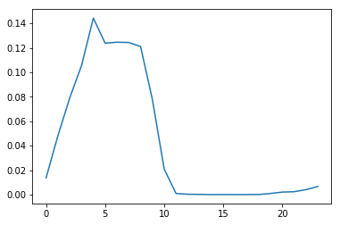

$\newcommand{\V}[1]{\boldsymbol{#1}}$
$\newcommand{\jump}[1]{[\\![#1]\\!]}$
$\newcommand{\bigjump}[1]{\big[\\!\\!\big[#1\big]\\!\\!\big]}$
$\newcommand{\Bigjump}[1]{\bigg[\\!\\!\bigg[#1\bigg]\\!\\!\bigg]}$
$\\newcommand{\\indep}{\\mathop{\\perp\\!\\!\\!\\perp}}$

# 2. 確率・統計の基礎（後半上）

千葉工業大学 上田 隆一

 

This work is licensed under a <a rel="license" href="http://creativecommons.org/licenses/by-sa/4.0/">Creative Commons Attribution-ShareAlike 4.0 International License</a>.

---

## 2.4 複雑な分布

* これまでひとつのセンサの値だけを扱ってきたが、 センサの値は他の要因で変わる
    * 壁までの距離、向き、その他センサに関する変数・・・  　

ほとんどの場合、もっと多くの変数の考慮が必要

---

## 2.4.1 条件付き確率

* センサ値のヒストグラム（距離: 600[mm])
    * ピーク（統計ではモード）が2つ
        * マルチモーダル
    * 635[mm]の頻度がゼロ

今までの解析方法では解析できない

---

### 時系列で見てみる

* センサ値が得られた順に並べてグラフを描画
    * どうやら時間で値が変動しているらしい
        * もっと言うと、昼と夜で変動するなにかが原因 （光、気温、湿度、・・・）

時刻$t$が変数に

---

### 時間別のヒストグラムを作成

* 時間で条件付けすることでガウス分布となる
    * オレンジ: 昼の14時台
    * 青: 朝の6時台
 

「条件付けした分布、確率」というものがある

---

### 条件付き確率の表記

* 例えば6時台のセンサ値の確率分布を次のように表記
    * $P(z | t \in \text{6時台})$
        * $t \in \text{6時台}$: $t$が6時台の時刻の集合に含まれる
        * 「$t$が6時台と分かったので$P(z)$をより確かにできた」とも解釈可能 　
* 一般的な条件付き確率の表記
    * $P(y|x)$: 変数$x$で条件付けられる変数$y$の分布
        * $x$が$y$に「直接」影響を与えている必要はない
            * 例: 時刻はセンサ値を変動させる直接の原因ではない 　
* 「$P(y|x)$は、$P(y)$に$x$という情報を加えた場合の分布」という解釈も頭に入れておきましょう

---

## 2.4.2 同時確率と 加法定理、乗法定理

* 今度は「時刻（時間帯）$t$で センサ値が$z$となる確率」を 考えてみましょう
    * 二つの事象が同時に 起こる確率$\Rightarrow$同時確率と呼ぶ 　
* 同時確率の表記: $P(z, t)$
    * $\sum_z \sum_t P(z, t) =  1$
    * 右図のように確率分布は2次元に
    * $P(z)$より情報が多い

---

### 周辺化

* $P(z)$を$P(z,t)$として見ると情報が増えた
* 逆に$t$の情報を消し去ることもできる$\Rightarrow$周辺化
    * 式: 確率の加法定理
        * $P(z) = \sum_{t=-\infty}^{\infty} P(z,t)$
        * $p(z) = \int_{-\infty}^{\infty} p(z,t) dt$
            * $\sum, \int$の区別をつけたくないので$p(z) = \jump{p(z,t)}_t$と略記
    * 下図: 水平方向の確率を足すと$P(z)$に
        * この操作における$P(z)$のことを周辺分布、その数値を周辺確率と言う

$\rightarrow$

---

### 同時確率と条件付き確率の関係

* $P(z,t)$をある時間帯で切り出すと$P(z|t)$と同じ形に
    * 大きさは$P(z|t)$の方が$\jump{P(z,t)}_z = P(t)$だけ大きく
    * つまり次のような関係（確率の乗法定理）
        * $P(z,t) = P(z|t)P(t)$
        * $p(z,t) = p(z|t)p(t)$

---

### 確率の乗法定理・加法定理のまとめ

* 乗法定理
$$p(x,y) = p(x|y)p(y) = p(y|x)p(x)$$
* 加法定理（と、乗法定理を利用した期待値への変形）
$$p(x) = \jump{p(x,y)}\_y = \jump{p(x|y)p(y)}\_y = \big\langle p(x|y) \big\rangle\_{p(y)}$$

確率の計算のルールはこれしかない

---

### 補足: 3変数以上の乗法定理

* 3変数の場合
    * ひとつの変数を条件に: $p(x,y,z) = p(x,z|y)p(y)$
    * ふたつの変数を条件に: $p(x,y,z) = p(x|y,z)p(y,z)$
    * 条件付き確率で一つの変数を条件に: $p(x,y|z) = p(x|y,z)p(y|z)$
        * $p(x,y) = p(x|y)p(y)$: 隠れている条件を明記していないだけ 　
* それ以上に変数がある場合
    * 上の記号をベクトルにすると同様に成立

---

## 2.4.3 独立、従属、 条件付き独立

変数どうしの関係性を考える

---

### 独立

* 条件付き確率において、条件$y$が$x$の確率分布に 何も影響を与えないと次が成立
    * $p(x|y) = p(x)$
    * $y$の情報が$x$に対してなにもヒントを与えない 　
* 乗法定理に上の式を代入
    * $p(x,y) = p(x|y)p(y)\Longrightarrow$$p(x,y) = p(x)p(y)$
    * この関係を事象$x,y$が互いに独立と表現
        * $x \indep y$と表記 　

---

### 条件付き独立

* $z$が分かっているときに$x$に対して$y$が何も情報を与えない
    * $P(x|z) = P(x|y,z)$ 　
* $p(x,y|z) = p(x|y,z)p(y|z)\Longrightarrow$$p(x,y|z) = p(x|z)p(y|z)$ 　
* 表記: $x \indep y \ | \ z$ 　

独立、条件付き独立ともに確率の計算で多用 （次のページ）

---

## 2.4.4 確率分布の性質を 利用した計算

* 例題1: $\int_\{\V\{z\} \in \{\mathbb{R}\}^2\} p(\V\{z\})\\{f(x) + \alpha g(y)\\} d\V\{z\}$
    * $\V{z} = (x \ y)^\top, x \indep y, x \in \mathbb{R},  y \in \mathbb{R}$とする 　
* 確率の性質だけで式展開可能
    * 上式 $= \big\langle f(x) + \alpha g(y) \big\rangle_{p(\V{z})}$ 
	$ = \big\langle f(x) \big\rangle_{p(\V{z})} +\alpha \big\langle g(y) \big\rangle_{p(\V{z})}  \qquad\qquad$（期待値の線形性から） 
	$ =\big\langle f(x) \big\rangle_{p(x)p(y)} +\alpha \big\langle g(y) \big\rangle_{p(x)p(y)} \quad\ $（$x$と$y$が独立） 
	$ =\big\langle f(x) \big\rangle_{p(x)} +\alpha \big\langle g(y) \big\rangle_{p(y)}  \qquad\qquad$（$f$と$y$、$g$と$x$が無関係） 

---

### もう一つ計算

* 例題2: $\int_\mathcal{\V{z} \in \mathbb{R}^2} p(\V{z})f(x)g(y) d\V{z}$
    * $\V{z} = (x \ y)^\top, x \indep y, x \in \mathbb{R},  y \in \mathbb{R}$とする 　
* $x,y$に関する期待値の積にできる
    * 上式$ = \int_\mathcal{\mathbb{R}} \int_\mathcal{\mathbb{R}} p(x)p(y)f(x)g(y) dy dx$
$ = \int_\mathcal{\mathbb{R}} p(x) \int_\mathcal{\mathbb{R}} p(y)f(x)g(y) dy dx$
$ = \int_\mathcal{\mathbb{R}} p(x) \big\langle f(x)g(y) \big\rangle_{p(y)} dx$
$ = \big\langle \langle f(x) g(y) \rangle_{p(y)} \big\rangle_{p(x)}$
$ = \big\langle f(x) \langle g(y) \rangle_{p(y)} \big\rangle_{p(x)}$
$ = \big\langle g(y) \rangle_{p(y)} \langle f(x) \big\rangle_{p(x)}$ 　
* 結果から得られる関係
    * $\big\langle g(y) \big\rangle_{p(y)} \big\langle f(x) \big\rangle_{p(x)} = \big\langle \langle f(x)g(y) \rangle_{p(x)} \big\rangle_{p(y)}$ $= \big\langle \langle f(x)g(y) \rangle_{p(y)} \big\rangle_{p(x)} = \big\langle f(x)g(y) \big\rangle_{p(x)p(y)} $

---

## 2.4.5 ベイズの定理

* 乗法定理: $p(z,t) = p(z|t)p(t) = p(t|z)p(z)$から導出
* 中辺、右辺から$$p(z|t) = \dfrac{p(t|z)p(z)}{p(t)} = \eta p(t|z)p(z)$$となる
    * $\eta$: 正規化定数
        * $\jump{p(z|t)}_t=1$とするための調整の定数
    * 意味: $t$と$p(t|z)$が分かると、$p(z)$が$p(z|t)$まで確かになる
        * $p(t|z)$: $z$がどの時間帯で得られやすいか

---

### ベイズの定理からの簡単な推定

* 例題: $z_1 = 630, z_2 = 632, z_3 = 636$と センサ値が入った時間帯を推定したい
* 解き方
    1. 各時間帯の$P(z|t)$をセンサ値から計算
        * ヒストグラムから計算可能
    2. ベイズの定理から
        * $P(t | z_1, z_2, z_3) = \eta P(z_1, z_2, z_3 | t) P(t)$
    3. センサの値がその時間帯内で 互いに独立していると仮定
        * 上式$= \eta P(z_1|t)P(z_2|t)P(z_3|t)P(t)$
            * 条件付き独立の事象の性質から
            * $P(z|t)$を使うと$P(t | z_1, z_2, z_3)$が計算可能

---

### 推定結果

 

* 明け方〜午前に得られたセンサ値である可能性が高い
    * 正解: 5時台
* 注意: 必ず当たるわけではない
    * 確率0でない時間帯には可能性がある

---

### ここまでのまとめ

* 条件付き確率、同時確率を理解 　
* 乗法定理、加法定理を理解 　
* 乗法定理からベイズの定理を導出
    * 補足: ベイズの定理は乗法定理の変化形とも言える 　
* ベイズの定理を使って推定をしてみた
    * 結果（センサ値）から原因（時間帯）を推定 
     ↑ 1章の話

