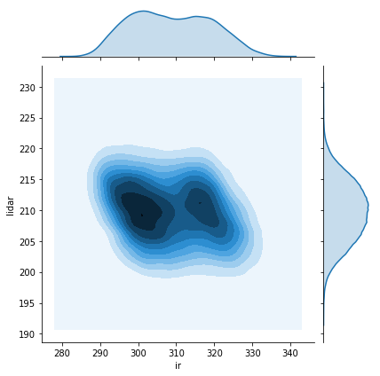
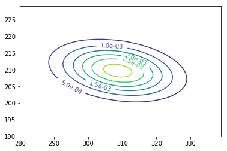
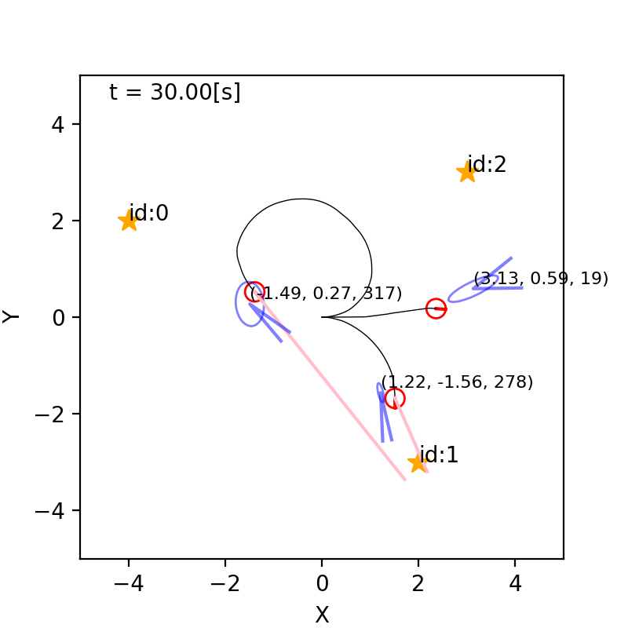

$\newcommand{\V}[1]{\boldsymbol{#1}}$
$\newcommand{\jump}[1]{[\\![#1]\\!]}$
$\newcommand{\bigjump}[1]{\big[\\!\\!\big[#1\big]\\!\\!\big]}$
$\newcommand{\Bigjump}[1]{\bigg[\\!\\!\bigg[#1\bigg]\\!\\!\bigg]}$
$\\newcommand{\\indep}{\\mathop{\\perp\\!\\!\\!\\perp}}$

# 2. 確率・統計の基礎（後半下）

千葉工業大学 上田 隆一

 

This work is licensed under a <a rel="license" href="http://creativecommons.org/licenses/by-sa/4.0/">Creative Commons Attribution-ShareAlike 4.0 International License</a>.

---

## 2.5 多次元のガウス分布

---

## 2.5.1 2次元のガウス分布の 当てはめ

* 右: 700[mm], 12〜16時台の 光センサとLiDARの値の分布
    * それぞれ$x,y$と表して $\V{z} = (x \ y)^T$を考える
    * $P(\V{z})= P(x,y)$は どちらの変数を周辺化しても ガウス分布に当てはまりがよい

同時確率分布$P(\V{z})$はどんな数式で表現できるか？

---

### 多次元のガウス分布

* 次のような確率密度関数（$n$次元ガウス分布）を作ると、 どの変数を残して周辺化してもガウス分布に
    * $$\mathcal{N}(\boldsymbol{z} | \boldsymbol{\mu}, \Sigma) = \frac{1}{(2\pi)^{\frac{n}{2}}\sqrt{|\Sigma|}} \exp \left\\{-\frac{1}{2}(\boldsymbol{z}-\boldsymbol{\mu})^T\Sigma^{-1}(\boldsymbol{z}-\boldsymbol{\mu})\right\\}$$
    $$ = \eta \exp \left\\{-\frac{1}{2}(\boldsymbol{z}-\boldsymbol{\mu})^T\Sigma^{-1}(\boldsymbol{z}-\boldsymbol{\mu})\right\\}$$
        * $\boldsymbol{\mu}$: 中心（$n$次元）
        * $\Sigma$: 共分散行列（$n \times n$対称行列）
    * 形状: 前のスライドの分布のように、等高線を引くと楕円に

共分散行列って何？

---

### 共分散行列

* 2次元の場合、次のような行列
    * $\Sigma = \begin{pmatrix}\sigma_x^2 & \sigma_{xy} \\\\ \sigma_{xy} & \sigma_y^2\end{pmatrix}$
        * $\sigma_x^2, \sigma_y^2$: $x, y$の分散、$\sigma_{xy}$: 共分散 　
* $\sigma_{xy} = \frac{1}{N}\sum_{i=0}^{N-1}(x_i-\mu_x)(y_i-\mu_y)$
    * なんなのかはあとで

イメージが難しいので センサ値から作って理解しましょう

---

### 2次元ガウス分布の当てはめ

* 光センサ、LiDARのセンサ値を2次元ガウス分布に
    * $\boldsymbol{\mu} =$$ \frac{1}{N}\sum_{i=0}^{N-1} \boldsymbol{z}_i = (19.9 \ 729.3)^T$
    * $\Sigma =$$ \begin{pmatrix}\sigma_x^2 & \sigma_{xy} \\\\ \sigma_{xy} & \sigma_y^2\end{pmatrix} = \begin{pmatrix}42.1 & -0.3 \\\\ -0.3 & 17.7\end{pmatrix}$

$\rightarrow$

---

## 2.5.2 共分散の意味

* 式（再掲）
    * $\sigma_{xy} = \frac{1}{N}\sum_{i=0}^{N-1}(x_i-\mu_x)(y_i-\mu_y)$
        * $x_i -\mu_x$と$y_i -\mu_y$の符号の多くが 一致していると正、不一致だと負に 　
* 共分散が正、負になると 楕円が傾く（図）
    * 左: $\sigma_{xy}=25\sqrt{3}$
    * 右: $\sigma_{xy}=-25\sqrt{3}$ 
     （どちらも$\sigma_x^2 = 100, \sigma_y^2 = 50$）

$x$が大きいと$y$が大きく/小さくなりやすいという 傾向を示す

---

### 例

* 左: 距離200[mm]のときの光センサとLiDARのセンサ値
    * 光センサの値が大きいとLiDARの値が小さい傾向あり
        * （ちょっと形が悪いので例としては良くない）
    * 共分散を計算すると$\sigma_{xy} = -13.4$（負の値） 　
* 右: ガウス分布に（むりやり）当てはめて描画したもの
    * 右下がりに傾く

---

## 2.5.3 共分散行列と誤差楕円

* 共分散行列は対角行列を回転行列で挟んだ形にできる
    * 左のガウス分布:
        * $\Sigma = \begin{pmatrix} 100 & 25\sqrt{3} \\\\ 25\sqrt{3} & 50 \end{pmatrix} =         R_{\pi/6} \begin{pmatrix} 125 & 0 \\\\ 0 & 25 \end{pmatrix} R_{\pi/6}^{-1}$
    * 右のガウス分布:
        * $\Sigma = \begin{pmatrix} 100 & -25\sqrt{3} \\\\ -25\sqrt{3} & 50 \end{pmatrix} =         R_{-\pi/6} \begin{pmatrix} 125 & 0 \\\\ 0 & 25 \end{pmatrix} R_{-\pi/6}^{-1}$

    * 等高線は楕円を回転させたもの
    * 長軸、短軸の長さ $\propto$ 固有値（= その方向の標準偏差）

---

### 誤差楕円

* 長軸、短軸の長さが各軸の標準偏差の$\alpha$倍の楕円
    * $\alpha$を定数とすると楕円内の確率が一定値に 
    $\Longrightarrow$大きさでガウス分布の不確かさが比較可能
    * 本書の図では$\alpha=3$
        * 2次元の場合、内部の確率は$0.99$

---

## 2.5.4 変数の和に対するガウス分布の合成

* 次のような問題を考える
    * 変数$\V{x}_1, \V{x}_2$がそれぞれガウス分布にしたがう
    * このとき$\V{x}_3 = \V{x}_1 + \V{x}_2$の分布は？ 　
* このような問題がロボットで発生する例
    * ロボットが1[m]動くとき、行き先がガウス分布でばらつく
    * ロボットがもう1[m]動いたら最終的な分布はどうなるか？

計算しましょう

---

### 計算

* 注意: 書籍と違う方法でやってみます 　
* $\V{x}_1, \V{x}_2$の分布を考える
    * $\V{x}_1 \sim \mathcal{N}_1(\V{x} | \V{\mu_1},\Sigma_1)$
    * $\V{x}_2 \sim \mathcal{N}_2(\V{x} | \V{\mu_2},\Sigma_2)$ 　
* $\V{x}_3$の分布は次のような考えで作る
    * $p(\V{x}\_3) = \jump{p(\V{x}\_3, \V{x}\_1)}\_{\V{x}\_1} = \jump{p(\V{x}\_3 | \V{x}\_1) p(\V{x}\_1)}\_{\V{x}\_1}$
        * $p(\V{x}_1)$というのは$\mathcal{N}_1$のこと
        * $p(\V{x}\_3 | \V{x}\_1)$の値は$\mathcal{N}_2(\V{x}_3 - \V{x}_1 | \V{x}_1, \V{\mu}_2, \Sigma_2)$に等しい
            * $\because \V{x}_1$のときに$\V{x}_3$となるという事象は、 $\V{x}_1$のときに$\V{x}_2 = \V{x}_3 - \V{x}_1$となる事象と同じ

$\V{p}(\V{x}_3)$の式に$\mathcal{N}_1, \mathcal{N}_2$を代入（次ページ）

---

### 計算（続き）

* ここからは書籍と同じ
    * $p(\V{x}\_3) = \eta \bigjump{ e^{-\frac{1}{2} (\V{x}\_3-\V{x}\_1-\V{\mu}\_2)^\top\Sigma\_2^{-1}( \V{x}\_3-\V{x}\_1-\V{\mu}\_2  )}e^{-\frac{1}{2} (\V{x}\_1-\V{\mu}\_1)^\top\Sigma\_1^{-1}(\V{x}\_1-\V{\mu}\_1)} }\_{\V{x}\_1}$ 
$= \eta \bigjump{ e^{-\frac{1}{2} (\V{x}\_3-\V{x}\_1-\V{\mu}\_2)^\top\Sigma\_2^{-1}( \V{x}\_3-\V{x}\_1-\V{\mu}\_2  )-\frac{1}{2} (\V{x}\_1-\V{\mu}\_1)^\top\Sigma\_1^{-1}(\V{x}\_1-\V{\mu}\_1)} }\_{\V{x}\_1}$ 
$= \cdots$（付録B.1.9の方法で$\V{x}_1$の積分が除去できる） 
$= \eta e^{-\frac{1}{2} (\V{x}\_3-\V{\mu}\_1-\V{\mu}\_2)^\top(\Sigma\_1 +\Sigma\_2)^{-1}( \V{x}\_3-\V{\mu}\_1-\V{\mu}\_2  )}$
$= \mathcal{N}(\V{x}\_3 | \V{\mu}\_1+\V{\mu}\_2, \Sigma_1 + \Sigma_2)$ 　
* $\V{x}_3$の分布はガウス分布に
    * 分布の中心は$\V{\mu}_1$と$\V{\mu}_2$の和
    * 共分散行列も$\Sigma_1$と$\Sigma_2$の和

共分散行列の足し算で不確かさが計算できる

---

## 2.5.5 ガウス分布同士の積

* 次のような問題を考える
    * ある変数$\V{x}$について、
        * Aさんはその分布が$p_1(\V{x}) = \mathcal{N}(\V{x} | \V{\mu}_1, \Sigma_1)$だと主張
        * Bさんはその分布が$p_2(\V{x}) = \mathcal{N}(\V{x} | \V{\mu}_2, \Sigma_2)$だと主張
    * 2つの分布をかけて新たな$\V{x}$の分布$p_3(\V{x})$を作ってみましょう
        * ただし正規化します

---

### 計算

* ガウス分布の積をつくる
    * $p\_3(\V{x}) = \eta e^{ -\frac{1}{2} (\V{x} - \V{\mu}\_1)^\top \Sigma\_1^{-1} (\V{x} - \V{\mu}\_1)} e^{ -\frac{1}{2} (\V{x} - \V{\mu}\_2)^\top \Sigma\_2^{-1} (\V{x} - \V{\mu}\_2)}$ 
$= \eta e^{ -\frac{1}{2} (\V{x} - \V{\mu}\_1)^\top \Sigma\_1^{-1} (\V{x} - \V{\mu}\_1) -\frac{1}{2} (\V{x} - \V{\mu}\_2)^\top \Sigma\_2^{-1} (\V{x} - \V{\mu}\_2)}$ 　
* 指数部を整理すると次のようになる
    * $ p\_3(\V{x})= \eta e^{ -\frac{1}{2} (\V{x} - \V{\mu}\_3)^\top \Sigma\_3^{-1}(\V{x} - \V{\mu}\_3)}$
       * $\Sigma_3 = (\Sigma_1^{-1} + \Sigma_2^{-1})^{-1}$
       * $\V{\mu}_3 = \Sigma_3(\Sigma_1^{-1} \V{\mu}_1 + \Sigma_2^{-1} \V{\mu}_2)$

ややこしいのでもう少し整理

---

### 精度行列による表現

* 精度行列$\Lambda$: 共分散行列$\Sigma$の逆行列
    * $\Lambda = \Sigma^{-1}$ 　
* 前ページの分布を精度行列で表現
    * $ p\_3(\V{x})= \eta e^{ -\frac{1}{2} (\V{x} - \V{\mu}\_3)^\top \Lambda\_3(\V{x} - \V{\mu}\_3)}$
       * $\Lambda_3 = \Lambda_1 + \Lambda_2$
       * $\V{\mu}_3  = \Lambda_3^{-1}(\Lambda_1 \V{\mu}_1 + \Lambda_2 \V{\mu}_2) = (\Lambda_1 + \Lambda_2)^{-1}(\Lambda_1 \V{\mu}_1 + \Lambda_2 \V{\mu}_2)$
           * 1次元の場合: $\mu_3 = \dfrac{\lambda_1^2}{\lambda_1^2 + \lambda_2^2}\mu_1 + \dfrac{\lambda_2^2}{\lambda_1^2 + \lambda_2^2}\mu_2$ ($\lambda^2_i = \sigma^{-2}_i$: 精度)

精度行列の和で不確かさの減少が計算できる 
中心は重みつき平均に（精度のよい分布の側に寄る）

---

## 2.6 まとめ

* 2.4節までのまとめ: 前回、前々回のまとめの通り
* このスライド（2.5節）のまとめ
    * 多次元ガウス分布を扱った
    * 共分散行列は分布の大きさや向きを表す
    * ガウス分布にしたがう変数の和の分布、ガウス分布の積は再びガウス分布となる
        * 共分散行列（精度行列）、中心の計算は単純な足し算になる 
        $\Longrightarrow$計算は複雑だがプログラムを書くと単純に
