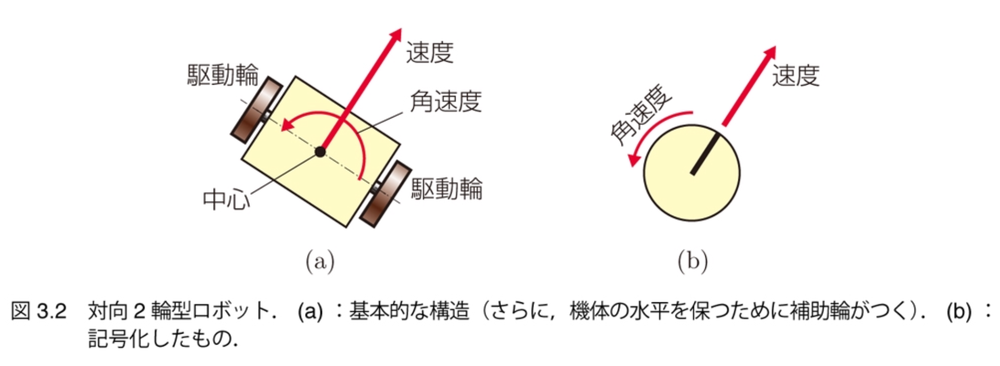
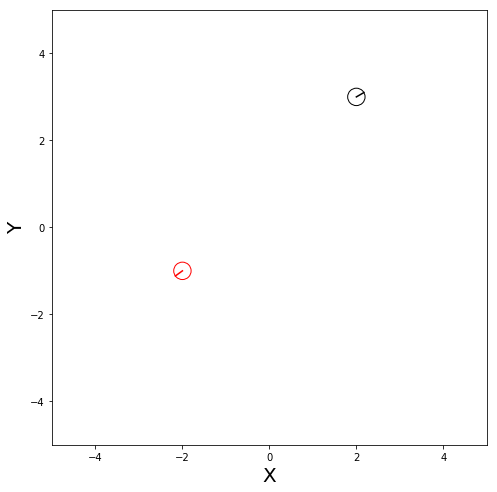
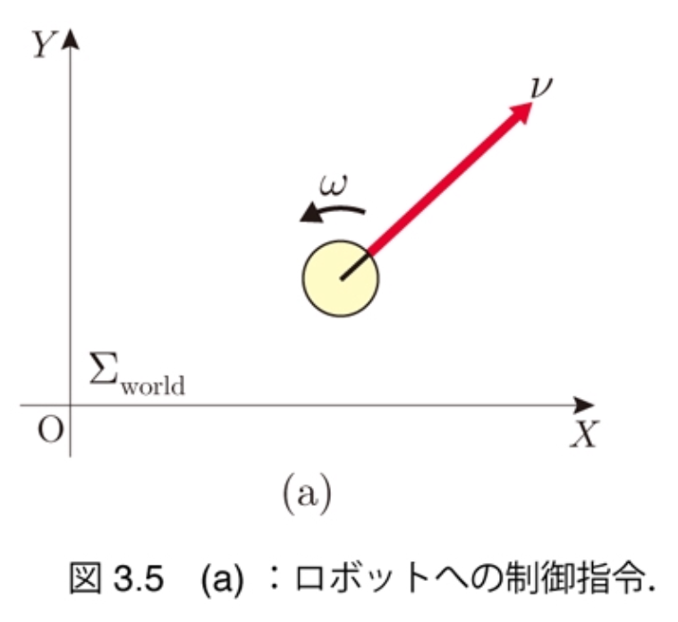

$\newcommand{\V}[1]{\boldsymbol{#1}}$

# 3. 自律ロボットの モデル化

千葉工業大学 上田 隆一

 

This work is licensed under a <a rel="license" href="http://creativecommons.org/licenses/by-sa/4.0/">Creative Commons Attribution-ShareAlike 4.0 International License</a>.

---

### 本章の内容

* 以後の章で使うロボットのシミュレータを作る
    * 作るもの
        * ロボットの動作
        * ロボットのセンシング
    * 雑音は考慮しない 　
* ロボットの系を定式化する
    * 状態方程式
    * 観測方程式

---

## 3.1 想定するロボット

* 対向2輪型ロボット
    * 車軸の両側に駆動輪がついており、 軸の中心まわりに（つまりその場で）回転可能
    * 本書では平面上を動くことを仮定
        * 実際にはスロープを登り降りできるが、扱わない

<iframe width="300" height="280" src="https://www.youtube.com/embed/zm0gP6o09lM" frameborder="0" allow="accelerometer; autoplay; encrypted-media; gyroscope; picture-in-picture" allowfullscreen></iframe>

---

### 対向2輪ロボットの動き

* 速度と角速度だけで表現できると仮定
    * トルクや加速度は無視

これをシミュレータ上に再現

---

## 3.2 ロボットの動き

---

## 3.2.1 世界座標系と描画

* ロボットの動き回る平面を準備
    * 図のように$X$軸、$Y$軸を設置
    * 世界座標系$\Sigma_\text{world}$と名付ける
        * 複数の座標系の関係としてロボットの動きを考えることはロボット工学では極めて重要ですが、書籍では世界座標系しか出てきません。

---

## 3.2.2 ロボットの姿勢と描画

* $\Sigma_\text{world}$の上にロボットを置く 　
* ロボットが$\Sigma_\text{world}$で 
どのように存在しているか
    * $(x \ y)^\top$: 位置、$\theta$: 向きで表せる
    * 「姿勢」と呼ぶ 　
* 加速度を考えていないので、 この3変数だけ考えると制御可能
    * 制御工学の用語で「状態」とも呼べる 　
* ベクトル $\V{x} = (x \ y \ \theta)^\top$として表現

---

### 状態と状態空間

制御の話をするために用語を整理

* ロボットのとりうる状態$\V{x}$の集合を$\mathcal{X}$とする
    * $\mathcal{X}$を状態空間と呼ぶ
    * 要はロボットが行ける範囲 　
* 数式での表現
    * $\mathcal{X} = \\{ \V{x} = (x \ y \ \theta)^\top | x \in [x_\text{min},x_\text{max}] ,y \in [y_\text{min},y_\text{max}], \theta \in [-\pi, \pi) \\}$
    * $\V{x} \in \mathcal{X}$

簡単なうちに集合の表現をおさえておきましょう

---

## 3.2.3 アニメーションの導入

* 作業の話はスライドでは割愛 　
* 時刻を離散的に表現
    * 1ステップの時間を$\Delta t$とする
    * $\Delta t$ごとに、時刻に$t=0,1,2,\dots$と番号を付与 　
* 以後は離散時間でロボットの動きを考える
    * ロボットは連続時間の中に存在しているが、 基本的に周期的にしか計算ができないので

---

## 3.2.4 ロボットの運動と 状態方程式

* 扱う問題: ある時刻にロボットが動いたときに、 次のステップにロボットの姿勢がどうなるか

---

### 制御指令

* ロボットに与える速度、角速度を それぞれ$\nu$[m/s]、$\omega$[rad/s]と表現
    * まとめて$\V{u} = (\nu \ \omega)^\top$と表現
    * 制御指令と呼ぶ
        * 制御入力などとも呼ぶが、入力か出力か紛らわしいので

