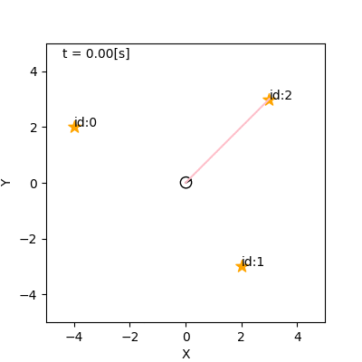

# 4. 不確かさの モデル化

千葉工業大学 上田 隆一

 

This work is licensed under a <a rel="license" href="http://creativecommons.org/licenses/by-sa/4.0/">Creative Commons Attribution-ShareAlike 4.0 International License</a>.

---

## 4.1 本章でやること

* シミュレータを実世界に近づける
    * トラブルのない世界 $\rightarrow$未来が予測可能
        * 状態方程式: $\boldsymbol{x}\_t = \boldsymbol{f}(\boldsymbol{x}\_{t-1}, \boldsymbol{u}_t)$
        * 観測方程式: $\\boldsymbol\{z\}\_j = \\boldsymbol\{h\}_j (\\boldsymbol\{x\})$（$j$: ランドマークのID）
    * 雑音や外乱を加えて未来を不確かに

---

## 4.2 ロボットの移動に対する 不確かさの要因の実装

---

### 不確かさの要因

* とにかく様々なことが起こる
    * 小石への片輪の乗り上げ、走り出し、停止時の揺れ、縁石への乗り上げ、走行環境の傾斜、左右の車輪が同じように回らない、穴に車輪が嵌る、人が移動する、・・・

<iframe width="560" height="315" src="https://www.youtube.com/embed/Oz2wIDD02LY" frameborder="0" allow="accelerometer; autoplay; encrypted-media; gyroscope; picture-in-picture" allowfullscreen></iframe>

シミュレータへ実装しているときりがない

---

### 雑音や誤差の分類

* アクシデントは次の2軸で分類可能
    * どれだけ継続期間があるか
        * 例: 小石に車輪が乗り上げた（一瞬）$\leftrightarrow$縁石に乗り上げた（数秒） $\leftrightarrow$右車輪の空気が少ない（ずっと継続）
    * どれだけ$\boldsymbol{x}$が動くか
        * 例: 小石に車輪が乗り上げた（小）$\leftrightarrow$人がロボットを移動（大） 　
* これらの分類をカバーするように本書では次の4つを実装
    * 雑音: 突発的にロボットの向きを少し変化
    * バイアス: 制御指令値と実際の出力値を常に一定量ずらす
    * スタック: ロボットを同じ姿勢に抑留
    * 誘拐: ロボットを別の場所に突然ワープ

一つずつ実装方法を見ていきましょう

---

## 4.2.1 移動に対して発生する 雑音の実装

* 次のようなモデルを考える
    * 環境にランダムに何か（小石としましょう）が落ちている
    * ロボットがそれを踏むと向き$\theta$が少しずれる 　
* シミュレータへの実装方法（1, 2の繰り返し）
    1. ロボットが小石を踏んだら、次に踏むまでの道のりを計算
    1. 計算した道のりに達したら$\theta$をずらして再度道のりを計算
        * これはガウス分布で

1について、どんな数式を使えばよいか

---

### 指数分布の利用

* $p(x | \lambda ) = \lambda e^{-\lambda x} \quad (x \ge 0)$
    * $x$: 小石を踏みつけるまでの道のり
    * $\lambda$: 道のりあたりに踏みつける小石の数の期待値
        * $1/\lambda$: 踏みつけるまでの道のりの期待値
* 下図のような確率密度関数
    * 左: $\lambda = 1$
    * 右: $\lambda = 2$
    * 右のほうが小石が多いので踏むまでの時間は短くなる

---

### 雑音のシミュレーション

* 道のりの計算: $x \sim p(x | \lambda ) = \lambda e^{-\lambda x}$
    * $\lambda = 5$（200[mm]に1回小石を踏む）
* $\theta$への雑音混入: $\theta \sim \mathcal{N}(\theta | \theta_\text{before}, \sigma_\theta)$
    * $\theta_\text{before}$: 小石を踏む前のロボットの向き
    * $\sigma_\theta = \pi/60$（小石を踏むと標準偏差3[deg]で$\theta$がずれる）

---

## 4.2.2 移動速度へのバイアスの実装

* 次の二つの値を違うものとして扱う
    * モータへの制御指令値: $\boldsymbol{u}_t = (\nu_t \ \omega_t)^\top$
    * 実際のロボットの速度: $\boldsymbol{u}_t^\* = (\nu_t^\* \  \omega_t^\*)^\top$ 　
* $\boldsymbol{u}_t$と$\boldsymbol{u}_t^\*$の関係
    * $(\nu_t^\* \  \omega_t^\*)^\top = (\delta_\nu \nu_t \ \delta_\omega\omega_t)^\top$
    * $\delta_\nu, \delta_\omega$はシミュレーションの開始時に決めて、 以後一定
	$\rightarrow$系統誤差となる

<iframe width="180" height="315" src="https://www.youtube.com/embed/wNm9dhWBqZM" frameborder="0" allow="accelerometer; autoplay; encrypted-media; gyroscope; picture-in-picture" allowfullscreen></iframe>

---

### バイアスのシミュレーション

* シミュレータでの$\delta_\nu, \delta_\omega$の決め方
    * いずれも平均値$0$、標準偏差$0.1$の ガウス分布からドロー
    * 右図: 灰色がバイアスなし、 赤がバイアスあり 　
* バイアスの存在
    * 推定に悪影響
        * 多くアルゴリズムは無視
        * 対策が難しい
    * キャリブレーションで 小さくすることは可能
    * 根絶は無理

---

## 4.2.3 スタックの実装

* スタック: ロボットが何かに引っかかり動けなくなる現象 　
* 実装方法（小石のときと同じ）
    * 次にスタックするまでの時間を指数分布からドロー
    * スタックしたら抜け出すまでの時間を指数分布からドロー

---

### スタックのシミュレーション

* パラメータ
    * スタックまでの時間の期待値: 60[s]
    * 抜け出す時間の期待値: 60[s] 　
* 図 
    * 赤: スタックのないロボット
    * 青: スタックするロボット（100台） 　

「誤差」と呼ぶには大きすぎる誤差が発生

---

## 4.2.4 誘拐の実装

* 誘拐
    * 動いているロボットが人に強制移動させられる
    * 誘拐ロボット問題（kidnapped robot problem）からの用語 　
* 実装方法
    * 誘拐のタイミング: 指数分布を利用
    * 誘拐後のロボットの姿勢$\boldsymbol{x}$: 一様分布を利用 　
* 一様分布
    * $\mathcal{U}(\boldsymbol{x} | X) = \begin{cases} \eta^{-1} & (\boldsymbol{x} \in X)  \\\\ 0 & (\boldsymbol{x} \not\in X) \end{cases}$
        * $\eta = \int_{X} 1 d\boldsymbol{x}'$（面積や体積）
        * $X$: ロボットの姿勢$\boldsymbol{x}$が存在する範囲（そして$X$内のどこか情報がない）

---

### 誘拐のシミュレーション

* パラメータ
    * 誘拐が起こるまでの時間の期待値: 5[s]
    * 誘拐先の姿勢: $-5<x<5$[m], $-5<y<5$[m], $-\pi<\theta<\pi$

過去の情報を使う自己位置推定には致命的

---

## 4.2.5 状態方程式と 確率的な状態遷移モデル

* 状態方程式の従来の形式（雑音つき）
    * $\boldsymbol{x}\_t = \boldsymbol{f}(\boldsymbol{x}\_{t-1}, \boldsymbol{u}\_t) + \boldsymbol{\varepsilon}\_t$
        * 「本来あるべき状態遷移があって、それに雑音$\boldsymbol{\varepsilon}\_t$が加わる」という表現
    * 問題
        * 表記上、各時刻で$\boldsymbol{x}_t$が決まってしまうように見える $\rightarrow$不確かさの表現に限界
        * 「$\boldsymbol{\varepsilon}\_t$」のイメージよりも大きい雑音が表現しずらい

もっと一般化した表現が必要

---

### 確率的な表現の導入

* 状態遷移関数$\boldsymbol{f}$に雑音をつけたものを次の確率密度関数で置き換え
$$p(\boldsymbol{x}|\boldsymbol{x}_{t-1}, \boldsymbol{u}_t)$$
* 状態方程式に相当する式
$$\boldsymbol{x}\_t \sim p(\boldsymbol{x}|\boldsymbol{x}\_{t-1}, \boldsymbol{u}\_t)$$

（上の確率密度関数も下の式も）状態遷移モデルと呼びましょう

---

### 状態方程式と状態遷移モデル

* 同じことを表現しているがニュアンスが違う
    * 場合に応じて使い分け
        * 加法定理、乗法定理など確率の演算は状態遷移モデルで 
        * 変数レベルの計算や実装などは状態方程式で

---

## 4.3 ロボットの観測に対する 不確かさの要因の実装

* 移動と同じくセンシングでも様々なことが起こる
    * 2章参照（センサの問題、外的要因） 　
* シミュレーションの方針
    * 偶然誤差、系統誤差、過失誤差をバランスよく
        * 過失誤差: 一般的には実験結果の記入間違いなどを指す
            * 観測対象の取り違えなどで同様の誤差が発生

次のスライドの5種類の誤差要因を実装

---

### 実装する誤差要因

* 偶然誤差
    * 雑音: ガウス分布状に計測値をばらつかせる 　
* 系統誤差
    * バイアス: 常に距離, 方角に一定値を加える  　
* （広い意味での）過失誤差
    * ファントム: 見えないはずのランドマークを観測する（偽陽性） 
    * 見落とし: 見えるはずのランドマークを見落とす（偽陰性）  　
* 偶然誤差（長時間起こると系統誤差）
    * オクルージョン: ランドマークの一部が障害物等に隠れてセンサ値に影響

---

## 4.3.1 センサ値に対する雑音の実装

* 実装方法
    * 計測距離$\ell$と向き$\varphi$に、それぞれ 独立したガウス分布状の雑音を付加
        * $\ell$は真の距離に比例した大きさの標準偏差で
            * 遠くに行くほど距離計測が不確か
        * $\varphi$は距離に関係なく一定の大きさの雑音を 　
* 数式
    * $\ell\_t \sim \mathcal{N}\left[\ell | \ell^\*\_t, (\ell^\*\_t \sigma\_\ell)^2 \right]$ 
    * $\varphi_t \sim \mathcal{N}\left(\varphi | \varphi^*_t, \sigma_\varphi^2\right) $
        * $^*$付きの変数は真の値
        * $\sigma_\ell, \sigma_\varphi$はパラメータ

---

## 4.3.2 センサ値に対する バイアスの実装

* 原因: カメラの取り付けの誤差、 環境光、湿度など（2章）
    * 人間の場合: 妙に山が近く見える場合など 　
* 実装方法
    * 計測距離$\ell$と向き$\varphi$を一定量ずらす
        * $\ell$については真の距離に比例した大きさで
    * シミュレーション開始時に ずらす量を決定
        * これもガウス分布からドロー
        * 数式は省略 　

---

### バイアスのシミュレーション

* 計測距離が実際より短く出力される例
    * 全計測値が全時間帯で 　
* ロボットを扱っているとよく起こり、しかも厄介
    * 自己位置推定の出力がずっと同じ傾向でずれる
    * キャリブレーション地獄

---

## 4.3.3 ファントムの実装

* ないはずのものが見える 　
* 実装方法
    * ある一定の確率で、ランドマークの 位置を偽の 位置にすり替え
        * 偽ランドマークの位置は一様分布からドロー
        * カメラの視界に合わない偽センサ値は除去
    * 図: 確率$0.5$ですり替え
        * （視界に入らないと除去されるので 少なく見える）

graph-based SLAMなどで厄介に （外れ値・アウトライアー）

---

## 4.3.4 見落としの実装

* 見えるはずのものが見えない 　
* 実装方法
    * ある確率でランドマークを見落とす
    * 図: 確率$0.1$で見落とし発生 　

「$\circ\circ$が見えたら$\times\times$する」というような プログラムで深刻な問題に

---

## 4.3.5 オクルージョンの実装

* 観測対象が物陰に
* センサによって様々な悪影響
    * 例: センサの前を人や別のロボットが横切ると・・・
        * LiDAR: 壁が近づいたような出力が得られる
        * カメラ: 物が欠けて小さく見える
            * 物体の大きさで距離を計測していると遠く見える$\leftarrow$これを実装 　
* 実装方法: ある一定の確率でセンサ値を書き換え
    * $\ \ell_t' \sim \mathcal{U}(\ell | \ell_t \le \ell < \ell_\max)$
        * $\ell_t$: もとの計測距離
        * $\ell_t'$: 書き換えられた計測距離

---

### オクルージョンのシミュレーション

* 図: 確率$0.5$で発生 

シミュレータでは偶然誤差扱いであるが、 実際は何秒か連続する大きなバイアスに

---

## 4.3.6 観測方程式と 確率的な観測モデル

* 観測方程式の従来の形式（雑音つき）
    * $\boldsymbol{z}_t = \boldsymbol{h}_j (\boldsymbol{x}_t) + \boldsymbol{\varepsilon}\_j$
        * $j$はランドマークID
    * 問題: 状態方程式と状態遷移モデルのときと同じ 　

状態遷移モデルと同じように確率的な表現が必要

---

### 観測モデルの導入

* ランドマーク$j$を観測したときのモデル: $\boldsymbol{z}_t \sim p\_j (\boldsymbol{z} | \boldsymbol{x}_t)$
* すべてのセンサ値に関する観測モデル　: $\textbf{z}_t \sim p (\textbf{z} | \boldsymbol{x}_t)$
    * $\textbf{z}$: センサ値のリスト 　
* 各ランドマークから得られるセンサ値が互いに独立なら
$$\textbf{z}\_t \sim p (\textbf{z} | \boldsymbol{x}\_t) = \prod\_{j=0}^{N\_\textbf{m} -1} p\_j (\boldsymbol{z} | \boldsymbol{x}_t)$$
    * バイアスがあり、バイアスを考慮していない確率密度関数を 用いるとこのようにはならないことに注意（次ページに補足）

---

### 確率モデルに関する補足

* 独立同分布（independent and identically distributed, iid）
    * 同じ確率分布からドローされた複数の値が、その確率分布以外の関連性を持たないこと
    * 多くのアルゴリズムは、データに独立同分布性を仮定
    * 例: 同じランドマークから連続で得られたセンサ値$\boldsymbol{z}\_{j,t}$と$\boldsymbol{z}\_{j,t+1}$
        * $\boldsymbol{z}\_{j,t+1}$は$\boldsymbol{z}\_{j,t}$の値に無関係
        * そうでないと観測モデルが$\boldsymbol{z}\_{t+1} \sim p\_j (\boldsymbol{z} | \boldsymbol{x}\_t, \boldsymbol{z}\_{j,t})$になってしまう 　
* 実際には独立同分布にならない
    * アルゴリズムで利用する$p_j(\boldsymbol{z} | \boldsymbol{x})$で バイアスが考慮されない/できない
    * 状態遷移モデルも同じ

---

## 4.4 まとめ

* シミュレータを実装 　
* 実装したシステムや他の多くのシステムは次のふたつのモデルで表せる
    * 状態遷移モデル: $\boldsymbol{x}\_t \sim p(\boldsymbol{x}|\boldsymbol{x}\_{t-1}, \boldsymbol{u}\_t)$
    * 観測モデル　　: $\textbf{z}_t \sim p (\textbf{z} | \boldsymbol{x}_t)$ 　
* ただし
    * 従来の状態方程式、観測方程式も使う
    * アルゴリズム中で使うモデルと真のシステムには乖離があることに注意
