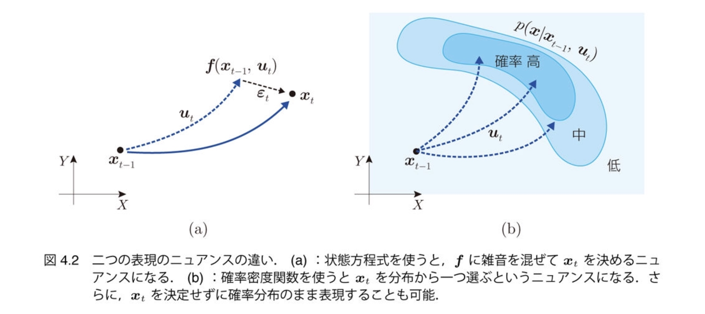

# 4. 不確かさの モデル化

千葉工業大学 上田 隆一

 

This work is licensed under a <a rel="license" href="http://creativecommons.org/licenses/by-sa/4.0/">Creative Commons Attribution-ShareAlike 4.0 International License</a>.

---

## 4.1 本章でやること

* シミュレータを実世界に近づける
    * トラブルのない世界 $\rightarrow$未来が予測可能
        * 状態方程式: $\boldsymbol{x}\_t = \boldsymbol{f}(\boldsymbol{x}\_{t-1}, \boldsymbol{u}_t)$
        * 観測方程式: $\\boldsymbol\{z\}\_j = \\boldsymbol\{h\}_j (\\boldsymbol\{x\})$（$j$: ランドマークのID）
    * 雑音や外乱を加えて未来を不確かに

---

## 4.2 ロボットの移動に対する 不確かさの要因の実装

---

### 不確かさの要因

* とにかく様々なことが起こる
    * 小石への片輪の乗り上げ、走り出し、停止時の揺れ、縁石への乗り上げ、走行環境の傾斜、左右の車輪が同じように回らない、穴に車輪が嵌る、人が移動する、・・・

<iframe width="560" height="315" src="https://www.youtube.com/embed/Oz2wIDD02LY" frameborder="0" allow="accelerometer; autoplay; encrypted-media; gyroscope; picture-in-picture" allowfullscreen></iframe>

シミュレータへ実装しているときりがない

---

### 雑音や誤差の分類

* アクシデントは次の2軸で分類可能
    * どれだけ継続期間があるか
        * 例: 小石に車輪が乗り上げた（一瞬）$\leftrightarrow$縁石に乗り上げた（数秒） $\leftrightarrow$右車輪の空気が少ない（ずっと継続）
    * どれだけ$\boldsymbol{x}$が動くか
        * 例: 小石に車輪が乗り上げた（小）$\leftrightarrow$人がロボットを移動（大） 　
* これらの分類をカバーするように本書では次の4つを実装
    * 雑音: 突発的にロボットの向きを少し変化
    * バイアス: 制御指令値と実際の出力値を常に一定量ずらす
    * スタック: ロボットを同じ姿勢に抑留
    * 誘拐: ロボットを別の場所に突然ワープ

一つずつ実装方法を見ていきましょう

---

## 4.2.1 移動に対して発生する 雑音の実装

* 次のようなモデルを考える
    * 環境にランダムに何か（小石としましょう）が落ちている
    * ロボットがそれを踏むと向き$\theta$が少しずれる 　
* シミュレータへの実装方法（1, 2の繰り返し）
    1. ロボットが小石を踏んだら、次に踏むまでの道のりを計算
    1. 計算した道のりに達したら$\theta$をずらして再度道のりを計算
        * これはガウス分布で

1について、どんな数式を使えばよいか

---

### 指数分布の利用

* $p(x | \lambda ) = \lambda e^{-\lambda x} \quad (x \ge 0)$
    * $x$: 小石を踏みつけるまでの道のり
    * $\lambda$: 道のりあたりに踏みつける小石の数の期待値
        * $1/\lambda$: 踏みつけるまでの道のりの期待値
* 下図のような確率密度関数
    * 左: $\lambda = 1$
    * 右: $\lambda = 2$
    * 右のほうが小石が多いので踏むまでの時間は短くなる

---

### 雑音のシミュレーション

* 道のりの計算: $x \sim p(x | \lambda ) = \lambda e^{-\lambda x}$
    * $\lambda = 5$（200[mm]に1回小石を踏む）
* $\theta$への雑音混入: $\theta \sim \mathcal{N}(\theta | \theta_\text{before}, \sigma_\theta)$
    * $\theta_\text{before}$: 小石を踏む前のロボットの向き
    * $\sigma_\theta = \pi/60$（小石を踏むと標準偏差3[deg]で$\theta$がずれる）

---

## 4.2.2 移動速度へのバイアスの実装

* 次の二つの値を違うものとして扱う
    * モータへの制御指令値: $\boldsymbol{u}_t = (\nu_t \ \omega_t)^\top$
    * 実際のロボットの速度: $\boldsymbol{u}_t^\* = (\nu_t^\* \  \omega_t^\*)^\top$ 　
* $\boldsymbol{u}_t$と$\boldsymbol{u}_t^\*$の関係
    * $(\nu_t^\* \  \omega_t^\*)^\top = (\delta_\nu \nu_t \ \delta_\omega\omega_t)^\top$
    * $\delta_\nu, \delta_\omega$はシミュレーションの開始時に決めて、 以後一定
	$\rightarrow$系統誤差となる

<iframe width="180" height="315" src="https://www.youtube.com/embed/wNm9dhWBqZM" frameborder="0" allow="accelerometer; autoplay; encrypted-media; gyroscope; picture-in-picture" allowfullscreen></iframe>

---

### バイアスのシミュレーション

* シミュレータでの$\delta_\nu, \delta_\omega$の決め方
    * いずれも平均値$0$、標準偏差$0.1$の ガウス分布からドロー
    * 右図: 灰色がバイアスなし、 赤がバイアスあり 　
* バイアスの存在
    * 推定に悪影響
        * 多くアルゴリズムは無視
        * 対策が難しい
    * キャリブレーションで 小さくすることは可能
    * 根絶は無理

---

## 4.2.3 スタックの実装

* スタック: ロボットが何かに引っかかり動けなくなる現象 　
* 実装方法（小石のときと同じ）
    * 次にスタックするまでの時間を指数分布からドロー
    * スタックしたら抜け出すまでの時間を指数分布からドロー

---

### スタックのシミュレーション

* パラメータ
    * スタックまでの時間の期待値: 60[s]
    * 抜け出す時間の期待値: 60[s] 　
* 図 
    * 赤: スタックのないロボット
    * 青: スタックするロボット（100台） 　

「誤差」と呼ぶには大きすぎる誤差が発生

---

## 4.2.4 誘拐の実装

* 誘拐
    * 動いているロボットが人に強制移動させられる
    * 誘拐ロボット問題（kidnapped robot problem）からの用語 　
* 実装方法
    * 誘拐のタイミング: 指数分布を利用
    * 誘拐後のロボットの姿勢$\boldsymbol{x}$: 一様分布を利用 　
* 一様分布
    * $p(\boldsymbol{x} | X) = \begin{cases} \eta^{-1} & (\boldsymbol{x} \in X)  \\\\ 0 & (\boldsymbol{x} \not\in X) \end{cases}$
        * $\eta = \int_{X} 1 d\boldsymbol{x}'$（面積や体積）
        * $X$: ロボットの姿勢$\boldsymbol{x}$が存在する範囲（そして$X$内のどこか情報がない）

---

### 誘拐のシミュレーション

* パラメータ
    * 誘拐が起こるまでの時間の期待値: 5[s]
    * 誘拐先の姿勢: $-5<x<5$[m], $-5<y<5$[m], $-\pi<\theta<\pi$

過去の情報を使う自己位置推定には致命的

---

## 4.2.5 状態方程式と 確率的な状態遷移モデル

* 状態方程式の従来の形式（雑音つき）
    * $\boldsymbol{x}\_t = \boldsymbol{f}(\boldsymbol{x}\_{t-1}, \boldsymbol{u}\_t) + \boldsymbol{\varepsilon}\_t$
        * 「本来あるべき状態遷移があって、それに雑音$\boldsymbol{\varepsilon}\_t$が加わる」という表現
    * 問題
        * 表記上、各時刻で$\boldsymbol{x}_t$が決まってしまうように見える $\rightarrow$不確かさの表現に限界
        * 「$\boldsymbol{\varepsilon}\_t$」のイメージよりも大きい雑音が表現しずらい

もっと一般化した表現も必要

---

### 確率的な表現の導入

* 状態遷移関数$\boldsymbol{f}$に雑音をつけたものを次の確率密度関数で置き換え
$$p(\boldsymbol{x}|\boldsymbol{x}_{t-1}, \boldsymbol{u}_t)$$
* 状態方程式に相当する式
$$\boldsymbol{x}\_t \sim p(\boldsymbol{x}|\boldsymbol{x}\_{t-1}, \boldsymbol{u}\_t)$$

（上の確率密度関数も下の式も）状態遷移モデルと呼びましょう

---

### 状態方程式と状態遷移モデル

* 同じことを表現しているがニュアンスが違う

