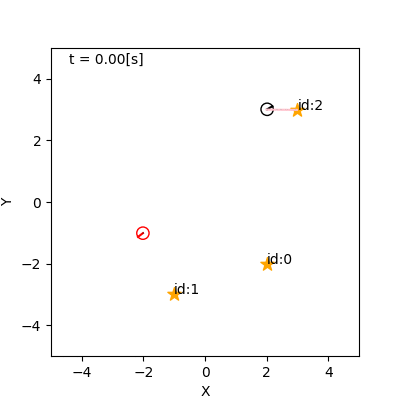
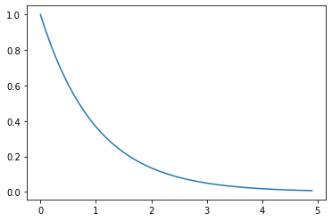
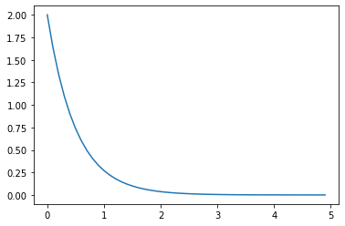
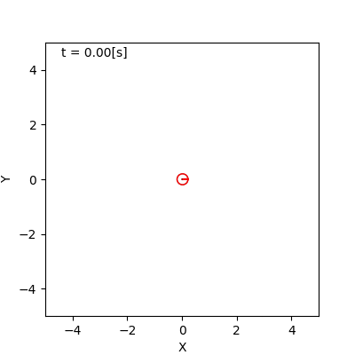

# 4. 不確かさの モデル化

千葉工業大学 上田 隆一

 

This work is licensed under a <a rel="license" href="http://creativecommons.org/licenses/by-sa/4.0/">Creative Commons Attribution-ShareAlike 4.0 International License</a>.

---

## 4.1 本章でやること

* シミュレータを実世界に近づける
    * トラブルのない世界 $\rightarrow$未来が予測可能
        * 状態方程式: $\boldsymbol{x}\_t = \boldsymbol{f}(\boldsymbol{x}\_{t-1}, \boldsymbol{u}_t)$
        * 観測方程式: $\\boldsymbol\{z\}\_j = \\boldsymbol\{h\}_j (\\boldsymbol\{x\})$（$j$: ランドマークのID）
    * 雑音や外乱を加えて未来を不確かに

---

## 4.2 ロボットの移動に対する 不確かさの要因の実装

---

### 不確かさの要因

* とにかく様々なことが起こる
    * 小石への片輪の乗り上げ、走り出し、停止時の揺れ、縁石への乗り上げ、走行環境の傾斜、左右の車輪が同じように回らない、穴に車輪が嵌る、人が移動する、・・・

<iframe width="560" height="315" src="https://www.youtube.com/embed/Oz2wIDD02LY" frameborder="0" allow="accelerometer; autoplay; encrypted-media; gyroscope; picture-in-picture" allowfullscreen></iframe>

シミュレータへ実装しているときりがない

---

### 雑音や誤差の分類

* アクシデントは次の2軸で分類可能
    * どれだけ継続期間があるか
        * 例: 小石に車輪が乗り上げた（一瞬）$\leftrightarrow$縁石に乗り上げた（数秒） $\leftrightarrow$右車輪の空気が少ない（ずっと継続）
    * どれだけ$\boldsymbol{x}$が動くか
        * 例: 小石に車輪が乗り上げた（小）$\leftrightarrow$人がロボットを移動（大） 　
* これらの分類をカバーするように本書では次の4つを実装
    * 雑音: 突発的にロボットの向きを少し変化
    * バイアス: 制御指令値と実際の出力値を常に一定量ずらす
    * スタック: ロボットを同じ姿勢に抑留
    * 誘拐: ロボットを別の場所に突然ワープ

一つずつ実装方法を見ていきましょう

---

## 4.2.1 移動に対して発生する 雑音の実装

* 次のようなモデルを考える
    * 環境にランダムに何か（小石としましょう）が落ちている
    * ロボットがそれを踏むと向き$\theta$が少しずれる 　
* シミュレータへの実装方法（1, 2の繰り返し）
    1. ロボットが小石を踏んだら、次に踏むまでの道のりを計算
    1. 計算した道のりに達したら$\theta$をずらして再度道のりを計算
        * これはガウス分布で

1について、どんな数式を使えばよいか

---

### 指数分布の利用

* $p(x | \lambda ) = \lambda e^{-\lambda x} \quad (x \ge 0)$
    * $x$: 小石を踏みつけるまでの道のり
    * $\lambda$: 道のりあたりに踏みつける小石の数の期待値
        * $1/\lambda$: 踏みつけるまでの道のりの期待値
* 下図のような確率密度関数
    * 左: $\lambda = 1$
    * 右: $\lambda = 2$
    * 右のほうが小石が多いので踏むまでの時間は短くなる

---

### 実装

* 道のりの計算: $x \sim p(x | \lambda ) = \lambda e^{-\lambda x}$
    * $\lambda = 5$（200[mm]に1回小石を踏む）
* $\theta$への雑音混入: $\theta \sim \mathcal{N}(\theta | \theta_\text{before}, \sigma_\theta)$
    * $\theta_\text{before}$: 小石を踏む前のロボットの向き
    * $\sigma_\theta = \pi/60$（小石を踏むと標準偏差3[deg]で$\theta$がずれる）

---

## 4.2.2 移動速度へのバイアスの実装

* 次の二つの値を違うものとして扱う
    * モータへの制御指令値: $\boldsymbol{u}_t = (\nu_t \ \omega_t)^\top$
    * 実際のロボットの速度: $\boldsymbol{u}_t^\* = (\nu_t^\* \  \omega_t^\*)^\top$ 　
* $\boldsymbol{u}_t$と$\boldsymbol{u}_t^\*$の関係
    * $(\nu_t^\* \  \omega_t^\*)^\top = (\delta_\nu \nu_t \ \delta_\omega\omega_t)^\top$
    * $\delta_\nu, \delta_\omega$はシミュレーションの開始時に決めて、以後一定 
	$\rightarrow$系統誤差となる

---

## 実装結果

* シミュレータでの$\delta_\nu, \delta_\omega$の決め方
    * いずれも平均値$0$、標準偏差$0.1$の ガウス分布からドロー
    * 右図: 灰色がバイアスなし、 赤がバイアスあり
* バイアスについて
    * 事前に予想がつきにくく厄介
    * キャリブレーションで 小さくすることは可能
    * 根絶は無理

