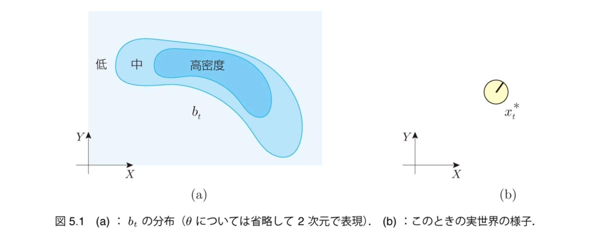
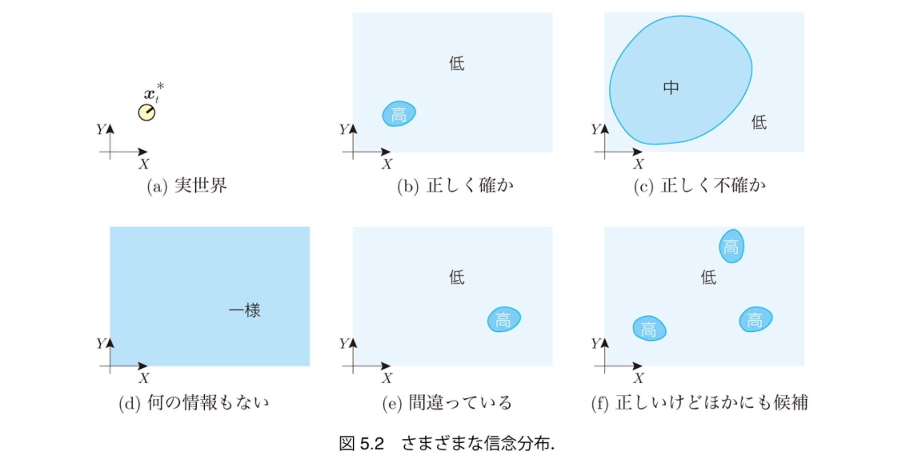
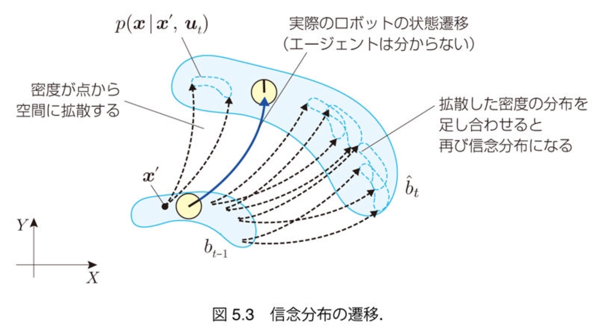
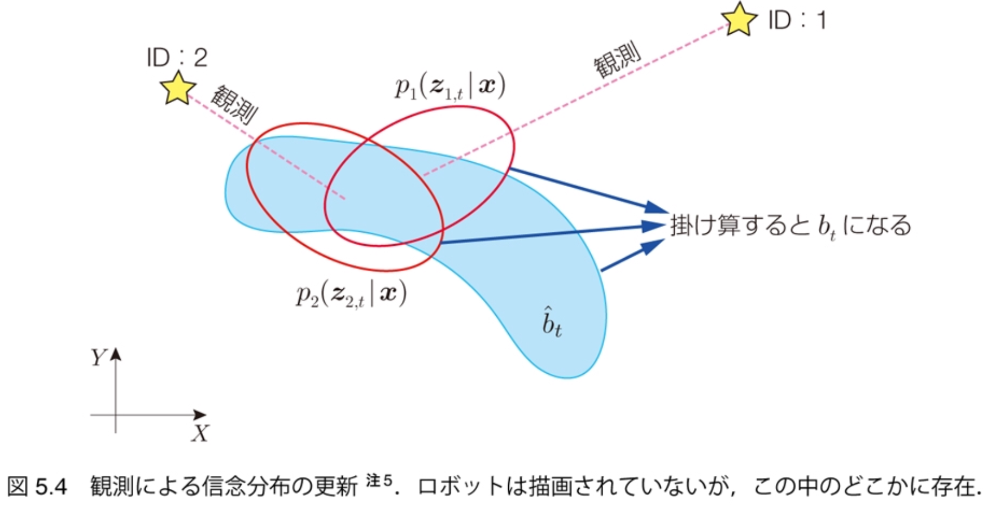
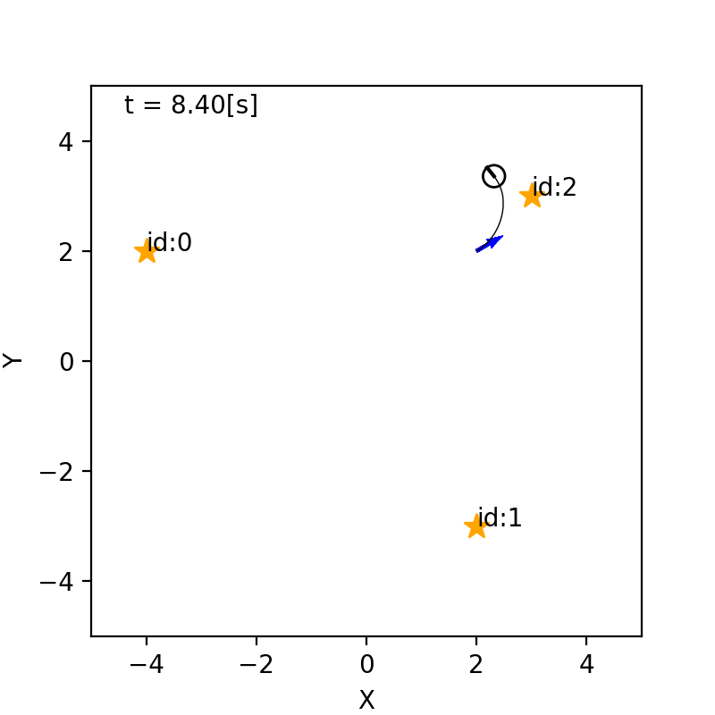
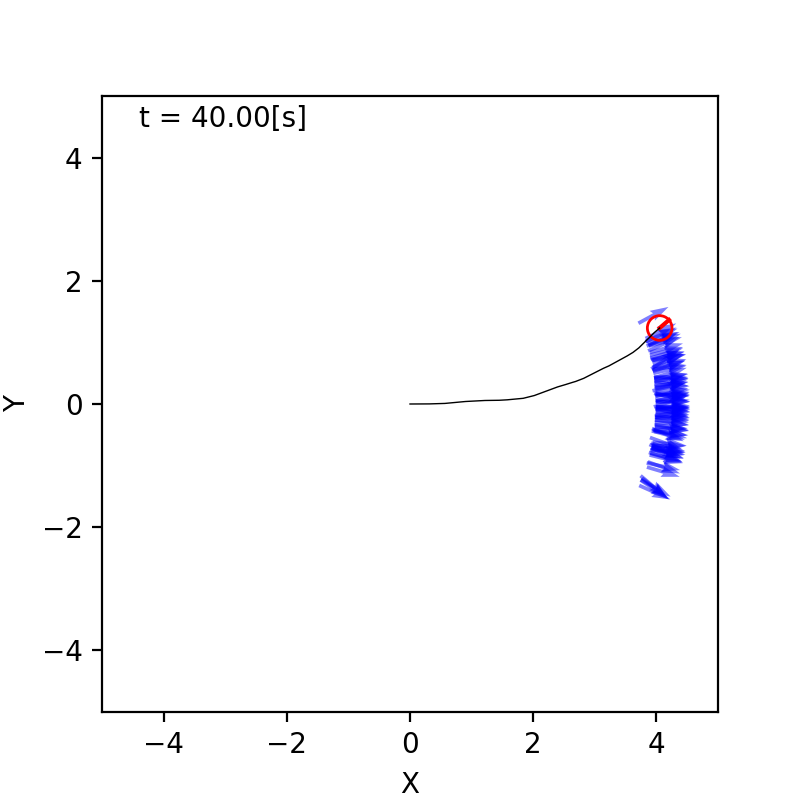
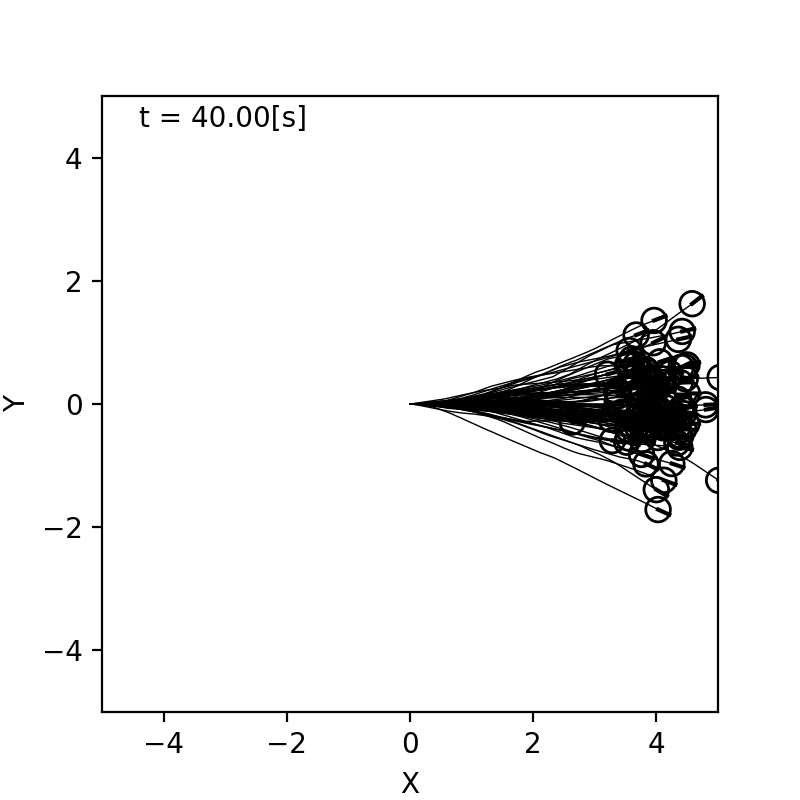
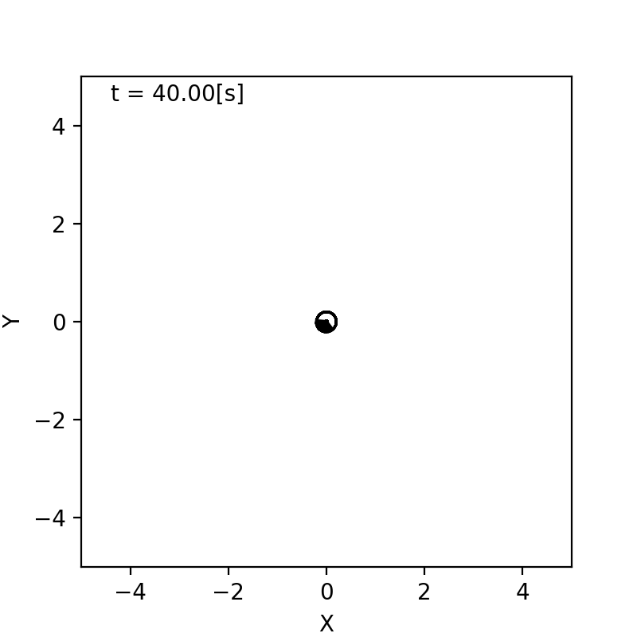

$\newcommand{\V}[1]{\boldsymbol{#1}}$

# 5. パーティクル フィルタによる 自己位置推定

千葉工業大学 上田 隆一

 

This work is licensed under a <a rel="license" href="http://creativecommons.org/licenses/by-sa/4.0/">Creative Commons Attribution-ShareAlike 4.0 International License</a>.

---

## 5.1 自己位置推定の問題と解法

* 自己位置推定
    * ロボットが自らの姿勢（位置と向き）を、これまで得た情報から推定すること
        * おさらい 
            * 位置: $(x,y)$
            * 向き: $\theta$
            * 姿勢・状態: $\V{x} = (x\ y \ \theta)^\top$ 　
    * ロボットにとって基本的な問題
        * 位置情報がないとプログラムが大変（できないことはないけど）
        * 新しいセンサが出るたびに新しい課題

今も重要な研究対象

---

## 5.1.1 計算すべき確率分布と 利用できる情報

数式で考えていきましょう

---

### 自己位置推定に使える情報

* $\V{x}_0$: 最初の姿勢（分かっているとしましょう） 　
* $\V{u}_\{1:t\}$: 各時刻の制御指令
    * $\V{u}_\{1:t\}$というのは$\V{u}_1, \V{u}_2, \dots, \V{u}_t$の略記 　
* $\textbf{z}_\{1:t\}$: 各時刻のセンサ値のリスト
    * $\textbf{z}_\{1:t\}$というのは$\textbf{z}_1, \textbf{z}_2, \dots, \textbf{z}_t$の略記
    * $\textbf{z}_t$には各ランドマークからのセンサ値（入っていないことも） 　
* $p(\V{x} | \V{x}_{t-1}, \V{u}\_t)$: 状態遷移モデル
* $p(\textbf{z} | \V{x})$: 観測モデル

数式で考えるとこれしかない

---

### 計算すべき確率分布

* 計算すべきは姿勢ではなく姿勢の分布
    * 姿勢だけ求めても、不確かさが表現できない 　
* 計算すべき分布: $p_t(\V{x} | \V{x}_0, \V{u}_\{1:t\}, \textbf{z}_\{1:t\})$
    * $\V{x}_t^*$: 真の姿勢
    * 自己位置推定問題: 初期姿勢と、これまでの制御出力、 センサ値から分布を計算する問題

---

## 5.1.2 信念

* 「計算すべき分布」に特別に$b_t$と記号を与えましょう
    * $b_t(\V{x}) = p_t(\V{x} | \V{x}_0, \V{u}_\{1:t\}, \textbf{z}_\{1:t\})$
        * $XY\theta$空間中の確率分布（下図(a)）
        * ロボットは(b)の世界が見えない。頭の中の(a)だけ

* $b_t$を信念（信念分布）と呼ぶ
    * 自己の姿勢に対するロボットの考え
        * 姿勢だけでなく不確かさも表現（次ページ）

---

### 様々な信念と、それの意味するもの

多様な判断が可能に（難しいが。12章で詳しく）

---

## 5.1.3 信念の演算

* 以下の手順を踏む
    * 初期の信念$b_0$を与える
        * 本章では$\V{x}_0$が分かっているので、$\V{x}_0$まわりの急峻な分布に
    * 以後、情報が入るごとに信念を更新
        * ロボットが移動したら更新
        * ロボットがランドマークを観測したら更新

計算式を導出しましょう

---

### ロボットが移動したときの演算

* $b_\{t-1\}$に新たに$\V{u}_t$の情報が加わる
    * $b_{t-1}(\V{x}) \rightarrow b_{t-1}(\V{x}|\V{u}_t)$ 　
* $\hat{b}\_t = b_{t-1}(\V{x}|\V{u}_t)$としましょう
    * $b_t$との違い: $\textbf{z}_t$の情報がまだない

$\hat{b}\_t$を$b_{t-1}$からどう計算すればよいでしょう？

<!--* $\hat{b}_t(\V{x}) = p(\V{x} = \V{x}_t^* | \V{x}_0, \V{u}_\{1:t\}, \textbf{z}_\{1:t-1\})$-->

---

### $b_{t-1}$と$\hat{b}\_t$の関係

* 考え方
    * 例えば時刻$t-1$においてロボットの姿勢が$\V{x}'$である場合、 $\V{u}\_t$によって、次状態が状態遷移モデルで$p(\V{x} | \V{x}', \V{u}\_t)$に分布
        * 信念$b_{t-1}$によると、$\V{x}'$に存在する確率の密度は$b_{t-1}(\V{x}')$
        * 密度$b_{t-1}(\V{x}')$が状態遷移によって拡散
    * $\V{x}'$を状態空間からくまなく選んで密度$b_{t-1}(\V{x}')$を動かし、 拡散した密度をある姿勢$\V{x}$で積算すると$\hat{b}_t(\V{x})$に（次ページ）

---

### $\hat{b}\_t$の計算式

* 前ページの操作を式に
    * $\hat{b}\_t(\V{x}) = \int\_{\V{x}' \in \mathcal{X}} p(\V{x} | \V{x}', \V{u}\_t) b\_{t-1}(\V{x}')  d\V{x}'$
        * $\boldsymbol{x}'$を状態遷移モデルで動かして密度を積分
* 次のようにも書ける
    * $\hat{b}\_t(\V{x}) =  \big\langle p(\V{x} | \V{x}', \V{u}_t) \big\rangle_\{b_\{t-1\}(\V{x}')\}$ 
        * $b_{t-1}$のときに状態遷移モデルから得られる次状態の密度の期待値を$\boldsymbol{x}'$で計算すると$\hat{b}_t(\boldsymbol{x})$になる 　
* 式の名前
    * 筆者は「マルコフ連鎖の式」、「状態遷移の式」などと呼称
        * マルコフ性: 次状態が直前の姿勢と制御出力だけから決まって、それ以前の状態は情報として不要という性質を指す
            * $p(\V{x} | \V{x}', \V{u}\_t)$がそうなっている

---

### ロボットがセンシングしたときの演算

* 移動で不確かになった姿勢の情報をセンサ値で修正
   * 下図
* $\hat{b}\_t(\V{x})$に新たに$\textbf{z}_t$の情報が加わる
   * $\hat{b}\_t(\V{x}) \rightarrow \hat{b}\_t(\V{x} | \textbf{z}_t) = b_t(\V{x})$

---

### $b_t$の計算式

* ベイズの定理を使う
    * $b\_t(\V{x}) = \hat{b}\_t(\V{x} | \textbf{z}\_t) = \eta p(\textbf{z}\_t | \V{x}) \hat{b}\_t(\V{x})$ 
    $ = \eta \hat{b}\_t(\V{x})\prod\_{j=0}^{N\_\textbf{m}-1} p\_j(\V{z}\_{j,t} | \V{x})$
    * 補足
        * 最後の式変形は各ランドマークのセンサ値が独立している場合
        * $\textbf{z}_t$内にセンサ値がない場合は$b\_t(\V{x}) = \hat{b}\_t(\V{x})$

これで定式化は完了

---

### ベイズフィルタ

* 次の2つの式で$b_0$を$b_1, b_2, \dots$と更新していける
    * 移動時: $\hat{b}\_t(\V{x}) =  \big\langle p(\V{x} | \V{x}', \V{u}_t) \big\rangle_\{b_\{t-1\}(\V{x}')\}$ 
    * 観測時: $b\_t(\V{x}) = \eta p(\textbf{z}\_t | \V{x}) \hat{b}\_t(\V{x})$ 
     $\Longrightarrow$この手続きは「ベイズフィルタ」と呼ばれる

どうやって実装するのか？

---

## 5.2 パーティクルの準備

* 本章では信念分布を パーティクル（の集合）で表現
    * パーティクル: ロボットの分身
    * 分身をシミュレート $\Rightarrow$分身の分布が信念分布 　
* 数式でのパーティクルの表現
    * $\V{x}_t^{(i)}$$\quad(i=0,1,2,\dots,N-1)$ 
        * あとから変えます
        * 分身なので姿勢を変数に持つ
        * $N$個ある 　
* 右図の青の矢印
    * ロボットの初期姿勢に置いた100個 のパーティクル（まだ動かない）

---

## 5.3 移動後のパーティクルの 姿勢更新

* やること: ロボットの動きをシミュレートして パーティクルを動かす
    * センサについてはまだ扱わない
    * 雑音とバイアスのシミュレーション
    * パーティクルの分布が信念分布 　
* 4章のモデルが使えるが、実機だとそうもいかない
    * ロボットの動きの統計をとってシミュレーションしてみましょう

---

## 5.3.1 パーティクルの移動のための状態遷移モデル

* 移動にともなう姿勢のばらつきをガウス分布で表現
    * 4章と違うけどなんとなく
        * 様々な誤差を考慮していると最終的にはガウス分布に（中心極限定理） 　
* ガウス分布を4つの標準偏差で表現
    * $\sigma_{\nu\nu}$: 直進1[m]で生じる道のりのばらつき
    * $\sigma_{\nu\omega}$: 回転1[rad]で生じる道のりのばらつき
    * $\sigma_{\omega\nu}$: 直進1[m]で生じるロボットの向きのばらつき
    * $\sigma_{\omega\omega}$: 回転1[rad]で生じるロボットの向きのばらつき 　

これらの値を実験で求めて実現するように$\nu, \omega$に雑音を乗せる

---

## 速度、角速度に乗せる誤差の量

* $\sigma_{\nu\nu}$のとき、$\nu$に乗せる雑音の量の決め方
    1. $\delta_{\nu\nu} \sim \mathcal{N}(0, \sigma_{\nu\nu}^2)$
        * $\delta_{\nu\nu}$: 1[m]あたりの誤差
    2.  $\delta\_{\nu\nu}' = \delta\_{\nu\nu}\sqrt{|\nu|/\Delta t}$
        * $\delta_{\nu\nu}'$: 速度に乗せる誤差
        * 分散（誤差の2乗）の大きさは移動距離に比例するので 
$\delta\_{\nu\nu}^2 : (\delta'\_{\nu\nu}\Delta t)^2 = 1 : |\nu|\Delta t$
            * 2章で説明
    3. $\sigma_{\nu\omega}, \sigma_{\omega\nu}, \sigma_{\omega\omega}$についても同様に
    4. $\begin{pmatrix} \nu' \\\\ \omega' \end{pmatrix} = \begin{pmatrix} \nu \\\\ \omega \end{pmatrix} + \begin{pmatrix} \delta_{\nu\nu}\sqrt{|\nu|/\Delta t} + \delta_{\nu\omega}\sqrt{|\omega|/\Delta t} \\\\ \delta_{\omega\nu}\sqrt{|\nu|/\Delta t} + \delta_{\omega\omega}\sqrt{|\omega|/\Delta t} \end{pmatrix}$
        * $(\nu \ \omega)^\top$: 制御指令
        * $(\nu' \ \omega')^\top$: 実際の速度

---

## 5.3.2 状態遷移モデルの実装

* 前ページの式を実装してパーティクルを動かす
    * （念のため）パーティクルごとに雑音の量は変える
* まだ$\sigma_{\nu\nu}, \sigma_{\nu\omega}, \sigma_{\omega\nu}, \sigma_{\omega\omega}$の値は未定なので適当な値で観察
    * 左図: 30[s]後のロボットの姿勢のばらつき
    * 中図: 値を小さくしたとき（小さすぎる）
    * 右図: 値を大きくしたとき（大きすぎる）

---

## 5.3.3 パラメータの調整

* 適切な$\sigma_{\nu\nu}, \sigma_{\nu\omega}, \sigma_{\omega\nu}, \sigma_{\omega\omega}$の値を実験で決定 　
* 実験で値を決めるにあたっての方針
    * 雑音だけでなくバイアスの誤差も$\sigma_{\nu\nu}, \sigma_{\nu\omega}, \sigma_{\omega\nu}, \sigma_{\omega\omega}$に反映
        * 事前にバイアスの大きさを予想できないので
    * スタックや誘拐は反映しない
        * 別の方法で対処

---

### 前進時の向きのばらつき

* 同じバイアスを持つロボットを4[m]走らせた
    * 左図のように向きがばらつく 
        * 分散: $0.068$[rad$^2$]、道のり（始点終点の距離で代用）の平均値: $4.08$[m]
	* $\sigma_{\omega\nu} = \sqrt{0.068/4.08} = 0.13$
* 補足
    * $\sigma_{\nu\nu}$についてはバイアス込みで後で計算
    * 前進方向のバイアスは向きのばらつきに無関係
    * 右図: $\sigma_{\omega\nu} = 0.13$、他の$\sigma$を微小にして得たパーティクルの挙動

---

### 前進時の道のりのばらつき

* バイアスの異なるロボットで同様に実験
    * 今度は道のりがばらつく
        * 分散: $0.14$[m$^2$]、道のり（始点終点の距離で代用）の平均値: $3.97$[m]
    * $\sigma_{\nu\nu} = \sqrt{0.138/3.97} = 0.19$

---

### 回転時の向きと移動量のばらつき

* $\sigma_{\omega\omega}$について
    * 実験でバイアス不揃いのロボット100台を4[rad]回転させて算出
    * 最終的な$\theta$の分散と平均値から計算
        * 書籍では$\sigma_{\omega\omega}=0.2$とした 　
* $\sigma_{\nu\omega}$について
    * このシミュレータではロボットが回転してもロボットの 位置はずれないのでゼロ
        * ただしシミュレータで$0$とするとエラーになるので微少量に

---

## 5.3.4 求めたパラメータによる 動作確認

* 左: 30[s]後のロボットの姿勢のばらつき
    * バイアスは不揃い
* 右: 求めた4つの標準偏差で30[s]パーティクルを動作
    * ロボットの左右で分布が少し広いがシミュレートできている

&nbsp;

---

### 数式上の解釈

* パーティクルの分布は信念分布の近似
* 次のような確率計算が可能
    * $P(\V{x}\_t^* \in X ) = \int\_{\V{x} \in X} \hat{b}\_t(\V{x}) d\V{x} \approx \dfrac{1}{N} \sum\_{i=0}^{N-1} \delta(\V{x}\_t^{(i)} \in X)$
        * $\V{x}\_t^*$: 真の姿勢
        * $X \subset \mathcal{X}$（状態空間$\mathcal{X}$の部分空間）
        * $\delta($事象$)$: 事象が正しければ1、違えば0を返す関数 　
    * 式で書くとややこしいが、「ある領域$X$内にロボットの姿勢が含まれる確率は、その領域内にどれだけの割合のパーティクルが含まれるかで近似計算できる」ということ

---

## 5.4 観測後のセンサ値の反映

* やること: センサ値の持つ情報をパーティクルの分布に 反映する
    * ベイズの定理を利用

---

## 5.4.1 準備 

作業なので省略

---

## 5.4.2 センサ値による パーティクルの姿勢の評価

* センサ値$\V{z}_j$が得られたときに、ふたつのパーティクル$\V{x}^{(i)}, \V{x}^{(k)}$のどっちがどれだけ真値としてふさわしい？ 　
* 観測モデル$p_j (\V{z}_j | \V{x})$の比で数値化可能
    * 例: $p_j (\V{z}_j | \V{x}^{(i)}) = 0.02, p_j (\V{z}_j | \V{x}^{(k)}) = 0.01$なら $\V{x}^{(i)}$の方が$\V{x}^{(k)}$より2倍尤もらしい
    * $0.02$や$0.01$は確率ではないが確率的な比較は可能
    * 比: 尤度比、数値: 尤度 　
* 観測モデル$p_j (\V{z}_j | \V{x})$は状態遷移モデルのときと同様、 実験などで特定（後述）

---

### 尤度関数

* $p_j (\V{z}_j | \V{x})$について$\V{x}$を変数とみなす$\Longrightarrow$尤度関数 
    * $L_j(\V{x} | \V{z}_j ) = \eta p_j (\V{z}_j | \V{x})$
        * $\eta$は正ならなんでもよい（比でしか利用しないので）
        * 条件（パラメータ）と変数が入れ替わっただけで同じ式 　
* ベイズの定理との関係
    * あえて尤度を使って考察したが、 今の議論はベイズの定理でも説明可能
    * $b\_t(\V{x}\_t^{(i)}) = \hat{b}\_t(\V{x}\_t^{(i)} | \V{z}\_{j,t}) = \eta p\_j(\V{z}\_{j,t} | \V{x}\_t^{(i)}) \hat{b}\_t(\V{x}\_t^{(i)}) \\\\ = \eta L\_j (\V{x}\_t^{(i)} | \V{z}\_{j,t} ) \hat{b}\_t(\V{x}\_t^{(i)})$

---

## 5.4.3 パーティクルの重み

* 尤度をどうパーティクルの分布に反映するか？
    * とりあえず重みという変数を付加
* パーティクル（再定義）: $\xi_t^{(i)} = (\V{x}_t^{(i)}, w_t^{(i)})$
    * $\sum_{i=0}^{N-1} w^{(i)} = 1$ 　
* 次のように信念分布を近似
    * $P(\V{x}\_t^* \in X ) = \int\_{\V{x} \in X} b\_t(\V{x}) d\V{x} \approx \sum\_{i=0}^{N-1} w\_t^{(i)} \delta(\V{x}\_t^{(i)} \in X)$
        * $X$に真の姿勢が含まれる確率をパーティクルの重みつき和で近似

---

## 5.4.4 尤度関数の決定

---

## 5.4.5 尤度関数の実装

---

## 5.5 リサンプリング

---

## 5.5.1 単純なリサンプリングの実装

---

## 5.5.2 系統サンプリングによるリサンプリングの実装

---

## 5.6 出力の実装

---

## 5.7 まとめ
