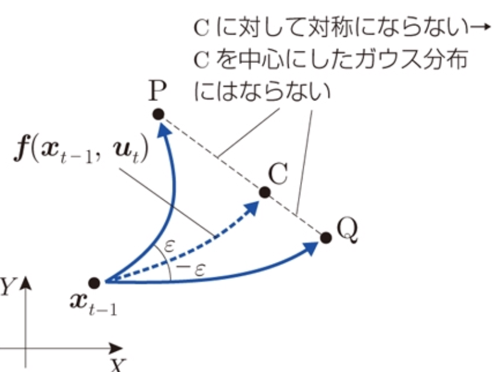
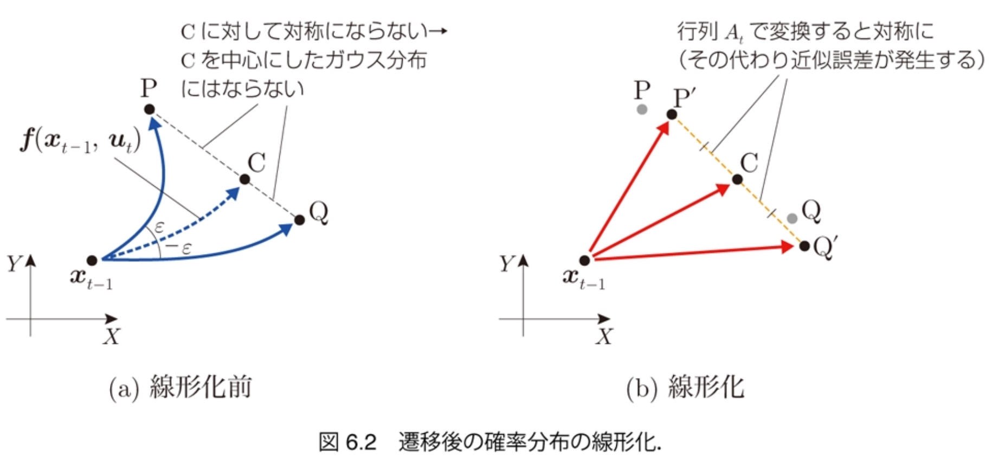

$\newcommand{\V}[1]{\boldsymbol{#1}}$

# 6. カルマンフィルタによる自己位置推定

千葉工業大学 上田 隆一

 

This work is licensed under a <a rel="license" href="http://creativecommons.org/licenses/by-sa/4.0/">Creative Commons Attribution-ShareAlike 4.0 International License</a>.

---

### カルマンフィルタ

* 信念分布をガウス分布に限定したベイズフィルタ
    * 次のベイズフィルタの式をすべてガウス分布の演算に
        * 移動時: $\hat{b}\_t(\V{x}) =  \big\langle p(\V{x} | \V{x}', \V{u}_t) \big\rangle_\{b_\{t-1\}(\V{x}')\}$ 
        * 観測時: $b\_t(\V{x}) = \eta p(\textbf{z}\_t | \V{x}) \hat{b}\_t(\V{x})$ 　
* 本書で扱う系は非線形系 $\Longrightarrow$線形化という操作が必要
    * 線形化をともなうカルマンフィルタ: 「拡張カルマンフィルタ」
    * 本書でいうカルマンフィルタは拡張カルマンフィルタのこと

なぜガウス分布にこだわるのか？

---

### カルマンフィルタの性質

パーティクルフィルタと比較すると・・・

* 計算量が小さい
    * 平均値と共分散行列の演算だけでベイズフィルタを実装可能
    * 状態の次元が高くても適用可能 　
* ガウス分布なので次のような状況で信念が表現しずらい
    * ロボットが壁ぎわにいて、壁の向こうにはいる可能性がない
        * 壁のところで分布を打ち切れない
    * 分布がマルチモーダル
    * 自己位置の情報がない（一様分布） 　
* （線形化が必要な場合に）誤差が生じる

---

## 6.1 信念分布の近似と描画

* 信念をガウス分布として実装
    * $b_t = \mathcal{N}(\V{\mu}_t, \Sigma_t)$ 　
* 誤差楕円を描く
    * 2章で扱いました
    * $XY\theta$空間の楕円球となる
        * （ユークリッド空間とみなせば） 　
    * シミュレータでは次の2要素で描画
        * $XY$平面の$3\sigma$範囲を表す楕円
        * $\theta$方向の$3\sigma$範囲を示す2本の線分

---

## 6.2 移動後の信念分布の更新

* やること: 移動時のベイズフィルタの式をガウス分布だけの演算に
    * 近似が必要 　
* ベイズフィルタの式
    * $\hat{b}\_t(\V{x}) = \big\langle p(\V{x} | \V{x}', \V{u}\_t) \big\rangle\_{b\_{t-1}(\V{x}')} $$= \int\_{\V{x}' \in \mathcal{X}} p(\V{x} | \V{x}', \V{u}\_t) b\_{t-1}(\V{x}') d\V{x}'$ 　

$p(\V{x} | \V{x}', \V{u}\_t)$の形が問題になる

---

## 6.2.1 状態遷移モデルの線形化

* 問題: 分布$p(\V{x} | \V{x}', \V{u}\_t)$がガウス分布にはならない
    * 例: 前章では$\V{u}_t$のばらつきをガウス分布でモデル化したが、 ロボットをまっすぐ走らせるとパーティクルは弓状の分布に

むりやりガウス分布に近似しましょう

---

### 近似の方法（状態遷移関数の線形化）

* 移動後の姿勢$\V{x}\_t$の分布がガウス分布になるように、 状態方程式を次のような形式に線形近似
    * $\V{x}\_t = \V{f}(\V{x}\_{t-1}, \V{u}\_t')$ $\approx \V{f}(\V{x}\_{t-1}, \V{u}\_t) + A\_t (\V{u}\_t' - \V{u}\_t)$
        * $\V{u}\_t, \V{u}'_t$: 制御指令と実際の制御
        * $A_t$: 後述

速度、角速度の誤差が等倍に広がる

---

### 行列$A_t$の意味

* $A\_t = \dfrac{\partial \V{f}}{\partial \V{u}}\Big|\_{\V{x}=\V{x}\_{t-1},\V{u}=\V{u}\_t}$
    * 近似した状態方程式（再掲）: $\V{x}\_t \approx \V{f}(\V{x}\_{t-1}, \V{u}\_t) + A\_t (\V{u}\_t' - \V{u}\_t)$ 　
* 解釈
    * $\V{x} =\V{x}_{t-1}, \V{u} = \V{u}_t$において、$\V{u}$が少しずれると$\V{f}$がどれだけずれるかを計算したもの
    * $A_t$に$\V{u}'_t - \V{u}$（速度・角速度の誤差）をかけることで、$\V{f}$のズレ（$=XY\theta$空間での$\V{x}_t$の誤差）が計算できる 　

---

### 行列$A_t$の計算

* 状態方程式
    * $\\boldsymbol{f}(\\boldsymbol{x}, \\boldsymbol{u}) = \\begin{pmatrix} x \\\\ y \\\\ \\theta \\end{pmatrix} + \\begin{pmatrix} \\nu\\omega^{-1}\\left\\{\\sin( \\theta + \\omega \\Delta t ) - \\sin\\theta \\right\\} \\\\ \\nu\\omega^{-1}\\left\\{-\\cos( \\theta + \\omega \\Delta t ) + \\cos\\theta \\right\\} \\\\ \\omega \\Delta t \\end{pmatrix}$
* 状態方程式の偏微分
    * $\\dfrac{\\partial \\boldsymbol{f}}{\\partial \\boldsymbol{u}} = \\begin{pmatrix} \\partial f\_x/\\partial \\nu & \\partial f\_x/\\partial \\omega \\\\ \\partial f\_y/\\partial \\nu & \\partial f\_y/\\partial \\omega \\\\ \\partial f\_\\theta/\\partial \\nu & \\partial f\_\\theta/\\partial \\omega \\end{pmatrix} \\nonumber \\\\ \hspace{-5em} = \\begin{pmatrix} \\omega^{-1}\\left\\{\\sin( \\theta + \\omega \\Delta t ) - \\sin\\theta \\right\\} & -\\nu\\omega^{-2}\\left\\{\\sin( \\theta + \\omega \\Delta t ) - \\sin\\theta \\right\\} + \\nu\\omega^{-1}\\Delta t \\cos( \\theta + \\omega \\Delta t )  \\\\ \\omega^{-1}\\left\\{-\\cos( \\theta + \\omega \\Delta t ) + \\cos\\theta \\right\\} & -\\nu\\omega^{-2}\\left\\{-\\cos( \\theta + \\omega \\Delta t ) + \\cos\\theta \\right\\} + \\nu\\omega^{-1}\\Delta t\\sin( \\theta + \\omega \\Delta t ) \\\\ 0 & \\Delta t \\end{pmatrix}$

これに$\boldsymbol{x} = \boldsymbol{x}\_{t-1}, \boldsymbol{u} = \boldsymbol{u}_t$を代入すると$A_t$となる

---

### 状態遷移モデルの近似

* 次にやること
    * $\V{x}\_t \approx \V{f}(\V{x}\_{t-1}, \V{u}\_t) + A\_t (\V{u}\_t' - \V{u}\_t)$について、$\V{x}_t$の分布を求める 　
* 分布の式
    * $\V{x}_t \sim \mathcal{N}(\V{x} | \V{\mu}_t , R_t)$
        * $\V{\mu}\_t = \V{f}(\V{x}\_{t-1}, \V{u}\_t)$
        * $R_t$は誤差項$A_t(\V{u}'_t - \V{u}_t)$のばらつきの共分散行列 　
* $R_t$の求め方
    * $\nu\omega$空間にある誤差$\V{u}'-\V{u}$の分布を$XY\theta$空間に$A_t$で写像

計算しましょう

---

### $R_t$の計算

1. 速度、角速度を$\boldsymbol{u}' \sim \mathcal{N}(\boldsymbol{u}, M_t)$でモデル化
    * $M\_t = \begin{pmatrix} \sigma^2\_{\nu\nu}|\nu\_t|/\Delta t + \sigma^2\_{\nu\omega}|\omega\_t|/\Delta t & 0 \\\\ 0 & \sigma^2\_{\omega\nu}|\nu\_t|/\Delta t + \sigma^2\_{\omega\omega}|\omega\_t|/\Delta t \end{pmatrix}$
    * $\sigma^2_{ab}$: 移動量$b$あたりの$a$の分散
    * これは前章で使ったモデルと同じ 　
2. 共分散行列の定義から
    * $R\_t = \left\langle  (\V{x}\_t - \V{\mu}\_t) (\V{x}\_t - \V{\mu}\_t)^\top \right\rangle\_{\mathcal{N}(\V{u}, M\_t)}$ 
    $= \left\langle A\_t (\V{u}'\_t - \V{u}\_t) \left\\{ A\_t (\V{u}'\_t - \V{u}\_t) \right\\}^\top \right\rangle\_{\mathcal{N}(\V{u}, M\_t)}$
    $= A\_t  \left\\{ \left\langle (\V{u}'\_t - \V{u}\_t) (\V{u}'\_t - \V{u}\_t)^\top \right\rangle\_{\mathcal{N}(\V{u}, M\_t)} \right\\} A\_t^\top$
	$ = A\_t M\_t A\_t^\top$ 
        ※ 書籍（付録B.1.10）はもう少し回りくどい方法で計算しています。書き直したい・・・
