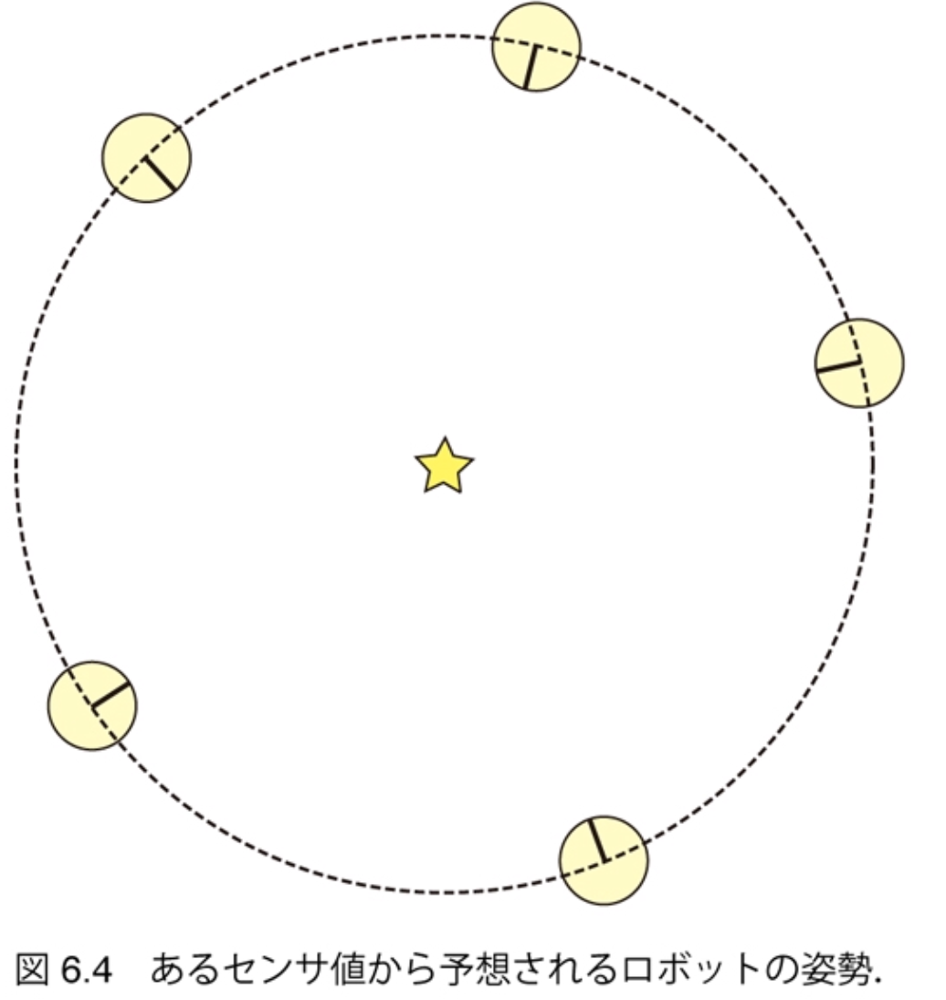

$\newcommand{\V}[1]{\boldsymbol{#1}}$

# 6. カルマンフィルタによる自己位置推定（後半）

千葉工業大学 上田 隆一

This work is licensed under a <a rel="license" href="http://creativecommons.org/licenses/by-sa/4.0/">Creative Commons Attribution-ShareAlike 4.0 International License</a>.

---

## 6.3 観測後の信念分布の更新

* やること
    * 観測後の信念がガウス分布になるように近似方法を考えて実装

---

## 6.3.1 近似前の更新式

* ひとつのセンサ値$\V{z}$を信念分布に反映する式
    * $b(\V{x}) = \eta p(\V{z} | \V{x}) \hat{b}(\V{x}) = \eta L(\V{x} | \V{z}) \hat{b}(\V{x})$
        * ランドマーク1個、時間の流れも気にしなくていいので添字は省略 　
* 尤度関数はパーティクルフィルタのものと共通
    * $L(\V{x} | \V{z}) = \mathcal{N}\left[ \V{z} | \V{h}(\V{x}), Q(\V{x}) \right]$
        * $Q(\V{x}) = \begin{pmatrix} [\ell(\V{x})\sigma_\ell]^2 & 0 \\\\ 0 & \sigma^2_\varphi \end{pmatrix}$
        * $\ell(\V{x})$: $\V{x}$とランドマーク$\text{m}$の距離
        * $\V{h}$: 観測関数
	
$b$はガウス分布にならない

---

### 尤度関数の形

* $XY$平面で見ると、尤度のモードはドーナツ状に
    * 信念分布と掛け算してもガウス分布にならない

* どうするか？$\Longrightarrow$信念分布の中心で線形化

---

### $b$の計算式のどこを近似するか

* $b(\V{x}) = \eta e^{ -\frac{1}{2} \left[ \V{z} - \V{h}(\V{x}) \right]^\top Q\_{\V{x}}^{-1} \left[ \V{z} - \V{h}(\V{x}) \right] -\frac{1}{2} ( \V{x} - \hat{\V{\mu}} )^\top \hat{\Sigma}^{-1} ( \V{x} - \hat{\V{\mu}} ) }$
    * ここで
        * $Q_{\V{x}}$: $Q(\V{x})$のこと
        * $\hat{b} = \mathcal{N}(\hat{\V{\mu}}, \hat\Sigma)$
        * $\V{h}(\V{x}) = \begin{pmatrix} \sqrt{(x - m_x)^2 + (y - m_y)^2} \\\\ \text{atan2}(m_y - y, m_x - x) - \theta \end{pmatrix}$ 　
    * 指数部が$\V{x}$の二次形式になればガウス分布になる 　
* やるべき近似
    1. 非線形な$\V{h}$から$\V{x}$を救出
    2. $Q_\V{x}$から変数$\V{x}$をなくす

---

## 6.3.2 $XY\theta$空間での観測方程式の線形近似

* $\V{h}$を次のように近似して$\V{x}$の多項式に
    * $\V{h}(\V{x}) \approx \V{h}(\hat{\V{\mu}}) + H(\V{x} - \hat{\V{\mu}})$
        * $\hat{\V{\mu}}$: 信念分布の中心
        * $H = \dfrac{\partial \V{h}}{\partial \V{x}}\Big|_{\V{x} = \hat{\V{\mu}}}$
    * 意味: ある姿勢$\V{x}$でのセンサ値は、分布の中心で得られるセンサ値$\V{h}(\hat{\V{\mu}})$に、中心からのずれ$\V{x} - \hat{\V{\mu}}$を$H$倍した値を足したものに
        * もちろん近似で、$\V{x}$が$\hat{\V{\mu}}$から離れるとデタラメ

---

### $H$の計算

* $H = \dfrac{\partial \V{h}}{\partial \V{x}}\Big|\_{\V{x} = \hat{\V{\mu}}}$
$ = \begin{pmatrix} (x - m\_x)/\sqrt{(x - m\_x)^2 + (y - m\_y)^2} & (y - m\_y)/\sqrt{(x - m\_x)^2 + (y - m\_y)^2} & 0 \\\\ (m\_y - y)/\{(x-m\_x)^2+(y-m\_y)^2\} & (x - m\_x)/\{(x-m\_x)^2+(y-m\_y)^2\} & -1 \end{pmatrix} \Bigg|\_{\V{x} = \V{\hat{\mu}}} $
$ = \begin{pmatrix} (\hat{\mu}\_x - m\_x)/\ell\_{\hat{\V{\mu}}} & (\hat{\mu}\_y - m\_y)/\ell\_{\hat{\V{\mu}}} & 0 \\\\ (m\_y - \hat{\mu}\_y)/\ell\_{\hat{\V{\mu}}}^2 & (\hat{\mu}\_x - m\_x)/\ell\_{\hat{\V{\mu}}}^2 & -1 \end{pmatrix}$
    * ここで$\quad \ell_{\hat{\V{\mu}}} = \sqrt{(\hat{\mu}_x - m_x)^2 + (\hat{\mu}_x - m_y)^2}$
    * すべて既知の変数で構成される

---

### $Q_\V{x}$の近似

* $Q(\V{x}) = \begin{pmatrix} [\ell(\V{x})\sigma_\ell]^2 & 0 \\\\ 0 & \sigma^2_\varphi \end{pmatrix}$を定数にしたい 　
$\Longrightarrow$信念分布の中心$\hat{\V{\mu}}$で$\V{x}$を代用 　
* $Q_{\ell_{\hat{\V{\mu}}}} = \begin{pmatrix} [\ell_{\hat{\V{\mu}}} \sigma_\ell]^2 & 0 \\\\ 0 & \sigma_\varphi^2 \end{pmatrix}\label{eq:kalman_q_lmu}$ を使う
   * $\ell_{\hat{\V{\mu}}}$: $\hat{\V{\mu}}$でのランドマークとの距離 　
* 以後、$Q$という表記は$Q_{\ell_{\hat{\V{\mu}}}}$のこと

---

### 近似後の$b$の式

* $b(\V{x}) = \eta\exp \left\\{ -\frac{1}{2} \left[ \V{z} - \V{h}(\hat{\V{\mu}}) - H(\V{x} - \hat{\V{\mu}})  \right]^\top Q^{-1} \left[ \text{省略}\right] \\\\ \qquad\qquad\qquad\qquad -\frac{1}{2} ( \V{x} - \hat{\V{\mu}} )^\top \hat\Sigma^{-1} ( \V{x} - \hat{\V{\mu}} ) \right\\}$
    * $\V{x}$の多項式として指数部を整理
        * 2次の項: $-\dfrac{1}{2} \V{x}^\top (H^\top Q^{-1}H + \hat\Sigma^{-1} ) \V{x}$
        * 1次の項: $ \V{x}^\top \\{ H^\top Q^{-1} (\V{z} - \V{h}(\hat{\V{\mu}}) + H\hat{\V{\mu}}) + \hat\Sigma^{-1} \hat{\V{\mu}} \\} $ 　
* ガウス分布は次のようにも書けるので、 上の1, 2次の項から$b = \mathcal{N}(\V{\mu},\Sigma)$が求まる
    * $p(\V{x}) = \eta \exp \left\\{ -\dfrac{1}{2}\V{x}^\top \Sigma^{-1} \V{x} + \V{x}^\top \Sigma^{-1}\V{\mu} \right\\}$

---

### センサ値を反映するための更新式

* 一次の項から
    * $\Sigma^{-1} =  H^\top Q^{-1}H + \hat\Sigma^{-1}$
     $\Longrightarrow$$\Sigma =  (H^\top Q^{-1}H + \hat\Sigma^{-1} )^{-1}$
* 二次の項から
    * $\Sigma^{-1}\V{\mu} = H^\top Q^{-1} (\V{z} - \V{h}(\hat{\V{\mu}}) + H\hat{\V{\mu}}) + \hat\Sigma^{-1} \hat{\V{\mu}}$ 　
$\V{\mu} =$$\Sigma \\{ H^\top Q^{-1} (\V{z} - \V{h}(\hat{\V{\mu}}) + H\hat{\V{\mu}}) + \hat\Sigma^{-1} \hat{\V{\mu}} \\}$ 　
$\quad = \Sigma \\{ H^\top Q^{-1}(\V{z} - \V{h}(\hat{\V{\mu}})) + (H^\top Q^{-1} H + \hat\Sigma^{-1} )\hat{\V{\mu}} \\}$ 
$\qquad = \Sigma H^\top Q^{-1} (\V{z} - \V{h}(\hat{\V{\mu}})) + \hat{\V{\mu}}$
* 解釈
    * 更新後の精度行列: 更新前の情報$\hat{\Sigma}^{-1}$にセンサ値からの情報$H^\top Q^{-1}H$を足したもの
    * 更新後の分布の中心: 更新前の中心$\hat{\V{\mu}}$に、センサ値のずれ$\V{z} - \V{h}(\hat{\V{\mu}})$を行列$\Sigma H^\top Q^{-1}$で変換した量を足したもの

---

## 6.3.3 カルマンゲインによる表現

* 行列$\Sigma H^\top Q^{-1}$を、センサ値のずれに応じて信念分布の中心を移動するための拡大率と考えカルマンゲインと呼ぶ 　
* カルマンゲインを使って更新式を整理 
（行列の計算は書籍参考のこと）
    * $K = \hat\Sigma H^\top (H \hat\Sigma H^\top + Q )^{-1}$
    * $\Sigma =  (I - KH) \hat{\Sigma}$
    * $\V{\mu} = K (\V{z} - \V{h}(\hat{\V{\mu}})) + \hat{\V{\mu}}$ 　
* 新たな解釈
    * 更新後の共分散行列: 更新前の不確かさ$\hat{\Sigma}$が$KH\hat{\Sigma}$だけ縮小
    * 更新後の分布の中心: センサ値のズレを$K$で$XY\theta$空間に写像して、その分だけ中心をずらす

---

## 6.3.4 観測後の更新の実装

