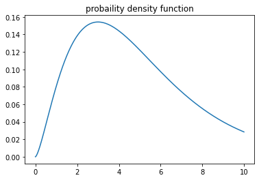

$\newcommand{\V}[1]{\boldsymbol{#1}}$

# 7. 自己位置推定の 諸問題（前半）

千葉工業大学 上田 隆一

This work is licensed under a <a rel="license" href="http://creativecommons.org/licenses/by-sa/4.0/">Creative Commons Attribution-ShareAlike 4.0 International License</a>.

---

### 本章でやること

* パーティクルフィルタを用いた自己位置推定（MCL） について
    * パーティクルの個数を可変に（7.1節）
    * スタックや誘拐問題への対応（7.2節以降）

---

## 7.1 KLDサンプリング

* こういうことはできないか
    * 推定姿勢が不確かなときはパーティクルの数を多く
        * 近似精度を確保
    * 推定姿勢が確かなときはパーティクルの数を少なく
        * 計算量を小さく

「KLDサンプリング」という手法を用いて実現

---

## 7.1.1 パーティクル数の決定問題

* ある信念分布をある正確さで近似するために必要な パーティクル数$N$は？ 　

この問題を考えるためには 「正確さ」の数値化が必要

---

### カルバック・ライブラー情報量

* Kullback-Leibler divergence, KL divergence, KL情報量
    * 次の式で二つの分布$P,Q$の「近さ」を比較
        * $D\_\\text{KL}(P||Q) = \\sum_{s \\in \\mathcal{S}} P(s)\\log \\dfrac{P(s)}{Q(s)} = \\left\\langle \\log P(s) \\right\\rangle\_{P(s)} - \\left\\langle \\log Q(s) \\right\\rangle\_{P(s)}$
            * $\mathcal{S}$は有限個の要素の集合
    * 性質
        * $P=Q \Longrightarrow D_\text{KL} = 0$
        * $P\neq Q \Longrightarrow D_\text{KL} > 0$ 　
* KL情報量で真の信念分布と、パーティクルによる分布の近似を比較
    * ただし真の信念分布が不明なことに注意

---

### 格子上の分布$P$

* $XY\theta$空間を格子状に分割して離散化
    * 区画を「ビン」（瓶のこと）と呼ぶ
    * ビン一つ一つに$s_0, s_1, s_2, \dots, s_{k-1}$と番号づけ 　
* 信念分布$b$から、次のような格子上の分布$P$を考える
    * $P(s_i) = \int_{\V{x} \in s_i} b(\V{x})d\V{x}$
* パーティクルの分布からも、$P$の分布を考える
    * $P(s_i) = n_i/N$
        * $n_i$: ビン$s_i$に入っているパーティクルの個数
        * $N$: 全パーティクルの個数 　
* 真の信念分布、あるパーティクルの分布からそれぞれ確率分布$P^\*, \hat{P}$を作り、$D_\text{KL}(\hat{P} || P^\*)$で比較

---

### 近似精度の目標の設定

* まず、$D_\text{KL}(\hat{P} || P^*) \le\varepsilon$という目標（目標1）を考える
    * $D_\text{KL}$が設定した閾値$\varepsilon$を下回るために必要な$N$は？ 　
* 目標1はどんなに$N$が大きくても達成できない可能性
    * パーティクルの分布が偏ると$D_\text{KL}(\hat{P} || P^\*)$が小さく
* そこで、目標2: $$P\left[ D_\text{KL}(\hat{P} || P^*) \le\varepsilon \right] \ge 1 - \delta$$
を設定
    * 目標1が達成される確率が、閾値$\delta$を設定したときに$1-\delta$以上

これで$N$が決まるが、$b^*$が不明という問題が残る

---

## 7.1.2 対数尤度比の性質による パーティクル数の決定

* やること: 
    * $P^\*$が分からず$D_\text{KL}(\hat{P} || P^\*)$が直接計算できないので、 
    $D_\text{KL}(\hat{P} || P^\*)$がどのようにばらつくかを（間接的に）調べる 　

---

### 格子上の分布$P$の分布を考える

* 次の確率$P_\text{M}$を考える
    * ある信念分布$b$の値の大きいビンを$k$個選び、$b$からパーティクルを$N$個選んで分布$P$を作ったときに、ある分布になる確率
    * $P\_\text{M}$の変数: $\textbf{n} = \\{n\_i | i=0,1,2,\dots,k-1 \\}$
        * $n_i$: ビン$s_i$内のパーティクルの数
    * $P\_\text{M}$のパラメータ（条件）: $\Theta = \\{ p_i | i=0,1,\dots,k-1 \\}$
        * 信念分布$b$から計算した各ビンの確率 　
* 次のような多項分布となる
    * 例: サイコロを何回か投げて1〜6の出る回数を全的中させる確率
    * $P\_\text{M}(\textbf{n} | \Theta) = \\\\ \dfrac{N!}{n\_0! n\_1!\dots n\_{k-1}!} (p\_0)^{n\_0} (p^\*\_1)^{n\_1} \dots (p^\*\_{k-1})^{n\_{k-1}} = \eta\prod\_{j=0}^{k-1} (p^\*\_j)^{n\_j}$

---

### 尤度比による比較

* 尤度関数$L(\Theta, \textbf{n}) = P\_\text{M}(\textbf{n} | \Theta)$から対数尤度比を考える
    * 真の分布から作った$\Theta^*$に比べてパーティクルの分布がどれだけ尤もらしいか（の対数）
    * $\log \lambda\_N = \log \dfrac{L(\hat\Theta | \textbf{n})}{L(\Theta^\* | \textbf{n})} = \log \dfrac{ \prod\_{j=0}^{k-1} \hat{p}\_j^{n\_j} } { \prod\_{j=0}^{k-1} {p^\*\_j}^{n\_j}} =  \sum\_{j=0}^{k-1} \hat{n}\_j \log ( \hat{p}\_j / p^\*\_j )$ 
        * $\hat{\Theta} = \\{\hat{p}_i | i=0,1,\dots,k-1\\}$: あるパーティクルの分布から作った格子上の確率分布$\hat{P}$の確率
        * $\hat{n}_i$: ビン$s_i$に入っているパーティクルの個数 　
* KL情報量が次のように$\log \lambda_N$で表せる
    * \* $D\_\\text{KL}(\hat{P}||P^\*) = \\sum_{s \\in \\mathcal{S}} \hat{P}(s)\\log \\dfrac{\hat{P}(s)}{P^\*(s)}$
    $ = \sum\_{i=0}^{k-1} \hat{p}\_i \log (\hat{p}\_i / p^\*\_i) = \sum\_{i=0}^{k-1} \dfrac{\hat{n}\_i}{N} \log (\hat{p}\_i / p^\*\_i) = \dfrac{1}{N} \log \lambda_N $ 　

---

### 「目標2」の変形

* $P\left[ D_\text{KL}(\hat{P} || P^*) \le\varepsilon \right] \ge 1 - \delta$
     $\Longrightarrow P\left[ 2 \log \lambda_N \le 2N \varepsilon \right] \ge 1 - \delta$
     $\Longrightarrow P\left[y \le 2N \varepsilon \right] \ge 1 - \delta$
    * $y=2\log \lambda_N$ 　
* $y$は自由度$k-1$の カイ二乗分布$\chi^2_{k-1}$に従う
    * $\chi^2_k$: $\mathcal{N}(0, 1)$に従う$a$を $k$回ドローした値の二乗和 $a_1^2 + a_2^2 + \dots + a_k^2$が従う分布 
    * $\chi^2_k (y) = \eta\ y^{k/2-1} e^{-y/2}$
    * 右図: $\chi^2_5$の確率密度関数

$k$を決めると$N$が決まる（次ページ）

---

### パーティクル数$N$の決定

* 手順
    * $k$を決める（決め方はあとで）
    * $\int_0^y \chi^2_{k-1}(x) dx = 1 - \delta$から$y$を算出
        * グラフを左から積分していって値が$1-\delta$になったところの$y$（分位点）
 
        * Pythonの場合はライブラリで分位点が計算可能
        * 自分で実装する場合は近似（Wilson-Hilferty変換）を利用（書籍で説明）
    * $y \le 2N\varepsilon$なので、$N \ge y/(2\varepsilon)$を満たす最小の$N$が求める数

---

### ビンの数$k$とパーティクル数$N$の関係

* $\varepsilon = 0.1, \delta = 0.01$のとき
    * 横軸: $k$
    * 縦軸: $N$

ビンの数が増えれば、近似に必要なパーティクルも増える（単純）

---

## 7.1.3 MCLへの組み込み

* 残った問題: $k$をどう決めればよい？ 　
* 解決するアルゴリズム（KLDサンプリング）
    * 初期化: $XY\theta$空間を離散化してビンを作っておく
        * シミュレータでは200[mm]$\times$200[mm]$\times$10[deg]
    * リサンプリング時: 新しいパーティクルを1個ずつドローしては次の値を比較
        * 新しいパーティクルの数$N$
        * 新しいパーティクルが存在しているビンの数$k$
        * $k$に対して$N$が必要な数を上回ったところでリサンプリング終了 　

リサンプリング前の分布の広さに応じて $k$が増え、あるとき頭打ちになる

---

### 実装、動作結果

* 見どころ: ランドマークが観測できなくなると ビンとパーティクルの数が増えていく

---

### KLDサンプリングのまとめ

* パーティクルの数を可変に
* パーティクルによる分布の近似の尤もらしさ（の対数）が、カイ二乗分布に従う性質を利用 　
* ROSのamclパッケージで利用されているので知っておくとよいが、
自分でMCLを作ったときに実装が必須ということはない 　
* ビンの作り方には、格子状の離散化以外の方法が存在
    * 木構造など
    * （私見）ちょっと凝りすぎではないかと思われる

