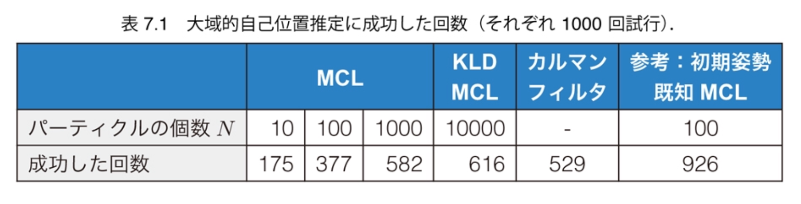
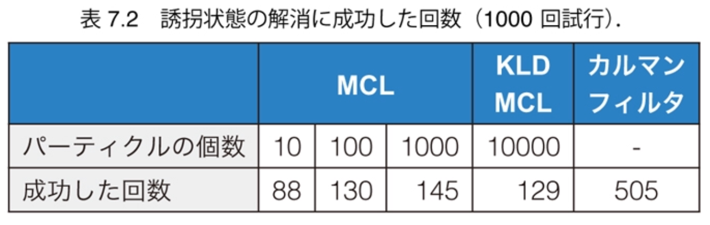
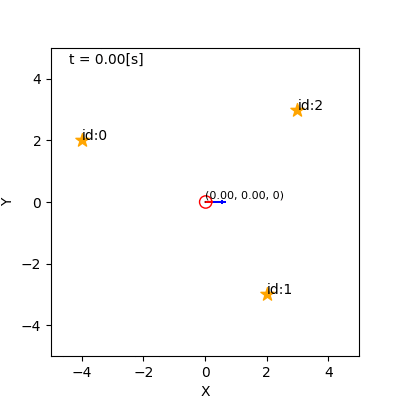
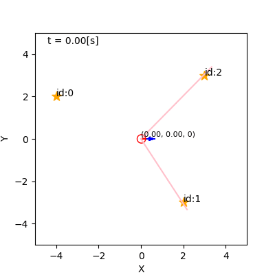
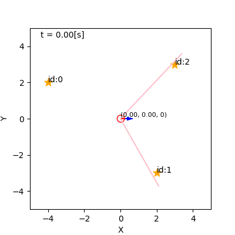
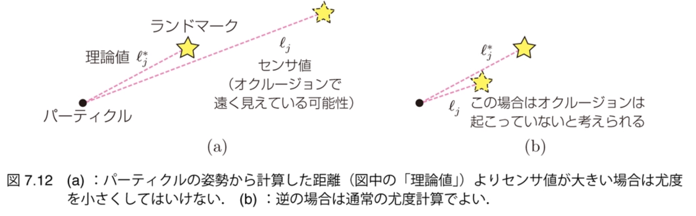
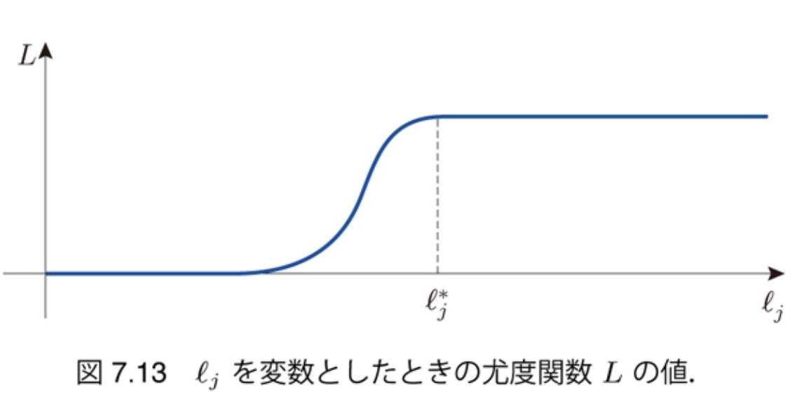
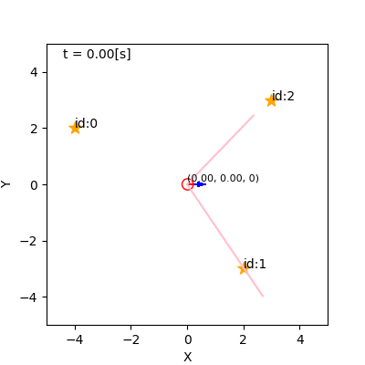

$\newcommand{\V}[1]{\boldsymbol{#1}}$

# 7. 自己位置推定の 諸問題（後半）

千葉工業大学 上田 隆一

This work is licensed under a <a rel="license" href="http://creativecommons.org/licenses/by-sa/4.0/">Creative Commons Attribution-ShareAlike 4.0 International License</a>.

---

## 7.2 より難しい自己位置推定

* やること
    * スタックや誘拐で起こる問題を確認する
    * 問題に対応するためのアルゴリズムを考える

---

## 7.2.1 大域的自己位置推定

* ロボットの初期姿勢$\V{x}_0$が分からない場合を考える
    * 5, 6章では$\V{x}_0$が分かるという前提だった 　
* 初期の信念分布$b_0$は一様分布が適切
    * カルマンフィルタでは非常に広い分布で近似可能だが 線形化の影響が心配
    * パーティクルフィルタだと近似はできるが パーティクルの数が不足

---

### 実験

* ランダムにパーティクルを配置して自己位置推定
    * 図は$N=100$の場合 

    * 偶然センサ値と矛盾のない姿勢にいたパーティクルが残る

---

### 実験結果

* 大域的自己位置推定に成功する確率を求める
    * 成功: 30秒後に$XY$平面での誤差が1[m]以内 　
* 結果
    * カルマンフィルタ: 半分失敗
    * パーティクルフィルタ: $N$と成功率は比例しない
        * 多次元空間を埋め尽くすには指数乗のパーティクルが必要

---

## 7.2.2 誘拐ロボット問題

* ロボットの姿勢が突然移動するという問題
    * 突然、信念の分布とロボットの姿勢が乖離
    * 下図: パーティクルとロボットを別の場所からスタート 

    * パーティクルのないところのことは何も考慮されないので 対応不可能

---

### 実験と結果

* 大域的自己位置推定のときと同様に実験
    * 前ページのアニメーションのようにロボットを信念分布と離してスタート 　
* パーティクルフィルタ: 対応できていない
* カルマンフィルタ: 多少は対応可能
    * 少しずつ分布が観測したランドマークの方に寄っていくので

---

## 7.3 推定の誤りの考慮

* 信念分布が間違っているかもしれない
    * これを今まで考えてこなかったのがいけない
    * ロボットの不安を拡張
        * 姿勢が不確か$\rightarrow$推定自体が不確か 　
* 準備
    * 「信念分布が正しいかどうかを表す変数$\Upsilon$」の導入
        * $\Upsilon$: 緊急事態を表すフラグ （$\Upsilon$は「ウプシロン」と読む）
            * $\Upsilon=0$: 正しい
            * $\Upsilon=1$: 正しくない（= 緊急事態発生） 

---

### 信念分布の拡張

* $\Upsilon$を考慮して信念分布を書き直し
    * $b(\boldsymbol{x}) = b(\boldsymbol{x} | \Upsilon=0)P(\Upsilon=0) + b(\boldsymbol{x} | \Upsilon=1)P(\Upsilon=1)$
        * 第一項: 今までの信念分布
        * 第二項: 自己位置推定が間違っているときの信念分布 　
* 新たな信念分布の計算に必要なこと
    * 確率分布$P(\Upsilon)$をどうやって求めるか
        * 注意: 本書や以後のスライドではこれより簡単な問題を扱うだけにとどめており、いつ$\Upsilon=1$とするかどうかだけを求めている
    * 分布$b(\boldsymbol{x} | \Upsilon=1)$をどう作るか

---

## 7.3.1 信念分布が信頼できるか どうかの判断

* このタイトルの「信念分布」: 拡張前の信念分布
    * $b(\boldsymbol{x} | \Upsilon=0)$のこと 　
* やること: いつ$\Upsilon=1$とするのかを考える 　
* やりかた:
    * $\hat{b}(\boldsymbol{x} | \Upsilon=0)$と得られたセンサ値$\textbf{z}$を比較
        * $\hat{b}$: ロボットの移動$\V{u}$が反映された信念分布
            * 時刻の添字$t$を省略しています
    * $\hat{b}(\boldsymbol{x} | \Upsilon=0)$を信じたときに$\textbf{z}$が得られそうにないなら $\Upsilon=1$

---

### 周辺尤度

* 「$\hat{b}(\boldsymbol{x} | \Upsilon=0)$を信じたときに$\textbf{z}$が得られそう」 を数値化したもの
$$\alpha = \langle p(\textbf{z} | \boldsymbol{x}') \rangle_{\hat{b}(\boldsymbol{x}')}$$
* 周辺尤度の計算
    * 周辺尤度はベイズの定理の分母
         * $b(\boldsymbol{x}) = \hat{b}(\boldsymbol{x} | \textbf{z}) = \dfrac{ p(\textbf{z} | \boldsymbol{x}) \hat{b}(\boldsymbol{x}) } { p(\textbf{z}) } = \dfrac{ p(\textbf{z} | \boldsymbol{x}) \hat{b}(\boldsymbol{x}) } { \langle p(\textbf{z} | \boldsymbol{x}') \rangle_{\hat{b}(\boldsymbol{x}')}}$
    * パーティクルフィルタでは$\textbf{z}$反映後の正規化前の重みの合計
        * $\alpha = \sum_{i=0}^{N-1} w^{(i)} = \sum_{i=0}^{N-1} p(\textbf{z} | \V{x}^{(i)}) w^{(i)}$
        * 簡単に計算できるので閾値処理で$\Upsilon=0,1$を判断

---

### 周辺尤度の閾値の決定

* 書籍での方法
    1. パーティクルが真の姿勢から離れないか監視しながらロボットとMCLを動作
    2. 1の間、$\alpha$の値を記録
    3. 2の最小値を下回るように閾値$\alpha_\text{th}$を決定 　
* 結果
    * ランドマークを1個だけ観測した場合: $\alpha > 0.01$
    * ランドマーク2個を同時に観測した場合: $\alpha > 0.07$
    * 参考: パーティクルの姿勢とセンサ値が大きく乖離すると$\alpha = 10^{-150}$くらいの小さい値になる 　
* $\alpha_\text{th} = 0.001$に設定
    * オクルージョンなどがないという前提で設定したので少し雑

---

## 7.3.2 単純リセットの実装

* 周辺尤度が閾値を下回ったらどうするのか？ 
    * 下のふたつの式から$b(\boldsymbol{x}) = b(\boldsymbol{x} | \Upsilon=1)$
        * $P(\Upsilon=1) = 1$
        * $b(\boldsymbol{x}) = b(\boldsymbol{x} | \Upsilon=0)P(\Upsilon=0) + b(\boldsymbol{x} | \Upsilon=1)P(\Upsilon=1)$
    * つまり信念分布を「いままでの自己位置推定が間違っていたときの代用の信念分布」で置き換え
        * これをリセットと呼ぶ 　
* $b(\boldsymbol{x} | \Upsilon=1)$は何か？
    * とりあえず一様分布と考えてみましょう
        * 何も情報がないので
    * パーティクルを一様分布状に再配置
        * 「単純リセット」と呼ぶ

---

### 単純リセットの挙動

* 大域的自己位置推定を やりなおすことになるので、 運次第となる
    * ただしリセットなしより改善
    * 誘拐ロボット問題の実験:  成功回数$446$回
        * $N=100$、$1000$回試行 　
* 実用的な環境では$N$が不足 　

もっと効率の良い方法はないか？

---

## 7.3.3 センサリセットの実装

* 一様分布ではなくリセットを引き起こしたセンサ値$\textbf{z}$に基づいてパーティクルを置き直すことを考える 
$\Longrightarrow$センサリセット
    * $b(\V{x}) = \eta L(\V{x} | \textbf{z})$ 　
* センサリセットのアルゴリズム
    * 尤度関数$L(\V{x} | \textbf{z})$から$N$個パーティクルをドロー

---

### センサリセットの挙動

* 単純リセットより効率がよい
    * 誘拐ロボット問題の実験: 585回/1000回成功
    * より狭い領域にパーティクルを配置できるので

---

## 7.3.4 センサリセットの問題とadaptive MCL

* 単純リセットもセンサリセットもセンサ値の大きな誤差に弱い
    * 誤発動でいままで推定が正しかったのにリセットされる
    * これならリセットがないほうがよい 　
* 対応: 1個の$\textbf{z}$でリセットを判断しない
    * $\alpha$の値がしばらくの間だけ小さい場合にリセット

---

### adaptive MCL

* 次のような方法で急なリセットを防ぐ
    * 変数$\alpha_\text{slow}, \alpha_\text{fast}$を次のように更新
        * $\alpha_\text{slow} \longleftarrow \alpha_\text{slow} + \alpha_\text{th-slow} (\alpha - \alpha_\text{slow})$
        * $\alpha_\text{fast} \longleftarrow \alpha_\text{fast} + \alpha_\text{th-fast} (\alpha - \alpha_\text{fast})$
    * $\alpha_\text{th-slow}, \alpha_\text{th-fast}$は閾値
        * $0 < \alpha_\text{th-slow} \ll \alpha_\text{th-fast} < 1$ （例: $\alpha_\text{th-slow} = 0.001, \alpha_\text{th-fast} = 0.1$）
        * $\alpha$が小さい状態が続く$\rightarrow$先に$\alpha_\text{fast}$が0に接近$\rightarrow$あとから$\alpha_\text{slow}$が0に接近 　
* $\alpha_\text{slow}, \alpha_\text{fast}$にもとづき、$\tilde{N}$個のパーティクルを置き直し
    * $\tilde{N} = N \max \left(0, 1 - \alpha_\text{fast}/\alpha_\text{slow} \right)$
        * $\alpha_\text{fast} < \alpha_\text{slow}$のときに一部のパーティクルが置き直される
    * やっている計算
        * $b(\V{x}) = b(\V{x} | \Upsilon=0)\dfrac{1-\tilde{N}}{N} + b(\V{x} | \Upsilon=1)\dfrac{\tilde{N}}{N}$

---

### adaptive MCLの挙動

* $N=1000$、観測でファントムを起こす
    * $\alpha_\text{th-slow} = 0.001, \alpha_\text{th-fast} = 0.1$
* 左図: 誘拐なし
    * 突発的な周辺尤度の低下ではリセットが起きない
* 右図: 誘拐あり
    * リセットが起こる（$\tilde{N}$が少ないので不安定）

---

## 7.3.5 膨張リセット

* adaptive MCLは「無駄なリセットを起こさない」という方針だが、リセットが起きても急激に分布の形状を変えないという方針も考えられる 　
* 膨張リセット
    * 元の信念分布を広げる（ぼかす）ようにリセット
        * パーティクルの分布を膨張させる
    * 本書での実装
        * リセット前の分布のパーティクルにブラウン運動させて分布を拡散
            * ガウス分布に従う量だけ変異させる
	        * 標準偏差: $X, Y$軸方向それぞれ0.2[mm]、$\theta$方向0.2[rad]

---

### 膨張リセットの挙動

* $N=100$、ファントム有り
* 左図: 膨張を繰り返して誘拐を解消
* 右図: スタックしてもパーティクルが戻ってくる

&nbsp;

* 誘拐ロボット問題の実験: $N=100$で$334$回/$1000$回成功
    * 収束が30[s]では足りない

---

## 7.3.6 膨張リセットとセンサリセットの組み合わせ

* 膨張リセットの短所
    * センサリセットより誘拐の解決に時間がかかる
    * パーティクルが広がりすぎると大域的自己位置推定と変わらない 　
* $\Longrightarrow$複合リセット
    * 膨張を何回か繰り返したらセンサリセットに切り替え
        * とってつけたようだが、パーティクルが過度に広がって推定不能になることを防いでいる

---

### 複合リセットの挙動

* 図の例: 4回膨張リセットが連続したら5回目でセンサリセットに切り替え
* 誘拐ロボット問題の実験: $N=100$で$609$回/$1000$回成功
    * とってつけたようだが機能する
    * ただしファントムが連続で見えた場合には誤作動する

---

## 7.4 MCLにおける変則的な分布の利用

* いままでMCLでの確率モデルはガウス分布を使っていたが、MCLではその必要はない
    * 尤度関数は自由に定義できる 　
* やること
    * オクルージョンを考慮した尤度関数の設計

---

### オクルージョンの影響

* 本書でいうオクルージョンの設定
    * ランドマークが移動障害物に隠れて 欠けて見え、実際より遠く見える 　
* 図: 何も対応せずにMCLを実行
    * ランドマークから遠い パーティクルが残って 自己位置推定できない 　

---

### いつ発生するか分からない 観測への妨害の対応

* リセットにたよらず尤度関数で対応する場合
    * 可能ならば、妨害が起こっている可能性を常に考える
 $\Longrightarrow$起こっている/いない場合で尤度を計算して大きい方をとる 　
* 本書のオクルージョンの場合
    * センサ値が示すよりランドマークが手前にある可能性を常に考慮

---

### オクルージョンに対応した尤度関数

* センサ値の示す距離$\ell_j$から計算した尤度と、姿勢$\V{x}$から計算される距離$\ell_j^\*$から計算した尤度の大きい方をとる
    * $ L\_j(\V{x} | \V{z}\_j) = \begin{cases} \mathcal{N}\left[ \V{z} = \V{z}\_j | \V{h}\_j(\V{x}), Q\_j(\V{x}) \right] & (\ell\_j < \ell\_j^\*)  \\\\ \mathcal{N}\left[ \ell = \ell\_j^\* ,\varphi = \varphi\_j | \V{h}\_j(\V{x}), Q\_j(\V{x}) \right] & (\text{otherwise}) \end{cases} $
    * $\ell_j$が不自然に大きくても尤度は小さくならない
    * 直観的には、ガウス分布と一様分布を継ぎ足した形状の尤度関数となる

---

### 効果

* 左: 尤度関数でオクルージョン未考慮
    * パーティクルがランドマークから遠ざかって推定不可能
* 右: 尤度関数でオクルージョン考慮
    * 少しランドマーク側にパーティクルが寄るが推定は可能

&nbsp;&nbsp;

---

## 7.5 まとめ

* 以下を扱った
    * パーティクルの数を可変にする方法
        * KLDサンプリング 
    * 大きな偶発的誤差への対応
        * リセット、変則的な尤度関数 　
* いずれも2000年代前半、実際にロボットを動かしたいという強い動機から生まれた研究
    * 実践的、実戦的
    * きれいな理論だけではロボットは動かないので、おそらくもっときれいな理論を作らなければならない
