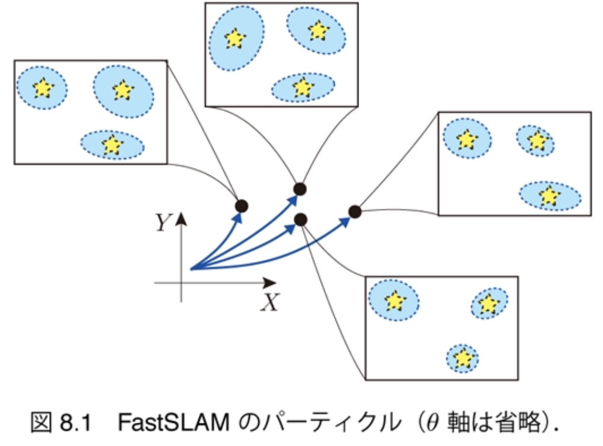

$\newcommand{\V}[1]{\boldsymbol{#1}}$

# 8. パーティクル フィルタによるSLAM（前半）

千葉工業大学 上田 隆一

This work is licensed under a <a rel="license" href="http://creativecommons.org/licenses/by-sa/4.0/">Creative Commons Attribution-ShareAlike 4.0 International License</a>.

---

### 本章でやること

* SLAMの問題を理解
* FastSLAMの導出と実装

---

### SLAM

* simultaneous localization and mapping
    * 自己位置推定と地図生成を同時に実行すること 　
* ランドマークの位置が分からないのに自己位置推定できるのか？
    * 素直に次のようにすればできる
        1. 白地図を用意
        2. ロボットの初期姿勢を原点にして世界座標系を設定
        3. 移動して姿勢を更新し、ロボットが観測したものを世界座標系の位置に変換して白地図に書き込むことを繰り返す

ただし雑音が厄介

---

## 8.1 逐次SLAMの解き方
### 8.1.1 SLAMの問題と部分問題への分解

* SLAM問題: $b_t(\V{x}\_{1:t}, \textbf{m}) = p(\V{x}\_{1:t}, \textbf{m} | \V{x}\_0, \V{u}\_{1:t}, \textbf{z}\_{1:t})$を計算
   * ここで
       * $\V{x}\_{1:t}$: ロボットの姿勢の履歴（軌跡）
       * $\textbf{m}$: 地図（全ランドマークの位置）
           * $\textbf{m} = \\{\V{m}\_0, \V{m}\_1, \dots, \V{m}\_{N\_\textbf{m}}\\}$
   * 用途
       * 地図が未知の自己位置推定
       * 地図と履歴を利用（$b_t$を最大化する$\V{x}\_{1:t}, \textbf{m}$だけ求める）
       * 地図を利用（$b_t$を最大化する$\textbf{m}$だけ求める）

いずれにせよ非常に多次元の分布を求めることに

---

### Rao-Blackwellization

* 分布が多次元すぎて扱えないので変形
    * 軌跡の分布と地図の分布に分解できる （ラオ・ブラックウェル化）
$$\begin{align} &b\_t(\boldsymbol{x}\_\{1:t\}, \textbf{m}) = p(\boldsymbol{x}\_\{1:t\},\textbf{m} | \boldsymbol{x}\_{0}, \boldsymbol{u}\_\{1:t\}, \textbf{z}\_\{1:t\}) \\\\
&=
p(\textbf{m} | \boldsymbol{x}\_\{1:t\}, \boldsymbol{x}\_0, \boldsymbol{u}\_\{1:t\}, \textbf{z}\_\{1:t\})
p(\boldsymbol{x}\_\{1:t\} | \boldsymbol{x}\_0, \boldsymbol{u}\_\{1:t\}, \textbf{z}\_\{1:t\}) & （乗法定理）\\\\
&=
p(\boldsymbol{x}\_\{1:t\} | \boldsymbol{x}\_0, \boldsymbol{u}\_\{1:t\}, \textbf{z}\_\{1:t\})
p(\textbf{m} | \boldsymbol{x}\_{0:t}, \boldsymbol{u}\_\{1:t\}, \textbf{z}\_\{1:t\}) & （左右入れ替え）\\\\
&=
p(\boldsymbol{x}\_\{1:t\} | \boldsymbol{x}\_0, \boldsymbol{u}\_\{1:t\}, \textbf{z}\_\{1:t\})
p(\textbf{m} | \boldsymbol{x}\_{0:t}, \textbf{z}\_\{1:t\}) & （不要な条件を削除）\\\\
\end{align}$$
    * 左の分布の軌跡をパーティクルで表す$\Longrightarrow$ パーティクルごとに地図を推定する問題に分解される
        * Rao-Blackwellized particle filter（RBPF） という種類のパーティクルフィルタに

---

### ランドマークごとに問題を分解

* $\textbf{m}$をランドマークごとの式に分解
    * $b\_t(\boldsymbol{x}\_\{1:t\}, \textbf{m}) 
  = p(\boldsymbol{x}\_\{1:t\} | \boldsymbol{x}\_0, \boldsymbol{u}\_\{1:t\}, \textbf{z}\_\{1:t\})
  \prod\_{j=0}^{N\_\textbf{m}-1} p(\boldsymbol{m}\_j | \boldsymbol{x}\_{0:t}, \V{z}\_\{j, 1:t\})$
        * センサ値のないランドマークについては$p(\boldsymbol{m}\_j | \boldsymbol{x}\_{0:t}, \V{z}\_\{j, 1:t\}) = 1$とする 　
* 確率分布$p(\boldsymbol{m}\_j | \boldsymbol{x}\_{0:t}, \V{z}\_\{j,1:t\})$の計算: 単なる測量
    * 軌跡$\boldsymbol{x}\_{0:t}$が分かっている前提でセンサ値の履歴$\V{z}\_\{j,1:t\}$から求めた$\boldsymbol{m}\_j$の分布 　
* 残っている問題
    * $p(\boldsymbol{x}\_\{1:t\} | \boldsymbol{x}\_0, \boldsymbol{u}\_\{1:t\}, \textbf{z}\_\{1:t\})$をパーティクルでどう計算するか
    * 履歴を使うとリアルタイム性が保てない

---

## 8.1.2 逐次式への変換（未遂）

* やること
    * 履歴を式から追い出す
    * $b_{t-1}$から$\hat{b}_t$、$\hat{b}_t$から$b_t$を計算する方法を考案

---

### 移動後の更新

* $\textbf{z}_t$が入る前の信念分布
    * $\hat{b}\_t(\V{x}\_{1:t}, \textbf{m}) = p(\V{x}\_{1:t} | \V{x}\_0, \V{u}\_{1:t}, \textbf{z}\_{1:t-1}) \prod\_{j=0}^{N\_\textbf{m}-1} p(\V{m}\_j | \V{x}\_{0:t}, \V{z}\_{j,1:t-1})$ 　
* 右辺の左側の分布を変形
    * $p(\V{x}\_{1:t} | \V{x}\_0, \V{u}\_{1:t}, \textbf{z}\_{1:t-1})$ 
    $\begin{align}
&=
p(\boldsymbol{x}\_t | \boldsymbol{x}\_0, \boldsymbol{u}\_\{1:t\}, \textbf{z}\_\{1:t-1\}, \boldsymbol{x}\_\{1:t-1\})
p(\boldsymbol{x}\_\{1:t-1\} | \boldsymbol{x}\_0, \boldsymbol{u}\_\{1:t\}, \textbf{z}\_\{1:t-1\}) \\\\
&=
p(\boldsymbol{x}\_t | \boldsymbol{x}\_{t-1},\boldsymbol{u}\_t)
p(\boldsymbol{x}\_\{1:t-1\} | \boldsymbol{x}\_0, \boldsymbol{u}\_\{1:t-1\}, \textbf{z}\_\{1:t-1\}) 
\end{align}$
    * 最後の式の右側の分布と、$\hat{b}\_t$の$\prod$の部分をかけると$b\_{t-1}$に 　
* $\Longrightarrow\hat{b}\_t(\V{x}\_{0:t},\textbf{m}) = p(\V{x}\_t | \V{x}\_{t-1}, \V{u}\_t)b\_{t-1}(\V{x}\_{0:t-1},\textbf{m})$
    * MCLと同様の逐次式に

---

### 観測後の軌跡の更新

* $\textbf{z}_t$が入ったあとの信念分布
    * $b\_t(\V{x}\_{1:t}, \textbf{m}) = p(\V{x}\_{1:t} | \V{x}\_0, \V{u}\_{1:t}, \textbf{z}\_{1:t}) \prod\_{j=0}^{N\_\textbf{m}-1} p(\V{m}\_j | \V{x}\_{0:t}, \V{z}\_{j,1:t})$ 　
* ベイズの定理で右辺の左側の分布を変形
    * $p(\V{x}\_{1:t} | \V{x}\_0, \V{u}\_{1:t}, \textbf{z}\_{1:t}) \\\\ = \eta p(\textbf{z}\_t | \V{x}\_0, \V{u}\_{1:t}, \textbf{z}\_{1:t-1}, \V{x}\_{1:t}) p(\V{x}\_{1:t} | \V{x}\_0, \V{u}\_{1:t}, \textbf{z}\_{1:t-1}) \\\\ = \eta p(\textbf{z}\_t | \V{x}\_{0:t}, \V{u}\_{1:t}, \textbf{z}\_{1:t-1}) p(\V{x}\_{1:t} | \V{x}\_0, \V{u}\_{1:t}, \textbf{z}\_{1:t-1})$
        * 左側の分布: 今までの履歴からセンサ値を占う分布
        * 右側の分布: 今までの履歴から軌跡を占う分布

地図がないので逐次化できない

---

### 観測後の地図の更新

* $\textbf{z}_t$が入ったあとの信念分布（再掲）
    * $b\_t(\V{x}\_{1:t}, \textbf{m}) = p(\V{x}\_{1:t} | \V{x}\_0, \V{u}\_{1:t}, \textbf{z}\_{1:t}) \prod\_{j=0}^{N\_\textbf{m}-1} p(\V{m}\_j | \V{x}\_{0:t}, \V{z}\_{j,1:t})$ 　
* ベイズの定理で右辺の右側の分布を変形
    * $p(\V{m}\_j | \V{x}\_{0:t}, \V{z}\_{j,1:t}) \\\\ = \eta\_j  p(\V{z}\_{j,t} | \V{m}\_j, \V{x}\_{0:t}, \V{z}\_{j,1:t-1}) p(\V{m}\_j | \V{x}\_{0:t}, \V{z}\_{j,1:t-1})  \\\\ = \eta\_j  p(\V{z}\_{j,t} | \V{m}\_j, \V{x}\_t) p(\V{m}\_j | \V{x}\_{0:t}, \V{z}\_{j,1:t-1})   \\\\ = \eta\_j  p(\V{z}\_{j,t} | \V{m}\_j, \V{x}\_t) p(\V{m}\_j | \V{x}\_{0:t-1}, \V{z}\_{j,1:t-1})$
        * ただしセンサ値$\V{z}\_{j,t}$が存在しないときは$p(\V{m}\_j | \V{x}\_{0:t}, \V{z}\_{j,1:t}) = p(\V{m}\_j | \V{x}\_{0:t}, \V{z}\_{j,1:t-1})$と解釈

地図の更新は（$\V{m}\_j$が分からないけど） $p(\V{z}\_{j,t} | \V{m}\_j, \V{x}\_t)$をかけるだけの逐次式に

---

### $\hat{b}_t$から$b_t$への更新式

* 前の2ページをまとめると
    * $b\_t(\V{x}\_{0:t},\textbf{m}) = \left\\{\eta p(\textbf{z}\_t | \V{x}\_{0:t}, \V{u}\_{1:t}, \textbf{z}\_{1:t-1}) \prod\_{\V{z}\_{j,t} \in \textbf{z}\_t} \eta\_j p(\V{z}\_{j,t}| \V{m}\_j, \V{x}\_t) \right\\} \hat{b}\_t(\V{x}\_{0:t},\textbf{m})$
        * $\\{\\}$の中身: 前の2ページの計算で増えた因子

移動後の更新と違い、逐次式にならないし、 計算方法も分からない

---

## 8.2 PFによる演算

* 次のようなパーティクルを仮に導入
    * $\xi_t^{(i)} = ( \boldsymbol{x}_{0:t}^{(i)}, w_t^{(i)}, \hat{\textbf{m}}_t^{(i)} )\quad$$(i=0,1,2,\dots,N-1)$
        * $\hat{\textbf{m}}_t^{(i)}$: 地図の分布の変数
            * 各ランドマークの位置や, その不確かさを表す変数
    * 各パーティクルが軌跡の推定値と推定地図を持つ（下図）
        * 軌跡は決定論的、地図は確率的（RBPFのパーティクルになっている）

---

## 8.2.1 移動後の軌跡の更新

* 手続き（MCLとほぼ同じ）
    * すべてのパーティクル$\xi\_{t-1}^{(i)}$に対し
        1. $\V{x}\_t \sim p(\V{x}\_t | \V{x}\_{t-1}, \V{u}\_t)$
        2. $\V{x}\_t$を$\V{x}\_{0:t-1}^{(i)}$にくっつけて$\V{x}\_{0:t}^{(i)}$に 　
* この手続きでは時刻$t-2$以前の履歴を使わない
    * あとの手続きでも同様なら履歴を使わないで済むかもしれない

---

## 8.2.2 観測後の地図の更新

* 各パーティクルの持つ地図の情報を次のように表現
    * $\hat{\textbf{m}}_t^{(i)} = \\{ \hat{\boldsymbol{m}}\_\{j,t\}^{(i)}, \Sigma\_\{j,t\}^{(i)} | j=0,1,2,\dots,N\_\textbf{m}-1 \\}$
        * 各ランドマークの位置推定をガウス分布$\mathcal{N}(\hat{\boldsymbol{m}}\_\{j,t\}^{(i)}, \Sigma\_\{j,t\}^{(i)})$で表し、 カルマンフィルタを使って行う 　
* ランドマークの位置推定の式をパーティクル仕様に
    * $p(\V{m}\_j | \V{x}\_{0:t}, \V{z}\_{j,1:t}) = \eta\_j  p(\V{z}\_{j,t} | \V{m}\_j, \V{x}\_t) p(\V{m}\_j | \V{x}\_{0:t-1}, \V{z}\_{j,1:t-1})$ $\Longrightarrow$
$p(\V{m}\_j | \hat{\V{m}}\_{j,t}^{(i)}, \hat{\Sigma}\_{j,t}^{(i)}) = \eta\_j  p(\V{z}\_{j,t} | \V{m}\_j, \V{x}\_t^{(i)}) p(\V{m}\_j | \hat{\V{m}}\_{j,t-1}^{(i)}, \Sigma\_{j,t-1}^{(i)})$
        * パーティクルごとに$\V{m}\_j$を推定するためには
             * $\V{x}\_{0:t}$をパーティクルの軌跡で置き換え
             * $p(\V{m}\_j | \V{x}\_{0:t-1}, \V{z}\_{j,1:t-1})$を、パーティクルを使って計算した結果である$p(\V{m}\_j | \hat{\V{m}}\_{j,t-1}^{(i)}, \Sigma\_{j,t-1}^{(i)})$で置き換え（どう計算するかはまだ不明）
    * 逐次式になっている

---

## 8.2.3 観測後の重みの更新

* スライド9ページの次の式をパーティクルを使って表現
    * $p(\V{x}\_{1:t} | \V{x}\_0, \V{u}\_{1:t}, \textbf{z}\_{1:t}) = \eta p(\textbf{z}\_t | \V{x}\_{0:t}, \V{u}\_{1:t}, \textbf{z}\_{1:t-1}) p(\V{x}\_{1:t} | \V{x}\_0, \V{u}\_{1:t}, \textbf{z}\_{1:t-1})$ 
$\Longrightarrow w\_t^{(i)} = p(\textbf{z}\_t | \boldsymbol{x}\_{0:t}^{(i)}, \boldsymbol{u}\_{1:t}, \textbf{z}\_{1:t-1}) w\_{t-1}^{(i)}$ 
$\Longrightarrow w\_t^{(i)} = p(\textbf{z}\_t | \boldsymbol{x}\_{0:t}^{(i)}, \textbf{z}\_{1:t-1}) w\_{t-1}^{(i)}$

$p(\textbf{z}\_t | \boldsymbol{x}\_{0:t}^{(i)}, \textbf{z}\_{1:t-1})$をどう計算する？

---

### $p(\textbf{z}\_t | \boldsymbol{x}\_{0:t}^{(i)}, \textbf{z}\_{1:t-1})$の計算

* 加法定理を使って地図を登場させる
    * 

