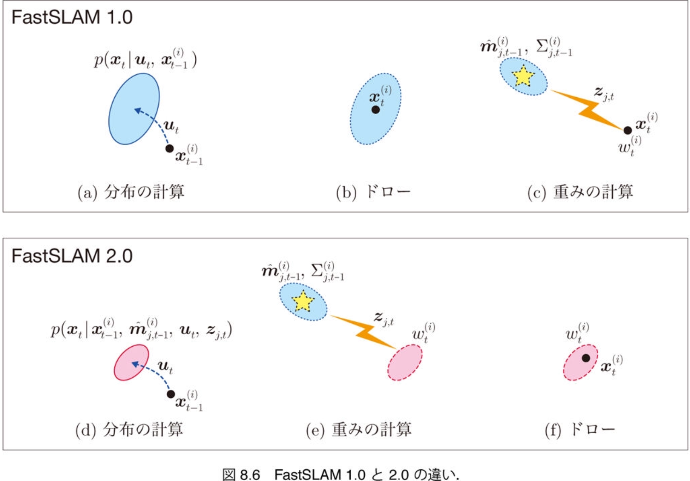

$\newcommand{\V}[1]{\boldsymbol{#1}}$

# 8. パーティクル フィルタによるSLAM（後半）

千葉工業大学 上田 隆一

This work is licensed under a <a rel="license" href="http://creativecommons.org/licenses/by-sa/4.0/">Creative Commons Attribution-ShareAlike 4.0 International License</a>.

---

## 8.6 FastSLAM 2.0

* いままでのFastSLAMの実装を工夫したバージョン
    * いままでのFastSLAMはFastSLAM 1.0と呼ばれる 　
* 工夫: パーティクルを状態遷移させる際、 センサ値も考慮
    * FastSLAM 1.0: そのまま$\V{x}\_t^{(i)} \sim p(\V{x} | \V{x}\_{t-1}^{(i)},\V{u}_t)$で遷移
    * FastSLAM 2.0: その先のセンサ値のリスト$\textbf{z}_t$まで考慮

なぜそうするのか？ 
とりあえず$\textbf{z}\_t$にセンサ値$\V{z}\_{j,t}$が1個だけ含まれるという仮定で説明します。

---

### センサ値まで考慮する効果

* より狭い分布$p(\V{x} | \V{x}\_{t-1}^{(i)}, \hat{\V{m}}\_{j,t-1} \V{u}\_t, \V{z}\_{j,t})$からドロー可能 
    * パーティクルが広く薄く分布されることを防ぐ
* ただし
    * どうやってこの分布を作るのか
    * 重みの計算方法が変わってしまう

---

## 8.6.1 センサ値を考慮したパーティクルの姿勢の更新

* パーティクルの移動に使う分布を導出
    * $p(\V{x}\_t | \V{x}^{(i)}\_{t-1}, \hat{\textbf{m}}^{(i)}\_{t-1}, \V{u}\_t, \V{z}\_{j,t})$ 
$ = \eta p( \V{z}\_{j,t} | \V{x}\_t, \V{x}^{(i)}\_{t-1}, \hat{\textbf{m}}^{(i)}\_{t-1}, \V{u}\_t) p(\V{x}\_t | \V{x}^{(i)}\_{t-1}, \hat{\textbf{m}}^{(i)}\_{t-1}, \V{u}\_t)$  
$ = \eta p( \V{z}\_{j,t} | \V{x}\_t, \hat{\textbf{m}}^{(i)}\_{t-1}) p(\V{x}\_t | \V{x}^{(i)}\_{t-1}, \V{u}\_t) $ 
$= \eta [\\![ p( \V{z}\_{j,t}, \V{m}\_j |\V{x}\_t, \hat{\V{m}}^{(i)}\_{j,t-1}, \Sigma\_{j,t-1}^{(i)}) ]\\!]\_{\V{m}\_j} \ p(\V{x}\_t | \V{x}^{(i)}\_{t-1}, \V{u}\_t)$ 
$= \eta [\\![ p( \V{z}\_{j,t}, |\V{x}\_t, \V{m}\_j, \hat{\V{m}}^{(i)}\_{j,t-1}, \Sigma\_{j,t-1}^{(i)}) p(\V{m}\_j | \V{x}\_t, \hat{\V{m}}^{(i)}\_{j,t-1}, \Sigma\_{j,t-1}^{(i)}) ]\\!]\_{\V{m}\_j} \ p(\V{x}\_t | \V{x}^{(i)}\_{t-1}, \V{u}\_t)$ 
$= \eta [\\![ p( \V{z}\_{j,t} | \V{x}\_t, \V{m}\_j) \mathcal{N}(\V{m}\_j | \hat{\V{m}}^{(i)}\_{j,t-1}, \Sigma\_{j,t-1}^{(i)}) ]\\!]\_{\V{m}\_j} p(\V{x}\_t | \V{x}^{(i)}\_{t-1}, \V{u}\_t) $ 
$= \eta \big\langle p( \V{z}\_{j,t} | \V{x}\_t, \V{m}\_j) \big\rangle\_{\mathcal{N}(\V{m}\_j | \hat{\V{m}}^{(i)}\_{j,t-1}, \Sigma\_{j,t-1}^{(i)}) } p(\V{x}\_t | \V{x}^{(i)}\_{t-1}, \V{u}\_t) $

状態遷移の密度関数に、ランドマークの推定位置から得られる$\V{x}_t$の尤度の期待値をかけた分布
