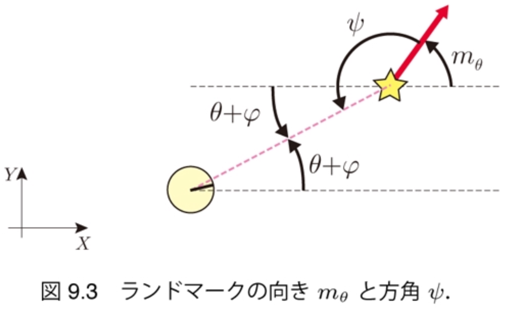
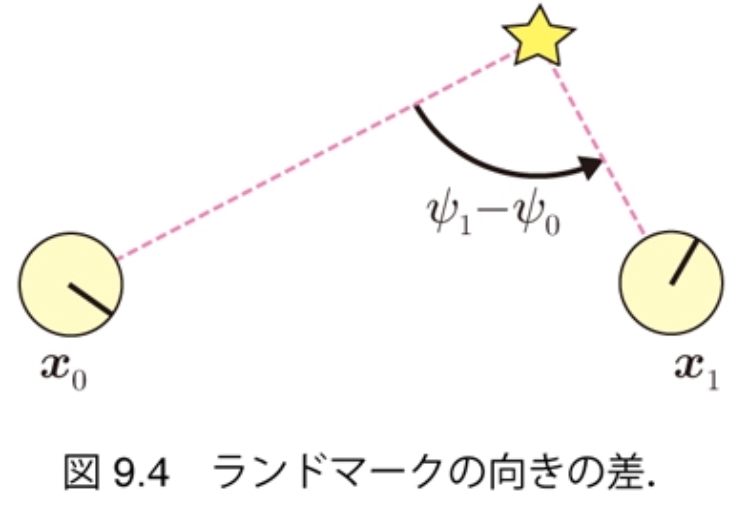

$\newcommand{\V}[1]{\boldsymbol{#1}}$

# 9. グラフ表現によるSLAM（前半）

千葉工業大学 上田 隆一

This work is licensed under a <a rel="license" href="http://creativecommons.org/licenses/by-sa/4.0/">Creative Commons Attribution-ShareAlike 4.0 International License</a>.

---

### グラフベースSLAM

* グラフ（グラフ理論のもの）を用いたSLAM
    * ノード（頂点）: ロボットの姿勢やランドマークの位置 
    * エッジ（辺）: ノードの相対位置情報
        * デッドレコニング、センサ値 

* グラフに「歪み」
    * エッジの相対位置情報が互いに矛盾
    * 歪みを最小化するようにノードを移動$\Longrightarrow$最尤な地図と軌跡

---

## 9.1 問題の定式化

* 8章のSLAMの式（少し改変）からスタート
    * $p(\V{x}\_{1:T}, \textbf{m} | \V{x}\_0, \V{u}\_{1:T}, \textbf{z}\_{0:T})$
        * $T$: ロボットが移動、観測を終了する時刻
        * $\textbf{z}_0$の存在を仮定（あとで不要に） 　
* FastSLAM同様、軌跡の分布と地図の分布に分離
    * $p(\V{x}\_{1:T}, \textbf{m} | \V{x}\_0, \V{u}\_{1:T}, \textbf{z}\_{0:T}) = p(\V{x}\_{1:T} | \V{x}\_0, \V{u}\_{1:T}, \textbf{z}\_{0:T}) p(\textbf{m} | \V{x}\_{0:T}, \textbf{z}\_{0:T}) $ 　
* FastSLAMと異なり、次の手順を踏む
    * $\V{x}\_{1:T}^\* = \text{argmax}\_{\V{x}\_{1:T}} p(\V{x}\_{1:T} | \V{x}\_0, \V{u}\_{1:T}, \textbf{z}\_{0:T})$で軌跡を算出
    * $\textbf{m}^\* = \text{argmax}\_{\textbf{m}} p(\textbf{m} | \V{x}\_0, \V{x}\_{1:T}^*, \textbf{z}\_{0:T})$で地図を算出

推定というより最適化

---

## 9.1.1 軌跡の算出問題

* 解く問題（「ポーズ調整」と呼ばれる）
    * $\V{x}\_{0:T}^\* = \text{argmax}\_{\V{x}\_{0:T}} p(\V{x}\_{0:T} | \hat{\V{x}}\_0, \V{u}\_{1:T}, \textbf{z}\_{0:T})$
        * 前ページと違って$\V{x}_0$を変数に
        * 条件にあった$\V{x}_0$は$\hat{\V{x}}_0$に
            * 下記のように初期値を条件とする
    * 初期値$\hat{\V{x}}\_{0:T}$を決めて$\V{x}\_{0:T}^\*$まで探索 　
* 初期値$\hat{\V{x}}\_{0:T}$の決め方
    * 雑音を考慮せず状態方程式で$\hat{\V{x}}\_{0:T}$を決める
    * 各初期値をノードに

---

### グラフの構成

* 位置情報で関係（拘束）のあるノードをエッジでつなぐ
    1. 時刻が前後するノードは状態方程式で互いに関係
        * 移動エッジ: $\text{e}\_{t\_1,t\_2} = (\hat{\V{x}}\_{t\_1}, \hat{\V{x}}\_{t\_2}, \V{u}\_{t\_2})$
            * $t_2 = t_1 + 1$
    2. 同じランドマークが観測された2姿勢はセンサ値を通じて互いに関係
        * 仮想移動エッジ: $\text{e}\_{j,t\_1,t\_2} = ( \hat{\V{x}}\_{t\_1}, \hat{\V{x}}\_{t\_2}, \V{z}\_{j, t\_1}, \V{z}\_{j, t\_2})$
            * 「仮想移動エッジ」というのはあくまで本書の呼び方です

---

### 残差と残差関数の準備（移動エッジ）

* 移動エッジの両端のノードを動かそうとすると状態遷移関数からずれる

* 現状のズレの量（残差と呼ぶ）
    * $\hat{\V{e}}\_{t\_1,t\_2} = \hat{\V{x}}\_{t\_2} - \V{f}(\hat{\V{x}}\_{t\_1},\V{u}\_{t_2})$
        * いまのところゼロ

* ノードを動かしたときのズレの量（残差関数と呼ぶ）
    * $\V{e}\_{t\_1,t\_2}(\V{x}\_{t\_1},\V{x}\_{t\_2}) = \V{x}\_{t\_2} - \V{f}(\V{x}\_{t\_1},\V{u}\_{t_2})$

---

### 残差と残差関数の準備 （仮想移動エッジ）

* 現状のズレの量（残差）
    * $\hat{\V{e}}\_{j, t\_1,t\_2} = \V{h}^{-1}(\hat{\V{x}}\_{t\_1}, \V{z}\_{j,t\_1}) - \V{h}^{-1}(\hat{\V{x}}\_{t\_2}, \V{z}\_{j,t\_2})$
        * $\V{h}^{-1}$は姿勢とセンサ値からランドマークの位置を計算する関数 　
* ノードを動かしたときのズレの量（残差関数）
    * $\V{e}\_{j, t\_1,t\_2} = \V{h}^{-1}(\V{x}\_{t\_1}, \V{z}\_{j,t\_1}) - \V{h}^{-1}(\V{x}\_{t\_2}, \V{z}\_{j,t\_2})$ 　
* ズレが大きいほど歪む
    * しかし、残差は起こりやすいものと起こりにくいものがあるので均一に小さくすればよいわけではない

---

### 残差の確率モデルの準備

* 次のような分布で残差の発生しやすさを考える
    * $p(\V{e}) = \mathcal{N}(\V{e} | \V{0}, \Omega\_\text{e}^{-1}) = \eta \exp \left( -\dfrac{1}{2} \V{e}^\top \Omega\_{\text{e}} \V{e} \right)$
        * $\V{e}$: 移動エッジまたは仮想移動エッジの残差関数の値
        * $\Omega\_\text{e}$: 残差に関する精度行列 　
* $p(\V{e})$の性質（具体的な計算は9.2.4項で）
    * 例えばセンサ値の距離が大きいと$\V{e}$が大きくても$p(\V{e})$の値は小さくならない

残差の最小化ではなく全エッジの$p(\V{e})$の最大化を目標にノードを移動するとよい

---

### 最適化問題を作る

* 前ページの分布の掛け算で評価関数を作る
    * $f( \V{x}\_{0:T}) = p_0(\V{x}\_0)\big\\{ \prod\_{\textbf{e}\_\textbf{z} } p(\V{e}\_{j,t\_1,t\_2}) \big\\} \big\\{ \prod\_{ \textbf{e}\_\textbf{x} } p(\V{e}\_{t\_1,t\_2}) \big\\}^\lambda$
        * $\textbf{e}\_\textbf{z}$: 全仮想移動エッジ
        * $\textbf{e}\_\textbf{x}$: 全移動エッジ
        * $p_0(\V{x}\_0)$は$\hat{\V{x}}\_0$まわりの鋭いガウス分布
            * $\V{x}を\hat{\V{x}}\_0$から動かすと大きなペナルティーを与えて座標系を固定
        * $\lambda$: 移動エッジをどれだけ重視するか決める定数（当面$\lambda = 1$） 　
* 対数をとって整理すると次のような問題に
    * $\V{x}\_{0:T}^\* = \text{argmin}\_{\V{x}\_{0:T}} J(\V{x}\_{0:T})$
        * ここで
            * $J(\V{x}\_{0:T}) = (\V{x}\_{0} - \hat{\V{x}}\_0)^\top \Omega\_0 (\V{x}\_{0} - \hat{\V{x}}\_0) + J\_\textbf{z}(\V{x}\_{0:T}) + \lambda J\_\textbf{x}(\V{x}\_{0:T})$
                * $J\_\textbf{z}(\V{x}\_{0:T}) =  \sum\_{\textbf{e}\_\textbf{z}} \left\\{\V{e}\_{j,t\_1,t\_2}(\V{x}\_{t\_1},\V{x}\_{t\_2})\right\\}^\top \Omega\_{j,t\_1,t\_2} \left\\{ \V{e}\_{j,t\_1,t\_2}(\V{x}\_{t\_1},\V{x}\_{t\_2})\right\\}$
                * $J\_\textbf{x}(\V{x}\_{0:T}) =  \sum\_{\textbf{e}\_\textbf{x}} \left\\{\V{e}\_{t\_1,t\_2}(\V{x}\_{t\_1},\V{x}\_{t\_2})\right\\}^\top \Omega\_{t\_1,t\_2} \left\\{ \V{e}\_{t\_1,t\_2}(\V{x}\_{t\_1},\V{x}\_{t\_2})\right\\}$

---

### マハラノビス距離

* 前ページの$J$の式に出てきた$\V{e}^\top \Omega \V{e}$の値の平方根
    * $\sqrt{\V{e}^\top \Omega \V{e}}$
* $\V{e}^\top \V{e}$: 誤差の内積 $=$ 変数の誤差の二乗和
* $\V{e}^\top \Omega \V{e}$: 精度行列をはさんだ誤差の二乗和
    * $\V{e}$の各変数の重みが変わる
    * 確率的に起こりにくい誤差ほど大きく評価される 　
* 前ページの最適化問題: マハラノビス距離の二乗和を最小化する問題

---

## 9.1.2 地図の算出問題

* $\V{x}\_{0:T}^\*$を使って各ランドマーク$\text{m}_j$の位置$\V{m}_j$を求める
    * 各ランドマーク$\text{m}_j$に対して独立に計算可能 　
* 手続き
     1. $\text{m}_j$が観測された各姿勢と$\text{m}_j$を結んでエッジとする
        * エッジの集合を$\textbf{I}\_{\V{z}\_j}$とする
     2. 残差関数と残差の分布、分布の積を考える
        * 残差関数: $\V{e}\_{j,t}(\V{m}\_j) = \V{m}\_j - \V{h}^{-1}(\V{x}\_t^\*, \V{z}\_{j,t})$
        * 残差の分布: $p\_{j,t}(\V{e}\_{j,t}) = \eta \exp \left(-\dfrac{1}{2} \V{e}\_{j,t}^\top \Omega\_{j,t} \V{e}\_{j,t} \right)$
        * 分布の積: $f(\V{m}\_j ) = \prod\_{\textbf{I}\_{\V{z}\_j}} p\_{j,t}(\V{e}\_{j,t})$
     3. 分布の積の対数から作った最適化の問題を解く
        *  $\V{m}\_j^\* = \text{argmin}\_{\V{m}\_j} \sum\_{\textbf{I}\_{\V{z}\_j}} \{\V{e}\_{j,t}(\V{m}\_j)\}^\top \Omega\_{j,t} \{\V{e}\_{j,t}(\V{m}\_j)\}$

---

## 9.2 仮想移動エッジによる軌跡の算出

* やること
    * 仮想移動エッジだけでポーズ調整 　
* 解く式
    * $\V{x}\_{0:T}^\* = \text{argmin}\_{\V{x}\_{0:T}} \left\\{ (\V{x}\_{0} - \hat{\V{x}}\_0)^\top \Omega\_0 (\V{x}\_{0} - \hat{\V{x}}\_0)  \\\\ +  \sum\_{\textbf{e}\_\textbf{z}} \left[ \V{e}\_{j,t\_1,t\_2}(\V{x}\_{t\_1},\V{x}\_{t\_2})\right]^\top \Omega\_{j,t\_1,t\_2} \left[ \V{e}\_{j,t\_1,t\_2}(\V{x}\_{t\_1},\V{x}\_{t\_2})\right]\right\\}$
        * 第一項: $\V{x}_0$を固定
        * 第二項: 仮想移動エッジの歪みの評価

---

## 9.2.1 ログの記録と初期化

* その前に、問題を易しくしておく
    * $\V{m}$を「ランドマークの姿勢」として3次元ベクトルに（左図）
        * 移動エッジを使わない場合、センサ値の次元が足りないので
            * あとで2次元に戻す
        * $\V{m} = (m_x \  m_y \ m_\theta)^\top$
            * $m_\theta$: ランドマークの方角
        * $\V{z} = (\ell \ \varphi \ \psi)^\top$
            * $\psi$: ランドマークのどのツラを見ているかを表す角度

    * 最終的には2姿勢間の$\psi$の相対値だけ必要になる（右図）

---

### 記録された軌跡とセンサ値

* シミュレータのロボットを動かして$\hat{\V{x}}\_{0:T}$と$\textbf{z}\_{0:T}$を記録
    * $\hat{\V{x}}\_{0:T}$は状態遷移関数を信じて記録
    * 結果、$\hat{\V{x}}\_{0:T}$が実際とずれており、センサ値が指し示すランドマークの位置もばらばらに

---

## 9.2.2 仮想移動エッジの作成

* 実装なので割愛

---

## 9.2.3 残差の計算

* 残差: エッジの両側の姿勢から計算されるランドマークの姿勢の差
    * $\hat{\boldsymbol{e}}\_{j,t\_1,t\_2} = \begin{pmatrix} \hat{x}\_{t\_2} + \ell\_{j,t\_2}\cos (\hat{\theta}\_{t\_2} + \varphi\_{j,t\_2})  \\\\ \hat{y}\_{t\_2} + \ell\_{j,t\_2}\sin (\hat{\theta}\_{t\_2} + \varphi\_{j,t\_2})  \\\\ \hat{\theta}\_{t\_2} + \varphi\_{j,t\_2} - \psi\_{j,t\_2} \end{pmatrix} - \begin{pmatrix} \hat{x}\_{t\_1} + \ell\_{j,t\_1}\cos (\hat{\theta}\_{t\_1} + \varphi\_{j,t\_1}) \\\\ \hat{y}\_{t\_1} + \ell\_{j,t\_1}\sin (\hat{\theta}\_{t\_1} + \varphi\_{j,t\_1}) \\\\ \hat{\theta}\_{t\_1} + \varphi\_{j,t\_1} - \psi\_{j,t\_1} \end{pmatrix}$
        * ただし$\theta$成分は$[-\pi,\pi)$の範囲に正規化
* 残差関数
    * $\boldsymbol{e}\_{j,t\_1,t\_2}(\boldsymbol{x}\_{t\_1}, \boldsymbol{x}\_{t\_2}) = \begin{pmatrix} {x}\_{t\_2} + \ell\_{j,t\_2}\cos ({\theta}\_{t\_2} + \varphi\_{j,t\_2}) \\\\ {y}\_{t\_2} + \ell\_{j,t\_2}\sin ({\theta}\_{t\_2} + \varphi\_{j,t\_2}) \\\\ {\theta}\_{t\_2} + \varphi\_{j,t\_2} - \psi\_{j,t\_2} \end{pmatrix} - \begin{pmatrix} {x}\_{t\_1} + \ell\_{j,t\_1}\cos ({\theta}\_{t\_1} + \varphi\_{j,t\_1}) \\\\ {y}\_{t\_1} + \ell\_{j,t\_1}\sin ({\theta}\_{t\_1} + \varphi\_{j,t\_1}) \\\\ {\theta}\_{t\_1} + \varphi\_{j,t\_1} - \psi\_{j,t\_1} \end{pmatrix}$

---

## 9.2.4 マハラノビス距離を決める精度行列の導出

* ノード$\text{e}\_{j,t\_1,t\_2}$の$\Omega\_{j,t\_1,t\_2}$を求めましょう
    * センサ値$\V{z}\_{t\_1}, \V{z}\_{t\_2}$の分布$\ell\varphi\psi$空間を残差の$XY\theta$空間に写像 　
* 求めかた
    * 写像につかう関数: センサ値を変数とした残差（前ページの上の式）の関数$\hat{\boldsymbol{e}}\_{j,t\_1,t\_2}(\boldsymbol{z}\_a, \boldsymbol{z}\_b)$を線形化したもの
        * $\hat{\boldsymbol{e}}\_{j,t\_1,t\_2}(\boldsymbol{z}\_a, \boldsymbol{z}\_b) \approx \hat{\boldsymbol{e}}\_{j,t\_1,t\_2}( \boldsymbol{z}\_{t\_1}, \boldsymbol{z}\_{t\_2}) + R\_{j,t\_1} (\boldsymbol{z}\_{j,a} - \boldsymbol{z}\_{j,t\_1} ) + R\_{j,t\_2} (\boldsymbol{z}\_{j,b} - \boldsymbol{z}\_{j,t\_2} )$
            * $R_{j,t}$: $\hat{\boldsymbol{e}}\_{j,t\_1,t\_2}$を$\V{z}_{j,t}$まわりで偏微分したヤコビ行列
    * 写像する分布: $\mathcal{N}(\V{z}\_{t\_1}, Q\_{j,t\_1}), \mathcal{N}(\V{z}\_{t\_2}, Q\_{j,t\_2})$
        * $Q_{j,t} = \begin{pmatrix} (\ell_{j,t} \sigma_\ell)^2 & 0 & 0\\\\ 0 & \sigma_\varphi^2 & 0 \\\\ 0 & 0 & \sigma_\psi^2 \end{pmatrix}$

---

### 結果

* $\Omega_{j,t_1,t_2}^{-1} = R_{j,t_1} Q_{j,t_1} R_{j,t_1}^\top + R_{j,t_1} Q_{j,t_2} R_{j,t_1}^\top$
    * ここで
        * $R\_{j,t\_1} = - \begin{pmatrix} \cos(\hat{\theta}\_{t\_1} + \varphi\_{t\_1}) & -\ell\_{j,t\_1}\sin(\hat{\theta}\_{t\_1} + \varphi\_{t\_1}) & 0\\\\ \sin(\hat{\theta}\_{t\_1} + \varphi\_{t\_1}) & \ell\_{j,t\_1}\cos(\hat{\theta}\_{t\_1} + \varphi\_{t\_1}) & 0\\\\ 0 & 1 & -1 \end{pmatrix}$
        * $R\_{j,t\_2} = \begin{pmatrix} \cos(\hat{\theta}\_{t\_2} + \varphi\_{t\_2}) & -\ell\_{j,t\_2}\sin(\hat{\theta}\_{t\_2} + \varphi\_{t\_2}) & 0\\\\ \sin(\hat{\theta}\_{t\_2} + \varphi\_{t\_2}) & \ell\_{j,t\_2}\cos(\hat{\theta}\_{t\_2} + \varphi\_{t\_2}) & 0\\\\ 0 & 1 & -1 \end{pmatrix}$

---

## 9.2.5 

* 

