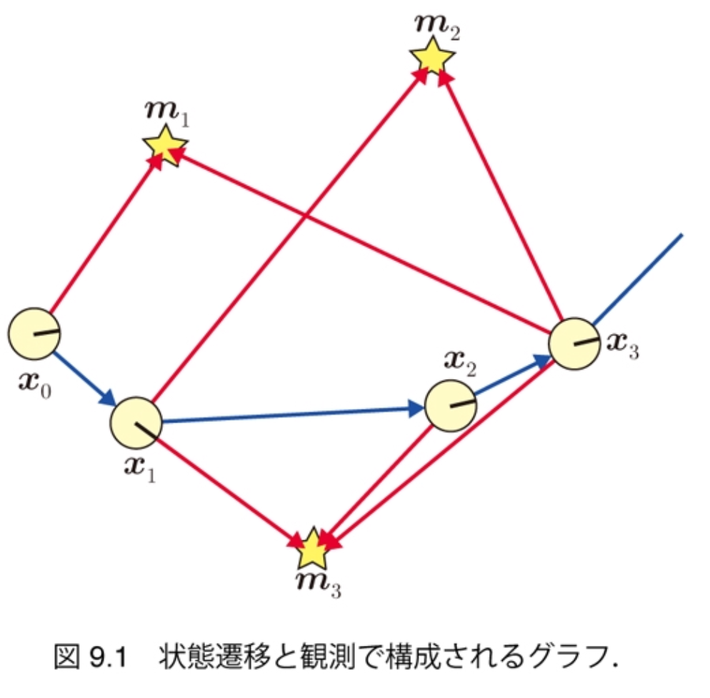
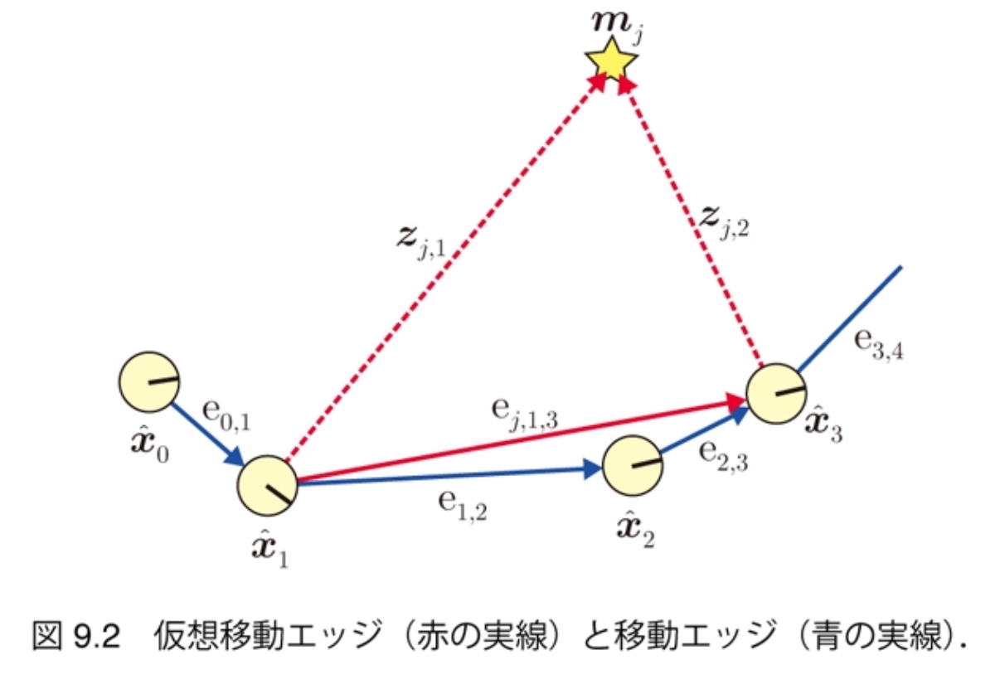

$\newcommand{\V}[1]{\boldsymbol{#1}}$

# 9. グラフ表現によるSLAM（前半）

千葉工業大学 上田 隆一

This work is licensed under a <a rel="license" href="http://creativecommons.org/licenses/by-sa/4.0/">Creative Commons Attribution-ShareAlike 4.0 International License</a>.

---

### グラフベースSLAM

* グラフ（グラフ理論のもの）を用いたSLAM
    * ノード（頂点）: ロボットの姿勢やランドマークの位置 
    * エッジ（辺）: ノードの相対位置情報
        * デッドレコニング、センサ値 

* グラフに「歪み」
    * エッジの相対位置情報が互いに矛盾
    * 歪みを最小化するようにノードを移動$\Longrightarrow$最尤な地図と軌跡

---

## 9.1 問題の定式化

* 8章のSLAMの式（少し改変）からスタート
    * $p(\V{x}\_{1:T}, \textbf{m} | \V{x}\_0, \V{u}\_{1:T}, \textbf{z}\_{0:T})$
        * $T$: ロボットが移動、観測を終了する時刻
        * $\textbf{z}_0$の存在を仮定（あとで不要に） 　
* FastSLAM同様、軌跡の分布と地図の分布に分離
    * $p(\boldsymbol{x}\_{1:T}, \textbf{m} | \boldsymbol{x}\_0, \boldsymbol{u}\_{1:T}, \textbf{z}\_{0:T}) = p(\boldsymbol{x}\_{1:T} | \boldsymbol{x}\_0, \boldsymbol{u}\_{1:T}, \textbf{z}\_{0:T}) p(\textbf{m} | \boldsymbol{x}\_{0:T}, \textbf{z}\_{0:T}) $ 　
* FastSLAMと異なり、次の手順を踏む
    * $\boldsymbol{x}\_{1:T}^\* = \text{argmax}\_{\boldsymbol{x}\_{1:T}} p(\boldsymbol{x}\_{1:T} | \boldsymbol{x}\_0, \boldsymbol{u}\_{1:T}, \textbf{z}\_{0:T})$で軌跡を算出
    * $\textbf{m}^\* = \text{argmax}\_{\textbf{m}} p(\textbf{m} | \V{x}\_0, \boldsymbol{x}\_{1:T}^*, \textbf{z}\_{0:T})$で地図を算出

推定というより最適化

---

## 9.1.1 軌跡の算出問題

* 解く問題（「ポーズ調整」と呼ばれる）
    * $\boldsymbol{x}\_{0:T}^\* = \text{argmax}\_{\boldsymbol{x}\_{0:T}} p(\boldsymbol{x}\_{0:T} | \hat{\boldsymbol{x}}\_0, \boldsymbol{u}\_{1:T}, \textbf{z}\_{0:T})$
        * 前ページと違って$\V{x}_0$を変数に
        * 条件にあった$\V{x}_0$は$\hat{\V{x}}_0$に
            * 下記のように初期値を条件とする
    * 初期値$\hat{\boldsymbol{x}}\_{0:T}$を決めて$\boldsymbol{x}\_{0:T}^\*$まで探索 　
* 初期値$\hat{\boldsymbol{x}}\_{0:T}$の決め方
    * 雑音を考慮せず状態方程式で$\hat{\boldsymbol{x}}\_{0:T}$を決める
    * 各初期値をノードに

---

### グラフの構成

* 位置情報で関係（拘束）のあるノードをエッジでつなぐ
    1. 時刻が前後するノードは状態方程式で互いに関係
        * 移動エッジ: $\text{e}\_{t\_1,t\_2} = (\hat{\boldsymbol{x}}\_{t\_1}, \hat{\boldsymbol{x}}\_{t\_2}, \boldsymbol{u}\_{t\_2})$
    2. 同じランドマークが観測された2姿勢はセンサ値を通じて互いに関係
        * 仮想移動エッジ: $\text{e}\_{j,t\_1,t\_2} = ( \hat{\boldsymbol{x}}\_{t\_1}, \hat{\boldsymbol{x}}\_{t\_2}, \boldsymbol{z}\_{j, t\_1}, \boldsymbol{z}\_{j, t\_2})$
            * 「仮想移動エッジ」というのはあくまで本書の呼び方です

