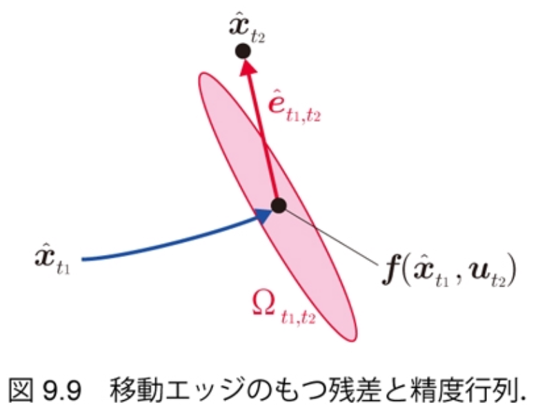
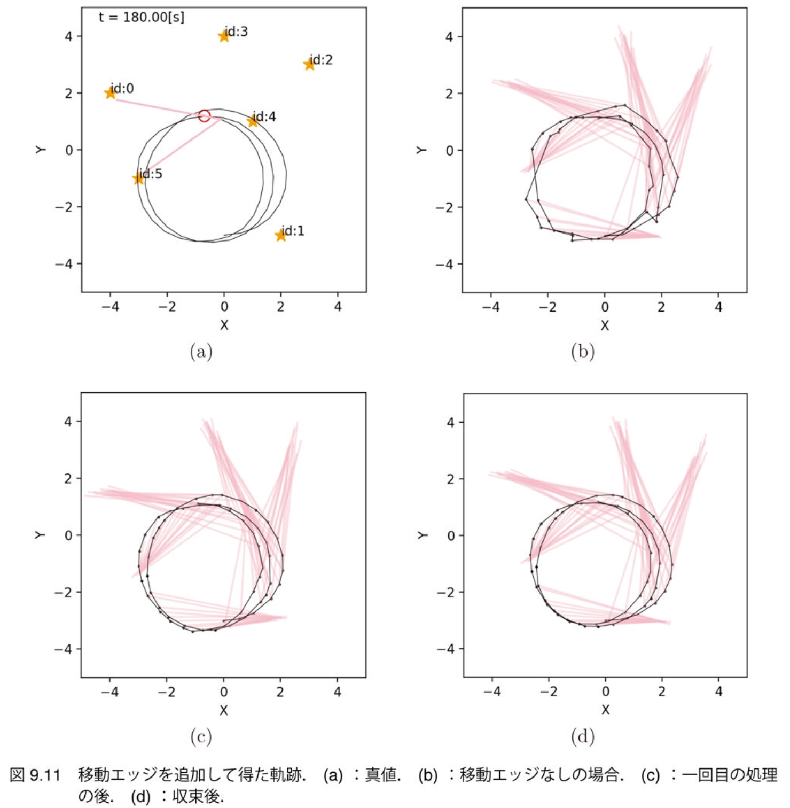
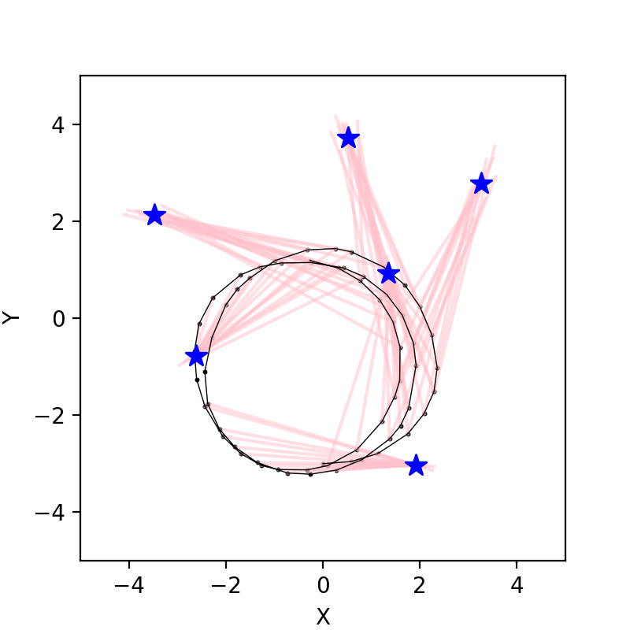
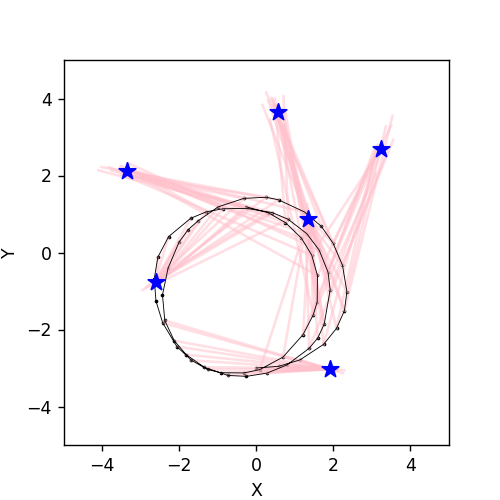
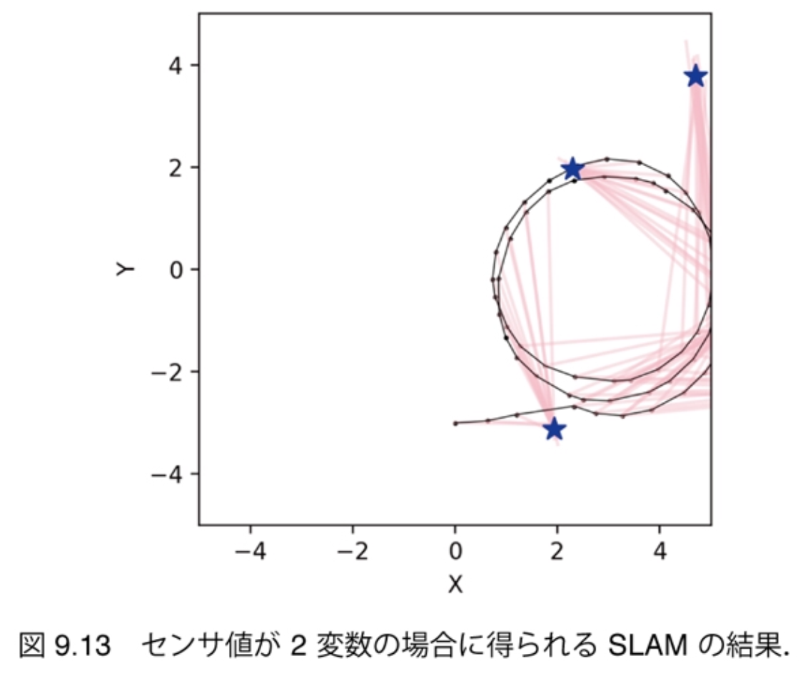
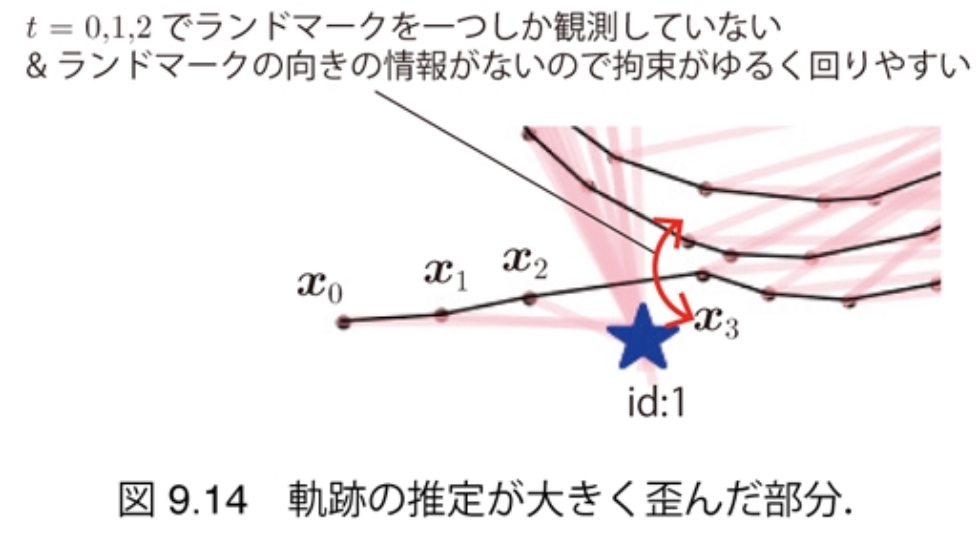
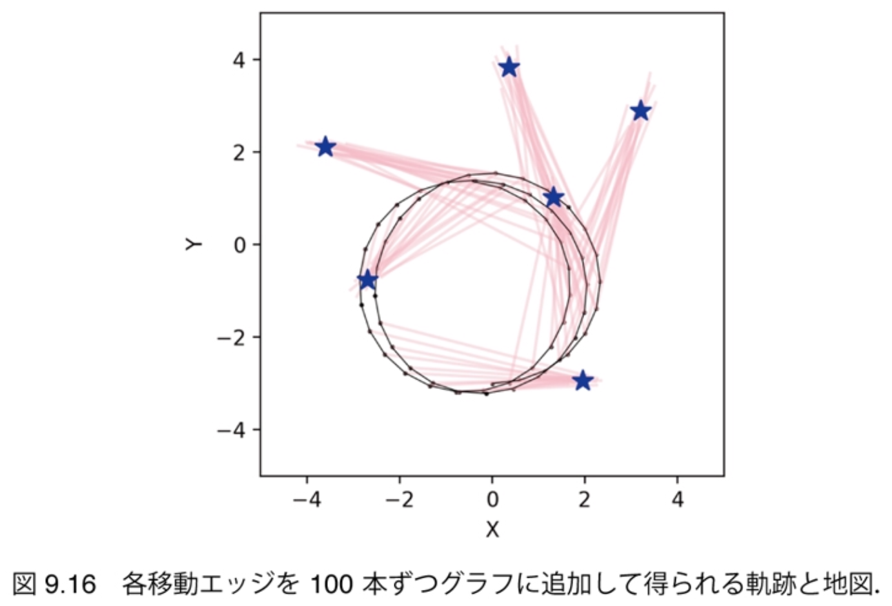

$\newcommand{\V}[1]{\boldsymbol{#1}}$

# 9. グラフ表現によるSLAM（後半）

千葉工業大学 上田 隆一

This work is licensed under a <a rel="license" href="http://creativecommons.org/licenses/by-sa/4.0/">Creative Commons Attribution-ShareAlike 4.0 International License</a>.

---

## 9.3 移動エッジの追加

* やること
    * 移動エッジの情報を$\Omega$、$\V{\xi}$に追加
         * 手順は仮想移動エッジとほぼ同じ
         * ノードをずらしたときのマハラノビス距離の変化（精度行列）を計算し、変数$\V{x}\_{0:T}$で表された最適化の式を線形近似して$\Delta\V{x}\_{[0:T]}$の二次式に

---

## 9.3.1 移動エッジと残差

* 移動エッジの残差、残差関数
    * $\hat{\boldsymbol{e}}\_{t\_1,t\_2} = \hat{\boldsymbol{x}}\_{t\_2} - \boldsymbol{f}(\hat{\boldsymbol{x}}\_{t\_1}, \boldsymbol{u}\_{t\_2})$
    * 下図: ノード、状態遷移関数、残差、残差の精度行列の関係 
 
        * $\Omega_{t_1,t_2}$は状態遷移で期待される雑音の分布から作成
* 残差関数
    * $\boldsymbol{e}\_{t\_1,t\_2}(\Delta \boldsymbol{x}\_{t\_1}, \Delta\boldsymbol{x}\_{t\_2}) = \hat{\boldsymbol{x}}\_{t\_2} + \Delta\boldsymbol{x}\_{t\_2} - \boldsymbol{f}(\hat{\boldsymbol{x}}\_{t\_1} + \Delta\boldsymbol{x}\_{t\_1}, \boldsymbol{u}\_{t\_2})$
        * 最適化の式を線形化するときに、この式を線形化

---

## 9.3.2 ログの追加

* 作業 
    * 今度は観測のない姿勢も扱えるのでログに記録
    * 制御指令、制御の周期も利用するので記録

---

## 9.3.3 残差の確率モデルの構築

* カルマンフィルタのときと同じ
    * $\V{u}\_{t\_2}$で移動したときの移動後の姿勢の不確かさの共分散行列: 
    $R\_{t\_1,t\_2} = A\_{t\_2}M\_{t\_2}A\_{t\_2}^\top$
        * $M\_{t\_2}$: $\nu\omega$空間での動きの不確かさの共分散行列
        * $A\_{t\_2}$: $M\_{t\_2}$を$XY\theta$空間に写像するためのヤコビ行列
            * $\V{u}\_{t\_2}$まわりで偏微分 　
* 異なる点
    * 情報行列$\Omega\_{t\_1,t\_2} = R\_{t\_1,t\_2}^{-1}$を作らないといけないが、$R\_{t\_1,t\_2}$に逆行列がない
        * 共分散行列の対角成分を少し水増し
            * $R\_{t\_1,t\_2} = A\_{t\_2}M\_{t\_2}A\_{t\_2}^\top + \zeta I$
            * 少し情報を捨てることになる

---

## 9.3.4 グラフの精度行列と係数ベクトルに足す値の計算

* 評価関数$J\_\textbf{x}(\V{x}\_{0:T})$を線形化して$\Delta\V{x}\_{[0:t]}$の多項式に
    * $J\_\textbf{x}(\V{x}\_{0:T}) =  \sum\_{\textbf{e}\_\textbf{x}} \left\\{\V{e}\_{t\_1,t\_2}(\V{x}\_{t\_1},\V{x}\_{t\_2})\right\\}^\top \Omega\_{t\_1,t\_2} \left\\{ \V{e}\_{t\_1,t\_2}(\V{x}\_{t\_1},\V{x}\_{t\_2})\right\\}$ 　
* 残差関数の線形化
    * $\V{e}\_{t\_1,t\_2}(\Delta \V{x}\_{t\_1},\Delta \V{x}\_{t\_2}) \approx \hat{\V{x}}\_{t\_2} - \V{f}(\hat{\V{x}}\_{t\_1}, \V{u}\_{t\_2}) + \Delta \V{x}\_{t\_2} - F\_{t\_1,t\_2} \Delta \V{x}\_{t\_1}$
        * $F\_{t\_1,t\_2} = \frac{\partial \V{f}}{\partial \V{x}\_{t\_1}}\Big|\_{\V{x}\_{t\_1} = \hat{\V{x}}\_{t\_1}}$
    * これで$J\_\textbf{x}$が$\Delta\V{x}\_{0:T}$を変数とする多項式に

これを$\Delta\V{x}\_{[0:T]}$を変数にしてまとめる

---

### 各エッジの精度行列と係数ベクトル

* $\boldsymbol{x}\_{t\_1}$と$\boldsymbol{x}\_{t\_2}$に関する項の係数をまとめたもの: 
    * $\Omega^\*\_{\boldsymbol{x}\_{t\_1},\boldsymbol{x}\_{t\_2}} = \begin{pmatrix} \ddots &   &  &  \\\\ & F\_{t\_1,t\_2}^\top\Omega\_{t\_1,t\_2}F\_{t\_1,t\_2} & -F\_{t\_1,t\_2}^\top\Omega\_{t\_1,t\_2} &  \\\\ & -\Omega\_{t\_1,t\_2}F\_{t\_1,t\_2} &  \Omega\_{t\_1,t\_2} &  \\\\ & & & \ddots \end{pmatrix}$
    * $\xi^*\_{\boldsymbol{x}\_{t\_1},\boldsymbol{x}\_{t\_2}} = - \begin{pmatrix} \vdots \\\\ -F\_{t\_1,t\_2}^\top \\\\ I \\\\ \vdots \end{pmatrix} \Omega\_{t\_1,t\_2} \left\\{ \hat{\boldsymbol{x}}\_{t\_2} - \boldsymbol{f}(\hat{\boldsymbol{x}}\_{t\_1}, \boldsymbol{u}\_{t\_2}) \right\\}$

これを仮想移動エッジから計算した $\Omega, \V{\xi}$に追加（単純に足す）

---

## 9.3.5 移動エッジによる 処理の実装

* 軌跡の推定がなめらかに
    * 仮想移動エッジがノード をひっぱって歪めた軌跡 を移動エッジが引っ張り 戻す 　 　 　 　 　 　 　

---

## 9.4 地図の推定

* やること
    * 求めた軌跡$\V{x}^*\_{0:T}$とセンサ値$\textbf{z}\_{0:T}$から各ランドマークの姿勢$\V{m}\_j = (m\_{j,x}\ m\_{j,y}\ m\_{j,\theta})^\top$を求める

---

## 9.4.1 ランドマークの姿勢の計算と描画

* 事前準備
    * 時刻$t$のセンサ値から計算されるランドマークの向き$m\_{j,\theta,t}$を、最初に時刻$s$にランドマーク$\text{m}\_j$を見たときとの相対値で表現
        * $m_{j,\theta_,t} = (\theta_t + \varphi_{j,t} - \psi_{j,t} + \pi) - (\theta_s + \varphi_{j,s} - \psi_{j,s} + \pi)  \\\\ = \theta_t - \theta_s + \varphi_{j,t} - \varphi_{j,s} - \psi_{j,t} + \psi_{j,s}$ 
            * $\V{m}\_j = (m\_{j,x}\ m\_{j,y}\ m\_{j,\theta})^\top$の$m\_{j,\theta}$の原点を決めていないので、この表現が必要

---

### ランドマークの姿勢の暫定値

* 各センサ値から計算されるランドマークの姿勢
    * $\V{m}\_{j,t} = \begin{pmatrix} x\_t^* + \ell\_{j,t}\cos (\theta\_t^* + \varphi\_{j,t}) \\\\ y\_t^* + \ell\_{j,t\_1}\sin (\theta\_t^* + \varphi\_{j,t}) \\\\ \theta\_t^* - \theta\_s^* + \varphi\_{j,t} - \varphi\_{j,s} - \psi\_{j,t} + \psi\_{j,s} \end{pmatrix}$
* これを単純に平均すると次のように地図が描ける
    * これでもよいが、マハラノビス距離を使ったほうがより良い

---

## 9.4.2 最小二乗問題の 構築と実装

* ある推定値$\V{m}\_j$、センサ値から計算される姿勢$\V{m}\_{j,t}$間の残差関数の定義
    * $\boldsymbol{e}\_t(\boldsymbol{m}\_j) = \boldsymbol{m}\_j - \boldsymbol{m}\_{j,t} = \boldsymbol{m}\_j - \boldsymbol{x}\_t^\* - \begin{pmatrix} \ell\_{j,t}\cos (\theta\_t^\* + \varphi\_{j,t}) \\\\ \ell\_{j,t}\sin (\theta\_t^\* + \varphi\_{j,t}) \\\\ - \theta\_s^\* + \varphi\_{j,t} - \varphi\_{j,s} - \psi\_{j,t} + \psi\_{j,s} \end{pmatrix}$
* これをセンサ値$\V{z}_{j,t}$まわりで線形化
    * $\boldsymbol{e}\_t(\boldsymbol{z}) \approx \boldsymbol{m}\_j - \boldsymbol{m}\_{j,t} + R\_{j,t} (\boldsymbol{z} - \boldsymbol{z}\_{j,t})$
        * $R\_{j,t} = \begin{pmatrix} -\cos (\theta\_t^* + \varphi\_{j,t}) & \ell\_{j,t}\sin (\theta\_t^* + \varphi\_{j,t}) & 0\\\\ -\sin (\theta\_t^* + \varphi\_{j,t}) & -\ell\_{j,t}\cos (\theta\_t^* + \varphi\_{j,t}) & 0 \\\\ 0 & -1 & 1 \end{pmatrix}$ $ $

---

### 評価関数の定義

* $J\_{\boldsymbol{m}\_j}(\boldsymbol{m}\_j) = \sum\_{t \in \textbf{I}\_{\V{z}}} (\boldsymbol{m}\_j  - \boldsymbol{m}\_{j,t})^\top \Omega\_{j,t} (\boldsymbol{m}\_j  - \boldsymbol{m}\_{j,t})$
    * $\textbf{I}_{\V{z}}$: $\text{m}_j$の観測があった時刻の集合
    * $\Omega_{j,t} = R_{j,t}Q_{j,t}R_{j,t}^\top$
        * センサ値の不確かさの共分散行列を前ページの$R_{j,t}$で$XY\theta$空間に写像 　
* これに上で線形化した式を代入し、$\V{m}_j$の二次形式に
    * 最初から線形な式なので、そのまま各項の行列等を足し算
    * 求まる情報行列と係数ベクトル
        * $\Omega\_j = \sum\_{t \in \textbf{I}\_{\boldsymbol{z}}} \Omega\_{j,t}$
        * $\boldsymbol{\xi}\_j = \sum\_{t \in \textbf{I}\_{\boldsymbol{z}}} \Omega\_{j,t}\boldsymbol{m}\_{j,t}$
    * 求まるランドマークの姿勢: $\boldsymbol{m}\_j^* = \Omega\_j^{-1}\boldsymbol{\xi}\_j$

---

### 得られる地図

* 実はスライド11ページ目の地図とほとんど変わらないが、$\ell$の小さいセンサ値がより大きな重みを持つ

---

## 9.5 センサ値が2変数の場合

* 移動エッジがあれば仮想移動エッジの残差の次元が3である必要がない 　
* やること
    * $\psi$に関する行列の要素を除去
    * うまくいかなくなるので調整

---

## 9.5.1 センサ値を2変数に戻す

* $\psi$に関する行列の要素を除去していく
    * 残差関数
        * $\V{e}\_{j,t\_1,t\_2}(\V{x}\_{t\_1}, \V{x}\_{t\_2}) = \begin{pmatrix} {x}\_{t\_2} + \ell\_{j,t\_2}\cos ({\theta}\_{t\_2} + \varphi\_{j,t\_2}) \\\\ {y}\_{t\_2} + \ell\_{j,t\_2}\sin ({\theta}\_{t\_2} + \varphi\_{j,t\_2}) \end{pmatrix} - \begin{pmatrix} {x}\_{t\_1} + \ell\_{j,t\_1}\cos ({\theta}\_{t\_1} + \varphi\_{j,t\_1}) \\\\ {y}\_{t\_1} + \ell\_{j,t\_1}\sin ({\theta}\_{t\_1} + \varphi\_{j,t\_1}) \end{pmatrix}$ 　
    * $\V{z}$の$\ell\varphi$空間を$\V{m}$の$XY$平面に映すヤコビ行列
        * $R\_{j,t\_1} = \dfrac{\partial \hat{\V{e}}\_{j,t\_1,t\_2}} {\partial \V{z}\_{j,a}} \Big|\_{\V{z}\_{j,a} = \V{z}\_{j,t\_1}} = - \begin{pmatrix} \cos(\hat{\theta}\_{t\_1} + \varphi\_{t\_1}) & -\ell\_{j,t\_1}\sin(\hat{\theta}\_{t\_1} + \varphi\_{t\_1})\\\\ \sin(\hat{\theta}\_{t\_1} + \varphi\_{t\_1}) & \ell\_{j,t\_1}\cos(\hat{\theta}\_{t\_1} + \varphi\_{t\_1}) \end{pmatrix}$
            * $R\_{j,t\_2}$は上の式の$1$を$2$に入れ替えたもの 　
    * $J\_\textbf{z}(\V{x}\_{0:T})$を$\V{x}$の多項式に近似するためのヤコビ行列
        * （参考）$J\_\textbf{z}(\V{x}\_{0:T}) =  \sum\_{\textbf{e}\_\textbf{z}} \left\\{\V{e}\_{j,t\_1,t\_2}(\V{x}\_{t\_1},\V{x}\_{t\_2})\right\\}^\top \Omega\_{j,t\_1,t\_2} \left\\{ \V{e}\_{j,t\_1,t\_2}(\V{x}\_{t\_1},\V{x}\_{t\_2})\right\\}$
        * $B_{j,t_1} = - \begin{pmatrix} 1 & 0 & -\ell_{j,t_1} \sin(\theta_{t_1} + \varphi_{j,t_1}) \\\\ 0 & 1 & \ell_{j,t_1} \cos(\theta_{t_1} + \varphi_{j,t_1}) \end{pmatrix}$
            * $B\_{j,t\_2}$は上の式の$1$を$2$に入れ替えたもの
            * このヤコビ行列で3次元の$\V{x}$が二次元の$\V{e}$に

---

### グラフの精度行列と係数ベクトルに 足す値

* センサ値を2次元にしても同じ
    * $\Omega^*\_{j,t_1,t_2} = \begin{pmatrix} \ddots \&  \&  \&  \&  \\\\ \& B\_{j,t\_1}^\top\Omega\_{j,t\_1,t\_2}B\_{j,t\_1} \& \cdots \& B\_{j,t\_1}^\top\Omega\_{j,t\_1,t\_2}B\_{j,t\_2} \&  \\\\ \& \vdots \& \ddots \& \vdots \\\\ \& B\_{j,t\_2}^\top\Omega\_{j,t\_1,t\_2}B\_{j,t\_1} \& \cdots \& B\_{j,t\_2}^\top\Omega\_{j,t\_1,t\_2}B\_{j,t\_2} \&  \\\\ \& \& \& \& \ddots \end{pmatrix}$、${\boldsymbol{\xi}}^\\ast\_{j,t_1,t_2} = - \begin{pmatrix} \vdots \\\\ B\_{j,t\_1}^\top \\\\ \vdots \\\\ B\_{j,t\_2}^\top \\\\ \vdots \end{pmatrix} \Omega\_{j,t\_1,t\_2} \hat{\boldsymbol{e}}\_{j,t\_1,t\_2}$
        * $3(T+1)\times 3(T+1)$行列、$3(T+1)$次元ベクトル

---

### 実装・実行

* 軌跡が途中で折れることがある
    * 地図は相対的に正しい　　　　　　　　　　　　　　　

---

## 9.5.2 軌跡の推定失敗への対応

* 失敗の考察（証明したわけではない）
    * 2次元空間と3次元空間のマハラノビス距離を比較している
    * 移動エッジに比べて仮想移動エッジの数が多い
        * センサ値にバイアスがなければ問題ないが、あるので仮想移動エッジがノードをひっぱりすぎる

---

### 重みの活用

* 移動エッジのマハラノビス距離に重みをつける
    * 最適化の式（再掲）
        * $J(\V{x}\_{0:T}) = (\V{x}\_{0} - \hat{\V{x}}\_0)^\top \Omega\_0 (\V{x}\_{0} - \hat{\V{x}}\_0) + J\_\textbf{z}(\V{x}\_{0:T}) + \lambda J\_\textbf{x}(\V{x}\_{0:T})$
            * $J\_\textbf{z}(\V{x}\_{0:T}) =  \sum\_{\textbf{e}\_\textbf{z}} \left\\{\V{e}\_{j,t\_1,t\_2}(\V{x}\_{t\_1},\V{x}\_{t\_2})\right\\}^\top \Omega\_{j,t\_1,t\_2} \left\\{ \V{e}\_{j,t\_1,t\_2}(\V{x}\_{t\_1},\V{x}\_{t\_2})\right\\}$
            * $J\_\textbf{x}(\V{x}\_{0:T}) =  \sum\_{\textbf{e}\_\textbf{x}} \left\\{\V{e}\_{t\_1,t\_2}(\V{x}\_{t\_1},\V{x}\_{t\_2})\right\\}^\top \Omega\_{t\_1,t\_2} \left\\{ \V{e}\_{t\_1,t\_2}(\V{x}\_{t\_1},\V{x}\_{t\_2})\right\\}$
    * $\lambda$を大きくすると移動エッジを重視できる （軌跡が曲がりにくくなる） 　
* 注意: 特にスタンダードな方法ではない
    * ただ、ベイズ的でない機械学習の手法で過学習防止のために同様の手法が見られる
    * FastSLAMでは起こらない
    * 違う種類の情報源を混ぜるのは難しい

---

### $\lambda = 100$での結果

* 移動エッジ数の100倍水増しに相当

---

## 9.6 まとめ

* グラフベースSLAMを実装 　
* 8章、9章で扱っていないことは多い
    * ランドマークのIDが未知
    * LiDARでのSLAMの方法（スキャンマッチ中心）
    * 外れ値（大きなセンサ値の誤り）の問題
    * 主流のSLAMソフトウェアの構造 　
* 本書のSLAMの内容が物足りない場合
    * 友納正裕: SLAM入門: ロボットの自己位置推定と地図構築の技術, オーム社, 2018. 

