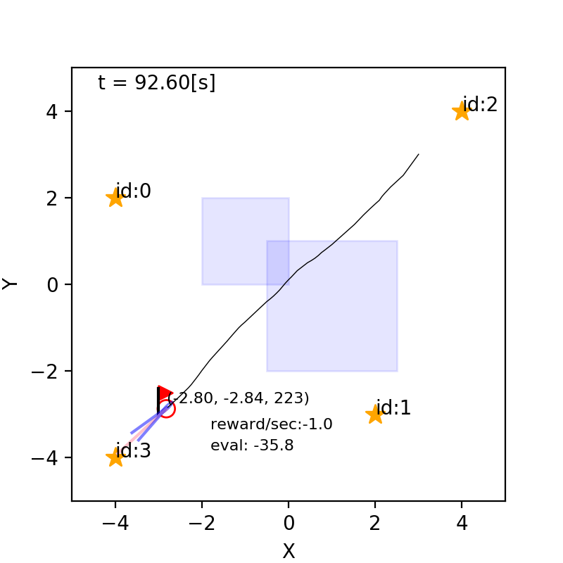
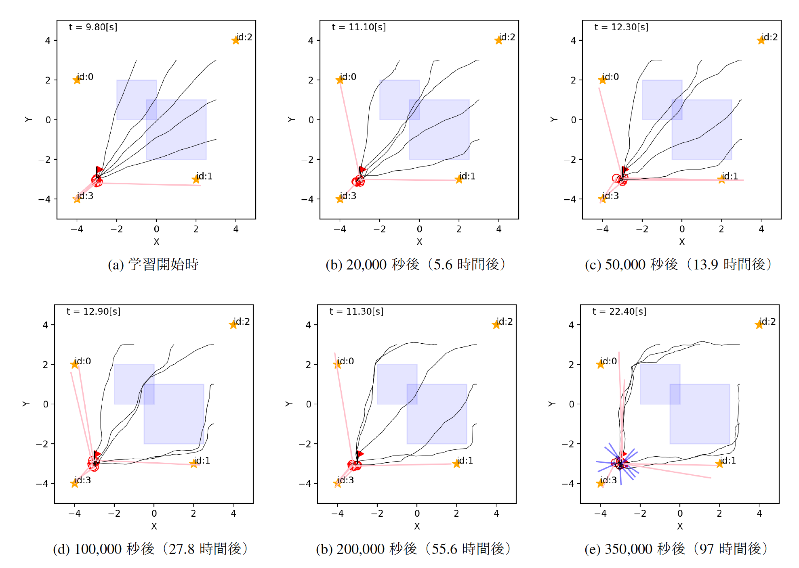
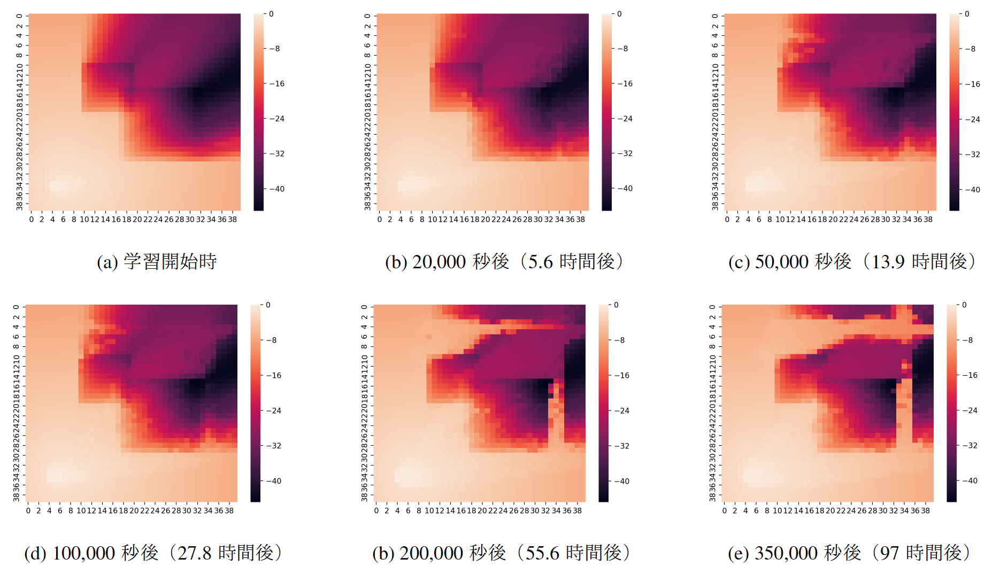
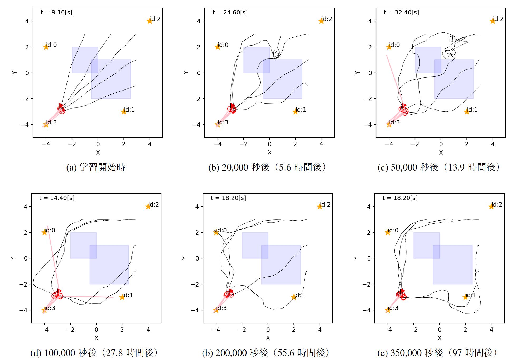
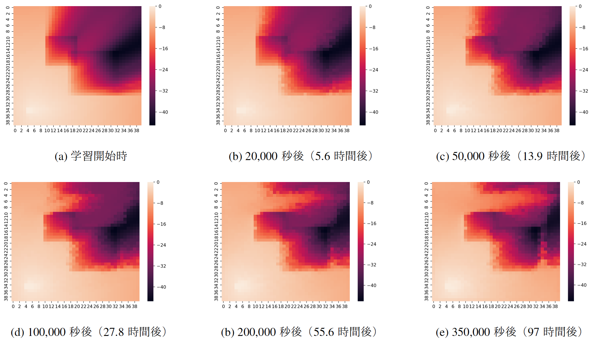
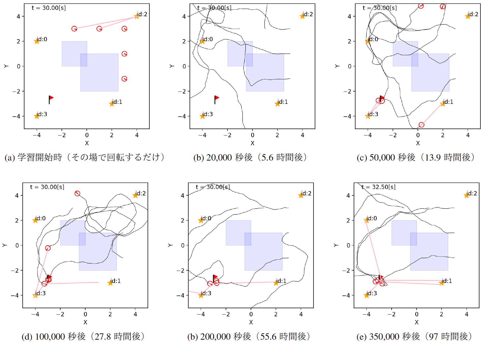

## 11. 強化学習

千葉工業大学 上田 隆一

 

This work is licensed under a <a rel="license" href="http://creativecommons.org/licenses/by-sa/4.0/">Creative Commons Attribution-ShareAlike 4.0 International License</a>.

---

### 強化学習の問題

* 問題はMDPだがエージェントが行動決定する際に状態遷移モデルや報酬モデルが既知として使えない
* エージェントから見えるもの
    * 行動と行動の集合: $a \in \mathcal{A}$
    * 現在時刻までのエピソード: $\\{\boldsymbol{x}_0, a_1, \boldsymbol{x}_1, r_1, a_2, \boldsymbol{x}_2, r_2, \dots, a_t, \boldsymbol{x}_t, r_t \\}$
    * 終端状態に着いたこと, およびそのときに得られる価値$v_\text{f}$
    * 評価: $J(\boldsymbol{x}\_{0:T}, a\_{1:T}) = \sum\_{t=1}^\top r\_t + v\_\text{f}$
* 経験から方策を得る

---

### 行動価値関数

* ロボットが状態$s$から行動$a$をとるときの価値
    * 状態価値関数$V(s)$に対して行動$a$も変数に加えたもの
    * $Q(s,a)$と表す
    * $V^\*(s) = \max_a Q^\*(s,a)$
* 行動価値関数の値: Q値と呼ぶことがあり、このスライドでもQ値と呼ぶ

---

### 11.1 Q学習

* ロボットが状態$s$から行動$a$で状態$s'$に遷移した直後、状態$s$、行動$a$における行動価値関数の値$Q(s,a)$を次のような式で更新
    * $Q(s,a) \longleftarrow (1 - \alpha)Q(s,a) + \alpha \left[ r + \max_{a'} Q(s',a') \right]$
        * $\alpha$: ステップサイズ・パラメータ$(0 \lt \alpha \le 1)$
* 式の意味
    * 次の値の重み付き和
        * $Q(s,a)$: 元のQ値
        * $r + \max_{a'} Q(s',a')$:報酬に遷移後の状態における最大のQ値を足したもの
    * 価値反復に相当する計算を1個の状態遷移だけで行なっている

---

### 基本的なQ学習のアルゴリズム

1. 行動価値関数（Q値のテーブル）を初期化
    * 特になにも事前情報がない場合は一定の値で初期化
        * 価値反復と異なり、終端状態も最初は分からないので特別扱いしない
    * なにか特定の方策に基づいて初期化してもよい
        * サンプルコードはこちら
1. ロボットを行動させながらQ値の更新
    * 行動して報酬を観測したら前ページの式で更新
    * どう行動させるかは重要な問題
        * 実装の説明のときに説明します

---

### 実装の準備

* [コード](https://github.com/ryuichiueda/LNPR_BOOK_CODES/blob/master/section_reinforcement_learning/q1.ipynb)
    * `QAgent`クラスに、とりあえずゴールにまっすぐ向かう方策（PuddleIgnoreAgent）を実装しておく（`policy`メソッド） 

* PuddleIgnoreAgentの方策評価`policy_evaluation.ipynb`の結果をファイルに書き出し

---

### 状態価値関数の実装と初期化

* [コード](https://github.com/ryuichiueda/LNPR_BOOK_CODES/blob/master/section_reinforcement_learning/q2.ipynb)
    * `StateInfo`クラス: 各状態のQ値やQ値から得られる行動を管理
        * `greedy`メソッド: Q値が最大の行動を返す
    * `QAgent`クラスの`set_action_value_function`メソッドで初期化
        * PuddleIgnoreAgentの方策評価`policy_evaluation.ipynb`の結果を流用
            * この方策をQ学習で改善していく（まっさらな状態からの学習は無理）
        * Q値の初期値の与え方
            * `PuddleIgnoreAgent`と一致する行動に対するQ値: 方策評価で得られた状態価値
            * 一致しない行動に対するQ値: 方策評価で得られた状態価値を少し下げる
    * これで、Q値経由で`PuddleIgnoreAgent`の方策が再現される

---

### 現段階での方策の問題

* Q値から導かれる方策以外をエージェントが試さない
    * 現状の方策で得られる行動以外のQ値が変更されない
    * もっと良い方策を探せない
* たまに現状のQ値で良いとされない行動を選ぶことが必要
    * 選びすぎるとゴールに行かなかったりあまりにも無駄が多くなったりするので適度に
    * Q学習の場合はどんな行動をとってもQ値の計算に悪影響がない
        * なぜでしょうか

---

### 探索的な方策

* 本の実装例では「$\varepsilon$-グリーディ方策」を実装
    * Q値の示す最適な行動以外の行動を、ある決まった確率でランダムに選択
        * 最も単純
* 他にボルツマン方策など
* $\varepsilon$-グリーディ方策の実装
    * [コード](https://github.com/ryuichiueda/LNPR_BOOK_CODES/blob/master/section_reinforcement_learning/q3.ipynb)

---

### 価値の更新則などの実装

* あとはQ学習の更新式を実装して、ロボットに初期状態からゴールへの行動を繰り返させるだけ
    * [更新式の実装](https://github.com/ryuichiueda/LNPR_BOOK_CODES/blob/master/section_reinforcement_learning/q4.ipynb)
        * `decision`メソッドから呼び出されている`q_update`でQ値を更新
    * [試行の繰り返しの実装](https://github.com/ryuichiueda/LNPR_BOOK_CODES/blob/master/section_reinforcement_learning/q5.ipynb)
        * `WarpRobot`クラス

---

### 学習結果: 方策から得られる行動

---

### 学習結果: 状態価値関数

* 各状態で最大のQ値を選んで描画したもの
    * $\theta$は$180\sim 190$[deg]の区間に固定

---

### 11.2 Sarsa

* 次の更新式を使う
    * $Q(s,a) \longleftarrow (1 - \alpha)Q(s,a) + \alpha \left[ r + Q(s',a') \right]$
    * 参考: Q学習の更新式
        * $Q(s,a) \longleftarrow (1 - \alpha)Q(s,a) + \alpha \left[ r + \max_{a'} Q(s',a') \right]$
* Q学習と異なり、具体的な行動$a'$を選んで$Q(s',a')$で$Q(s,a)$を更新
    * $s,a,r,s',a'$が確定してから更新$\rightarrow$Sarsa
    * 学習中に使っている方策の価値関数を求めていることになる（on-policy） 
      $\longleftrightarrow$Q学習では最適方策の価値関数を求めている（off-policy）

---

### Sarsaの実装

* [コード](https://github.com/ryuichiueda/LNPR_BOOK_CODES/blob/master/section_reinforcement_learning/sarsa1.ipynb)
    * Q学習からちょっと変えるだけ
	* $a'$を使う
	* 更新式をSarsaのものに

---

### 学習結果: 方策から得られる行動

* 水たまりを避ける行動が早く生成される
    * $a'$で水たまりに突っ込んだ場合に$Q(s,a)$の値が悪くなる
    * Q学習より良いということではない

---

### 学習結果: 状態価値関数

---

### 11.3 $n$-step Sarsa

* ある行動選択で、ある$Q(s,a)$が大きく変わる 
  $\rightarrow$エピソード中のそれ以前の状態行動対の価値も変えた方がいい
    * Q学習でもSarsaでも不可能
* 価値の更新を数ステップ遅らす$\rightarrow n$-step Sarsa 
$=$ 現在の状態行動対の価値+得た報酬を$n$ステップ前の状態行動対の価値に反映 

---

### $n$-step Sarsaの更新式の導出

* 元のSarsaの式を少し書き換える
    * $Q(s,a) \longleftarrow (1 - \alpha)Q(s,a) + \alpha \left[ r^{(1)} + Q(s^{(1)},a^{(1)}) \right]$ 
        * $(n)$は、現在の状態行動対から$n$ステップ先の状態行動対
* 2ステップ先まで更新を先延ばし
    * $Q(s,a) \longleftarrow (1 - \alpha)Q(s,a) + \alpha \left[ r^{(1)} + r^{(2)} + Q(s^{(2)},a^{(2)}) \right]$
* $n$ステップ先まで更新を先延ばし
    * $Q(s,a) \longleftarrow (1 - \alpha)Q(s,a) + \alpha \left[ \sum_{i=1}^n r^{(i)} + Q(s^{(n)},a^{(n)}) \right]$
* $n$ステップ前の$Q$値を最新の状態行動対から更新する式
    * $Q(s^{(-n)},a^{(-n)}) \longleftarrow (1 - \alpha)Q(s^{(-n)},a^{(-n)}) + \alpha \left[ \sum_{i=0}^{n-1} r^{(-i)} + Q(s,a) \right]$

---

### $n$-step Sarsaの実装

* [コード](https://github.com/ryuichiueda/LNPR_BOOK_CODES/blob/master/section_reinforcement_learning/nstep_sarsa2.ipynb)
    * Sarsaからの変更点
        * エピソードを記録する変数を準備
        * 更新式
    * その他のサンプルコードの変更
        * 事前知識の不使用（Q値を一様に）
        * 最初のうち、ゴールに入れなくなるので制限時間を設定

---

### 学習結果: 方策から得られる行動

---

### 学習結果: 状態価値関数

---

### 11.4 Sarsa($\lambda$)

* 評価を遅らせるのではなく、もっと積極的に過去の状態行動対の価値を変更
* 考え方
    * Q値が改善（改悪）された場合、その前の状態行動対の価値もすべて同じだけ更新すべきではないのか？
        * 例えば下図の$Q=-100 \rightarrow Q = -20$の更新

---

### Sarsa($\lambda$)の更新式の導出

* Sarsaの式を並び替え
    * $Q(s,a) \longleftarrow Q(s,a) + \alpha \left[ r + Q(s',a') - Q(s,a) \right]$
* Q値の変化を$\Delta Q$とおく
    * $\Delta Q = r + Q(s',a') - Q(s,a)$
        * エピソードをさかのぼってQ値に$\Delta Q$を足していく
        * ただし減衰させていく（過去にいくほど因果関係が薄くなるので）
* 更新式
    * $Q(s^{(-n)}, a^{(-n)}) \longleftarrow Q(s^{(-n)}, a^{(-n)}) + \alpha \lambda^n \Delta Q \quad (n=0,1,2,\dots)$
        * $\lambda$: エリジビリティ減衰率

---

### Sarsa($\lambda$)の実装

* $n$-step Sarsaからの変更点
    * 過去の報酬を使わないので記録をしない
    * エピソードをさかのぼって更新式を適用
        * 現在の計算機ではたいした計算量にはならない

---

### 学習結果: 方策から得られる行動

---

### 学習結果: 状態価値関数

