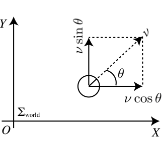
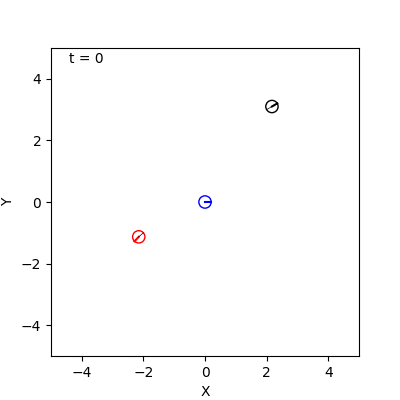
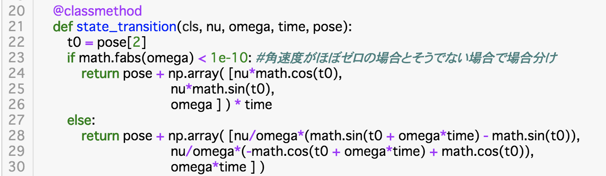
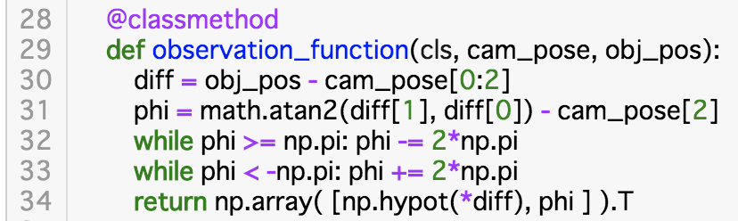

## 3. 自律ロボットのモデル化

千葉工業大学 上田 隆一

 

This work is licensed under a <a rel="license" href="http://creativecommons.org/licenses/by-sa/4.0/">Creative Commons Attribution-ShareAlike 4.0 International License</a>.

---

### 本章の内容

* 3.1: 想定するロボット
* 3.2: ロボットの動きの実装
* 3.3: ロボットの観測の実装
* 3.4: まとめ

---

### 想定するロボット

* 対向2輪型の自律ロボット
    * 駆動輪が二つ平行に取り付けられている
    * 原点周りにその場で回転可能
        * 原点: 両駆動輪の軸を結んだ中点
    * 本書では平面を移動するものに限定

<iframe width="372" height="210" src="https://www.youtube.com/embed/RpPcmyXOcr4" frameborder="0" allow="accelerometer; autoplay; encrypted-media; gyroscope; picture-in-picture" allowfullscreen></iframe>
<iframe width="372" height="210" src="https://www.youtube.com/embed/7xXnXHc0roA" frameborder="0" allow="accelerometer; autoplay; encrypted-media; gyroscope; picture-in-picture" allowfullscreen></iframe>

---

### ロボットの姿勢と制御指令

* 姿勢: $\boldsymbol{x} = (x \ y \ \theta)^\top$
    * 世界座標系$\Sigma_\text{world}$を定義してその上に定義
    * $(x,y)$: 位置
    * $\theta$: 向き
        * $X$軸の向きを0[deg]にして$Y$軸方向を正とする
* 制御指令: $\boldsymbol{u} = (\nu \ \omega)^\top$
    * $\nu$: 速度
    * $\omega$: 角速度

 
 

---

### ロボットの動き

* 制御指令とロボットの世界座標系$\Sigma_\text{world}$での速度の関係
    * $(\dot{x} \quad\dot{y} \quad\dot{\theta})^\top = ( \\nu\\cos\\theta \quad\\nu\\sin\\theta \quad\omega)^\top$
* 問題
    * 離散時刻$t=0,1,2,\dots,$を考え、姿勢$\boldsymbol{x}\_{t-1}$から姿勢$\boldsymbol{x}\_{t}$までの変化を求めてみましょう
        * 各離散時刻間の実時間は$\Delta t$
        * 姿勢$\boldsymbol{x}\_{t-1}$から姿勢$\boldsymbol{x}\_{t}$までの制御指令は$\boldsymbol{u}_t = (\nu \ \omega)^\top$で固定

 
 

---

### 答え

* $\\omega_t = 0$のとき
    * $\\begin{pmatrix} x_t \\\\ y_t \\\\ \\theta_t \\\\ \\end{pmatrix} = \\begin{pmatrix} x_{t-1} \\\\ y_{t-1} \\\\ \\theta_{t-1} \\\\ \\end{pmatrix} +  \\begin{pmatrix} \\nu_t\\cos \\theta_{t-1} \\\\ \\nu_t\\sin \\theta_{t-1} \\\\ \\omega_t \\end{pmatrix} \\Delta t$
    * 極限をとると下の式と一致
* $\\omega_t \neq 0$のとき
    * $\\begin{pmatrix} x_t \\\\ y_t \\\\ \\theta_t \\\\ \\end{pmatrix} = \\begin{pmatrix} x_{t-1} \\\\ y_{t-1} \\\\ \\theta_{t-1} \\\\ \\end{pmatrix} + \\begin{pmatrix} \\nu_t\\omega_t^{-1}\\left\\{\\sin( \\theta_{t-1} + \\omega_t  \\Delta t ) - \\sin\\theta_{t-1} \\right\\} \\\\ \\nu_t\\omega_t^{-1}\\left\\{-\\cos( \\theta_{t-1} + \\omega_t \\Delta t ) + \\cos\\theta_{t-1} \\right\\} \\\\ \\omega_t \\Delta t \\end{pmatrix}$

---

### 状態方程式・状態遷移関数

* 状態方程式
    * 姿勢$\boldsymbol{x}$を状態とみなしたときに、それがどのように遷移するかを表した式
    * 離散系では$\boldsymbol{x}\_t = \boldsymbol{f}(\boldsymbol{x}\_{t-1}, \boldsymbol{u}_t)$という形
    * 前ページの式もこのような形式になっている
* 状態遷移関数
    * $\boldsymbol{f}(\boldsymbol{x}\_{t-1}, \boldsymbol{u}_t)$のこと

---

### 実装

* [コード](https://github.com/ryuichiueda/LNPR_BOOK_CODES/blob/master/section_robot/ideal_robot6.ipynb)
    * 「エージェント」がロボットに乗って、そこから制御司令を出すという実装になっている
* 状態遷移関数の実装

---

### ロボットの観測

* 点ランドマークとカメラ
    * ランドマークの集合（地図）: $\textbf{m} = \\{ \text{m}\_j | j=0,1,2,\dots,N\_\textbf{m} -1 \\}$
    * ランドマーク$\text{m}\_j$の位置: $\boldsymbol{m}\_j = (m\_\{j,x\} \ m\_\{j,y\})^\top$
* ランドマーク$\text{m}\_j$から得られるセンサ値
    * 極座標で$\boldsymbol{z}_j = (\ell_j \ \varphi_j )^\top$
    * 問題: $\boldsymbol{z}_j$と$\boldsymbol{x}$の関係は？

---

### 観測方程式・観測関数

* 観測方程式 $\\boldsymbol\{z\}\_j = \\boldsymbol\{h\}_j (\\boldsymbol\{x\})$
    * $\\boldsymbol\{h\}_j (\\boldsymbol\{x\}) = \\begin\{pmatrix\} \\sqrt\{(m\_\{j,x\} - x)^2 + (m\_\{j,y\} - y)^2\} \\\\ \\text\{atan2\}(m\_\{j,y\} - y, m\_\{j,x\} - x) - \\theta \\end\{pmatrix\}$
        * 観測関数
    * 姿勢$\boldsymbol{x}$と、$\boldsymbol{x}$で得られるセンサ値$\boldsymbol{z}_j$の関係を表すもの
* SLAMではランドマークの位置も変数になる
    * $\\boldsymbol\{h\}(\boldsymbol{x},\boldsymbol{m}_j )$

---

### 実装

* [コード](https://github.com/ryuichiueda/LNPR_BOOK_CODES/blob/master/section_robot/ideal_robot11.ipynb)
    * ロボットにカメラをのせる
        * シミュレーションのため、カメラオブジェクトに観測対象の地図を与えておく
    * 観測方程式の実装

---

### 最終的なロボットの挙動

