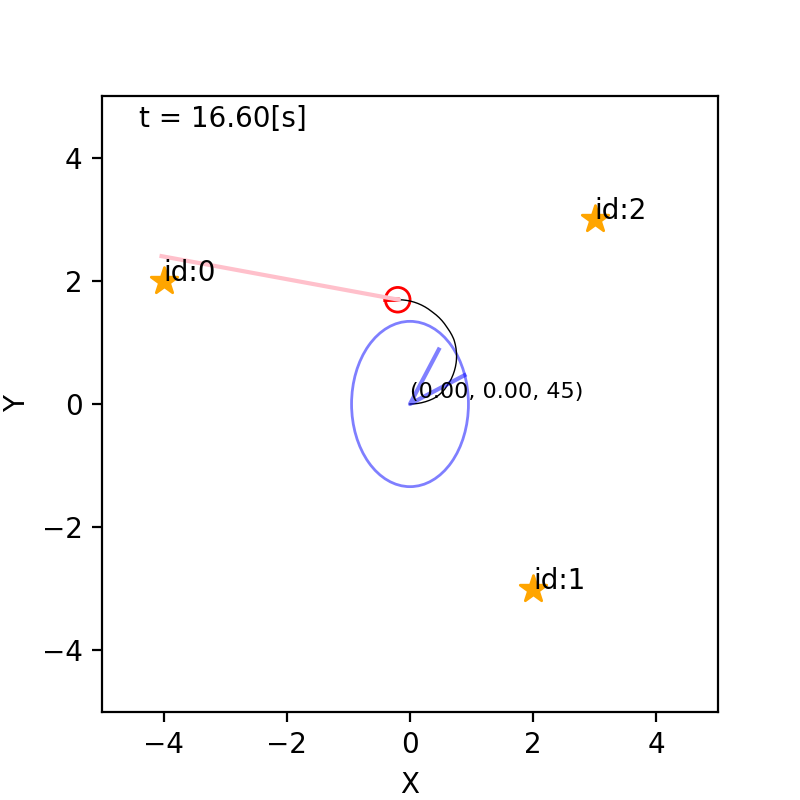
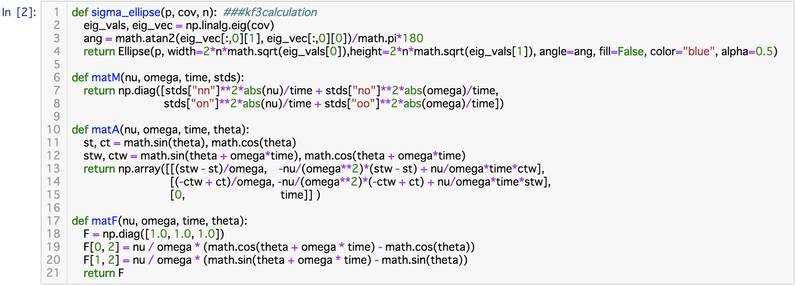
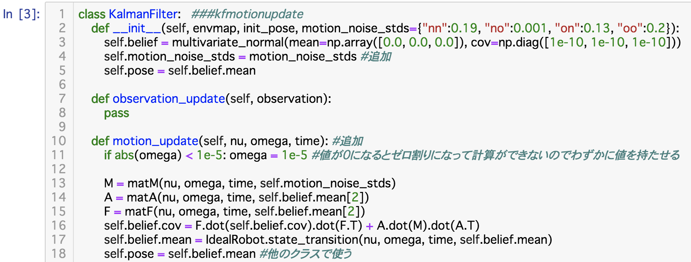
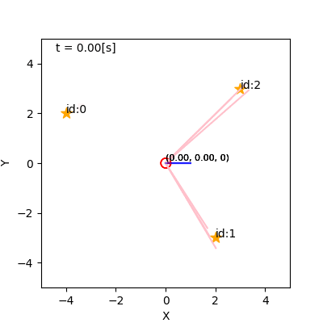
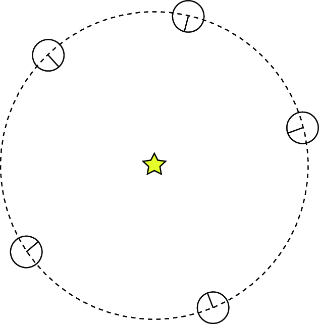
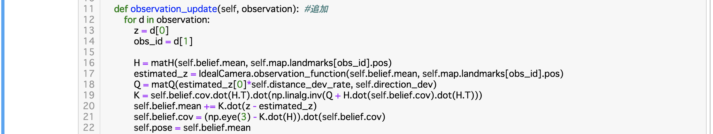

## 6. カルマンフィルタによる自己位置推定

千葉工業大学 上田 隆一

 

This work is licensed under a <a rel="license" href="http://creativecommons.org/licenses/by-sa/4.0/">Creative Commons Attribution-ShareAlike 4.0 International License</a>.

---

### ガウス分布で信念分布を近似

* 時刻$t$における信念$b_t$を$b_t = \mathcal{N}(\mathcal{\mu}_t, \Sigma_t)$と近似
    * $\mathcal{\mu}_t$: 分布の中心（推定姿勢とみなすこともできる）
    * $\Sigma_t$: 共分散行列
* 下図: とりあえず描画した信念分布（[コード](https://github.com/ryuichiueda/LNPR_BOOK_CODES/blob/master/section_kalman_filter/kf2.ipynb)）
    * まだ動かない
    * $XY$平面の不確かさを誤差楕円、$\theta$方向の不確かさを青い線分の範囲で図示

---

### 移動後の信念分布の更新

* 信念のパラメータを計算する必要がある
    * MCLならパーティクルをロボットと同じように動かせばよかった
* 式
    * $\hat{b}\_t(\boldsymbol{x}) = \int\_{\boldsymbol{x}' \in \mathcal{X}} p(\boldsymbol{x} | \boldsymbol{x}', \boldsymbol{u}\_t) b\_{t-1}(\boldsymbol{x}')  d\boldsymbol{x}' = \big\langle p(\boldsymbol{x} | \boldsymbol{x}', \boldsymbol{u}\_t) \big\rangle\_{b\_{t-1}(\boldsymbol{x}')}$
    * MCLと同じ
    * ただし、これを計算してもガウス分布にならない
        * $p(\boldsymbol{x} | \boldsymbol{x}', \boldsymbol{u}\_t)$がガウス分布という保証はない（大抵違う。参考: [MCLでのパーティクルの動き](https://ryuichiueda.github.io/LNPR_SLIDES/slides/chap5_60min.html?#/18)）
        * $p(\boldsymbol{x} | \boldsymbol{x}', \boldsymbol{u}\_t)$がガウス分布でも$b_{t-1}$とかけて積分するとガウス分布にならない（$b_{t-1}$と変数が違うので）

---

### 状態遷移モデルの近似 1/4

* 本来ガウス分布でない$p(\boldsymbol{x} | \boldsymbol{x}', \boldsymbol{u}\_t)$をガウス分布に
* 手順
    1. 速度、角速度を$\boldsymbol{u}' \sim \mathcal{N}(\boldsymbol{u}, M_t)$でモデル化 （これは[MCLで使ったモデル](https://ryuichiueda.github.io/LNPR_SLIDES/slides/chap5_60min.html?#/16)の場合、近似なしでガウス分布）
        * $M\_t = \begin{pmatrix} \sigma^2\_{\nu\nu}|\nu\_t|/\Delta t + \sigma^2\_{\nu\omega}|\omega\_t|/\Delta t & 0 \\\\ 0 & \sigma^2\_{\omega\nu}|\nu\_t|/\Delta t + \sigma^2\_{\omega\omega}|\omega\_t|/\Delta t \end{pmatrix}$
    1. この$\nu\omega$空間中のガウス分布を$XY\theta$空間に写像
        * ここで分布が歪む（下図のように、PとQがCに対して対称にならない）

---

### 状態遷移モデルの近似 2/4

* $\boldsymbol{x}\_t \sim p(\boldsymbol{x} | \boldsymbol{x}\_{t-1}, \boldsymbol{u}\_t)$を次のように線形近似
    * $\boldsymbol{x}\_t \approx \boldsymbol{f}(\boldsymbol{x}\_{t-1}, \boldsymbol{u}\_t) + A\_t (\boldsymbol{u}\_t' - \boldsymbol{u}\_t)$
        * $\boldsymbol{f}$: 状態遷移関数
        * $A\_t = \dfrac{\partial \boldsymbol{f}}{\partial \boldsymbol{u}}\Big|\_{\boldsymbol{x}=\boldsymbol{x}\_{t-1},\boldsymbol{u}=\boldsymbol{u}\_t}$

---

### 状態遷移モデルの近似 3/4

* 状態遷移関数の偏微分
    * 状態方程式
        * $\\boldsymbol{f}(\\boldsymbol{x}, \\boldsymbol{u}) = \\begin{pmatrix} x \\\\ y \\\\ \\theta \\end{pmatrix} + \\begin{pmatrix} \\nu\\omega^{-1}\\left\\{\\sin( \\theta + \\omega \\Delta t ) - \\sin\\theta \\right\\} \\\\ \\nu\\omega^{-1}\\left\\{-\\cos( \\theta + \\omega \\Delta t ) + \\cos\\theta \\right\\} \\\\ \\omega \\Delta t \\end{pmatrix}$
    * 状態方程式の偏微分
        * $ \\dfrac{\\partial \\boldsymbol{f}}{\\partial \\boldsymbol{u}} = \\begin{pmatrix} \\partial f\_x/\\partial \\nu & \\partial f\_x/\\partial \\omega \\\\ \\partial f\_y/\\partial \\nu & \\partial f\_y/\\partial \\omega \\\\ \\partial f\_\\theta/\\partial \\nu & \\partial f\_\\theta/\\partial \\omega \\end{pmatrix} \\nonumber \\\\ \hspace{-5em} = \\begin{pmatrix} \\omega^{-1}\\left\\{\\sin( \\theta + \\omega \\Delta t ) - \\sin\\theta \\right\\} & -\\nu\\omega^{-2}\\left\\{\\sin( \\theta + \\omega \\Delta t ) - \\sin\\theta \\right\\} + \\nu\\omega^{-1}\\Delta t \\cos( \\theta + \\omega \\Delta t )  \\\\ \\omega^{-1}\\left\\{-\\cos( \\theta + \\omega \\Delta t ) + \\cos\\theta \\right\\} & -\\nu\\omega^{-2}\\left\\{-\\cos( \\theta + \\omega \\Delta t ) + \\cos\\theta \\right\\} + \\nu\\omega^{-1}\\Delta t\\sin( \\theta + \\omega \\Delta t ) \\\\ 0 & \\Delta t \\end{pmatrix}$
    * これに$\boldsymbol{x} = \boldsymbol{x}\_{t-1}, \boldsymbol{u} = \boldsymbol{u}_t$を代入すると$A_t$となる

---

### 状態遷移モデルの近似 4/4

* $\boldsymbol{x}\_t \approx \boldsymbol{f}(\boldsymbol{x}\_{t-1}, \boldsymbol{u}\_t) + A\_t (\boldsymbol{u}\_t' - \boldsymbol{u}\_t)$の分布は？ 
    * $\Longrightarrow \boldsymbol{u}'$のばらつき$\boldsymbol{u}' \sim \mathcal{N}(\boldsymbol{u}, M_t)$が右辺の$\boldsymbol{f}(\boldsymbol{x}\_{t-1}, \boldsymbol{u}\_t)+$ $A\_t (\boldsymbol{u}\_t' - \boldsymbol{u}\_t)$で$XY\theta$空間に線形に写像される
* $\boldsymbol{x}\_t \sim \mathcal{N}(\boldsymbol{x}\_{t-1}, R_t)$とすると $R_t = A_t M_t A_t^\top$
    * 理由は付録B.1.10
    * $R_t$には逆行列がないが、以後は逆行列が存在すると仮定
        * 最終的には逆行列を用いないアルゴリズムになる

---

### 信念分布の遷移

* 線形化した状態遷移モデルを使うと次のようになる
    * $\\hat{b}\_t(\\boldsymbol{x}) =  \\int\_{\\boldsymbol{x}' \\in \\mathcal{X}} \\exp\\left\\{ -\\dfrac{1}{2} \\left[\\boldsymbol{x} - \\boldsymbol{f}(\\boldsymbol{x}',\\boldsymbol{u}\_t) \\right]^\\top R\_t^{-1} \\left[ \\boldsymbol{x} - \\boldsymbol{f}(\\boldsymbol{x}',\\boldsymbol{u}\_t) \\right] \\right\\} \\\\ \cdot \\exp\\left\\{ -\\dfrac{1}{2} (\\boldsymbol{x}' - \\boldsymbol{\\mu}\_{t-1})^\\top \\Sigma\_{t-1}^{-1} (\\boldsymbol{x}' - \\boldsymbol{\\mu}\_{t-1}) \\right\\}  d\\boldsymbol{x}'$
    * この式を$\boldsymbol{x}$のガウス分布にするには・・・
        * $\boldsymbol{x}'$を$\boldsymbol{f}$の外に出す
        * 積分を計算して消去
    * 方法: 状態遷移関数$\boldsymbol{f}$を線形近似

---

### 状態遷移関数の線形化

* $\boldsymbol{f}(\boldsymbol{x}\_{t-1}, \boldsymbol{u}\_t) \approx \boldsymbol{f}(\boldsymbol{\mu}\_{t-1}, \boldsymbol{u}\_t) + F\_t(\boldsymbol{x}\_{t-1} - \boldsymbol{\mu}\_{t-1})$
    * $F\_t = \\dfrac{\\partial \\boldsymbol{f}(\\boldsymbol{x}\_{t-1}, \\boldsymbol{u})}{\\partial \\boldsymbol{x}\_{t-1}}\\Big|\_{ \\boldsymbol{x}\_{t-1} = \\boldsymbol{\\mu}\_{t-1}}$
    * 先ほどの線形化との違い:
        * 先ほどのは$\boldsymbol{u}$と$\boldsymbol{u}'$の誤差がどう$\boldsymbol{x}$に反映されるかを表したもので、これは$\boldsymbol{x}\_{t-1}$と分布の中心$\boldsymbol{\mu}\_{t-1}$とのズレがどのように遷移後に拡大するかを線形近似したもの
* 次ページで$F_t$を求めます

---

* $F_t$の計算
    * $F\_t = \\begin{pmatrix} \\partial f\_x(\\boldsymbol{x}\_{t-1}, \\boldsymbol{u}) / \\partial x\_{t-1} & \\partial f\_x(\\boldsymbol{x}\_{t-1}, \\boldsymbol{u}) / \\partial y\_{t-1} & \\partial f\_x(\\boldsymbol{x}\_{t-1}, \\boldsymbol{u}) / \\partial \\theta\_{t-1} \\\\ \\partial f\_y(\\boldsymbol{x}\_{t-1}, \\boldsymbol{u}) / \\partial x\_{t-1} & \\partial f\_y(\\boldsymbol{x}\_{t-1}, \\boldsymbol{u}) / \\partial y\_{t-1} & \\partial f\_y(\\boldsymbol{x}\_{t-1}, \\boldsymbol{u}) / \\partial \\theta\_{t-1} \\\\ \\partial f\_\\theta(\\boldsymbol{x}\_{t-1}, \\boldsymbol{u}) / \\partial x\_{t-1} & \\partial f\_\\theta(\\boldsymbol{x}\_{t-1}, \\boldsymbol{u}) / \\partial y\_{t-1} & \\partial f\_\\theta(\\boldsymbol{x}\_{t-1}, \\boldsymbol{u}) / \\partial \\theta\_{t-1} \\end{pmatrix} \\Bigg|\_{ \\boldsymbol{x}\_{t-1} = \\boldsymbol{\\mu}\_{t-1}}$
$= \\begin{pmatrix} 1 & 0 & \\nu\_t\\omega\_t^{-1}\\{\\cos(\\theta\_{t-1} + \\omega\_t\\Delta t) - \\cos \\theta\_{t-1} \\} \\\\ 0 & 1 & \\nu\_t\\omega\_t^{-1}\\{\\sin(\\theta\_{t-1} + \\omega\\Delta t) - \\sin \\theta\_{t-1} \\} \\\\ 0 & 0 & 1 \\end{pmatrix} \\Bigg|\_{ \\boldsymbol{x}\_{t-1} = \\boldsymbol{\\mu}\_{t-1}}$
$= \\begin{pmatrix} 1 & 0 & \\nu\_t\\omega\_t^{-1}\\{\\cos(\\mu\_{\\theta\_{t-1}} + \\omega\_t\\Delta t) - \\cos \\mu\_{\\theta\_{t-1}} \\} \\\\ 0 & 1 & \\nu\_t\\omega\_t^{-1}\\{\\sin(\\mu\_{\\theta\_{t-1}} + \\omega\_t\\Delta t) - \\sin \\mu\_{\\theta\_{t-1}} \\} \\\\ 0 & 0 & 1 \\end{pmatrix}$

---

### 状態遷移関数の線形化

* $F_t$を使った信念分布の表現
    * $\hat{b}\_t(\boldsymbol{x}) = \int\_{\boldsymbol{x}' \in \mathcal{X}} \exp \Big\\{ - \\dfrac{1}{2}\\left[ \\boldsymbol{x} - \\boldsymbol{f}(\\boldsymbol{\\mu}\_{t-1}, \\boldsymbol{u}\_t) - F\_t(\\boldsymbol{x}' - \\boldsymbol{\\mu}\_{t-1}) \\right]^\\top R\_t^{-1} \\big[ \cdots \\big] \\\\ - \\dfrac{1}{2}( \\boldsymbol{x}' - \\boldsymbol{\\mu}\_{t-1} )^\\top \\Sigma\_{t-1}^{-1} (  \cdots ) \Big\\} d\boldsymbol{x}'$
* 付録B.1.9の結果を使うと$\hat{b}\_t$の中心と共分散行列は
    * $\\hat{\\boldsymbol{\\mu}}\_t = \\boldsymbol{f}(\\boldsymbol{\\mu}\_{t-1}, \\boldsymbol{u}\_t)$
    * $\\hat{\\Sigma}\_t = F\_t\\Sigma\_{t-1}F\_t^\\top + R\_t = F\_t\\Sigma\_{t-1}F\_t^\\top + A\_t M\_t A\_t^\\top$

---

### [移動後の更新の実装](https://github.com/ryuichiueda/LNPR_BOOK_CODES/blob/master/section_kalman_filter/kf3.ipynb) 1/2

* 行列$M_t, A_t, F_t$の実装

---

### [移動後の更新の実装](https://github.com/ryuichiueda/LNPR_BOOK_CODES/blob/master/section_kalman_filter/kf3.ipynb) 2/2

* 注意: カルマンフィルタの場合、導出過程がコードに反映されないのでコードを読んでも理解不可能

---

### 動作

* 観測がないので誤差楕円は広がっていく

---

### 観測後の信念分布の更新

* $b\_t(\\boldsymbol{x}) = \\eta^{-1} L\_j(\\boldsymbol{x} | \\boldsymbol{z}\_{j,t}) \\hat{b}\_t(\\boldsymbol{x})$
    * $L_j$は尤度関数
    * [MCLで使ったもの](https://ryuichiueda.github.io/LNPR_SLIDES/slides/chap5_60min.html?#/22)がそのまま使える
        * たまたまガウス分布だったので
* $b\_t(\\boldsymbol{x})$はガウス分布にならない
    * $L_j$は$\boldsymbol{x}$のガウス分布ではなく$\boldsymbol{z}\_{j,t}$のガウス分布
    * $\boldsymbol{z}\_{j,t}$から予想される$\boldsymbol{x}$の分布は下図のようにドーナツ状に

---

### $b_t$の計算

* もとの式
    * $b(\\boldsymbol{x}) = \\eta^{-1} \\exp \\Big\\{ -\\dfrac{1}{2} \\left[ \\boldsymbol{z} - \\boldsymbol{h}(\\boldsymbol{x}) \\right]^T Q\_{\\boldsymbol{x}}^{-1} \\left[ \\boldsymbol{z} - \\boldsymbol{h}(\\boldsymbol{x}) \\right] \\\\ -\\dfrac{1}{2} ( \\boldsymbol{x} - \\hat{\\boldsymbol{\\mu}} )^T \\hat{\\Sigma}^{-1} ( \\boldsymbol{x} - \\hat{\\boldsymbol{\\mu}} ) \\Big\\}$
    * $\boldsymbol{h}$は[観測関数](https://ryuichiueda.github.io/LNPR_SLIDES/slides/chap3_10min.html?#/9)
    * 添字$t, j$は省略
* 近似の方針
    * $\boldsymbol{x}$のガウス分布にしたいので、$\boldsymbol{h}(\boldsymbol{x})$を線形近似して$\boldsymbol{x}$を外に
    * $Q\_{\\boldsymbol{x}}$は$\boldsymbol{x} = \hat{\boldsymbol{\mu}}$として定数に近似

---

### 観測関数の線形近似

* $\\boldsymbol{h}(\\boldsymbol{x}) \\approx \\boldsymbol{h}(\\hat{\\boldsymbol{\\mu}}) + H(\\boldsymbol{x} - \\hat{\\boldsymbol{\\mu}})$
    * $H = \\dfrac{\\partial \\boldsymbol{h}}{\\partial \\boldsymbol{x}}\\Big|\_{\\boldsymbol{x} = \\hat{\\boldsymbol{\\mu}}}$
    * $\\boldsymbol{h}(\\hat{\\boldsymbol{\\mu}})$: 信念分布の中心で得られるセンサ値
    * $H(\\boldsymbol{x} - \\hat{\\boldsymbol{\\mu}})$: 中心から外れた姿勢からどれだけずれると どれだけセンサ値が変わるか
        * 当然、$\boldsymbol{x}$が$\\hat{\\boldsymbol{\\mu}}$から遠いほど近似誤差が生じる

---

### $H$の計算

* $H = \\dfrac{\\partial \\boldsymbol{h}}{\\partial \\boldsymbol{x}}\\Big|\_{\\boldsymbol{x} = \\hat{\\boldsymbol{\\mu}}} \\\\ = \\begin{pmatrix} (x - m\_x)/\ell(\boldsymbol{x}) & (y - m\_y)/\ell(\boldsymbol{x}) & 0 \\\\ (m\_y - y)/\ell(\boldsymbol{x})^2 & (x - m\_x)/\ell(\boldsymbol{x})^2 & -1 \\end{pmatrix} \\Bigg|\_{\\boldsymbol{x} = \\boldsymbol{\\hat{\\mu}}} \\nonumber \\\\ = \\begin{pmatrix} (\\hat{\\mu}\_x - m\_x)/\\ell\_{\\hat{\\boldsymbol{\\mu}}} & (\\hat{\\mu}\_y - m\_y)/\\ell\_{\\hat{\\boldsymbol{\\mu}}} & 0 \\\\ (m\_y - \\hat{\\mu}\_y)/\\ell\_{\\hat{\\boldsymbol{\\mu}}}^2 & (\\hat{\\mu}\_x - m\_x)/\\ell\_{\\hat{\\boldsymbol{\\mu}}}^2 & -1 \\end{pmatrix}$
    * ここで$\\ell\_{\\hat{\\boldsymbol{\\mu}}} = \\sqrt{(\\hat{\\mu}\_x - m\_x)^2 + (\\hat{\\mu}\_x - m\_y)^2}$

---

### 近似による$b_t$の計算

* $b(\\boldsymbol{x}) = \\eta^{-1} \\exp \\Big\\{ -\\dfrac{1}{2} \\left[ \\boldsymbol{z} - \\boldsymbol{h}(\\hat{\\boldsymbol{\\mu}}) - H(\\boldsymbol{x} - \\hat{\\boldsymbol{\\mu}})  \\right]^\\top Q^{-1} \\left[ .. \\right] \\\\ -\\dfrac{1}{2} ( \\boldsymbol{x} - \\hat{\\boldsymbol{\\mu}} )^\\top \\hat\\Sigma^{-1} ( .. ) \\Big\\}$
    * 添字は省略
* 付録B.1.9の結果を使うと$b$の中心と共分散行列は次のように求まる
    * $\\boldsymbol{\\mu} = \Sigma H^\top Q^{-1} (\boldsymbol{z} - \boldsymbol{h}(\hat{\boldsymbol{\mu}})) + \hat{\boldsymbol{\mu}}$
    * $\\Sigma =  (H^\\top Q^{-1}H + \\hat\\Sigma^{-1} )^{-1}$

---

### カルマンゲイン

* 前のページで求まった更新をもう少し変形
    * カルマンゲイン$K = \Sigma H^\top Q^{-1}$を定義
    * 更新前の行列を使うと$K = \hat\Sigma H^\top (H \hat\Sigma H^\top + Q )^{-1}$
* $K$を使った更新式
    * $\\boldsymbol{\\mu}$$ = \Sigma H^\top Q^{-1} (\boldsymbol{z} - \boldsymbol{h}(\hat{\boldsymbol{\mu}})) + \hat{\boldsymbol{\mu}}$$\ \ =K[\boldsymbol{z} - \boldsymbol{h}(\hat{\boldsymbol{\mu}})] + \hat{\boldsymbol{\mu}}$
        * 実際のセンサの値と分布の中心から予測されるセンサ値の違いに$K$をかけたもの
    * $\\Sigma$$= (H^\\top Q^{-1}H + \\hat\\Sigma^{-1} )^{-1} = \cdots$$\ \ = (I - KH)\hat{\Sigma}$
        * 元の共分散行列を$KH\hat{\Sigma}$だけ小さくしたもの
* 実装には赤字で書いた式を用いる

---

### [観測後の更新の実装](https://github.com/ryuichiueda/LNPR_BOOK_CODES/blob/master/section_kalman_filter/kf4.ipynb)

---

### 動作例

---

### まとめ: カルマンフィルタの更新則

* 移動後の更新
    * $\\hat{\\boldsymbol{\\mu}}\_t = \\boldsymbol{f}(\\boldsymbol{\\mu}\_{t-1}, \\boldsymbol{u}\_t)$
    * $\\hat{\\Sigma}\_t = F\_t\\Sigma\_{t-1}F\_t^\\top + R\_t = F\_t\\Sigma\_{t-1}F\_t^\\top + A\_t M\_t A\_t^\\top$
* 観測後の更新
    * $K = \hat\Sigma_t H^\top (H \hat\Sigma_t H^\top + Q )^{-1}$
    * $\\boldsymbol{\\mu}_t = K[\boldsymbol{z}\_\{j,t\} - \boldsymbol{h}_j(\hat{\boldsymbol{\mu}}_t)] + \hat{\boldsymbol{\mu}}_t$
    * $\\Sigma_t = (I - KH)\hat{\Sigma}_t$
