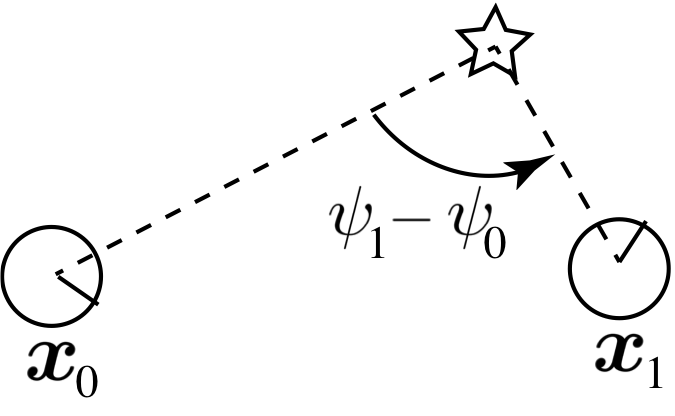
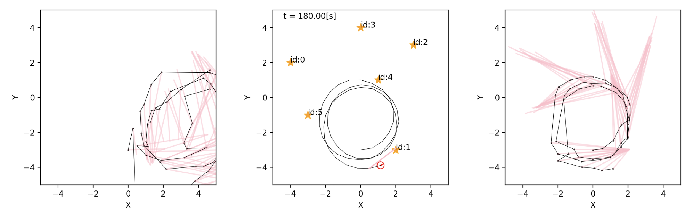
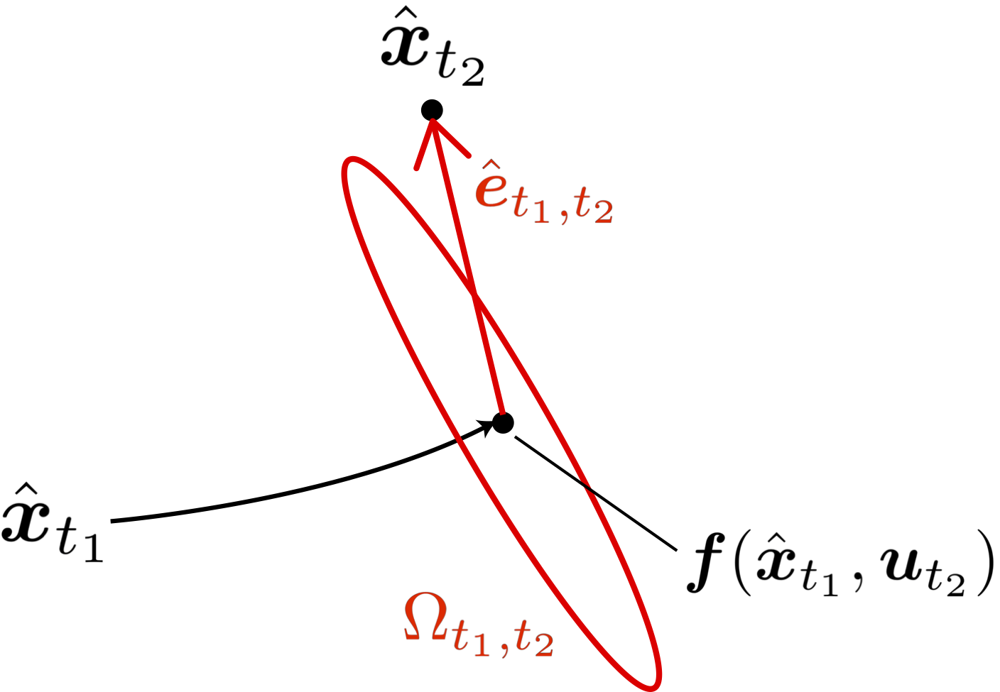
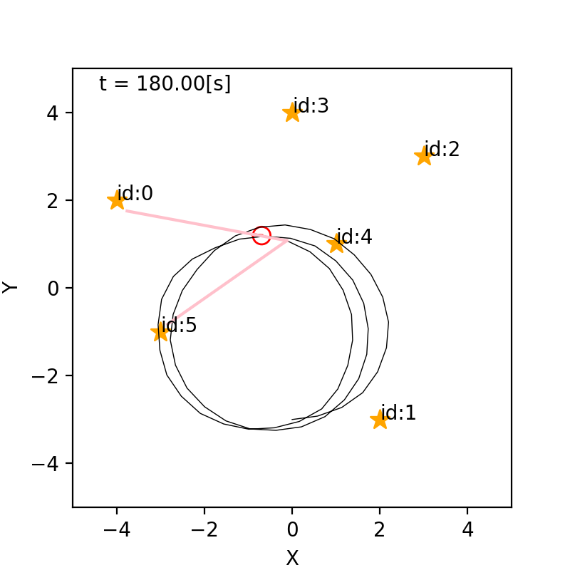
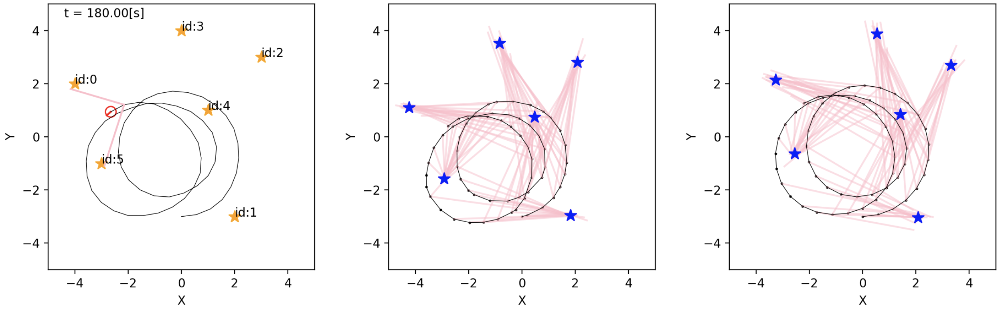

## 9. グラフ表現を 用いたSLAM

千葉工業大学 上田 隆一

 

This work is licensed under a <a rel="license" href="http://creativecommons.org/licenses/by-sa/4.0/">Creative Commons Attribution-ShareAlike 4.0 International License</a>.

---

### graph-based SLAM

* 制御指令値やセンサ値がある程度蓄積 された後にSLAMを行う方法の一つ
* グラフ
    * ノード:
        * ランドマークの推定姿勢
        * ロボットの各離散時刻での推定姿勢
    * エッジ: 位置姿勢関係の情報がある ノード同士を結ぶ

---

### グラフの「歪み」

* エッジの情報 
    * 姿勢間: デッドレコニング
    * 姿勢とランドマーク間: 観測
* 個々のエッジが示すノードの姿勢が互いに矛盾
    * 観測に雑音があるため
    * 最も歪みが少なくなるノードの位置を探す

---

### 9.1 問題の定式化

* 完全SLAM問題
    * $\boldsymbol{x}\_{1:T}^\*, \textbf{m}^\* = \text{argmax}\_{\boldsymbol{x}\_{1:T}, \textbf{m}} \ p(\boldsymbol{x}\_{1:T}, \textbf{m} | \boldsymbol{x}\_0, \boldsymbol{u}\_{1:T}, \textbf{z}\_{0:T})$
    * （解き方にもよるが）計算量が大きくなるのでこれは解かない
* 作戦
    * 式(8.2)を再掲 
        * $p(\boldsymbol{x}\_{1:T}, \textbf{m} | \boldsymbol{x}\_0, \boldsymbol{u}\_{1:T}, \textbf{z}\_{0:T}) = p(\boldsymbol{x}\_{1:T} | \boldsymbol{x}\_0, \boldsymbol{u}\_{1:T}, \textbf{z}\_{0:T}) p(\textbf{m} | \boldsymbol{x}\_{0:T}, \textbf{z}\_{0:T}) $
            * 注意: $\textbf{z}_0$の存在の仮定を暫定追加（最終的に不要になる）
    * 先に$p(\boldsymbol{x}\_{1:T} | \boldsymbol{x}\_0, \boldsymbol{u}\_{1:T}, \textbf{z}\_{0:T})$を最大にする軌跡$\boldsymbol{x}^\*_{1:T}$を求める
        * 軌跡のグラフを作って歪みを最小化
    * 観測の情報をどうするの？

---

### 観測を姿勢の情報に

* 次のようなエッジを考える
    * 仮想移動エッジ: $\text{e}\_{j,t\_1,t\_2} = ( \hat{\boldsymbol{x}}\_{t\_1}, \hat{\boldsymbol{x}}\_{t\_2}, \boldsymbol{z}\_{j, t\_1}, \boldsymbol{z}\_{j, t\_2})$
        * $j$はランドマークのID
        * 同じランドマークを観測したセンサ値から得られる2姿勢間の情報
    * 移動エッジ: $\text{e}\_{t\_1,t\_2} = (\hat{\boldsymbol{x}}\_{t\_1}, \hat{\boldsymbol{x}}\_{t\_2}, \boldsymbol{u}\_{t\_2})$
        * $t\_2 = t\_1+1$
        * デッドレコニング情報

---

### 残差の計算

* 残差（グラフの歪み）: エッジの抱える矛盾
    * 仮想移動エッジの残差: $\hat{\boldsymbol{x}}\_{t\_1}, \boldsymbol{z}\_{j, t\_1}$から求められるランドマークの位置と$\hat{\boldsymbol{x}}\_{t\_2}, \boldsymbol{z}\_{j, t\_2}$から求められるランドマークの位置の差
    * 移動エッジの残差: $\hat{\boldsymbol{x}}\_{t\_2}$と状態遷移関数の値$\boldsymbol{f}(\hat{\boldsymbol{x}}\_{t\_1},\boldsymbol{u}\_{t_2})$の違い $\ $ 
* 次のような「残差関数」を考えましょう
    * $\hat{\boldsymbol{x}}\_{t\_1}$と$\hat{\boldsymbol{x}}\_{t\_2}$がそれぞれ$\boldsymbol{x}\_{t\_1}, \boldsymbol{x}\_{t\_2}$に移動したときの上記の量
    * 仮想移動エッジの残差関数: $\boldsymbol{e}\_{j,t\_1,t\_2}(\boldsymbol{x}\_{t\_1}, \boldsymbol{x}\_{t\_2})$
    * 移動エッジの残差関数: $\boldsymbol{e}\_{t\_1,t\_2}(\boldsymbol{x}\_{t\_1}, \boldsymbol{x}\_{t\_2})$

---

### グラフの最適化

* ノードを動かして残差をゼロにするのが理想だが・・・
    * ある仮想移動エッジの残差を消そうとすると別の仮想移動エッジや移動エッジの残差が増えるかもしれない $\ $
* 大きく残ってよい残差とそうでない残差がある
    * センサ値$\boldsymbol{z}\_{j, t\_1}, \boldsymbol{z}\_{j, t\_2}$に大きな誤差が予想されるなら、その仮想移動エッジの残差はある程度残っても問題ない
        * 残差に重み付けして全体を最適化 $\ $
* 各残差関数の値$\boldsymbol{e}$の確率分布を考える
    * $p(\boldsymbol{e}) = \mathcal{N}(\boldsymbol{e} | \boldsymbol{0}, \Omega\_\text{e}^{-1}) = \eta \exp \left( -\dfrac{1}{2} \boldsymbol{e}^\top \Omega\_{\text{e}} \boldsymbol{e} \right)$
        * これで$\mathcal{e}$を評価（確率が低いほどありえない残差で打ち消さなければならないということになる）

---

### 最適化問題の構成

* 全エッジに対して前ページの式をかけた評価関数を構成
    * $f( \boldsymbol{x}\_{0:T}) = p_0(\boldsymbol{x}\_0)\big\\{ \prod\_{(j,t\_1,t\_2) \in \textbf{I}\_{\textbf{e}\_\textbf{z}} } p(\boldsymbol{e}\_{j,t\_1,t\_2}) \big\\} \big\\{ \prod\_{(t\_1,t\_2) \in \textbf{I}\_{\textbf{e}\_\textbf{x}} } p(\boldsymbol{e}\_{t\_1,t\_2}) \big\\}^\lambda$
        * $\textbf{I}\_{\textbf{e}\_\textbf{z}}$: 仮想移動エッジのインデックスの組
        * $\textbf{I}\_{\textbf{e}\_\textbf{x}}$: 移動エッジのインデックスの組
        * $p_0(\boldsymbol{x}\_0)$は$\boldsymbol{x}\_0$まわりの鋭いガウス分布
            * $\hat{\boldsymbol{x}}\_0$を動かすと大きなペナルティーを与えて座標系を固定 $\ $
* 対数をとって符号などを整理すると次のような問題に
    * $\boldsymbol{x}\_{0:T}^\* = \text{argmin}\_{\boldsymbol{x}\_{0:T}} J(\boldsymbol{x}\_{0:T})$
        * ここで
            * $J(\boldsymbol{x}\_{0:T}) = (\boldsymbol{x}\_{0} - \hat{\boldsymbol{x}}\_0)^\top \Omega\_0 (\boldsymbol{x}\_{0} - \hat{\boldsymbol{x}}\_0) + J\_\textbf{z}(\boldsymbol{x}\_{0:T}) + \lambda J\_\textbf{x}(\boldsymbol{x}\_{0:T})$
            * $J\_\textbf{z}(\boldsymbol{x}\_{0:T}) =  \sum\_{(j,t\_1,t\_2) \in \textbf{I}\_{\textbf{e}\_\textbf{z}}} \left\\{\boldsymbol{e}\_{j,t\_1,t\_2}(\boldsymbol{x}\_{t\_1},\boldsymbol{x}\_{t\_2})\right\\}^\top \Omega\_{j,t\_1,t\_2} \left\\{ \boldsymbol{e}\_{j,t\_1,t\_2}(\boldsymbol{x}\_{t\_1},\boldsymbol{x}\_{t\_2})\right\\}$
            * $J\_\textbf{x}(\boldsymbol{x}\_{0:T}) =  \sum\_{(t\_1,t\_2) \in \textbf{I}\_{\textbf{e}\_\textbf{x}}} \left\\{\boldsymbol{e}\_{t\_1,t\_2}(\boldsymbol{x}\_{t\_1},\boldsymbol{x}\_{t\_2})\right\\}^\top \Omega\_{t\_1,t\_2} \left\\{ \boldsymbol{e}\_{t\_1,t\_2}(\boldsymbol{x}\_{t\_1},\boldsymbol{x}\_{t\_2})\right\\}$

---

### 地図の最適化問題

* 軌跡を求めた後に地図を求める
    * 方法は軌跡を求める方法と同じで残差の評価値を最小化
        * 残差関数: $\boldsymbol{e}\_{j,t}(\boldsymbol{m}\_j) = \boldsymbol{m}\_j -$($\boldsymbol{x}\_t^*, \boldsymbol{z}\_{j,t}$から求められるランドマークの姿勢)
        * 残差の分布: $p\_{j,t}(\boldsymbol{e}\_{j,t}) = \eta \exp \left(-\dfrac{1}{2} \boldsymbol{e}\_{j,t}^\top \Omega\_{j,t} \boldsymbol{e}\_{j,t} \right) \quad (t \in \textbf{I}\_{\boldsymbol{m}\_j})$ 
        * 分布の積: $f(\boldsymbol{m}\_j ) = \prod\_{t \in \textbf{I}\_{\boldsymbol{z}}} p\_{j,t}(\boldsymbol{e}\_{j,t})$
        * 分布の積から作った最適化の問題: $\boldsymbol{m}\_j^\* = \text{argmin}\_{\boldsymbol{m}\_j} J\_{\boldsymbol{m}\_j}(\boldsymbol{m}\_j)$
            * ここで $J\_{\boldsymbol{m}\_j}(\boldsymbol{m}\_j) = \sum\_{t \in \textbf{I}\_{\boldsymbol{z}}} \{\boldsymbol{e}\_{j,t}(\boldsymbol{m}\_j)\}^\top \Omega\_{j,t} \{\boldsymbol{e}\_{j,t}(\boldsymbol{m}\_j)\}$

---

### 9.2 仮想移動エッジを使った軌跡の算出

* とりあえず仮想移動エッジだけで軌跡を算出
* センサ値が2次元、姿勢が3次元で計算が難しくなるのでセンサ値にもう一次元足す
    * 下図のような、「ランドマークのどの向きを見ているか」を表す変数$\psi$
        * 相対的なものなので原点は適当でよい

---

### ログをとる

* 毎時刻次のデータを記録
    * センサ値
    * デッドレコニングによる推定姿勢
        * 制御指令を記録しておいてもよい
* [実際のログ](https://github.com/ryuichiueda/LNPR_BOOK_CODES/blob/master/section_graph_slam/log.txt.for.book)
    * あとの処理の関係でセンサ値のない姿勢は記録されていない
    * そのまま絵にすると下図のようにセンサ値に矛盾

---

### 残差の計算

* 現在のセンサ値の揃っていない度合いを数値化
    * $\hat{\boldsymbol{e}}\_{j,t\_1,t\_2} = \begin{pmatrix} \hat{x}\_{t\_2} + \ell\_{j,t\_2}\cos (\hat{\theta}\_{t\_2} + \varphi\_{j,t\_2})  \\\\ \hat{y}\_{t\_2} + \ell\_{j,t\_2}\sin (\hat{\theta}\_{t\_2} + \varphi\_{j,t\_2})  \\\\ \hat{\theta}\_{t\_2} + \varphi\_{j,t\_2} - \psi\_{j,t\_2} \end{pmatrix} - \begin{pmatrix} \hat{x}\_{t\_1} + \ell\_{j,t\_1}\cos (\hat{\theta}\_{t\_1} + \varphi\_{j,t\_1}) \\\\ \hat{y}\_{t\_1} + \ell\_{j,t\_1}\sin (\hat{\theta}\_{t\_1} + \varphi\_{j,t\_1}) \\\\ \hat{\theta}\_{t\_1} + \varphi\_{j,t\_1} - \psi\_{j,t\_1} \end{pmatrix}$
        * ただし$\theta$成分は$[-\pi,\pi)$の範囲に正規化
* 残差関数
    * $\boldsymbol{e}\_{j,t\_1,t\_2}(\boldsymbol{x}\_{t\_1}, \boldsymbol{x}\_{t\_2}) = \\\\ \begin{pmatrix} {x}\_{t\_2} + \ell\_{j,t\_2}\cos ({\theta}\_{t\_2} + \varphi\_{j,t\_2}) \\\\ {y}\_{t\_2} + \ell\_{j,t\_2}\sin ({\theta}\_{t\_2} + \varphi\_{j,t\_2}) \\\\ {\theta}\_{t\_2} + \varphi\_{j,t\_2} - \psi\_{j,t\_2} \end{pmatrix} - \begin{pmatrix} {x}\_{t\_1} + \ell\_{j,t\_1}\cos ({\theta}\_{t\_1} + \varphi\_{j,t\_1}) \\\\ {y}\_{t\_1} + \ell\_{j,t\_1}\sin ({\theta}\_{t\_1} + \varphi\_{j,t\_1}) \\\\ {\theta}\_{t\_1} + \varphi\_{j,t\_1} - \psi\_{j,t\_1} \end{pmatrix}$ 

---

### マハラノビス距離による残差の評価

* 仮想移動エッジの残差には大きくても良いものとそうでないものがある
    * 下図: $\hat{\boldsymbol{x}}\_{t\_2}$を動かして遠いランドマークの残差を減らそうとすると、近い（距離計測値が正確な）ランドマークの残差が増える
* 評価方法:
    * 残差を単純な大きさ（$\boldsymbol{e}^\top \boldsymbol{e}$）でなく、マハラノビス距離で計算
        * マハラノビス距離: 下の評価式（再掲）の$\boldsymbol{e}^\top \Omega \boldsymbol{e}$
            * $J\_\textbf{z}(\boldsymbol{x}\_{0:T}) =  \sum\_{(j,t\_1,t\_2) \in \textbf{I}\_{\textbf{e}\_\textbf{z}}} \left\\{\boldsymbol{e}\_{j,t\_1,t\_2}(\boldsymbol{x}\_{t\_1},\boldsymbol{x}\_{t\_2})\right\\}^\top \Omega\_{j,t\_1,t\_2} \left\\{ \boldsymbol{e}\_{j,t\_1,t\_2}(\boldsymbol{x}\_{t\_1},\boldsymbol{x}\_{t\_2})\right\\}$

---

### マハラノビス距離を決める精度行列の導出（1/2）

* どの仮想移動エッジの残差を減らすか
    * センサ値の誤差の共分散行列$Q_{j,t}$を残差の$XY\theta$空間に移して、その逆行列（精度行列）に基づいて評価
        * $Q_{j,t} = \begin{pmatrix} (\ell_{j,t} \sigma_\ell)^2 & 0 & 0\\\\ 0 & \sigma_\varphi^2 & 0 \\\\ 0 & 0 & \sigma_\psi^2 \end{pmatrix}$
    * 残差の式について、$\boldsymbol{z}\_{t_1}, \boldsymbol{z}\_{t_2}$を変数扱いして線形化
        * $\hat{\boldsymbol{e}}\_{j,t\_1,t\_2}(\boldsymbol{z}\_a, \boldsymbol{z}\_b) \approx \hat{\boldsymbol{e}}\_{j,t\_1,t\_2}( \boldsymbol{z}\_{t\_1}, \boldsymbol{z}\_{t\_2}) + R\_{j,t\_1} (\boldsymbol{z}\_{j,a} - \boldsymbol{z}\_{j,t\_1} ) + R\_{j,t\_2} (\boldsymbol{z}\_{j,b} - \boldsymbol{z}\_{j,t\_2} )$
        * ここで
            * $R\_{j,t\_1} = \dfrac{\partial \hat{\boldsymbol{e}}\_{j,t\_1,t\_2}} {\partial \boldsymbol{z}\_{j,a}} \Big|\_{\boldsymbol{z}\_{j,a} = \boldsymbol{z}\_{j,t\_1}}, R\_{j,t\_2} = \dfrac{\partial \hat{\boldsymbol{e}}\_{j,t\_1,t\_2}} {\partial \boldsymbol{z}\_{j,b}} \Big|\_{\boldsymbol{z}\_{j,b} = \boldsymbol{z}\_{j,t\_2}} $ （あとから計算）

---

### マハラノビス距離を決める精度行列の導出（2/2）

* 前ページ下の式から$Q_{j,t}$を写像して$XY\theta$空間中の共分散行列に
    * 共分散行列: $\Sigma_{j,t_1,t_2} = R_{j,t_1} Q_{j,t_1} R_{j,t_1}^\top + R_{j,t_1} Q_{j,t_2} R_{j,t_1}^\top$
        * ここで
            * $R\_{j,t\_1} = - \begin{pmatrix} \cos(\hat{\theta}\_{t\_1} + \varphi\_{t\_1}) & -\ell\_{j,t\_1}\sin(\hat{\theta}\_{t\_1} + \varphi\_{t\_1}) & 0\\\\ \sin(\hat{\theta}\_{t\_1} + \varphi\_{t\_1}) & \ell\_{j,t\_1}\cos(\hat{\theta}\_{t\_1} + \varphi\_{t\_1}) & 0\\\\ 0 & 1 & -1 \end{pmatrix}$
            * $R\_{j,t\_2} = \begin{pmatrix} \cos(\hat{\theta}\_{t\_2} + \varphi\_{t\_2}) & -\ell\_{j,t\_2}\sin(\hat{\theta}\_{t\_2} + \varphi\_{t\_2}) & 0\\\\ \sin(\hat{\theta}\_{t\_2} + \varphi\_{t\_2}) & \ell\_{j,t\_2}\cos(\hat{\theta}\_{t\_2} + \varphi\_{t\_2}) & 0\\\\ 0 & 1 & -1 \end{pmatrix}$
* 精度行列: $\Omega\_{j,t_1,t_2} = \Sigma_{j,t_1,t_2}^{-1}$

---

### ノードを移動した時の残差の変化

* 線形化
    * $\boldsymbol{e}\_{j,t\_1,t\_2}(\boldsymbol{x}\_{t\_1}, \boldsymbol{x}\_{t\_2}) \approx \\\\ \boldsymbol{e}\_{j,t\_1,t\_2}(\hat{\boldsymbol{x}}\_{t\_1}, \hat{\boldsymbol{x}}\_{t\_2}) + \dfrac{\partial \boldsymbol{e}\_{j,t\_1,t\_2} } {\partial \boldsymbol{x}\_{t\_1}} \Big|\_{\boldsymbol{x}\_{t\_1} = \hat{\boldsymbol{x}}\_{t\_1}} (\boldsymbol{x}\_{t\_1} - \hat{\boldsymbol{x}}\_{t\_1}) + \dfrac{\partial \boldsymbol{e}\_{j,t\_1,t\_2} } {\partial \boldsymbol{x}\_{t\_2}} \Big|\_{\boldsymbol{x}\_{t\_2} = \hat{\boldsymbol{x}}\_{t\_2}} (\boldsymbol{x}\_{t\_2} - \hat{\boldsymbol{x}}\_{t\_2}) $
* 差分の式に
    * $\boldsymbol{e}\_{j,t\_1,t\_2}(\Delta \boldsymbol{x}\_{t\_1}, \Delta \boldsymbol{x}\_{t\_2}) \approx \hat{\boldsymbol{e}}\_{j,t\_1,t\_2} + B\_{j,t\_1} \Delta \boldsymbol{x}\_{t\_1} + B\_{j,t\_2} \Delta \boldsymbol{x}\_{t\_2}$
        * ここで
            * $ B\_{j,t\_1} = - \begin{pmatrix} 1 & 0 & -\ell\_{j,t\_1} \sin(\theta\_{t\_1} + \varphi\_{j,t\_1}) \\\\ 0 & 1 & \ell\_{j,t\_1} \cos(\theta\_{t\_1} + \varphi\_{j,t\_1})\\\\ 0 & 0  & 1\\\\ \end{pmatrix} $, $\quad B\_{j,t\_2} = \begin{pmatrix} 1 & 0 & -\ell\_{j,t\_2} \sin(\theta\_{t\_2} + \varphi\_{j,t\_2}) \\\\ 0 & 1 & \ell\_{j,t\_2} \cos(\theta\_{t\_2} + \varphi\_{j,t\_2})\\\\ 0 & 0  & 1\\\\ \end{pmatrix} $

---

### 最適化問題の解法

* これで次の最適化問題が解ける 
    * $\text{argmax}\_{\Delta\boldsymbol{x}\_{0:T}} J(\Delta\boldsymbol{x}\_{0:T})$
        * ここで
            * $J(\Delta\boldsymbol{x}\_{0:T}) \\\\ = \Delta\boldsymbol{x}\_{0}^\top \Omega\_0 \Delta\boldsymbol{x}\_{0} + \sum\_{(j,t\_1,t\_2) \in \textbf{I}\_{\textbf{e}\_\textbf{z}}} \left\\{\boldsymbol{e}\_{j,t\_1,t\_2}(\Delta\boldsymbol{x}\_{t\_1},\Delta\boldsymbol{x}\_{t\_2})\right\\}^\top \Omega\_{j,t\_1,t\_2} \left\\{ \boldsymbol{e}\_{j,t\_1,t\_2}(\Delta\boldsymbol{x}\_{t\_1},\Delta\boldsymbol{x}\_{t\_2})\right\\} \\\\ = \Delta\boldsymbol{x}\_{0}^\top \Omega\_0 \Delta\boldsymbol{x}\_{0} + \sum\_{(j,t\_1,t\_2) \in \textbf{I}\_{\textbf{e}\_\textbf{z}}} (\hat{\boldsymbol{e}}\_{j,t\_1,t\_2} + B\_{j,t\_1}\Delta\boldsymbol{x}\_{t\_1} + B\_{j,t\_2}\Delta\boldsymbol{x}\_{t\_2} )^\top \Omega\_{j,t\_1,t\_2} (\text{省略})$

---

### 解き方（1/4）

* $J$の各項を$\Delta\boldsymbol{x}\_{[0:T]}$で表す
    * $\Delta\boldsymbol{x}\_{[0:T]} = \begin{pmatrix} \Delta \boldsymbol{x}_0 \\\\ \Delta \boldsymbol{x}_1 \\\\ \vdots \\\\ \Delta \boldsymbol{x}_T \end{pmatrix}$
* アンカーの項
    * $\Delta\boldsymbol{x}\_{0}^\top \Omega\_0 \Delta\boldsymbol{x}\_{0} = \Delta\boldsymbol{x}\_{[0:T]}^\top \Omega^\*\_0 \Delta\boldsymbol{x}\_{[0:T]} $
        * $\Omega^*_0 = \begin{pmatrix} \Omega_0 & O \\\\ O & O \end{pmatrix}$

---

### 解き方（2/4）

* 仮想移動エッジの項
    * $(\hat{\boldsymbol{e}}\_{j,t\_1,t\_2} + B\_{j,t\_1}\Delta\boldsymbol{x}\_{t\_1} + B\_{j,t\_2}\Delta\boldsymbol{x}\_{t\_2} )^\top \Omega\_{j,t\_1,t\_2} (\text{省略}) \\\\ = \Delta\boldsymbol{x}\_{[0:T]}^\top \Omega^*\_{j,t_1,t_2} \Delta\boldsymbol{x}\_{[0:T]} - 2 \Delta\boldsymbol{x}\_{[0:T]}^\top {\boldsymbol{\xi}}^\\ast\_{j,t_1,t_2} + \text{定数項}$ 
        * ここで
            * $\Omega^*\_{j,t_1,t_2} = \begin{pmatrix} \ddots \&  \&  \&  \&  \\\\ \& B\_{j,t\_1}^\top\Omega\_{j,t\_1,t\_2}B\_{j,t\_1} \& \cdots \& B\_{j,t\_1}^\top\Omega\_{j,t\_1,t\_2}B\_{j,t\_2} \&  \\\\ \& \vdots \& \ddots \& \vdots \\\\ \& B\_{j,t\_2}^\top\Omega\_{j,t\_1,t\_2}B\_{j,t\_1} \& \cdots \& B\_{j,t\_2}^\top\Omega\_{j,t\_1,t\_2}B\_{j,t\_2} \&  \\\\ \& \& \& \& \ddots \end{pmatrix}$
            * ${\boldsymbol{\xi}}^\\ast\_{j,t_1,t_2} = - \begin{pmatrix} \vdots \\\\ B\_{j,t\_1}^\top \\\\ \vdots \\\\ B\_{j,t\_2}^\top \\\\ \vdots \end{pmatrix} \Omega\_{j,t\_1,t\_2} \hat{\boldsymbol{e}}\_{j,t\_1,t\_2}$

---

### 解き方（3/4）

* 最適化の式を$\Delta\boldsymbol{x}\_{[0:T]}$で表す
    * $J(\Delta\boldsymbol{x}\_{0:T}) = \eta + \Delta\boldsymbol{x}\_{[0:T]}^\top \left( \Omega\_0^* + \sum\_{(j,t\_1,t\_2) \in \textbf{I}\_{\textbf{e}\_\textbf{z}}} \Omega\_{j,t\_1,t\_2}^* \right) \Delta\boldsymbol{x}\_{[0:T]} \\\\ + \Delta\boldsymbol{x}\_{[0:T]}^\top \sum\_{(j,t\_1,t\_2) \in\textbf{I}\_{\textbf{e}\_\textbf{z}}} \boldsymbol{\xi}\_{j,t\_1,t\_2}^*$
* $\Omega\_0^\ast, \Omega\_{j,t\_1,t\_2}^\ast, \boldsymbol{\xi}\_{j,t\_1,t\_2}^\ast$をまとめる
    * $\Omega = \Omega\_0^\ast + \sum\_{(j,t\_1,t\_2) \in \textbf{I}\_{\textbf{e}\_\textbf{z}}} \Omega\_{j,t\_1,t\_2}^\ast$
    * $\boldsymbol{\xi} = \sum\_{(j,t\_1,t\_2) \in\textbf{I}\_{\textbf{e}\_\textbf{z}}} \boldsymbol{\xi}\_{j,t\_1,t\_2}^*$
* 最適化の式はこうなる
    * $J(\Delta\boldsymbol{x}\_{0:T}) = \eta + \Delta\boldsymbol{x}\_{[0:T]}^\top \Omega \Delta\boldsymbol{x}\_{[0:T]} -2 \Delta\boldsymbol{x}\_{[0:T]}^\top \boldsymbol{\xi}$
        * ガウス分布の指数部と同じ形
        * 分布の中央に$\Delta\boldsymbol{x}\_{[0:T]}$があると$J$が最大に

---

### 解き方（4/4）

* $J$が最大になる$\Delta\boldsymbol{x}\_{[0:T]}$
    * $\Delta\boldsymbol{x}_{[0:T]}^* = \Omega^{-1}\boldsymbol{\xi}$ &nbsp;
* ポーズ調整後のノード
    * $\boldsymbol{x}\_{[0:T]}^* = \hat{\boldsymbol{x}}\_{[0:T]} + \Omega^{-1}\boldsymbol{\xi}$ &nbsp; 
* 線形化の影響で$\boldsymbol{x}\_{[0:T]}^\ast$には改善の余地があるので、再度$\boldsymbol{x}\_{[0:T]}^\ast$を$\hat{\boldsymbol{x}\_{0:T}}$に設定してポーズ調整を繰り返す

---

### 仮想移動エッジによる軌跡推定の実装

* [コード（section_graph_slam/graphbasedslam5.ipynb）](https://github.com/ryuichiueda/LNPR_BOOK_CODES/blob/master/section_graph_slam/graphbasedslam5.ipynb)
* 図
    * 中央: 真の軌跡
    * 左: 1回目の計算後
    * 中央: 収束後
* センサ値の先が揃う（地図が推定できている）
* 軌跡はガタガタ（移動エッジを考慮していないので）

---

### 9.3 移動エッジの追加

* 仮想移動エッジと同様、残差と残差関数を定義
* 残差
    * $\hat{\boldsymbol{e}}\_{t\_1,t\_2} = \hat{\boldsymbol{x}}\_{t\_2} - \boldsymbol{f}(\hat{\boldsymbol{x}}\_{t\_1}, \boldsymbol{u}\_{t\_2})$
* 残差関数
    * $\boldsymbol{e}\_{t\_1,t\_2}(\Delta \boldsymbol{x}\_{t\_1}, \Delta\boldsymbol{x}\_{t\_2}) = \hat{\boldsymbol{x}}\_{t\_2} + \Delta\boldsymbol{x}\_{t\_2} - \boldsymbol{f}(\hat{\boldsymbol{x}}\_{t\_1} + \Delta\boldsymbol{x}\_{t\_1}, \boldsymbol{u}\_{t\_2})$
* 残差関数が減る方向に推定値$\hat{\boldsymbol{x}}_{0:T}$を動かす
    * ただし精度行列で重みをつける（下図）

---

### 残差の確率モデルの構築（1/2）

* 精度行列$\Omega\_{t_1,t_2}$を求める
    * $XY\theta$空間における残差のありえなさを測るもの $ $
* 求め方
    * $\nu\omega$空間での制御指令値$\boldsymbol{u}\_{t_2}$のばらつきの共分散行列$M\_{t_2}$を求める
        * パーティクルフィルタを実装したときのもの同じ
        * 計算は次ページ
    * $M\_{t_2}$を残差の空間（$XY\theta$空間）に写像するヤコビ行列$A_{t_2}$を算出
        * 次の線型近似を使う
            * $\hat{\boldsymbol{e}}\_{t\_1,t\_2}(\boldsymbol{u}) \approx \hat{\boldsymbol{e}}\_{t\_1,t\_2}(\boldsymbol{u}\_{t\_2}) + \dfrac{\partial \hat{\boldsymbol{e}}\_{t\_1,t\_2}} {\partial \boldsymbol{u}} \Big|\_{\boldsymbol{u} = \boldsymbol{u}\_{t\_2}} (\boldsymbol{u} - \boldsymbol{u}\_{t\_2})$
            * 式中のヤコビ行列を$A\_{t_2}$とおく（計算は次ページ）
    * $\Omega_{t_1,t_2}^{-1} = R_{t_1,t_2} = A_{t_2} M_{t_2} A_{t_2}^\top + \zeta I \qquad$ （$\zeta$: 小さな値）
        * 単位行列を足すのは逆行列をつくるため

---

### 残差の確率モデルの構築（2/2）

* $M\_{t\_2}, A\_{t_2}$の計算
    * $M\_{t\_2} = \\begin{pmatrix} \\sigma^2\_{\\nu\\nu}|\\nu\_{t\_2}|/\\Delta t + \\sigma^2\_{\\nu\\omega}|\\omega\_{t\_2}|/\\Delta t & 0 \\\\ 0 & \\sigma^2\_{\\omega\\nu}|\\nu\_{t\_2}|/\\Delta t + \\sigma^2\_{\\omega\\omega}|\\omega\_{t\_2}|/\\Delta t \\end{pmatrix}$ $ $
    * $A\_{t_2} = \dfrac{\partial \hat{\boldsymbol{e}}\_{t\_1,t\_2}} {\partial \boldsymbol{u}} \Big|\_{\boldsymbol{u} = \boldsymbol{u}\_{t\_2}} = \left( \begin{matrix} \omega_{t_2}^{-1}\left\\{\sin( \\theta_{t_1} + \omega_{t_2} \Delta t ) - \sin\\theta_{t_1} \right\\}  \\\\
\\omega\_{t\_2}^{-1}\\left\\{-\\cos( \\theta\_{t\_1} + \\omega\_{t\_2} \\Delta t ) + \\cos\\theta\_{t\_1} \\right\\} \\\\ 0 \end{matrix} \right. \\\\$
$\left.\begin{matrix} -\\nu\_{t\_2}\\omega\_{t\_2}^{-2}\\left\\{\\sin( \\theta\_{t\_1} + \\omega\_{t\_2} \\Delta t ) - \\sin\\theta\_{t\_1} \\right\\} + \\nu\_{t\_2}\\omega\_{t\_2}^{-1}\\Delta t \\cos( \\theta\_{t\_1} + \\omega\_{t\_2} \\Delta t )  \\\\ -\\nu\_{t\_2}\\omega\_{t\_2}^{-2}\\left\\{-\\cos( \\theta\_{t\_1} + \\omega\_{t\_2} \\Delta t ) + \\cos\\theta\_{t\_1} \\right\\} + \\nu\_{t\_2}\\omega\_{t\_2}^{-1}\\Delta t\\sin( \\theta\_{t\_1} + \\omega\_{t\_2} \\Delta t ) \\\\ \\Delta t \end{matrix}\right)$

---

### 残差関数の変化量

* 推定姿勢の変化による残差関数の変化を求める
    * $\boldsymbol{e}\_{t\_1,t\_2}(\Delta \boldsymbol{x}\_{t\_1},\Delta \boldsymbol{x}\_{t\_2}) \approx \hat{\boldsymbol{x}}\_{t\_2} - \boldsymbol{f}(\hat{\boldsymbol{x}}\_{t\_1}, \boldsymbol{u}\_{t\_2}) + \dfrac{\partial \boldsymbol{x}\_{t\_2}}{\partial \boldsymbol{x}\_{t\_2}}\Big|\_{\hat{\boldsymbol{x}}\_{t\_2}} \Delta \boldsymbol{x}\_{t\_2} - \dfrac{\partial \boldsymbol{f}}{\partial \boldsymbol{x}\_{t\_1}}\Big|\_{\boldsymbol{x}\_{t\_1} = \hat{\boldsymbol{x}}\_{t\_1}} \Delta \boldsymbol{x}\_{t\_1}  \\\\ = \hat{\boldsymbol{x}}\_{t\_2} - \boldsymbol{f}(\hat{\boldsymbol{x}}\_{t\_1}, \boldsymbol{u}\_{t\_2}) + \Delta \boldsymbol{x}\_{t\_2} - \dfrac{\partial \boldsymbol{f}}{\partial \boldsymbol{x}\_{t\_1}}\Big|\_{\boldsymbol{x}\_{t\_1} = \hat{\boldsymbol{x}}\_{t\_1}} \Delta \boldsymbol{x}\_{t\_1} $
* $F\_{t_1,t_2} = \dfrac{\partial \boldsymbol{f}}{\partial \boldsymbol{x}\_{t\_1}}\Big|\_{\boldsymbol{x}\_{t\_1} = \hat{\boldsymbol{x}}\_{t\_1}}$とすると
    * $F\_{t_1,t_2} = \\begin{pmatrix} 1 & 0 & \\nu\_{t\_2}\\omega\_{t\_2}^{-1}\\{\\cos(\\mu\_{\\theta\_{t\_1}} + \\omega\_{t\_2}\\Delta t) - \\cos \\mu\_{\\theta\_{t\_1}} \\} \\\\ 0 & 1 & \\nu\_{t\_2}\\omega\_{t\_2}^{-1}\\{\\sin(\\mu\_{\\theta\_{t\_1}} + \\omega\_{t\_2}\\Delta t) - \\sin \\mu\_{\\theta\_{t\_1}} \\} \\\\ 0 & 0 & 1 \\end{pmatrix}$

---

### グラフの精度行列と係数ベクトル（1/2）

* 求めた精度行列や残差関数の近似式を評価関数に代入
    * 評価関数（姿勢の差分が引数の関数にしておく）: 
        * $J\_\textbf{x}(\Delta\boldsymbol{x}\_{0:T}) = \sum\_{(t\_1,t\_2) \in \textbf{I}\_{\textbf{e}\_\textbf{x}}} \left\\{\boldsymbol{e}\_{t\_1,t\_2}(\Delta\boldsymbol{x}\_{t\_1},\Delta\boldsymbol{x}\_{t\_2})\right\\}^\top \Omega\_{t\_1,t\_2} \left\\{ \boldsymbol{e}\_{t\_1,t\_2}(\Delta\boldsymbol{x}\_{t\_1},\Delta\boldsymbol{x}\_{t\_2})\right\\}$
    * 代入するもの
        * 精度行列: $\Omega\_{t_1,t_2}$
        * 残差関数の近似式: $\boldsymbol{e}\_{t\_1,t\_2}(\Delta \boldsymbol{x}\_{t\_1},\Delta \boldsymbol{x}\_{t\_2}) \approx \hat{\boldsymbol{x}}\_{t\_2} - \boldsymbol{f}(\hat{\boldsymbol{x}}\_{t\_1}, \boldsymbol{u}\_{t\_2}) + \Delta \boldsymbol{x}\_{t\_2} - F\_{t_1,t_2} \Delta \boldsymbol{x}\_{t\_1} $

---

### グラフの精度行列と係数ベクトル（2/2）

* グラフの精度行列
    * $\Omega^\*\_{\boldsymbol{x}\_{t\_1},\boldsymbol{x}\_{t\_2}} = \begin{pmatrix} \ddots &   &  &  \\\\ & F\_{t\_1,t\_2}^\top\Omega\_{t\_1,t\_2}F\_{t\_1,t\_2} & -F\_{t\_1,t\_2}^\top\Omega\_{t\_1,t\_2} &  \\\\ & -\Omega\_{t\_1,t\_2}F\_{t\_1,t\_2} &  \Omega\_{t\_1,t\_2} &  \\\\ & & & \ddots \end{pmatrix}$
* 係数ベクトル
    * $\xi^*\_{\boldsymbol{x}\_{t\_1},\boldsymbol{x}\_{t\_2}} = - \begin{pmatrix} \vdots \\\\ -F\_{t\_1,t\_2}^\top \\\\ I \\\\ \vdots \end{pmatrix} \Omega\_{t\_1,t\_2} \left\\{ \hat{\boldsymbol{x}}\_{t\_2} - \boldsymbol{f}(\hat{\boldsymbol{x}}\_{t\_1}, \boldsymbol{u}\_{t\_2}) \right\\}$

---

### 移動エッジの追加と推定

* [コード（graph basedslam6. ipynb）](https://github.com/ryuichiueda/LNPR_BOOK_CODES/blob/master/section_graph_slam/graphbasedslam6.ipynb)
* 図
    * (a): 実際の軌跡
    * (b): 移動エッジなしの 推定結果
    * (c): 1回目の計算
    * (d): 収束後 $ $ $ $ $ $ $ $ $ $

---

### 9.4 地図の推定

* 各ランドマークの姿勢$\boldsymbol{m}\_j = (m\_{j,x} \ m\_{j,y} \ m\_{j,\theta})^\top$を推定
    * これまでと同様、残差関数を定義
        * $\boldsymbol{e}\_t(\boldsymbol{m}\_j) = \boldsymbol{m}\_j - \boldsymbol{m}\_{j,t} = \boldsymbol{m}\_j - \boldsymbol{x}\_t^\* - \begin{pmatrix} \ell\_{j,t}\cos (\theta\_t^\* + \varphi\_{j,t}) \\\\ \ell\_{j,t}\sin (\theta\_t^\* + \varphi\_{j,t}) \\\\ - \theta\_s^\* + \varphi\_{j,t} - \varphi\_{j,s} - \psi\_{j,t} + \psi\_{j,s} \end{pmatrix}$
    * 評価関数 
        * $J\_{\boldsymbol{m}\_j}(\boldsymbol{m}\_j) = \sum\_{t \in \textbf{I}\_{\boldsymbol{z}}} (\boldsymbol{m}\_j  - \boldsymbol{m}\_{j,t})^\top \Omega\_{j,t} (\boldsymbol{m}\_j  - \boldsymbol{m}\_{j,t})$ $ $
* 評価関数を最小にするように$\boldsymbol{m}\_j$を動かす
    * 各ランドマークで別々に処理すればよい

---

### 情報行列の計算

* 各エッジの情報行列を求める
    * $\Omega_{j,t} = R_{j,t}Q_{j,t}R_{j,t}^\top$
        * センサ値の雑音の共分散行列$Q_{j,t}$を残差の空間（$XY\theta$空間）へ写像
        * 写像に使う線形化された関数
            * $\boldsymbol{e}\_t(\boldsymbol{z}) \approx \boldsymbol{m}\_j - \boldsymbol{m}\_{j,t} + R\_{j,t} (\boldsymbol{z} - \boldsymbol{z}\_{j,t})$
            * $R\_{j,t} = \begin{pmatrix} -\cos (\theta\_t^* + \varphi\_{j,t}) & \ell\_{j,t}\sin (\theta\_t^* + \varphi\_{j,t}) & 0\\\\ -\sin (\theta\_t^* + \varphi\_{j,t}) & -\ell\_{j,t}\cos (\theta\_t^* + \varphi\_{j,t}) & 0 \\\\ 0 & -1 & 1 \end{pmatrix}$ $ $
* グラフの情報行列
    * 軌跡の推定のときととちがって次元は同じ
        * $\Omega\_j = \sum\_{t \in \textbf{I}\_{\boldsymbol{z}}} \Omega\_{j,t}$
        * $\boldsymbol{\xi}\_j = \sum\_{t \in \textbf{I}\_{\boldsymbol{z}}} \Omega\_{j,t}\boldsymbol{m}\_{j,t}$ $ $
* $J\_{\boldsymbol{m}\_j}(\boldsymbol{m}\_j)$が最小になるとき: $\boldsymbol{m}\_j^* = \Omega\_j^{-1}\boldsymbol{\xi}\_j$

---

### 地図の推定結果

* [コード（section_graph_slam/graphbasedslam8.ipynb）](https://github.com/ryuichiueda/LNPR_BOOK_CODES/blob/master/section_graph_slam/graphbasedslam8.ipynb)

---

### 9.5 センサ値が2変数の場合

* 移動エッジを加えた場合、センサ値は2変数でも計算可能
    * 移動エッジがないと姿勢が3次元、センサ値が2次元でグラフの精度行列に逆行列が存在しなくなる $ $
* 計算方法
   * とにかく式から$\psi$の関わる項や行列の要素、ベクトルの次元を削除していく $ $
* [コード（graphbasedslam_2d_sensor1.ipynb）](https://github.com/ryuichiueda/LNPR_BOOK_CODES/blob/master/section_graph_slam/graphbasedslam_2d_sensor1.ipynb)
    * 評価関数: $f( \boldsymbol{x}\_{0:T}) = p_0(\boldsymbol{x}\_0)\big\\{ \prod\_{(j,t\_1,t\_2) \in \textbf{I}\_{\textbf{e}\_\textbf{z}} } p(\boldsymbol{e}\_{j,t\_1,t\_2}) \big\\} \big\\{ \prod\_{(t\_1,t\_2) \in \textbf{I}\_{\textbf{e}\_\textbf{x}} } p(\boldsymbol{e}\_{t\_1,t\_2}) \big\\}^\lambda$
        * とりあえず$\lambda = 1$で計算

---

### 軌道が歪む

* 原因
    * $\lambda = 1$
    * 移動エッジに対して仮想移動エッジが多すぎる
    * センサ値にランドマークの向きの情報がない
    * センサ値にバイアスがあり

---

### 移動エッジの比重を上げる

* 下図
    * 左: 真の軌跡と地図
    * 中: センサ値が3変数、$\lambda = 1$
        * 3変数でもセンサ値にバイアスがあり歪む
    * 右: センサ値が2変数、$\lambda = 100$
        * 2変数でも歪みの小さい地図が得られる

