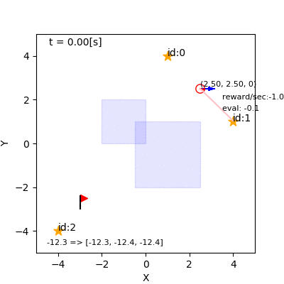
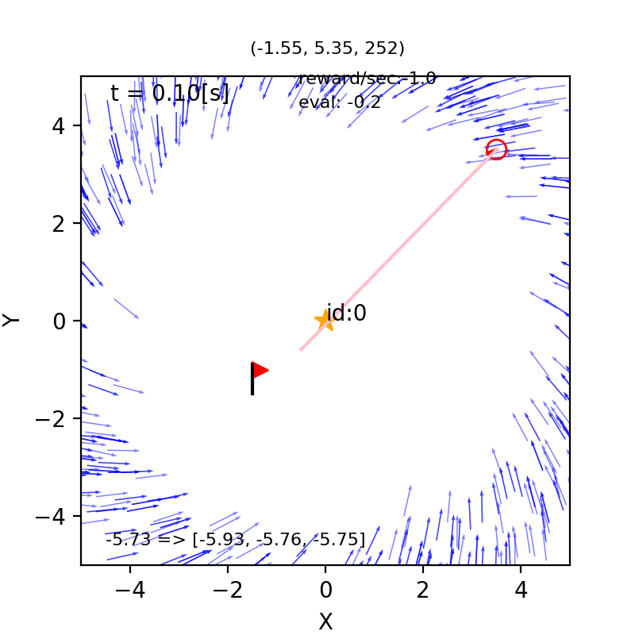
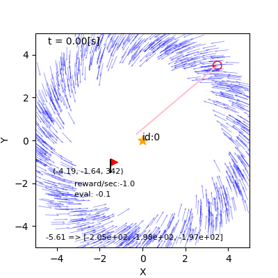
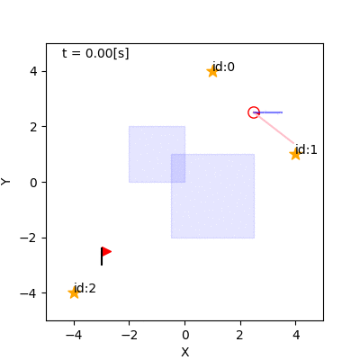

## 12. 部分観測マルコフ決定過程

千葉工業大学 上田 隆一

 

This work is licensed under a <a rel="license" href="http://creativecommons.org/licenses/by-sa/4.0/">Creative Commons Attribution-ShareAlike 4.0 International License</a>.

---

### 12.1 部分観測マルコフ決定過程（POMDP）

---

### 自己位置推定が不確かな場合に 起こる問題

* 分布の広さを考慮せずに一つの推定姿勢で行動決定
    * 分布の端にロボットがいる可能性が考慮されない
* 人間なら状況が不確かならどうするだろうか？
    * 調べる、警戒する、迂闊に危険に近づかない

---

### 別の例

* 外側から見ていると非常に不可解

---

### POMDP

* 問題はMDPだがエージェントが真の状態を把握できない
    * 自己位置推定などで自身で観測しなければならない
    * つまり今の例のような問題を扱うための枠組み
* POMDPにおける方策: $a\_{t+1} = \Pi\_\text{POMDP}(a\_{1:t}, \textbf{z}\_{1:t}, r\_{1:t})$
    * 状態がわからないのでこれまでに知ったことから行動を判断
    * この形式のままだと実装方法は見えない

---

### belief MDP

* 分布自体を「状態」と考える
    * 信念状態
* 信念状態を使った方策
    * $a\_{t+1} = \Pi\_\text{b}(b_t)$
    * 全種類の分布に対して行動を返す
    * 分布の状態遷移が分かれば理論の上では価値反復で計算可能
    * 自己位置推定するなら素直なPOMDPへのアプローチ
    * 分布の種類は膨大

---

### belief MDP

* 本書では2種類紹介
    * Q-MDP系: MDPでの解を使い回す
    * AMDP系: なんらかの近似を用いて信念状態で価値反復

---

### Q-MDP

* MDPでの最適行動価値関数$Q^*$と信念分布$b$から、次の期待値を基準に行動決定
    * $Q_\text{MDP}(a,b) = \Big\langle Q(a, \boldsymbol{x}) \Big\rangle_{b(\boldsymbol{x})}$
    * $\Pi\_{Q_\text{MDP}}(b) = \text{argmax}_a Q_\text{MDP}(a,b)$
* 性質
    * 自己位置推定（状態推定）が完璧な場合、もとの方策と一致
    * 明示的な行動はとれない

---

### 実装で使う$Q_\text{MDP}(a,b)$

* 状態空間が離散化されている場合:
    * $Q_\text{MDP}(a,b) = \Big\langle Q(a, s) \Big\rangle_{B(s)} = \sum_{s \in \mathcal{S}} B(s)Q(a, s)$
        * $B(s) = \int_{\boldsymbol{x} \in s} b(\boldsymbol{x}) d\boldsymbol{x}$
* 行動価値関数ではなく状態価値関数で実装する場合: 
    * $Q\_\text{MDP}(a,b) = \sum\_{s \in \mathcal{S}} B(s) \Big\langle R(s, a, s') + V(s') \Big\rangle\_{ P(s' | s, a) }$
* さらにMCLと併用する場合: $Q\_\text{MDP}(a,b) = \sum\_{i=0}^{N-1} w^{(i)} \Big\langle R(s^{(i)}, a, s') + V(s') \Big\rangle\_{ P(s' | s^{(i)}, a)}$

---

### 実装

* これまで作ったものを組み合わせ
    * 状態価値関数
    * MCL
* 状態価値関数とパーティクルから$Q\_\text{MDP}$を計算して、値の最も良い行動を選び続ける
    * [コード](https://github.com/ryuichiueda/LNPR_BOOK_CODES/blob/master/section_pomdp/qmdp3.ipynb)
        * `evaluation`メソッドがQ-MDPの式
* 最適な方策でないのでロボットが止まる可能性あり
    * なんらかのヒューリスティックが必要に
    * [コード](https://github.com/ryuichiueda/LNPR_BOOK_CODES/blob/master/section_pomdp/qmdp3.ipynb)の`policy`内に記述

---

### ロボットの行動例

* パーティクルを水たまりに多く入れないように行動決定
    * ロボットが水たまりに入ることもあるが統計を取ると有効性が分かる
    * ただし、自己位置推定が間違えていたら効果はない
* 図
    * 左: 最尤なパーティクルを使って行動決定
    * 右: Q-MDP

---

### 12.3 ランドマークの足りない状況でのナビゲーション

---

### 点ランドマークが一つの環境

* エージェントが観測可能なもの
    * 1つの点ランドマーク
    * ゴールに入ったかどうか
* パーティクルの初期位置
    * センサリセットが起こった状態から
* 姿勢が一意に推定できない

---

### Q-MDPでのロボットの挙動

* 途中で$Q_\text{MDP}$値が釣り合って止まる

---

### 価値で重みをつけたQ-MDP

* 良い$Q$値を持っているパーティクルを優遇
    * $Q\_\text{PFC}(a,b) = \sum\_{i=0}^{N-1} \dfrac{w^{(i)}}{[V\_{\max}- V(s^{(i)})]^m} Q(s^{(i)},a)$
      $= \sum\_{i=0}^{N-1} \dfrac{w^{(i)}}{[V\_{\max}- V(s^{(i)})]^m} \Big\langle R(s^{(i)}, a, s') + V(s') \Big\rangle\_{ P(s' | s^{(i)}, a) }$
        * ここで$V_{\max} = \max_{\boldsymbol{x} \in \mathcal{X}} V(\boldsymbol{x}) $
* PFC（probabilistic flow control）と名前をつけた

---

### PFCによるロボットの挙動

---

### 12.4 AMDP

---

### 信念分布を使った価値反復

* Q-MDP、PFCは不確かさに対して「受け身」
    * 「分布を小さくする」ような行動決定はできない
* AMDP（augmented MDP）
    * 信念状態に対して価値反復を解く 
    * 本書のシミュレーションで可能になること
        * ランドマークが視界に入りやすいルートをとる
        * 分布が水たまりにかかりやすいルートをあらかじめ避ける

---

### 価値反復の実装1（状態空間の構成）

* $XY\theta\sigma$空間の4次元
    * $XY\theta$空間: 10, 11章と同じ
    * $\sigma$軸: カルマンフィルタの分布の大きさを表す軸
        * $\sigma = | \Sigma_t |^{1/6}$で計算
* 状態空間の離散化（[コード](https://github.com/ryuichiueda/LNPR_BOOK_CODES/blob/master/section_pomdp/amdp1.ipynb)）
    * $XY\theta$空間: 10, 11章と同じ（57600状態）
    * $\sigma$軸: 5段階
    * 離散状態数: 288000状態

---

### 価値反復の実装1（終端状態）

* $XY\theta$空間では10章と同じ終端状態
* $\sigma$軸では最も$\sigma$の小さい区分のみを終端状態とする
    * 十分に自己位置推定が正確でないとゴールに止まれないので

---

### 価値反復の実装1 （移動による状態遷移）

* とりあえず観測は無視して移動による$\sigma$の変化を求める
* カルマンフィルタの式から
    * $\hat{\boldsymbol{\mu}}\_t = \boldsymbol{f}(\boldsymbol{\mu}\_{t-1}, a\_t)$
    * $\hat{\Sigma}\_t = F\_t\Sigma\_{t-1}F\_t^\top + A\_{t-1}M\_t A\_{t-1}^\top  = \sigma\_{t-1}^2F\_t F\_t^\top + A\_{t-1}M\_t A\_{t-1}^\top$
* 移動後の$\sigma$の計算
    * $\hat{\sigma}\_t = |\sigma\_{t-1}^2F\_t F\_t^\top + A\_{t-1}M\_t A\_{t-1}^\top|^{1/6}$

---

### 価値反復の実装1 （観測による状態遷移）

* 観測による$\sigma$の減少量を求める
    * 全状態で求める
    * 観測できるかどうかは`IdealCamera`クラスを用いて判断
* カルマンフィルタの式から
    * $\Sigma = ( I - KH ) \hat\Sigma$
    * $K = \hat\Sigma H^\top (Q +  H \hat\Sigma H^\top )^{-1}$

---

---

