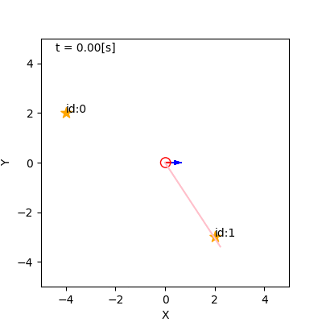

## 5. パーティクルフィルタを用いた自己位置推定

千葉工業大学 上田 隆一

 

This work is licensed under a <a rel="license" href="http://creativecommons.org/licenses/by-sa/4.0/">Creative Commons Attribution-ShareAlike 4.0 International License</a>.

---

### 自己位置推定

* ロボットが自らの姿勢を、これまで得た情報から推定することを指す言葉
    * 自らの行動を決める
    * 自身の周囲との位置づけを把握する

---

### 例: [カルマンフィルタ](https://github.com/ryuichiueda/LNPR_BOOK_CODES/blob/master/section_kalman_filter/kf4.ipynb)（KF） による実装

* 青い楕円が位置、青いヒゲが向きの不確かさを表す
    * 動くと不確かに
    * センサ値を得ると不確かさが減少

---

### 例: [パーティクルフィルタ](https://github.com/ryuichiueda/LNPR/blob/master/self_localization/mcl.ipynb)（PF） による実装

* 青い矢印が姿勢の候補
    * 動くと拡散し、センサ値を得ると収束
* KFもPFも同じ計算の近似

---

### PFで自己位置推定するロボット1

<iframe width="560" height="315" src="https://www.youtube.com/embed/Kvja3ROYhB4" frameborder="0" allow="accelerometer; autoplay; encrypted-media; gyroscope; picture-in-picture" allowfullscreen></iframe>

---

### PFで自己位置推定するロボット2

<iframe width="560" height="315" src="https://www.youtube.com/embed/RpPcmyXOcr4" frameborder="0" allow="accelerometer; autoplay; encrypted-media; gyroscope; picture-in-picture" allowfullscreen></iframe>

---

### 何を計算しているのか

* 分布$p_t(\boldsymbol{x} = \boldsymbol{x}_t^* | \boldsymbol{x}_0, \boldsymbol{u}_\{1:t\}, \textbf{z}_\{1:t\})$を計算
    * $t=0,1,2,\dots,t$: 離散時間（$t$が現在の時刻）
    * $\boldsymbol{x}_t^*$: 真の姿勢
    * $\boldsymbol{x}_0$: 最初の姿勢（分かっているとしましょう）
    * $\boldsymbol{u}_\{1:t\}$: 各時刻の制御指令
    * $\textbf{z}_\{1:t\}$: 各時刻のセンサ値のリスト
        * $\textbf{z}_s = \\{ \boldsymbol{z}_\{j,s\} | j=0,1,2,\dots, N_\text{m}-1 \\}$
            * $\boldsymbol{z}_\{j,s\}$: 時刻$s$におけるランドマーク$j$のセンサ値
            * $N_\text{m}$: ランドマークの数

---

### 信念

* 求める分布を特別に$b_t$と表しましょう
    * $b_t(\boldsymbol{x}) = p_t(\boldsymbol{x} = \boldsymbol{x}_t^* | \boldsymbol{x}_0, \boldsymbol{u}_\{1:t\}, \textbf{z}_\{1:t\})$
* $b_t$を信念と呼ぶ
    * エージェントの頭の中

---

### 信念の演算

* $b_\{t-1\}$から$b_t$へはどう計算すればよいか？
    * ロボットの移動後の信念には$\boldsymbol{u}_t$が加わる（$b_\{t-1\}\rightarrow \hat{b}_t$）
    * ロボットがセンサ値を得ると、さらに$\textbf{z}_t$が加わる（$\hat{b}_t \rightarrow b_t$）
    * 上記の$b_\{t-1\}, \hat{b}_t, b_t$
        * $b_\{t-1\}(\boldsymbol{x}) = p(\boldsymbol{x} = \boldsymbol{x}_\{t-1\}^* | \boldsymbol{x}_0, \boldsymbol{u}_\{1:t-1\}, \textbf{z}_\{1:t-1\})$
        * $\hat{b}_t(\boldsymbol{x}) = p(\boldsymbol{x} = \boldsymbol{x}_t^* | \boldsymbol{x}_0, \boldsymbol{u}_\{1:t\}, \textbf{z}_\{1:t-1\})$
        * $b_t(\boldsymbol{x}) = p(\boldsymbol{x} = \boldsymbol{x}_t^* | \boldsymbol{x}_0, \boldsymbol{u}_\{1:t\}, \textbf{z}_\{1:t\})$

---

### 移動時の更新

* $b_\{t-1\}$から$\hat{b}_t$へ
    * 計算式: $\hat{b}_t(\boldsymbol{x}) = \big\langle p(\boldsymbol{x} | \boldsymbol{x}', \boldsymbol{u}_t) \big\rangle_\{b_\{t-1\}(\boldsymbol{x}')\}$
        * $p(\boldsymbol{x} | \boldsymbol{x}', \boldsymbol{u}_t)$: 状態遷移モデル
    * 計算式の意味
        * 移動前の姿勢$\boldsymbol{x}'$が既知なら移動後の分布は状態遷移モデルと一致
        * 実際には移動前の姿勢は$b_\{t-1\}$で確率的にしか分からない 
            $\rightarrow$状態遷移モデルの期待値が$\hat{b}_t$となる

---

### センサ値の反映

* $\hat{b}_t$から$b_t$へ
    * 計算式: $b_t(\boldsymbol{x})= \hat{b}_t(\boldsymbol{x} | \textbf{z}_t) = \dfrac{ p(\textbf{z}_t | \boldsymbol{x}) \hat{b}_t(\boldsymbol{x}) } { p(\textbf{z}_t) } = \eta p(\textbf{z}_t | \boldsymbol{x}) \hat{b}_t(\boldsymbol{x})$
        * $p(\textbf{z}_t | \boldsymbol{x})$: 観測モデル
        * $\eta$は$b_t$の積分が1になるように後から計算すればよい（正規化定数）
    * 計算式の意味
        * $\hat{b}_t(\boldsymbol{x})$の各姿勢の値に、その姿勢から実際に得られたセンサ値（のリスト）$\textbf{z}_t$がどれだけ得られやすいかを表す値$p(\textbf{z}_t | \boldsymbol{x})$をかける

---

### ベイズフィルタ

* 前の二つのスライドの計算式を交互に適用して信念分布を更新
    * ベイズフィルタと呼ばれる
* 処理
    * 初期化: $b_0(\boldsymbol{x})$を構成
    * 以後、次の二つの式の繰り返し
        * $\hat{b}_t(\boldsymbol{x}) = \big\langle p(\boldsymbol{x} | \boldsymbol{x}', \boldsymbol{u}_t) \big\rangle_\{b_\{t-1\}(\boldsymbol{x}')\}$
        * $b_t(\boldsymbol{x}) = \eta p(\textbf{z}_t | \boldsymbol{x}) \hat{b}_t(\boldsymbol{x})$
* 実装方法
    * カルマンフィルタ
    * パーティクルフィルタ（本章ではこちらを扱う）

---

### パーティクルフィルタ

* 信念分布をパーティクルで近似
    * パーティクル（粒子）: ロボットの分身と考えておく
    * 自己位置推定に使われるPF: MCL（Monte Carlo localization）と呼ばれる

---

### パーティクルの分布

* 信念分布との関係
    * ある領域$X \in \mathcal{X}$中のパーティクルの数（を$N$で割ったもの）: 
    その領域にロボットの姿勢がある確率の近似
        * 左図: パーティクル100個の分布
        * 右図: ロボットを100台動作させたときの分布
    * この関係を満たすようにパーティクルを操作

&nbsp;

---

### 移動時の更新（アルゴリズム）

* 初期化
    * パーティクル: $\boldsymbol{x}^{(i)} \ (i=0,1,2,\dots,N-1)$を$\boldsymbol{x}_0$に置く
* $\boldsymbol{u}_t$を反映する手続き
    * $\boldsymbol{x}^{(i)} \sim p(\boldsymbol{x} | \boldsymbol{x}^{(i)}, \boldsymbol{u}_t) \qquad (i=0,1,2,\dots,N-1)$
        * 元の姿勢を状態遷移して上書き
    * 状態遷移モデル$p(\boldsymbol{x} | \boldsymbol{x}', \boldsymbol{u}_t)$がMCL内部に実装されている必要あり

---

### 状態遷移モデルの実装

* 状態遷移モデルはロボットごと、環境ごとに異なる
    * 事前になんらかの方法で同定する必要がある
* 同定の方法
    * 実験（統計をとる）、ロボットの動きを見て調整、勘と経験
        * 最終的にロボットが動けばなんでもよい
        * あまり真面目に求めても環境が変わると値がずれる

---

### 実験による状態遷移モデルの パラメータ決定 1/3

* ロボットを何度も決まった距離、角度だけ走らせて 指令値と実際に進んだ量を記録
    * 下図: ロボットを4[m]前進させて向きのばらつきを調査
    * このような実験から次ページからのような方法でモデルを作る

---

### 実験による状態遷移モデルの パラメータ決定 2/3

* 単位移動量あたりの雑音がガウス分布に従うと仮定
    * 実際は指数分布などに従っているが、ガウス分布で近似
        * 中心極限定理
* 雑音のパラメータを準備（ガウス分布の標準偏差）
    * $\sigma_{\nu\nu}$: 直進1[m]で生じる道のりのばらつきの標準偏差
    * $\sigma_{\nu\omega}$: 回転1[rad]で生じる道のりのばらつきの標準偏差
    * $\sigma_{\omega\nu}$: 直進1[m]で生じるロボットの向きのばらつきの標準偏差
    * $\sigma_{\omega\omega}$: 回転1[rad]で生じるロボットの向きのばらつきの標準偏差
* 実験でとった値からこれらの値を計算
    * 分散が移動量に比例することを利用

---

### 実験による状態遷移モデルの パラメータ決定 3/3

* パラメータ$\rightarrow$制御指令への雑音
    * 速度、角速度に変換
* 手順
    * 単位移動量あたりの雑音$\delta_{ab}$をドロー
        * $\delta_{ab} \sim \mathcal{N}(0, \sigma_{ab}^2)$ （$a,b$には$\nu,\omega$が入る）
    * 速度、角速度への雑音の量$\delta_{ab}'$に変換
        * $\delta'\_{ab} = \delta\_{ab} \sqrt{|b|/\Delta t}$
            * $\delta\_{ab}^2 : (\delta'\_{ab}\Delta t)^2 = 1 : |b|\Delta t$という関係から（分散が移動量に比例）
    * 次の速度$\nu'$、角速度$\omega'$でパーティクルを動かす
        * $\\begin{pmatrix} \\nu' \\\\ \\omega' \\end{pmatrix} = \\begin{pmatrix} \\nu \\\\ \\omega \\end{pmatrix} + \\begin{pmatrix} \delta_{\nu\nu}' + \delta_{\nu\omega}' \\\\ \delta_{\omega\nu}' + \delta_{\omega\omega}' \end{pmatrix}$
	

---

### センサ値の反映（アルゴリズム）

* 初期化
    * パーティクルに重み$w^{(i)}$ を持たせて$1/N$で初期化
    * 最終的なパーティクルの定義
        * $\xi^{(i)} = (\boldsymbol{x}^{(i)}, w^{(i)})$
* $\textbf{z}_t$を反映する手続き
    * $w^{(i)} \longleftarrow L(\boldsymbol{x}^{(i)} | \textbf{z}_t)w^{(i)}$
        * $L$: 尤度関数（$\boldsymbol{x}^{(i)}$の評価関数）
        * $L(\boldsymbol{x} | \textbf{z}_t) = p(\textbf{z}_t | \boldsymbol{x})$
* 重みはこのままだと消失or発散

---

### 尤度関数の作成

* 多くの場合、事前実験で求める
    * ロボットに様々な姿勢からランドマークを観測させてセンサ値を記録
    * なんらかのモデルで確率分布$p\_{j,t}(\boldsymbol{z}\_{j,t} | \boldsymbol{x})$を作る
    * 変数を$\boldsymbol{z}\_{j,t}$でなく$\boldsymbol{x}$とする
* 単純に実装する場合、ランドマークごとに尤度関数を実装
    * ランドマークが同時に二つ視界に入っても独立な観測とみなす 
        * 何度も$w^{(i)} \longleftarrow L(\boldsymbol{x}^{(i)} | \boldsymbol{z}\_{j,t})w^{(i)}$を繰り返す

---

### ベイズの定理との関係

* $p(\boldsymbol{x}|\boldsymbol{z}\_{j,t}) = \eta p ( \boldsymbol{z}\_{j,t} | \boldsymbol{x}) p(\boldsymbol{x}) = \eta L (\boldsymbol{x}|\boldsymbol{z}\_{j,t}) p(\boldsymbol{x})$
    * 任意の$\boldsymbol{x} \in \mathcal{X}$で成り立つ
    * パーティクルのある姿勢の評価に使える

---

### シミュレータのカメラ用の尤度関数

* センサ値の生成のモデルとしてガウス分布を仮定
    * $\boldsymbol{z}_j \sim \mathcal{N}\left[ \boldsymbol{z} | \boldsymbol{h}_j(\boldsymbol{x}), Q_j(\boldsymbol{x}) \right]$
        * 姿勢$\boldsymbol{x}$においてランドマーク$\text{m}_j$を観測したときのセンサ値$\boldsymbol{z}_j = (\ell_j \ \varphi_j )^\top$の性質をモデル化
        * $\boldsymbol{h}_j$は[観測関数](https://ryuichiueda.github.io/LNPR_SLIDES/slides/chap3_10min.html?#/9)

$Q_j(\V{x})$には, センサ値の
偶然誤差と系統誤差を反映します. 
* 次のようなモデルを準備
    * $\boldsymbol{z} = \mathcal{N}(\boldsymbol{z}^* | Q )$
        * $\boldsymbol{z}^*$: 姿勢$\boldsymbol{x}$で得られるはずのセンサ値
        * $Q_j(\boldsymbol{x}) = \begin{pmatrix} [\ell_j(\boldsymbol{x})\sigma_\ell]^2 & 0 \\\\ 0 & \sigma^2_\varphi \end{pmatrix}$

---

### 重みの正規化とリサンプリング

* まだ実装に足りないこと
    * 重みの正規化
    * 重みの偏りの是正
        * 特定のいくつかのパーティクルに重みが集中 
	$\rightarrow$他のパーティクルは存在しないのと同じ
* 方法: リサンプリング
    * 手続き
        1. パーティクルの集合から新しいパーティクルを$N$個選ぶ
        1. 重みを$1/N$にする
    * 下図: リサンプリングの一例（左: 前、右: 後）

---

### リサンプリングの方法（単純なもの）

* 単純な方法
    * 以下を$N$回繰り返し
        1. 古いパーティクルの集合から重みに比例する確率で1つパーティクルを選択
        1. 選択したパーティクルの重みを$1/N$に変えて新しい集合に追加
    * この方法は計算量が$O(N)$より大きい
        * パーティクルの数$N$が2倍になると2倍よりも計算量が増える

---

### リサンプリングの方法 （系統サンプリング）

* 手続き
    1. パーティクル（下図左）の重みを棒グラフ状のリストに（下図中）
        * 重みの合計を$W$とする（図の例: $W=10$。$N=10$）
    1. 累積値$r \sim \mathcal{U}(0, W/N)$の要素から幅$W/N$ずつ$N$個だけリストの要素を選択し、対応するパーティクルを選択（下図右）
* PFではこれが使われる
    * 計算量$N(O)$でしかも低バイアス

---

### 系統サンプリングの低バイアス性

* 左: 単純なリサンプリング
    * 何も観測していないのにパーティクルが複数のクラスタに分離
        * 理由: 重みが同じでも選ばれないパーティクルが発生
* 右: 系統サンプリングによるリサンプリング
    * 全パーティクルの重みが同じなら全て選ばれる

&nbsp;&nbsp;

---

### まとめ

* 移動ロボットの自己位置推定
    * 確率や統計の手法で計算
