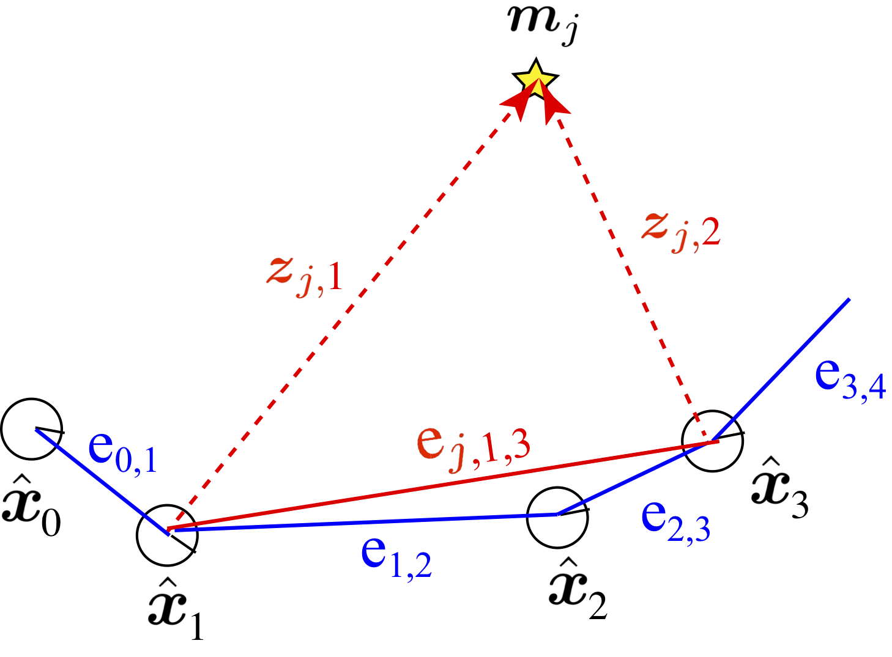
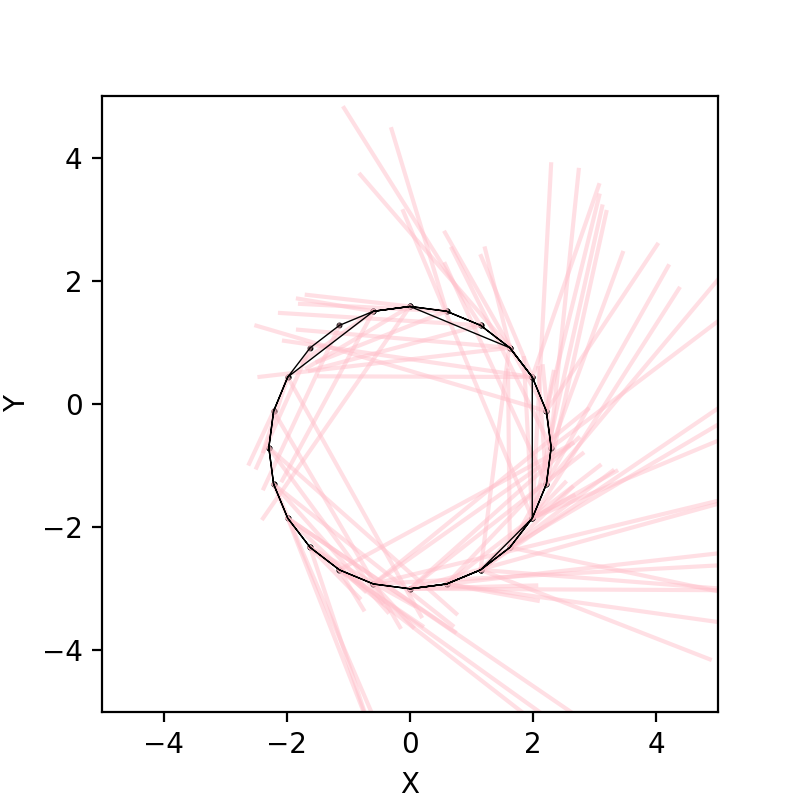
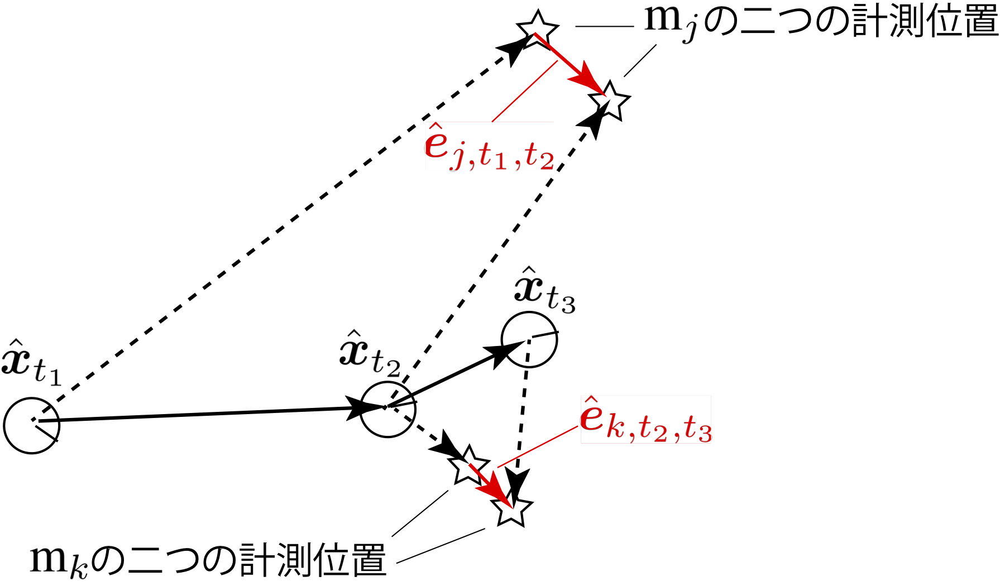

## 9. グラフ表現を 用いたSLAM

千葉工業大学 上田 隆一

 

This work is licensed under a <a rel="license" href="http://creativecommons.org/licenses/by-sa/4.0/">Creative Commons Attribution-ShareAlike 4.0 International License</a>.

---

### graph-based SLAM

* 制御指令値やセンサ値がある程度蓄積 された後にSLAMを行う方法の一つ
* グラフ
    * ノード:
        * ランドマークの推定姿勢
        * ロボットの各離散時刻での推定姿勢
    * エッジ: 位置姿勢関係の情報がある ノード同士を結ぶ

---

### グラフの「歪み」

* エッジの情報 
    * 姿勢間: デッドレコニング
    * 姿勢とランドマーク間: 観測
* 個々のエッジが示すノードの姿勢が互いに矛盾
    * 観測に雑音があるため
    * 最も歪みが少なくなるノードの位置を探す

---

### 9.1 問題の定式化

* 完全SLAM問題
    * $\boldsymbol{x}\_{1:T}^\*, \textbf{m}^\* = \text{argmax}\_{\boldsymbol{x}\_{1:T}, \textbf{m}} \ p(\boldsymbol{x}\_{1:T}, \textbf{m} | \boldsymbol{x}\_0, \boldsymbol{u}\_{1:T}, \textbf{z}\_{0:T})$
    * （解き方にもよるが）計算量が大きくなるのでこれは解かない
* 作戦
    * 式(8.2)を再掲 
        * $p(\boldsymbol{x}\_{1:T}, \textbf{m} | \boldsymbol{x}\_0, \boldsymbol{u}\_{1:T}, \textbf{z}\_{0:T}) = p(\boldsymbol{x}\_{1:T} | \boldsymbol{x}\_0, \boldsymbol{u}\_{1:T}, \textbf{z}\_{0:T}) p(\textbf{m} | \boldsymbol{x}\_{0:T}, \textbf{z}\_{0:T}) $
            * 注意: $\textbf{z}_0$の存在の仮定を暫定追加（最終的に不要になる）
    * 先に$p(\boldsymbol{x}\_{1:T} | \boldsymbol{x}\_0, \boldsymbol{u}\_{1:T}, \textbf{z}\_{0:T})$を最大にする軌跡$\boldsymbol{x}^\*_{1:T}$を求める
        * 軌跡のグラフを作って歪みを最小化
    * 観測の情報をどうするの？

---

### 観測を姿勢の情報に

* 次のようなエッジを考える
    * 仮想移動エッジ: $\text{e}\_{j,t\_1,t\_2} = ( \hat{\boldsymbol{x}}\_{t\_1}, \hat{\boldsymbol{x}}\_{t\_2}, \boldsymbol{z}\_{j, t\_1}, \boldsymbol{z}\_{j, t\_2})$
        * $j$はランドマークのID
        * 同じランドマークを観測したセンサ値から得られる2姿勢間の情報
    * 移動エッジ: $\text{e}\_{t\_1,t\_2} = (\hat{\boldsymbol{x}}\_{t\_1}, \hat{\boldsymbol{x}}\_{t\_2}, \boldsymbol{u}\_{t\_2})$
        * $t\_2 = t\_1+1$
        * デッドレコニング情報

---

### 残差の計算

* 残差（グラフの歪み）: エッジの抱える矛盾
    * 仮想移動エッジの残差: $\hat{\boldsymbol{x}}\_{t\_1}, \boldsymbol{z}\_{j, t\_1}$から求められるランドマークの位置と$\hat{\boldsymbol{x}}\_{t\_2}, \boldsymbol{z}\_{j, t\_2}$から求められるランドマークの位置の差
    * 移動エッジの残差: $\hat{\boldsymbol{x}}\_{t\_2}$と状態遷移関数の値$\boldsymbol{f}(\hat{\boldsymbol{x}}\_{t\_1},\boldsymbol{u}\_{t_2})$の違い $\ $ 
* 次のような「残差関数」を考えましょう
    * $\hat{\boldsymbol{x}}\_{t\_1}$と$\hat{\boldsymbol{x}}\_{t\_2}$がそれぞれ$\boldsymbol{x}\_{t\_1}, \boldsymbol{x}\_{t\_2}$に移動したときの上記の量
    * 仮想移動エッジの残差関数: $\boldsymbol{e}\_{j,t\_1,t\_2}(\boldsymbol{x}\_{t\_1}, \boldsymbol{x}\_{t\_2})$
    * 移動エッジの残差関数: $\boldsymbol{e}\_{t\_1,t\_2}(\boldsymbol{x}\_{t\_1}, \boldsymbol{x}\_{t\_2})$

---

### グラフの最適化

* ノードを動かして残差をゼロにするのが理想だが・・・
    * ある仮想移動エッジの残差を消そうとすると別の仮想移動エッジや移動エッジの残差が増えるかもしれない $\ $
* 大きく残ってよい残差とそうでない残差がある
    * センサ値$\boldsymbol{z}\_{j, t\_1}, \boldsymbol{z}\_{j, t\_2}$に大きな誤差が予想されるなら、その仮想移動エッジの残差はある程度残っても問題ない
        * 残差に重み付けして全体を最適化 $\ $
* 各残差関数の値$\boldsymbol{e}$の確率分布を考える
    * $p(\boldsymbol{e}) = \mathcal{N}(\boldsymbol{e} | \boldsymbol{0}, \Omega\_\text{e}^{-1}) = \eta \exp \left( -\dfrac{1}{2} \boldsymbol{e}^\top \Omega\_{\text{e}} \boldsymbol{e} \right)$
        * これで$\mathcal{e}$を評価（確率が低いほどありえない残差で打ち消さなければならないということになる）

---

### 最適化問題の構成

* 全エッジに対して前ページの式をかけた評価関数を構成
    * $f( \boldsymbol{x}\_{0:T}) = p_0(\boldsymbol{x}\_0)\big\\{ \prod\_{(j,t\_1,t\_2) \in \textbf{I}\_{\textbf{e}\_\textbf{z}} } p(\boldsymbol{e}\_{j,t\_1,t\_2}) \big\\} \big\\{ \prod\_{(t\_1,t\_2) \in \textbf{I}\_{\textbf{e}\_\textbf{x}} } p(\boldsymbol{e}\_{t\_1,t\_2}) \big\\}^\lambda$
        * $\textbf{I}\_{\textbf{e}\_\textbf{z}}$: 仮想移動エッジのインデックスの組
        * $\textbf{I}\_{\textbf{e}\_\textbf{x}}$: 移動エッジのインデックスの組
        * $p_0(\boldsymbol{x}\_0)$は$\boldsymbol{x}\_0$まわりの鋭いガウス分布
            * $\hat{\boldsymbol{x}}\_0$を動かすと大きなペナルティーを与えて座標系を固定 $\ $
* 対数をとって符号などを整理すると次のような問題に
    * $\boldsymbol{x}\_{0:T}^\* = \text{argmin}\_{\boldsymbol{x}\_{0:T}} J(\boldsymbol{x}\_{0:T})$
        * ここで
            * $J(\boldsymbol{x}\_{0:T}) = (\boldsymbol{x}\_{0} - \hat{\boldsymbol{x}}\_0)^\top \Omega\_0 (\boldsymbol{x}\_{0} - \hat{\boldsymbol{x}}\_0) + J\_\textbf{z}(\boldsymbol{x}\_{0:T}) + \lambda J\_\textbf{x}(\boldsymbol{x}\_{0:T})$
            * $J\_\textbf{z}(\boldsymbol{x}\_{0:T}) =  \sum\_{(j,t\_1,t\_2) \in \textbf{I}\_{\textbf{e}\_\textbf{z}}} \left\\{\boldsymbol{e}\_{j,t\_1,t\_2}(\boldsymbol{x}\_{t\_1},\boldsymbol{x}\_{t\_2})\right\\}^\top \Omega\_{j,t\_1,t\_2} \left\\{ \boldsymbol{e}\_{j,t\_1,t\_2}(\boldsymbol{x}\_{t\_1},\boldsymbol{x}\_{t\_2})\right\\}$
            * $J\_\textbf{x}(\boldsymbol{x}\_{0:T}) =  \sum\_{(t\_1,t\_2) \in \textbf{I}\_{\textbf{e}\_\textbf{x}}} \left\\{\boldsymbol{e}\_{t\_1,t\_2}(\boldsymbol{x}\_{t\_1},\boldsymbol{x}\_{t\_2})\right\\}^\top \Omega\_{t\_1,t\_2} \left\\{ \boldsymbol{e}\_{t\_1,t\_2}(\boldsymbol{x}\_{t\_1},\boldsymbol{x}\_{t\_2})\right\\}$

---

### 地図の最適化問題

* 軌跡を求めた後に地図を求める
    * 方法は軌跡を求める方法と同じで残差の評価値を最小化
        * 残差関数: $\boldsymbol{e}\_{j,t}(\boldsymbol{m}\_j) = \boldsymbol{m}\_j -$($\boldsymbol{x}\_t^*, \boldsymbol{z}\_{j,t}$から求められるランドマークの姿勢)
        * 残差の分布: $p\_{j,t}(\boldsymbol{e}\_{j,t}) = \eta \exp \left(-\dfrac{1}{2} \boldsymbol{e}\_{j,t}^\top \Omega\_{j,t} \boldsymbol{e}\_{j,t} \right) \quad (t \in \textbf{I}\_{\boldsymbol{m}\_j})$ 
        * 分布の積: $f(\boldsymbol{m}\_j ) = \prod\_{t \in \textbf{I}\_{\boldsymbol{z}}} p\_{j,t}(\boldsymbol{e}\_{j,t})$
        * 分布の積から作った最適化の問題: $\boldsymbol{m}\_j^\* = \text{argmin}\_{\boldsymbol{m}\_j} J\_{\boldsymbol{m}\_j}(\boldsymbol{m}\_j)$
            * ここで $J\_{\boldsymbol{m}\_j}(\boldsymbol{m}\_j) = \sum\_{t \in \textbf{I}\_{\boldsymbol{z}}} \{\boldsymbol{e}\_{j,t}(\boldsymbol{m}\_j)\}^\top \Omega\_{j,t} \{\boldsymbol{e}\_{j,t}(\boldsymbol{m}\_j)\}$

---

### 9.2 仮想移動エッジを使った軌跡の算出

* とりあえず仮想移動エッジだけで軌跡を算出
* センサ値が2次元、姿勢が3次元で計算が難しくなるのでセンサ値にもう一次元足す
    * 下図のような、「ランドマークのどの向きを見ているか」を表す変数$\psi$
        * 相対的なものなので原点は適当でよい

---

### ログをとる

* 毎時刻次のデータを記録
    * センサ値
    * デッドレコニングによる推定姿勢
        * 制御指令を記録しておいてもよい
* [実際のログ](https://github.com/ryuichiueda/LNPR_BOOK_CODES/blob/master/section_graph_slam/log.txt.for.book)
    * あとの処理の関係でセンサ値のない姿勢は記録されていない
    * そのまま絵にすると下図のようにセンサ値に矛盾

---

### 残差の計算

* 現在のセンサ値の揃っていない度合いを数値化
    * $\hat{\boldsymbol{e}}\_{j,t\_1,t\_2} = \begin{pmatrix} \hat{x}\_{t\_2} + \ell\_{j,t\_2}\cos (\hat{\theta}\_{t\_2} + \varphi\_{j,t\_2})  \\\\ \hat{y}\_{t\_2} + \ell\_{j,t\_2}\sin (\hat{\theta}\_{t\_2} + \varphi\_{j,t\_2})  \\\\ \hat{\theta}\_{t\_2} + \varphi\_{j,t\_2} - \psi\_{j,t\_2} \end{pmatrix} - \begin{pmatrix} \hat{x}\_{t\_1} + \ell\_{j,t\_1}\cos (\hat{\theta}\_{t\_1} + \varphi\_{j,t\_1}) \\\\ \hat{y}\_{t\_1} + \ell\_{j,t\_1}\sin (\hat{\theta}\_{t\_1} + \varphi\_{j,t\_1}) \\\\ \hat{\theta}\_{t\_1} + \varphi\_{j,t\_1} - \psi\_{j,t\_1} \end{pmatrix}$
        * ただし$\theta$成分は$[-\pi,\pi)$の範囲に正規化
* 残差関数
    * $\boldsymbol{e}\_{j,t\_1,t\_2}(\boldsymbol{x}\_{t\_1}, \boldsymbol{x}\_{t\_2}) = \\\\ \begin{pmatrix} {x}\_{t\_2} + \ell\_{j,t\_2}\cos ({\theta}\_{t\_2} + \varphi\_{j,t\_2}) \\\\ {y}\_{t\_2} + \ell\_{j,t\_2}\sin ({\theta}\_{t\_2} + \varphi\_{j,t\_2}) \\\\ {\theta}\_{t\_2} + \varphi\_{j,t\_2} - \psi\_{j,t\_2} \end{pmatrix} - \begin{pmatrix} {x}\_{t\_1} + \ell\_{j,t\_1}\cos ({\theta}\_{t\_1} + \varphi\_{j,t\_1}) \\\\ {y}\_{t\_1} + \ell\_{j,t\_1}\sin ({\theta}\_{t\_1} + \varphi\_{j,t\_1}) \\\\ {\theta}\_{t\_1} + \varphi\_{j,t\_1} - \psi\_{j,t\_1} \end{pmatrix}$ 

---

### マハラノビス距離を決める精度行列の導出（1/3）

* 仮想移動エッジの残差には大きくても良いものとそうでないものがある
    * 下図: $\hat{\boldsymbol{x}}\_{t\_2}$を動かして遠いランドマークの残差を減らそうとすると、近い（距離計測値が正確な）ランドマークの残差が増えてしまう

---

### マハラノビス距離を決める精度行列の導出（2/3）

* どの仮想移動エッジの残差を減らすか
    * センサ値の誤差の共分散行列から考える
        * $Q_{j,t} = \begin{pmatrix} (\ell_{j,t} \sigma_\ell)^2 & 0 & 0\\\\ 0 & \sigma_\varphi^2 & 0 \\\\ 0 & 0 & \sigma_\psi^2 \end{pmatrix}$
* $Q_{j,t}$を残差の$XY\theta$空間に移す
    * 残差の式について、$\boldsymbol{z}\_{t_1}, \boldsymbol{z}\_{t_2}$を変数扱いして線形化
        * $\hat{\boldsymbol{e}}\_{j,t\_1,t\_2}(\boldsymbol{z}\_a, \boldsymbol{z}\_b) \approx \hat{\boldsymbol{e}}\_{j,t\_1,t\_2}( \boldsymbol{z}\_{t\_1}, \boldsymbol{z}\_{t\_2}) + R\_{j,t\_1} (\boldsymbol{z}\_{j,a} - \boldsymbol{z}\_{j,t\_1} ) + R\_{j,t\_2} (\boldsymbol{z}\_{j,b} - \boldsymbol{z}\_{j,t\_2} )$
        * ここで
            * $R\_{j,t\_1} = \dfrac{\partial \hat{\boldsymbol{e}}\_{j,t\_1,t\_2}} {\partial \boldsymbol{z}\_{j,a}} \Big|\_{\boldsymbol{z}\_{j,a} = \boldsymbol{z}\_{j,t\_1}}, R\_{j,t\_2} = \dfrac{\partial \hat{\boldsymbol{e}}\_{j,t\_1,t\_2}} {\partial \boldsymbol{z}\_{j,b}} \Big|\_{\boldsymbol{z}\_{j,b} = \boldsymbol{z}\_{j,t\_2}} $ （あとから計算）

---

### マハラノビス距離を決める精度行列の導出（3/3）

* 前ページ下の式から$Q_{j,t}$を$XY\theta$空間に写像すると次のように
    * $\Sigma_{j,t_1,t_2} = R_{j,t_1} Q_{j,t_1} R_{j,t_1}^\top + R_{j,t_1} Q_{j,t_2} R_{j,t_1}^\top$
        * ここで
            * $R\_{j,t\_1} = - \begin{pmatrix} \cos(\hat{\theta}\_{t\_1} + \varphi\_{t\_1}) & -\ell\_{j,t\_1}\sin(\hat{\theta}\_{t\_1} + \varphi\_{t\_1}) & 0\\\\ \sin(\hat{\theta}\_{t\_1} + \varphi\_{t\_1}) & \ell\_{j,t\_1}\cos(\hat{\theta}\_{t\_1} + \varphi\_{t\_1}) & 0\\\\ 0 & 1 & -1 \end{pmatrix}$
            * $R\_{j,t\_2} = \begin{pmatrix} \cos(\hat{\theta}\_{t\_2} + \varphi\_{t\_2}) & -\ell\_{j,t\_2}\sin(\hat{\theta}\_{t\_2} + \varphi\_{t\_2}) & 0\\\\ \sin(\hat{\theta}\_{t\_2} + \varphi\_{t\_2}) & \ell\_{j,t\_2}\cos(\hat{\theta}\_{t\_2} + \varphi\_{t\_2}) & 0\\\\ 0 & 1 & -1 \end{pmatrix}$
