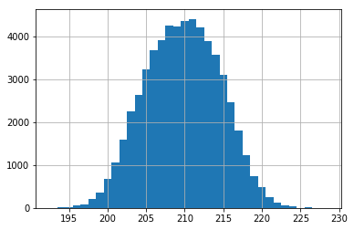
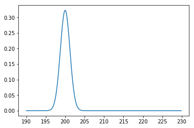
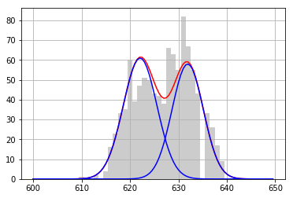

## A. ベイズ推論

千葉工業大学 上田 隆一

 

This work is licensed under a <a rel="license" href="http://creativecommons.org/licenses/by-sa/4.0/">Creative Commons Attribution-ShareAlike 4.0 International License</a>.

---

### A.1 共役事前分布と ベイズの定理を使った推論

* やること: 2章で出てきた下の分布にガウス分布をあてはめる
    * [データ](https://raw.githubusercontent.com/ryuichiueda/LNPR_BOOK_CODES/master/section_sensor/sensor_data_200.txt)
    * 2章では統計値から平均値と分散を計算して求めた
    * 本章ではベイズ的なアプローチをとる

---

### ガウス分布のパラメータ推定

* 次のような状況を考える
    * これから2章と同じ方法で200[mm]手前から壁の距離をLiDARで計測
    * おそらくセンサ値は200[mm]付近でばらつくと考えられる
    * ばらつきはガウス分布だろうと考えられる $ $
* 最初に考えていたガウス分布をセンサ値が入るごとに修正したい。あるいは一度に多数のセンサ値を反映させて修正したい

---

### 「最初に考えていたガウス分布」

* 例えば次のように表す
    * $p(z | \mu, \lambda) = \mathcal{N}(z | \mu, \lambda^{-1})$
        * $\lambda$は精度 $ $
* $\mu$や$\lambda$にも不確かさがある
    * $\mu$（平均値）は200[mm]とは限らない
    * $\sqrt{1/\lambda}$（標準偏差）はセンサの性能を考えると$1\sim 10$[mm]くらいだろう $ $
* つまり
    * $\mu, \lambda$も確率分布$p(\mu, \lambda)$で表現
    * $\mu, \lambda$は推定対象

---

### 自己位置推定との類似性

* 今扱っている問題: 結果から原因に関する変数/パラメータの分布を推定
    * 結果: センサ値
    * 原因: センサの特性
* 自己位置推定:
    * 結果: センサ値
    * 原因: 姿勢 $ $
* 類似点、相違点
    * 類似点: 原因に関する確率分布（=信念分布）を求める $\rightarrow$ベイズの定理
    * 相違点: 姿勢は動くがセンサのパラメータは動かない （マルコフ連鎖の式は不要）

---

### 確率分布$p(\mu, \lambda)$の更新

* センサ値が$z_0, z_1, \dots$と入ってきた
    * ベイズの定理でセンサ値$z_0$を反映すると次のようになる
        * $p(\mu, \lambda | z_0) = \dfrac{p(z_0 | \mu, \lambda)p(\mu, \lambda)}{p(z_0)} = \eta p(z_0 | \mu, \lambda)p(\mu, \lambda)$ $ $
* この式でセンサ値を次々に反映していけるが・・・
   * $p(\mu, \lambda | z_0)$と$p(\mu, \lambda)$が同じ確率モデルで表せないと面倒
        * カルマンフィルタのように線形化の山になるし、それでいい保証もない
        * とりあえず同じになる分布を仮定
   * $p(\mu, \lambda)$と$p(\mu, \lambda | z_0)$をそれぞれ事前分布、事後分布と呼ぶ

---

### 共役な分布

* 信念をガウス-ガンマ分布で作る
    * $p(\mu, \lambda) = b_0(\mu, \lambda | \mu_0, \zeta_0, \alpha_0, \beta_0) = \mathcal{N}(\mu | \mu_0, (\zeta_0\lambda)^{-1} ) \text{Gam}(\lambda | \alpha_0, \beta_0)$
         * $\mu_0, \zeta_0, \alpha_0, \beta_0$: 信念分布のパラメータ
         * $\text{Gam}(\lambda |\alpha,\beta) = \dfrac{1}{\Gamma(\alpha)}\beta^\alpha \lambda^{\alpha-1} e^{-\beta\lambda}$
         * $\Gamma(\alpha) = \int_0^{\infty} t^{\alpha-1}e^{-t}dt$ $ $
* $p(z_0 | \mu, \lambda)$がガウス分布の場合、ベイズの定理を何度適用してもガウス-ガンマ分布に
    * $b_0(\mu, \lambda | \mu_0, \zeta_0, \alpha_0, \beta_0)$: ガウス分布に対する共役事前分布

---

### 事前分布の作成

* $b_0(\mu, \lambda | \mu_0, \zeta_0, \alpha_0, \beta_0) = \mathcal{N}(\mu | \mu_0, (\zeta_0\lambda)^{-1} ) \text{Gam}(\lambda | \alpha_0, \beta_0)$の$\mu_0, \zeta_0, \alpha_0, \beta_0$に適切な値を入れる
    * $\sqrt{1/\lambda}$（標準偏差）はセンサの性能を考えると$1\sim 10$[mm]くらいだろう 
$\rightarrow 10^{-2} < \lambda \le 1$ 
$\rightarrow \lambda$の平均はおよそ$0.5$、分散はおよそ$0.5^2$ 
$\rightarrow$ガンマ分布の性質から$\alpha_0 = 1, \beta_0 = 2$
    * $\mu$（平均値）は200[mm]くらい$\rightarrow \mu_0 = 200$
    * $\mu$のばらつきは$\sqrt{1/\lambda}$としましょう$\rightarrow\zeta_0 = 1$

---

### 事後分布の導出（1/3）

* ガウス-ガンマ分布でベイズの定理の式を表現
    * $\mathcal{N}(\mu | \mu_1, (\zeta_1\lambda)^{-1} ) \text{Gam}(\lambda | \alpha_1, \beta_1) \\\\ = \eta \mathcal{N}(z_0 | \mu, \lambda^{-1}) \mathcal{N}(\mu | \mu_0, (\zeta_0\lambda)^{-1} ) \text{Gam}(\lambda | \alpha_0, \beta_0)$
* さらにセンサ値$z_1, z_2, z_N$を反映していく
    * $\mathcal{N}(\mu | \mu_N, (\zeta_N\lambda)^{-1} ) \text{Gam}(\lambda | \alpha_N, \beta_N) \\\\ = \eta \prod_{i=0}^{N-1} \mathcal{N}(z_i | \mu, \lambda^{-1}) \mathcal{N}(\mu | \mu_0, (\zeta_0\lambda)^{-1} ) \text{Gam}(\lambda | \alpha_0, \beta_0)$

---

### 事後分布の導出（2/3）

* 右辺のガウス分布を整理（テキスト参照のこと）
    * $\prod\_{i=0}^{N-1} \mathcal{N}(z\_i | \mu, \lambda^{-1})\mathcal{N}(\mu | \mu\_0, (\zeta\_0\lambda)^{-1} )  = \cdots \\\\ = \\mathcal{N} \\left( \\mu \\Bigg| \\dfrac{1}{N+\\zeta_0}\\sum_{i=0}^{N-1}z_i + \\dfrac{\\zeta_0}{N+\\zeta_0} \\mu_0, [(N + \\zeta_0)\\lambda]^{-1} \\right) \\eta \\lambda^{N/2}\\exp\\left( -\\dfrac{1}{2}\\lambda U \\right)$
        * ここで、$U = \\sum_{i=0}^{N-1}z_i^2 + \\zeta_0\\mu_0^2 - (N+\\zeta_0) \\left(\\dfrac{1}{N+\\zeta_0}\\sum_{i=0}^{N-1}z_i + \\dfrac{\\zeta_0}{N+\\zeta_0} \\mu_0 \\right)^2$
* 上の結果と事後分布のガウス分布の部分$\mathcal{N}(\mu | \mu_N, (\zeta_N\lambda)^{-1} )$を比較すると
    * $\mu_N = \dfrac{1}{N+\zeta_0}\sum_{i=0}^{N-1}z_i + \dfrac{\zeta_0}{N+\zeta_0} \mu_0$
    * $\zeta_N = N + \zeta_0$
    * $U = \sum_{i=0}^{N-1}z_i^2 + \zeta_0\mu_0^2 - \zeta_N\mu_N^2$

---

### 事後分布の導出（3/3）

* 今度はガンマ分布同士を比較
    * $\text{Gam}(\lambda | \alpha_N, \beta_N) = \eta \lambda^{N/2} \exp\left( -\dfrac{1}{2}\lambda U \right) \text{Gam}(\lambda | \alpha_0, \beta_0) \\\\
\cdots \\\\
\\lambda^{\\alpha_N-1} \\exp(-\\beta_N\\lambda) = \\eta \\lambda^{N/2+\\alpha_0-1} \\exp\\left\\{-\\left( \\dfrac{1}{2} U + \\beta_0 \\right)\\lambda\\right\\}$
* 両辺の比較により
    * $\alpha_N = \dfrac{N}{2} + \alpha_0$
    * $\beta_N = \dfrac{1}{2}U + \beta_0 = \dfrac{1}{2} \left( \sum_{i=0}^{N-1}z_i^2 + \zeta_0\mu_0^2 \right) - \dfrac{1}{2}\zeta_N\mu_N^2 + \beta_0$

---

### 事後分布のパラメータ（まとめ1/2）

* $\mathcal{N}(\mu | \mu_N, (\zeta_N\lambda)^{-1} ) \text{Gam}(\lambda | \alpha_N, \beta_N)$
    * $\zeta_N = N + \zeta_0$
        * $\zeta_N$: $\zeta_0$個分水増しされたセンサ値の数
    * $\mu_N = \dfrac{1}{N+\zeta_0}\sum_{i=0}^{N-1}z_i + \dfrac{\zeta_0}{N+\zeta_0} \mu_0 = \dfrac{1}{\zeta_N} \left( \sum_{i=0}^{N-1}z_i + \zeta_0 \mu_0 \right)$
        * $\mu_N$: $\zeta_0$個のセンサ値$\mu_0$で水増しされたセンサ値の平均値
    * $\alpha_N = N/2 + \alpha_0$
        * センサ値一つに対して$0.5$ずつ増える何かの値
        * $\alpha_0 = \zeta_0/2$とすると$\alpha_N = \zeta_N/2$となる
    * $\beta_N = \dfrac{1}{2}U + \beta_0 = \dfrac{\zeta_N}{2} \left\\{ \dfrac{1}{\zeta_N} \left( \sum_{i=0}^{N-1}z_i^2 + \zeta_0\mu_0^2 \right) - \mu_N^2 \right\\} + \beta_0$
        * $\beta_N$: 水増ししたセンサ値から求めた分散に$\zeta_N/2$をかけて$\beta_0$を足したもの

---

### 事後分布のパラメータ（まとめ2/2）

* 得られた事後分布（再掲）
    * $\mathcal{N}(\mu | \mu_N, (\zeta_N\lambda)^{-1} ) \text{Gam}(\lambda | \alpha_N, \beta_N)$
        * $\zeta_N = N + \zeta_0$、$\mu_N = \dfrac{1}{\zeta_N} \left( \sum_{i=0}^{N-1}z_i + \zeta_0 \mu_0 \right)$
        * $\alpha_N = N/2 + \alpha_0$、$\beta_N = \dfrac{\zeta_N}{2} \left\\{ \dfrac{1}{\zeta_N} \left( \sum_{i=0}^{N-1}z_i^2 + \zeta_0\mu_0^2 \right) - \mu_N^2 \right\\} + \beta_0$
    * わかること
        * $N$が大きくなると、$\mu_N$はセンサ値の平均値に近づく
        * $\alpha_N$と$\zeta_N/2$は$N$が大きいとほぼ同じ数$\rightarrow\lambda$の平均値$\alpha_N/\beta_N$は、$N$が大きいとセンサ値から求めた分散の逆数（つまりセンサ値の精度）に近づく
        * $\lambda$の分散$\alpha_N/\beta_N^2$は小さくなって$\lambda$の値が確定していく
        * $\zeta_N\lambda$は増え続け、$\mu$の精度が高くなっていく

---

### ベイズ推論の実装

* 左図: 共役事前分布からセンサ値の分布を一つドロー（[コード](https://github.com/ryuichiueda/LNPR_BOOK_CODES/blob/master/section_inference/gauss_gamma0.ipynb)）
* 右図: センサ値を5個入力してセンサ値の分布を一つドロー（[コード](https://github.com/ryuichiueda/LNPR_BOOK_CODES/blob/master/section_inference/gauss_gamma1.ipynb)）
* 右図: センサ値をすべて入力してセンサ値の分布を一つドロー（[コード](https://github.com/ryuichiueda/LNPR_BOOK_CODES/blob/master/section_inference/gauss_gamma2.ipynb)）

---

### A.2 変分推論による混合モデルの解析

* やること: 2章で出てきた下の分布に複数のガウス分布をあてはめる
    * 今度はマルチモーダル

---

### センサ値の生成モデル

* 解析をするにあたって次のような仮定を置く
    * 時系列は無視
    * 特定の条件（外光、湿度、気温など）に対応した何種類かのガウス分布がある. 
    * ガウス分布は$K$個存在する. （以後$k=0,1,2,\dots,K-1$と番号をつける. ）
    * 各ガウス分布の平均, 精度はそれぞれ$\mu_k, \lambda_k$. 
    * 各センサ値$z_i$は, ガウス分布のどれかから生成されたものと考える. 
    * 一つのセンサ値が生成されるとき, $k$番目のガウス分布から生成される確率は$\pi_k$である.  $ $ 
* $z_{0:N-1}$から各分布の$\mu_k, \lambda_k, \pi_k$を推定したい

---

### 生成モデルの数式化

* 一つのセンサ値$z$をドローするプロセスを考える
    * ガウス分布が選ばれるプロセス: カテゴリカル分布でモデル化
        * $\boldsymbol{c} \sim \text{Cat}(\boldsymbol{c} | \boldsymbol{\pi})$
        * $\text{Cat}(\boldsymbol{c} | \boldsymbol{\pi}) = \pi_0^{c_0}\pi_1^{c_1}\dots \pi_{K-1}^{c_{K-1}} = \prod_{k=0}^{K-1}\pi_k^{c_k}$
            * $\boldsymbol{c}$は$k$次元で、一つが1であとは0のベクトル（1-of-K 符号化法）
            * 1のある番目のガウス分布が選ばれたということを意味する $ $
    * 選んだガウス分布から$z$をドロー
        * $z \sim p(z|\boldsymbol{c}, \mu_{0:K-1}, \lambda_{0:K-1}) = \prod_{k=0}^{K-1} \mathcal{N}(z | \mu_k, \lambda_k^{-1})^{c_k}$
            * これはガウス分布だが$\boldsymbol{c}$を使って表現していることに注意

---

### 生成モデルの数式化（2/2）

* まとめると、$z$と$\boldsymbol{c}$の同時分布は
    * $p(z, \\boldsymbol{c} | \\mu_{0:K-1}, \\lambda_{0:K-1}, \\pi_{0:K-1}) = \\left\\{ \\prod_{k=0}^{K-1}\\mathcal{N}(z | \\mu_k, \\lambda_k^{-1})^{c_k} \\right\\} \\left\\{ \\prod_{k=0}^{K-1}\\pi_k^{c_k} \\right\\} \\\\ = \\prod_{k=0}^{K-1} \\left\\{ \\mathcal{N}(z | \\mu_k, \\lambda_k^{-1})^{c_k} \\pi_k^{c_k} \\right\\}$ $ $
* $z$の分布は
    * $p(z | \\mu_{0:K-1}, \\lambda_{0:K-1}, \\pi_{0:K-1}) = \\sum_{\\boldsymbol{c} \\in \\mathcal{C}} \\prod_{k=0}^{K-1} \\left\\{ \\mathcal{N}(z | \\mu_k, \\lambda_k^{-1})^{c_k} \\pi_k^{c_k} \\right\\} \\\\ = \\sum_{k=0}^{K-1} \\pi_k \\mathcal{N}(z | \\mu_k, \\lambda_k^{-1})$
* 補足
    * $\boldsymbol{c}$は直接観測されていないので潜在変数と呼ばれる
    * $p(z | \\mu_{0:K-1}, \\lambda_{0:K-1}, \\pi_{0:K-1})$はガウス分布の重み付き和なので混合ガウス分布と呼ばれる

---

### パラメータの分布のモデル化（1/2）

* $\\mu_{0:K-1}, \\lambda_{0:K-1}, \\pi_{0:K-1}$を$\boldsymbol{\mu}, \boldsymbol{\lambda}, \boldsymbol{\pi}$と置いて、$\boldsymbol{\mu}, \boldsymbol{\lambda}, \boldsymbol{\pi}$の事前分布を考える
    * まず、$\mu_k, \lambda_k$はガウス-ガンマ分布に従うと仮定
        * $\lambda_k \sim \text{Gam}(\lambda_k | \alpha_k, \beta_k)$
        * $\mu_k \sim \mathcal{N}(\mu_k | \mu'_k, (\zeta_k \lambda_k)^{-1} )$ 
    * これで、全ガウス分布のパラメータの事前分布はガウス-ガンマ分布の積になり、
        * $p(\boldsymbol{\mu}, \boldsymbol{\lambda} | \boldsymbol{\mu}', \boldsymbol{\zeta}, \boldsymbol{\alpha}, \boldsymbol{\beta}) = p(\boldsymbol{\mu} | \boldsymbol{\lambda}, \boldsymbol{\mu}', \boldsymbol{\zeta}, \boldsymbol{\alpha}, \boldsymbol{\beta})p(\boldsymbol{\lambda} |  \boldsymbol{\mu}', \boldsymbol{\zeta}, \boldsymbol{\alpha}, \boldsymbol{\beta}) = p(\boldsymbol{\mu} | \boldsymbol{\lambda}, \boldsymbol{\mu}', \boldsymbol{\zeta})p(\boldsymbol{\lambda} |  \boldsymbol{\alpha}, \boldsymbol{\beta}) \\\\ = \big\\{\prod_{k=0}^{K-1} \mathcal{N}(\mu_k | \mu'_k, (\zeta_k \lambda_k)^{-1} ) \big\\}$ 

    $\cdot \\{\prod_{k=0}^{K-1} \text{Gam}(\lambda_k | \alpha_k, \beta_k) \\}$となる
        * 太字は$k=0,1,\dots,K-1$のパラメータをつなげたベクトル

---

### パラメータの分布のモデル化（2/2）

* 今度は$\boldsymbol{\pi} = \pi_{0:K-1}$の事前分布を考える
    * $\pi_{0:K-1}$を足すと1$\rightarrow$ディリクレ分布
        * $\boldsymbol{\pi} \sim \text{Dir}(\boldsymbol{\pi} | \boldsymbol{\tau}) = \dfrac{\Gamma(\sum_{k=0}^{K-1}\tau_k)} {\prod_{k=0}^{K-1}\Gamma(\tau_k)} \prod_{k=0}^{K-1} \pi_k^{\tau_k-1} = \eta \prod_{k=0}^{K-1} \pi_k^{\tau_k-1}$ $ $
* これで$\boldsymbol{\mu}, \boldsymbol{\lambda}, \boldsymbol{\pi}$の事前分布は次のように
    * $p(\boldsymbol{\mu}, \boldsymbol{\lambda}, \boldsymbol{\pi}) = p(\boldsymbol{\mu}, \boldsymbol{\lambda} | \boldsymbol{\pi}) p(\boldsymbol{\pi}) \\\\ = p(\boldsymbol{\mu}, \boldsymbol{\lambda})p(\boldsymbol{\pi}) \\\\ =
 p(\boldsymbol{\mu} | \boldsymbol{\lambda})p(\boldsymbol{\lambda})p(\boldsymbol{\pi}) \\\\ = \left\\{ \prod\_{k=0}^{K-1} \mathcal{N}(\mu\_k | \mu'\_k, (\zeta\_k \lambda\_k)^{-1} )  \right\\} \left\\{\prod\_{k=0}^{K-1} \text{Gam}(\lambda\_k | \alpha\_k, \beta\_k)  \right\\} \text{Dir}(\boldsymbol{\pi} | \boldsymbol{\tau})$

---

### ベイズの定理の適用は無理

* センサ値$z_0$が入ったときに事前分布がどう変化するか
    * $p(\\boldsymbol{\\mu}, \\boldsymbol{\\lambda}, \\boldsymbol{\\pi} | z_0) = \\eta \\left\\{ \\sum_{k=0}^{K-1} \\pi_k \\mathcal{N}(z_0 | \\mu_k, \\lambda_k^{-1}) \\right\\} p(\\boldsymbol{\\mu}, \\boldsymbol{\\lambda}, \\boldsymbol{\\pi} )$
    * さらに$z_1, z_2, \dots$とセンサ値を反映していくと波括弧が増えていく
        * A.1と違って長大な多項式に
        * 計算ができない

---

### KL情報量を使ったアプローチ

* 潜在変数も含めた事後分布を考え、次のように近似
    * $p(\boldsymbol{\mu}, \boldsymbol{\lambda}, \boldsymbol{\pi}, \boldsymbol{c}\_{0:N-1} | z\_{0:N-1}) \approx b\_\text{c}(\boldsymbol{c}\_{0:N-1})b\_\text{d}(\boldsymbol{\mu}, \boldsymbol{\lambda}, \boldsymbol{\pi})$ $ $
* この近似の両辺の不一致度をKL情報量ではかる
    * $D_\text{KL}(b_\text{c}b_\text{d}||p) \\\\ = \big\langle \log b\_\text{c}(\boldsymbol{c}\_{0:N-1}) \big\rangle\_{b\_\text{c}} + \big\langle \log b\_\text{d}(\boldsymbol{\mu}, \boldsymbol{\lambda}, \boldsymbol{\pi}) \big\rangle\_{b\_\text{d}} \\\\ - \big\langle \log p(\boldsymbol{\mu}, \boldsymbol{\lambda}, \boldsymbol{\pi}, \boldsymbol{c}\_{0:N-1} | z\_{0:N-1}) \big\rangle\_{b\_\text{c}b\_\text{d}} $
    * $b_c$と$b_d$を交互に変化させてこの値をゼロに近づけて事後分布を求めることを考える

---

### $b_d$を固定してKL情報量を最小にする $b_c$を導出

* $b_d$を固定してKL情報量の式を変形
    * $D_\text{KL}(b_\text{c} b_\text{d}||p) \\\\ = \big\langle \log b\_\text{c}(\boldsymbol{c}\_{0:N-1}) \big\rangle\_{b\_\text{c}} - \big\langle \log p(\boldsymbol{\mu}, \boldsymbol{\lambda}, \boldsymbol{\pi}, \boldsymbol{c}\_{0:N-1} | z\_{0:N-1}) \big\rangle\_{b\_\text{c}b\_\text{d}}  + \text{定数} \\\\ \cdots  =D\_{\text{KL}}\big( b\_\text{c} \big|\big| \eta \exp \big\langle  \log p(\boldsymbol{\mu}, \boldsymbol{\lambda}, \boldsymbol{\pi}, \boldsymbol{c}\_{0:N-1} | z\_{0:N-1}) \big\rangle\_{b\_\text{d}} \big) + \text{定数}$
* 最後の式のKL情報量が最小になる時
    * 二つの分布が一致する時
        * $\log b\_\text{c}(\boldsymbol{c}\_{0:N-1}) = \big\langle  \log p(\boldsymbol{\mu}, \boldsymbol{\lambda}, \boldsymbol{\pi}, \boldsymbol{c}\_{0:N-1} | z\_{0:N-1}) \big\rangle\_{b\_\text{d}} + \eta \\\\ = \left\langle  \log \dfrac{ p(z\_{0:N-1}, \boldsymbol{c}\_{0:N-1}, \boldsymbol{\mu}, \boldsymbol{\lambda}, \boldsymbol{\pi})} {p(z\_{0:N-1})} \right\rangle\_{b\_\text{d}} + \eta \\\\ = \big\langle \log p(z\_{0:N-1}, \boldsymbol{c}\_{0:N-1}, \boldsymbol{\mu}, \boldsymbol{\lambda}, \boldsymbol{\pi}) \big\rangle\_{b\_\text{d}(\boldsymbol{\mu}, \boldsymbol{\lambda}, \boldsymbol{\pi})} + \eta$

---

### $b_c$を固定してKL情報量を最小にする $b_d$を導出

* 元のKL情報量の式が対称なので
    * $\log b\_\text{d}(\boldsymbol{\mu}, \boldsymbol{\lambda}, \boldsymbol{\pi}) = \big\langle  \log p(z\_{0:N-1}, \boldsymbol{c}\_{0:N-1}, \boldsymbol{\mu}, \boldsymbol{\lambda}, \boldsymbol{\pi}) \big\rangle\_{b\_\text{c}(\boldsymbol{c}\_{0:N-1})} + \eta$

---

### 事後分布の求め方 （前の2つのスライドのまとめ）

* 次の2つの式で潜在変数の分布と、混合ガウス分布のパラメータを交互に更新
    * $\log b\_\text{c}(\boldsymbol{c}\_{0:N-1}) = \big\langle \log p(z\_{0:N-1}, \boldsymbol{c}\_{0:N-1}, \boldsymbol{\mu}, \boldsymbol{\lambda}, \boldsymbol{\pi}) \big\rangle\_{b\_\text{d}(\boldsymbol{\mu}, \boldsymbol{\lambda}, \boldsymbol{\pi})} + \eta$
        * 混合ガウス分布を固定して潜在変数の分布を更新
    * $\log b\_\text{d}(\boldsymbol{\mu}, \boldsymbol{\lambda}, \boldsymbol{\pi}) = \big\langle  \log p(z\_{0:N-1}, \boldsymbol{c}\_{0:N-1}, \boldsymbol{\mu}, \boldsymbol{\lambda}, \boldsymbol{\pi}) \big\rangle\_{b\_\text{c}(\boldsymbol{c}\_{0:N-1})} + \eta$
        * 潜在変数の分布を固定して混合ガウス分布のパラメータを更新

---

### 潜在変数の分布（1/4）

* この関係を使って$b_c$を求める
    * $p(z\_{0:N-1}, \boldsymbol{c}\_{0:N-1}, \boldsymbol{\mu}, \boldsymbol{\lambda}, \boldsymbol{\pi}) = p(z\_{0:N-1}, \boldsymbol{c}\_{0:N-1} | \boldsymbol{\mu}, \boldsymbol{\lambda}, \boldsymbol{\pi}) p(\boldsymbol{\mu}, \boldsymbol{\lambda}, \boldsymbol{\pi}) \\\\ = p(z\_{0:N-1} | \boldsymbol{c}\_{0:N-1}, \boldsymbol{\mu}, \boldsymbol{\lambda}, \boldsymbol{\pi}) p(\boldsymbol{c}\_{0:N-1} | \boldsymbol{\mu}, \boldsymbol{\lambda}, \boldsymbol{\pi}) p(\boldsymbol{\mu}, \boldsymbol{\lambda}, \boldsymbol{\pi}) \\\\ = p(z\_{0:N-1} | \boldsymbol{c}\_{0:N-1}, \boldsymbol{\mu}, \boldsymbol{\lambda}) p(\boldsymbol{c}\_{0:N-1} | \boldsymbol{\pi}) p(\boldsymbol{\mu}, \boldsymbol{\lambda}, \boldsymbol{\pi}) \\\\ = p(z\_{0:N-1} | \boldsymbol{c}\_{0:N-1}, \boldsymbol{\mu}, \boldsymbol{\lambda}) p(\boldsymbol{c}\_{0:N-1} | \boldsymbol{\pi}) p(\boldsymbol{\mu} | \boldsymbol{\lambda})p(\boldsymbol{\lambda})p(\boldsymbol{\pi})$
* 前のスライドの$\log b\_\text{c}$の式に代入
    * $\log b\_\text{c}(\boldsymbol{c}\_{0:N-1}) \\\\ = \big\langle \log \{ p(z\_{0:N-1} | \boldsymbol{c}\_{0:N-1}, \boldsymbol{\mu}, \boldsymbol{\lambda}) p(\boldsymbol{c}\_{0:N-1} | \boldsymbol{\pi}) p(\boldsymbol{\mu} | \boldsymbol{\lambda})p(\boldsymbol{\lambda})p(\boldsymbol{\pi}) \} \big\rangle\_{b\_\text{d}(\boldsymbol{\mu}, \boldsymbol{\lambda}, \boldsymbol{\pi})} + \eta \\\\ = \big\langle \log p(z\_{0:N-1} | \boldsymbol{c}\_{0:N-1}, \boldsymbol{\mu}, \boldsymbol{\lambda}) + \log p(\boldsymbol{c}\_{0:N-1} | \boldsymbol{\pi}) \big\rangle\_{b\_\text{d}(\boldsymbol{\mu}, \boldsymbol{\lambda}, \boldsymbol{\pi})} + \eta$

---

### 潜在変数の分布（2/4）

* $\boldsymbol{\pi}$が$\boldsymbol{\mu}, \boldsymbol{\lambda}$と独立だと仮定して$b_\text{d} = b(\boldsymbol{\mu}, \boldsymbol{\lambda})b(\boldsymbol{\pi})$と分解
    * $\log b\_\text{c}(\boldsymbol{c}\_{0:N-1})  \\\\ =  \big\langle \log p(z\_{0:N-1} | \boldsymbol{c}\_{0:N-1}, \boldsymbol{\mu}, \boldsymbol{\lambda}) + \log p(\boldsymbol{c}\_{0:N-1} | \boldsymbol{\pi}) \big\rangle\_{b(\boldsymbol{\mu}, \boldsymbol{\lambda})b(\boldsymbol{\pi})} + \eta  \\\\ =  \big\langle \log p(z\_{0:N-1} | \boldsymbol{c}\_{0:N-1}, \boldsymbol{\mu}, \boldsymbol{\lambda}) \big\rangle\_{b(\boldsymbol{\mu}, \boldsymbol{\lambda})} + \big\langle \log p(\boldsymbol{c}\_{0:N-1} | \boldsymbol{\pi}) \big\rangle\_{b(\boldsymbol{\pi})} + \eta$ $ $
* さらにセンサ値ごとの式に分解
    * $\cdots = \left\langle \log \prod\_{i=0}^{N-1} p(z\_i | \boldsymbol{c}\_i, \boldsymbol{\mu}, \boldsymbol{\lambda}) \right\rangle\_{b(\boldsymbol{\mu}, \boldsymbol{\lambda})} + \left\langle \log \prod\_{i=0}^{N-1} p(\boldsymbol{c}\_i | \boldsymbol{\pi}) \right\rangle\_{b(\boldsymbol{\pi})} + \eta \\\\ = \sum\_{i=0}^{N-1} \big\langle \log p(z\_i | \boldsymbol{c}\_i, \boldsymbol{\mu}, \boldsymbol{\lambda}) \big\rangle\_{b(\boldsymbol{\mu}, \boldsymbol{\lambda})} + \sum\_{i=0}^{N-1} \big\langle \log p(\boldsymbol{c}\_i | \boldsymbol{\pi}) \big\rangle\_{b(\boldsymbol{\pi})} + \eta$

---

### 潜在変数の分布（3/4）

* さらに分布の式を代入（$c\_{i,k}$は$\boldsymbol{c}_i$の$k$番目の元）
    * $\cdots \\\\ = \sum\_{i=0}^{N-1} \big\langle \log \prod\_{k=0}^{K-1} \mathcal{N}(z\_i | \mu\_k, \lambda\_k^{-1})^{c\_{i,k}} \big\rangle\_{b(\boldsymbol{\mu}, \boldsymbol{\lambda})} \\\\ + \sum\_{i=0}^{N-1} \big\langle \log \prod\_{k=0}^{K-1}\pi\_k^{c\_{i,k}} \big\rangle\_{b(\boldsymbol{\pi})} + \eta \\\\ = \sum\_{i=0}^{N-1} \sum\_{k=0}^{K-1} c\_{i,k} \Big\\{ \dfrac{1}{2} \big\langle \log \lambda_k \big\rangle\_{b(\mu_k, \lambda_k) } - \dfrac{1}{2} \big\langle \lambda_k(z\_i - \mu_k)^2 \big\rangle\_{b(\mu_k, \lambda_k) } \\\\ + \big\langle \log \pi_k \big\rangle\_{b(\boldsymbol{\pi})} \big\\} + \eta$
* 波括弧の中の式を$\rho\_{i,k}$とおくと
    * $\log b\_\text{c}(\boldsymbol{c}\_{0:N-1}) = \sum\_{i=0}^{N-1} \sum\_{k=0}^{K-1} c\_{i,k} \log \rho\_{i,k} + \eta  = \cdots \\\\ = \log \prod\_{i=0}^{N-1} \prod\_{k=0}^{K-1} \rho\_{i,k}^{c\_{i,k}} + \eta$

---

### 潜在変数の分布（4/4）

* したがって
    * $b\_\text{c}(\boldsymbol{c}\_{0:N-1}) = e^\eta \prod\_{i=0}^{N-1} \prod\_{k=0}^{K-1} \rho\_{i,k}^{c\_{i,k}}$
    * $b(\boldsymbol{c}\_i) = \eta' \prod\_{k=0}^{K-1} \rho\_{i,k}^{c\_{i,k}}$ $ $
* さらに$r\_{i,k} = \rho\_{i,k} \big/ \sum_{k=0}^{K-1} \rho\_{i,k}$とおくと
    * $b(\boldsymbol{c}\_i) = \prod\_{k=0}^{K-1} r\_{i,k}^{c\_{i,k}}$（カテゴリカル分布）
    * $b\_\text{c}(\boldsymbol{c}\_{0:N-1}) = \prod\_{i=0}^{N-1} \prod\_{k=0}^{K-1} r\_{i,k}^{c\_{i,k}}$ $ $
* $r\_{i,k}$: 負担率
    * センサ値$z_i$が$k$番目のガウス分布から生成されている確率
    * まだ求めることはできない
        * $\rho\_{i,k}$中の$b(\mu_k,\lambda_k)$や$b(\boldsymbol{\pi})$を求める必要あり

---

### とりあえず負担率を初期化しておく

* [コード（セル2）](http://localhost:8888/notebooks/section_inference/variational_inference1.ipynb)
    * 次のように初期化している
        * クラスタ数を$K=2$とする
        * センサ値を小さいグループと大きいグループに分ける
        * 小さいグループのセンサ値$z_i$の負担率を$r\_{i,0} = 1, r\_{i,1} = 0$に
        * 大きいグループのセンサ値$z_i$の負担率を$r\_{i,0} = 0, r\_{i,1} = 1$に

---

### パラメータの事後分布

* $\log b\_\text{d}(\boldsymbol{\mu}, \boldsymbol{\lambda}, \boldsymbol{\pi})$を変形していく
    * $\log b\_\text{d}(\boldsymbol{\mu}, \boldsymbol{\lambda}, \boldsymbol{\pi}) \\\\ =  \big\langle \log \{ p(z\_{0:N-1} | \boldsymbol{c}\_{0:N-1}, \boldsymbol{\mu}, \boldsymbol{\lambda}) p(\boldsymbol{c}\_{0:N-1} | \boldsymbol{\pi}) p(\boldsymbol{\mu} | \boldsymbol{\lambda})p(\boldsymbol{\lambda})p(\boldsymbol{\pi}) \} \big\rangle\_{b\_\text{c}(\boldsymbol{c}\_{0:N-1})} + \eta \\\\ =  \big\langle \log p(z\_{0:N-1} | \boldsymbol{c}\_{0:N-1}, \boldsymbol{\mu}, \boldsymbol{\lambda}) \big\rangle\_{b\_\text{c}(\boldsymbol{c}\_{0:N-1})} \\\\ + \big\langle \log p(\boldsymbol{c}\_{0:N-1} | \boldsymbol{\pi}) \big\rangle\_{b\_\text{c}(\boldsymbol{c}\_{0:N-1})} + \log \\{ p(\boldsymbol{\mu} | \boldsymbol{\lambda})p(\boldsymbol{\lambda}) \\} + \log p(\boldsymbol{\pi}) + \eta$
        * さっき$b_\text{d} = b(\boldsymbol{\mu}, \boldsymbol{\lambda})b(\boldsymbol{\pi})$と分解できると仮定したが、実際に分解されているとわかる。

---

### $b(\boldsymbol{\pi})$の分布の特定

* $\boldsymbol{c}\_{0:N-1}$を固定して、どのガウス分布がどれだけ大きいかを求めるという計算に相当
* 前のスライドの式から$\boldsymbol{\pi}$に関するものを集めて計算 $ $
    * $\log b(\boldsymbol{\pi}) =  \left\langle \log p(\boldsymbol{c}\_{0:N-1} | \boldsymbol{\pi}) \right\rangle\_{b\_\text{c}(\boldsymbol{c}\_{0:N-1})} + \log p(\boldsymbol{\pi}) + \eta \\\\ = \left\langle \log \prod\_{i=0}^{N-1} \prod\_{k=0}^{K-1}\pi\_k^{c\_{i,k}} \right\rangle\_{b\_\text{c}(\boldsymbol{c}\_{0:N-1})} + \log \left( \eta' \prod\_{k=0}^{K-1} \pi\_k^{\tau\_k-1} \right) + \eta \\\\ = \cdots \\\\ = \log \prod\_{k=0}^{K-1} \pi\_k^{ \sum\_{i=0}^{N-1} \left\langle c\_{i,k} \right\rangle\_{b(\boldsymbol{c}\_i)} + \tau\_k-1 } + \eta$
        * ディリクレ分布になっている
        * 期待値 $\left\langle c\_{i,k} \right\rangle\_{b(\boldsymbol{c}\_i)}$: $b(\boldsymbol{c}\_i)$において$c\_{i,k}=1$となる確率$\rightarrow$つまり負担率$r\_{i,k}$

---

### $b(\boldsymbol{\pi})$の分布のパラメータ更新

* 前ページのディリクレ分布を整理
    * $b(\boldsymbol{\pi}) = e^\eta \prod_{k=0}^{K-1} \pi_k^{ R_k + \tau_k-1 }$
        * ここで$R\_k = \sum\_{i=0}^{N-1} \left\langle c\_{i,k} \right\rangle\_{b(\boldsymbol{c}\_i)} = \sum\_{i=0}^{N-1}  r\_{i,k}$ $ $
* $b(\boldsymbol{\pi}) = \text{Dir}(\boldsymbol{\pi} | \hat{\boldsymbol{\tau}}) = \text{Dir}(\boldsymbol{\pi} | \hat{\tau}\_{0:K-1})$とすると、$\boldsymbol{\pi}$の分布のパラメータは次のように更新される
* 
    * $\hat{\tau}_k = R_k + \tau_k$

---

### $b(\boldsymbol{\mu}, \boldsymbol{\lambda})$の分布の特定（1/4)

* $\log b(\boldsymbol{\mu}, \boldsymbol{\lambda})$を変形していく
    * $\log b(\boldsymbol{\mu}, \boldsymbol{\lambda})  = \left\langle \log p(z\_{0:N-1} | \boldsymbol{c}\_{0:N-1}, \boldsymbol{\mu}, \boldsymbol{\lambda}) \right\rangle\_{b\_\text{c}(\boldsymbol{c}\_{0:N-1})} + \log \{ p(\boldsymbol{\mu} | \boldsymbol{\lambda})p(\boldsymbol{\lambda}) \} + \eta \\\\ = \sum\_{k=0}^{K-1} \log \left\\{ \prod\_{i=0}^{N-1} \Big[ \mathcal{N}(z\_i | \mu\_k, \lambda\_k^{-1})^{r\_{i,k}} \mathcal{N}(\mu\_k | \mu'\_k, (\zeta\_k \lambda\_k)^{-1} ) \text{Gam}(\lambda\_k | \alpha\_k, \beta\_k) \Big] \right\\} + \eta$ $ $
* クラスタごとに分布を分解
    * $\log b(\mu\_k, \lambda\_k) \\\\ = \log \big\\{ \prod\_{i=0}^{N-1} \big[ \mathcal{N}(z\_i | \mu\_k, \lambda\_k^{-1})^{r\_{i,k}} \mathcal{N}(\mu\_k | \mu'\_k, (\zeta\_k \lambda\_k)^{-1} ) \text{Gam}(\lambda\_k | \alpha\_k, \beta\_k)  \big] \big\\} + \eta$ 
$\cdots$ 
    $b(\mu\_k, \lambda\_k) = e^\eta \prod\_{i=0}^{N-1} \big\[ \mathcal{N}(z\_i | \mu\_k, \lambda\_k^{-1})^{r\_{i,k}} \mathcal{N}(\mu\_k | \mu'\_k, (\zeta\_k \lambda\_k)^{-1} ) \text{Gam}(\lambda\_k | \alpha\_k, \beta\_k) \big\]$
    * A.1で出てきた分布と似た式になる

---

### $b(\boldsymbol{\mu}, \boldsymbol{\lambda})$の分布の特定（2/4)

* 前のスライドの最後の式についてガウス分布の積の部分を整理
    * $\prod\_{i=0}^{N-1} \left\\{ \sqrt{\dfrac{\lambda\_k}{2\pi}} \exp \left[ -\dfrac{\lambda\_k}{2}(z\_i - \mu\_k)^2 \right] \right\\}^{r\_{i,k}} \sqrt{\dfrac{\zeta\_k\lambda\_k}{2\pi}}\exp\left\\{ -\dfrac{\zeta\_k\lambda\_k}{2}(\mu\_k - \mu'\_k)^2 \right\\} \\\\ = \cdots \\\\ = \mathcal{N}\left[ \mu\_k \Bigg| \dfrac{ S\_k + \zeta\_k\mu'\_k }{R\_k + \zeta\_k}, \left[ \lambda\_k (R\_k + \zeta\_k) \right]^{-1} \right] \eta \lambda\_k^{R\_k/2}\exp \left( -\dfrac{\lambda\_k}{2}U\_k \right)$
    * ここで
        * $S_k = \sum_{i=0}^{N-1} r_{i,k}z_i$
        * $T_k = \sum_{i=0}^{N-1} r_{i,k}z_i^2$
        * $U_k = T_k + \zeta_k {\mu'_k}^2 - (R_k+\zeta_k)\left( \dfrac{ S_k + \zeta_k\mu'_k }{R_k + \zeta_k} \right)^2$

---

### $b(\boldsymbol{\mu}, \boldsymbol{\lambda})$の分布の特定（3/4)

* ガンマ分布について整理
    * 2つ前のスライドの最後の式と前のスライドの式から
    * $\eta \lambda\_k^{R\_k/2}\exp \big( -\dfrac{\lambda\_k}{2}U\_k \big) \text{Gam}(\lambda\_k | \alpha\_k, \beta\_k) = \cdots \\\\ = \text{Gam}\big(\lambda\_k \big| R\_k/2 + \alpha\_k, U\_k/2 + \beta\_k \big)$

---

### $b(\boldsymbol{\mu}, \boldsymbol{\lambda})$の分布の特定（4/4)

* まとめると、各ガウス分布のパラメータの分布は次のような式になる
    * $b(\mu\_k, \lambda\_k) = \mathcal{N}\left[\mu\_k \big| \hat{\mu}'\_k, (\hat{\zeta}\_k\lambda\_k)^{-1} \right] \text{Gam}(\lambda\_k | \hat{\alpha}\_k, \hat{\beta}\_k)$
    * ここで
        * $\hat{\zeta}_k = R_k + \zeta_k$
        * $\hat{\mu}'\_k = \dfrac{ S\_k + \zeta\_k\mu'\_k }{R\_k + \zeta\_k} = \dfrac{ S\_k + \zeta\_k\mu'\_k }{\hat{\zeta}\_k}$
        * $\hat{\alpha}_k = \dfrac{R_k}{2} + \alpha_k$
        * $\hat{\beta}_k = \dfrac{U_k}{2} + \beta_k = \dfrac{1}{2} \left(T_k + \zeta_k {\mu'_k}^2 - {\hat{\zeta}_k {\hat{\mu}'}_k}^2 \right) + \beta_k$

---

### パラメータの更新則の実装

* [コード（variational_inference1.ipynb [3]〜[5]）](https://github.com/ryuichiueda/LNPR_BOOK_CODES/blob/master/section_inference/variational_inference1.ipynb)
    * 各ガウス分布の事前分布のパラメータは`update_parameters`関数の引数に記述されている
    * 下図: 初期の負担率から計算したパラメータを使ってドローしたセンサ値の分布
        * まだ負担率の更新のコードを書いていないので、まだ繰り返し計算はできない

---

### 負担率の計算（1/3）

* 次の式の各項を計算
    * $\log \rho\_{i,k} = \dfrac{1}{2} \left\langle \log \lambda\_k \right\rangle\_{b(\mu\_k, \lambda\_k) } - \dfrac{1}{2} \left\langle \lambda\_k(z\_i - \mu\_k)^2 \right\rangle\_{b(\mu\_k, \lambda\_k) } + \left\langle \log \pi\_k \right\rangle\_{b(\boldsymbol{\pi})}$ $ $
* 第一項
    * $\left\langle \log \lambda\_k \right\rangle\_{b(\mu\_k, \lambda\_k) } = \left\langle \log \lambda\_k \right\rangle\_{ \mathcal{N}(\mu\_k | \hat{\mu}'\_k, (\hat{\zeta}\_k \lambda\_k)^{-1}) \text{Gam}(\lambda\_k | \hat{\alpha}\_k, \hat{\beta}\_k) }  = \cdots \\\\ = \psi(\hat{\alpha}\_k) - \log \hat{\beta}\_k$
        * $\psi(x ) =  \dfrac{d}{d x} \log \Gamma (x )$（ディガンマ関数）

---

### 負担率の計算（2/3）

* 第二項
    * $\left\langle \lambda\_k(z\_i - \mu\_k)^2 \right\rangle\_{b(\mu\_k, \lambda\_k) } = \cdots \\\\ = \Big\langle \big\langle (\mu\_k - \hat{\mu}'\_k)^2 + 2(\hat{\mu}'\_k - z\_i )(\mu\_k - \hat{\mu}'\_k) + (\hat{\mu}'\_k - z\_i )^2 \big\rangle_{ \mathcal{N}(\mu\_k | \hat{\mu}'\_k, (\hat{\zeta}\_k \lambda\_k)^{-1}) } \\\\ \cdot \lambda\_k \Big\rangle_{ \text{Gam}(\lambda\_k | \hat{\alpha}\_k, \hat{\beta}\_k)}  = \big\langle \big\\{ \hat{\zeta}\_k^{-1}\lambda\_k^{-1} + (\hat{\mu}'\_k - z\_i)^2 \big\\} \lambda\_k \big\rangle_{ \text{Gam}(\lambda\_k | \hat{\alpha}\_k, \hat{\beta}\_k) } \\\\ = \hat{\zeta}_k^{-1} + (\hat{\mu}'_k - z_i)^2 \dfrac{\hat{\alpha}_k}{\hat{\beta}_k}$ $ $
* 第三項
    * $\left\langle \log \pi\_k \right\rangle\_{b(\boldsymbol{\pi})} = \left\langle \log \pi\_k \right\rangle\_{ \text{Dir}(\boldsymbol{\pi}, \hat{\boldsymbol{\tau}}) } = \psi(\hat{\tau}\_k) - \psi\left( \sum\_{i=0}^{K-1} \hat{\tau}\_i \right)$
        * B.2.3参照のこと

---

### 負担率の計算（3/3）

* まとめると
    * $\log \rho\_{i,k} = \dfrac{1}{2} \left\langle \log \lambda\_k \right\rangle\_{b(\mu\_k, \lambda\_k) } - \dfrac{1}{2} \left\langle \lambda\_k(z\_i - \mu\_k)^2 \right\rangle\_{b(\mu\_k, \lambda\_k) } + \left\langle \log \pi\_k \right\rangle\_{b(\boldsymbol{\pi})} \\\\ = \dfrac{1}{2} \left\\{ \psi(\hat{\alpha}\_k) - \log \hat{\beta}\_k \right\\} - \dfrac{1}{2} \left\\{ \hat{\zeta}\_k^{-1} + (\hat{\mu}'\_k - z\_i)^2 \dfrac{\hat{\alpha}\_k}{\hat{\beta}\_k} \right\\} \\\\ + \psi(\hat{\tau}\_k) - \psi\left( \sum\_{i=0}^{K-1} \hat{\tau}\_i \right)$ $ $
* この計算で得た$\rho\_{i,k}$を正規化すると負担率$r\_{i,k}$に
