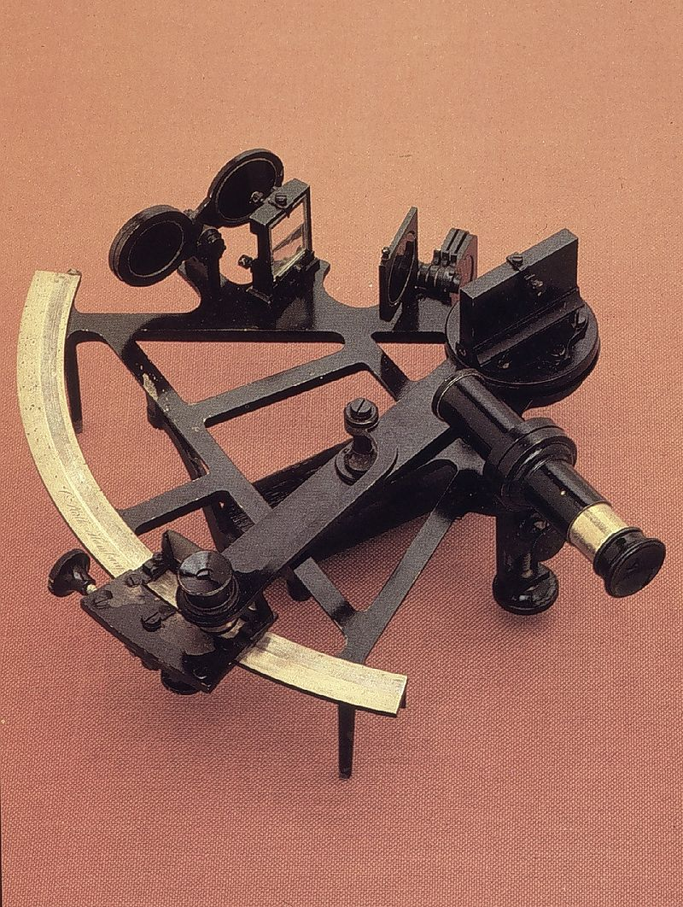
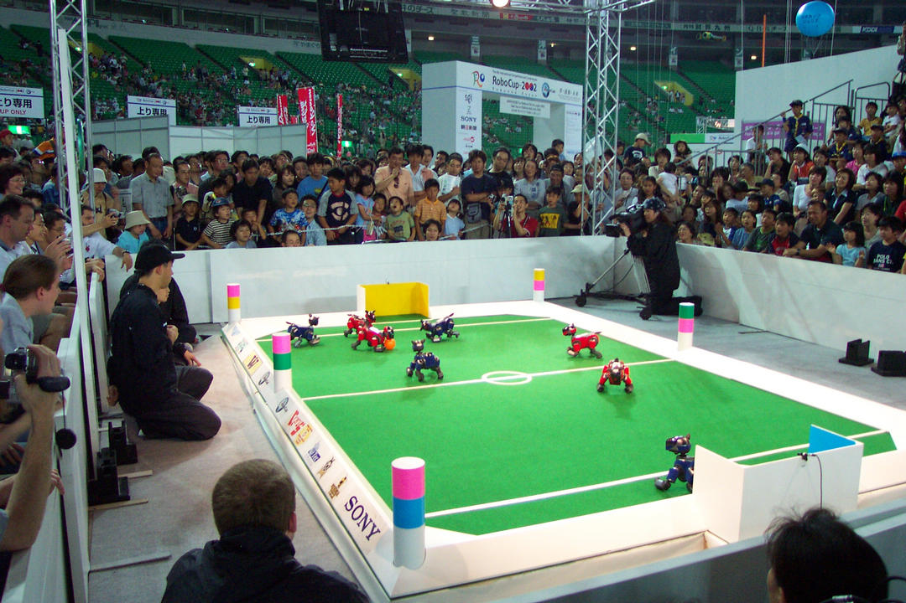
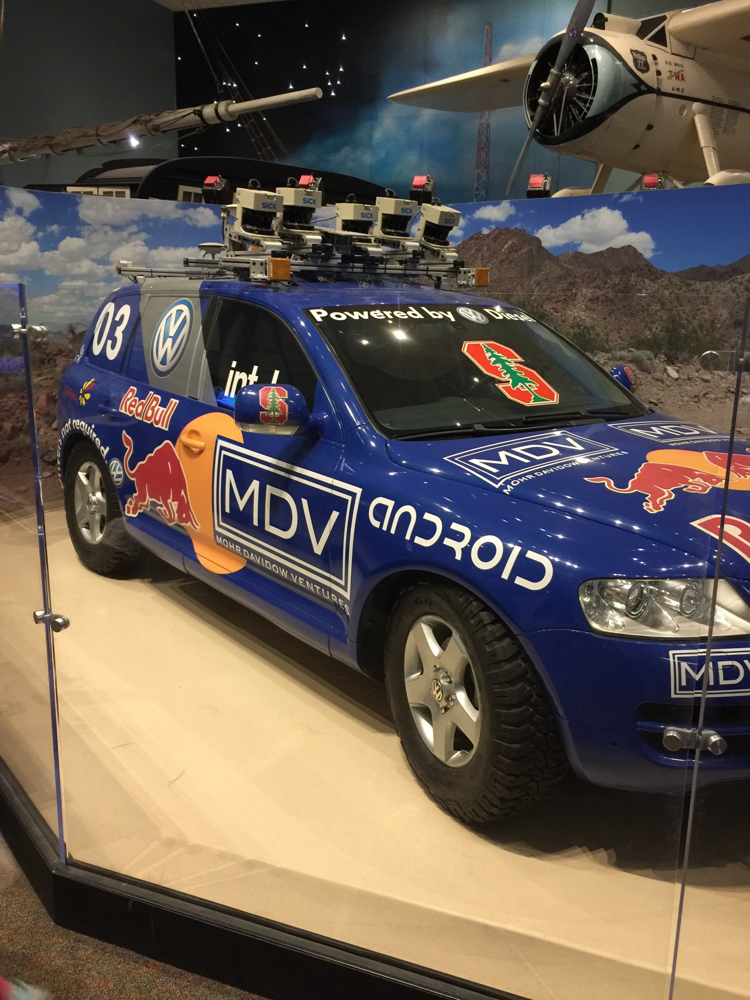
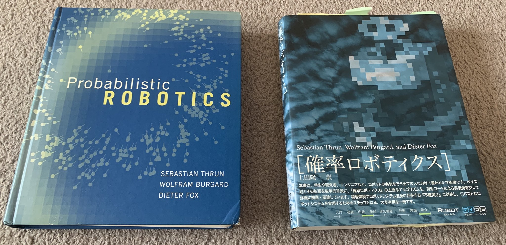
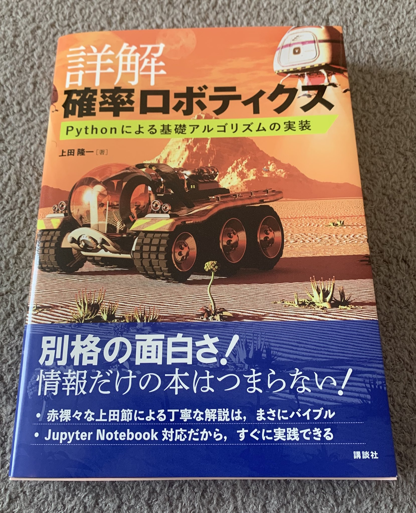

# 1. はじめに

千葉工業大学 上田 隆一

 

This work is licensed under a <a rel="license" href="http://creativecommons.org/licenses/by-sa/4.0/">Creative Commons Attribution-ShareAlike 4.0 International License</a>.

---

## 1.1 「分からない」を扱う

---

### 「確率ロボティクス」とは 

* 分からないことをロボットで扱うための分野
* なぜそんなことが必要か？
    * ロボットが[工場](https://youtu.be/-QquWBX0sa0?t=83)から生活環境へ
        * 生活環境は分からないことだらけ
    * 工場のロボットもやることが難しくなっている （[例: 唐揚げロボット](https://www.youtube.com/watch?v=Sfq81rVNyGo)）

不確かな状況で活動しなければならない

---

### 不確かな状況での活動

* 2020年は不幸なことに例を挙げやすい
    * 新型コロナウイルスに感染しているかどうか分からない状況でどう日常を過ごすか？
        * 用事ができたけど外出すべきか家にいるべきか？
        * 子供を外で遊ばせるかやめておけと言うか？
        * 結局、感染したら自分は重症になるのか軽症で済むのか？
        * 国民にいくら配ってもインフレが起きないのか？布マスクを配ると批判されないか？

適切に行動できていると誰も自信を持って言えない。自信満々はかえって危険$\rightarrow$ロボットも同じ

---

### 不確かさ、自信のなさを ロボットの中に表現

* 自信満々はとにかく危なっかしい
* 数学を使うとなると「確率」が道具となる

ということで確率ロボティクスという分野が存在

---

### もう少しだけ「不確かさ」を考察

* 五感で直接得られない、直接の体験で得られない情報
    * 隣の部屋、下の部屋で何が起きているかは分からない
    * 変な噂が流れてきたけど自分で直接確認できない
* 未来・過去の情報
    * 過去の記録が残ってない。未来は本質的に分からない。
* 正確に計測できない
    * 駅まで何メートル？$\rightarrow$誰も正確に言えない
* 前提知識がないと分からない
    * 小学生にいきなり微積分を教えても分からない 

---

### 「分からない」$\neq$「行動できない」

* 動物や人間はいい加減に生きている
    * 動物は言葉を知らないけど困ってもいない
    * 駅まで何メートルか分からなくても駅には行ける
    * 説明書読まないで何かを組み立て始めたけどなんとかなった（ならないこともある）
    * ブログに見当違いなことを書いていても儲かった
* 実世界は「動いたもの勝ち」が結構多い

「人間のように賢くいい加減」に動くロボットは実現できないか

---

## 1.2 確率ロボティクスの歴史

人類はどのように「分からないこと」と つきあい、確率ロボティクスに至ったか

---

### 紀元前〜大航海時代

* 船によって人類の行動範囲が拡大
    * ポリネシアの人々、コロンブス、マゼラン、・・・
    * 問題: 陸地が見えないとどこにいるか分からなくなって危険
        * 星の位置、陸地、船の動きなどから船の位置を算出$\rightarrow$進路決定

図: 6分義。パブリックドメイン

航海術 = ナビゲーション技術が発達

---

### 航海と移動ロボット

* 移動ロボット分野でも「ナビゲーション技術」という 言葉を使う
    * その他、様々な用語を借りている
        * dead reckoning（推測航法）
        * coastal navigation（沿岸航法）
    * 大航海時代では上陸したらまず測量だった
        * 移動ロボットでも測量を行う（自己位置推定、SLAM）
        * これもナビゲーション技術だとすると、船の技術は移動ロボットに関する技術の先祖だと言える

---

### 航海以外の確率にまつわる話題

* 占い$\rightarrow$天文
    * 豊作なのかどうなのかなど、未来を占うことに人々の興味 $\rightarrow$権力者の象徴
    * 分からないのをいいことに権力者に都合よく$\rightarrow$次第に科学的に
    * でも今も騙される人が多い 　
* 哲学
    * 「無知の知」
        * さきほどの「自身満々な人やロボットは危ない」という話
        * 現在の解釈では「メタ認知」（諸説はあると思う）
        * （本に書いてしまいましたが、ソクラテスは「無知の知」とは言ってないそうです。懺悔。）

---

### 産業革命

* ハイパワーな機械を「制御」しなければならない
    * 制御の基本: 危なくなったら出力を下げる
        * そうしないと爆発、暴走、とにかく危ない
    * 最初の制御: ワットのガバナー
        * フィードバック制御
        * 最初の頃はコンピュータどころか電気回路すらないので機械式

[パブリックドメイン](https://ja.wikipedia.org/wiki/%E8%AA%BF%E9%80%9F%E6%A9%9F#/media/%E3%83%95%E3%82%A1%E3%82%A4%E3%83%AB:Fliehkrafregler.PNG)

---

### 産業革命前夜の確率に関する話題

産業革命の話と関係ないけど、後に話がリンク

* ベイズの定理
    * トーマス・ベイズ
        * 確率で「分からなさ」を表現し、何か情報が得られるたびに「分からなさ」を小さくしていくというアイデアを示す。[Bayes 1763]
    * ピエール=シモン・ラプラス 
        * ベイズと同じ考え方を「逆確率」として定式化$\rightarrow$ベイズの定理
            * 逆: 結果から原因の確率を考える
    * 逆確率は画期的だが既存の考え方と一部相容れない
        * 既存の考え: 原因は固定されている
        * 学術的には広まらない状況が続く

---

### 第二次世界大戦前後

* 制御に電気回路、電子回路が入ってくる
    * 機械の動き$\rightarrow$電気信号に置き換え$\rightarrow$別の機械の動き
* 電気信号にすると複雑な計算が可能に
    * ディジタル回路と情報理論（クロード・シャノン） 　
* 電子回路が計算機になっていく
    * 計算機を主体に考えると、制御は情報の入出力となる
        * 機械から何か情報が入ってきて、機械を動かすために情報を出力

脳の進化のようなことが急速に進む

---

### 冷戦期（宇宙開発競争）

* アポロ計画でのカルマンフィルタの利用
    * 宇宙船の姿勢を推定し、その姿勢を光学観測の情報で修正することを逐次的に繰り返す[岩田2017]
* カルマンフィルタ: ベイズの定理で定式化可能
    * 姿勢が誤差の見積もりつきで推定される（つまり確率的）
    * 光学観測の結果は宇宙船の姿勢（原因）に依存
    * 原因が確率的に表現されている

制御とベイズの定理の話がつながった

[岩田2017] 岩田隆敬: "宇宙分野におけるカルマンフィルタの応用", 計測と制御, 56(9), pp. 668-674, 2017.

---

### 移動ロボットの研究

* 移動ロボットも宇宙船と同様、自身の位置を把握する必要がある（自己位置同定、自己位置推定）
    * カルマンフィルタは使えないのか
        * 利用可能。ただし、ロボットのまわりになにもなければ。 　
* ロボットは環境の影響を考えて活動しなければならない
    * 壁、人、地面、風、直射日光、暗闇・・・
    * 摩擦の問題が無視できない 　
* さらにロボットには他にも仕事がある
    * ものをつかむ、地図作り、自律的な判断、・・・

不確かな状況で活動しなければならない （2ページ目の話に戻る）

---

### アポロ計画の後

* 研究者などが主体となり、月の次の目標が設定される
    * 「月に行く」（60年代〜） $\rightarrow$「ロボットにサッカーをさせる（RoboCup）」（90年代〜） $\rightarrow$「自動車自身に運転させる（DARPA Grand Challenge）」（2000年代〜）

ロボット用のアルゴリズムの開発・検証が進む

---

### Probabilistic ROBOTICS （確率ロボティクス）

* セバスチャン・スランらの教科書
    * 1995年頃から10年間に確立したロボット用の推論アルゴリズム（+カルマンフィルタ）を掲載
    * カルマンフィルタ、パーティクルフィルタ、FastSLAM、GraphSLAM、POMDP手法など

---

### 現在

* いわゆる「人工知能」ブーム
    * 良く言うとゴールドラッシュ、悪く言うとうさんくさい 　
* （うさんくさくない）ブームの裏側: 機械学習の進歩
    * 機械学習: 大雑把に言うとデータから何か原因を推論すること
        * 確率ロボティクスの各手法も機械学習に含まれると言える
        * 深層学習も機械学習の一分野。人工ニューラルネットワークを利用 　

原因を確率的に表すとベイズの話が出てくる

---

## 1.3 詳解確率ロボティクス について

およびこの講義資料（スライド）について

---

## 1.3.1 意図と体裁

* 

---

## 1.3.2 書籍の構成

---

## 1.3.3 書籍で使用するツール

